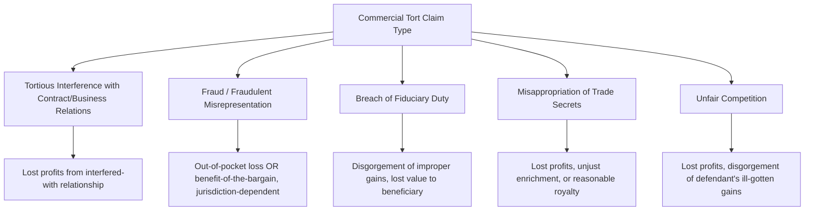

## Commercial Damages in Contract and Tort Disputes

### Overview

Commercial damages analysis quantifies the economic harm suffered by businesses in contract and tort disputes, applying distinct legal frameworks and measurement standards depending on the underlying cause of action. While contract and tort damages share common quantification techniques (lost profits, diminution in value, cost-based measures), the legal theories governing recoverability, the scope of compensable harm, and the applicable damages standards differ meaningfully between the two frameworks — differences that directly shape the forensic accountant's analytical approach.

### Contract Damages: Foundational Principles

**Key Points**

- The general goal of contract damages is to place the non-breaching party in the position it would have occupied had the contract been fully performed (the "expectation" or "benefit-of-the-bargain" measure)
- Contract damages are generally limited by principles of foreseeability (the *Hadley v. Baxendale* rule: damages must have been reasonably foreseeable to both parties at the time of contracting) and are subject to the doctrine of mitigation
- Consequential damages (indirect losses flowing from the breach, such as lost profits from a downstream contract) are often limited or excluded by contract terms (limitation of liability clauses) and are subject to stricter foreseeability scrutiny than direct damages

### Contract Damages Measures

| Measure | Description | Typical Application |
| --- | --- | --- |
| **Expectation damages** | Places plaintiff in the position as if the contract had been performed | Most common default measure for breach of contract |
| **Reliance damages** | Reimburses plaintiff for expenditures made in reliance on the contract, used where expectation damages are too speculative to calculate | Early-stage ventures, cases with insufficient historical data for lost profits |
| **Restitution/unjust enrichment** | Disgorges the benefit conferred upon the breaching party, independent of the non-breaching party's own loss | Cases where the defendant's gain differs from (often exceeds) plaintiff's loss |
| **Consequential damages** | Indirect losses flowing from the breach beyond the direct value of the contract itself (e.g., lost profits on downstream contracts) | Subject to foreseeability limits and often excluded by contract limitation clauses |
| **Liquidated damages** | Pre-agreed contractual damages amount, enforceable if a reasonable estimate of anticipated harm at the time of contracting (not a penalty) | Contracts with a liquidated damages clause; forensic accountant may be asked to assess reasonableness of the pre-agreed amount |

### Tort Damages: Foundational Principles

**Key Points**

- Tort damages generally aim to restore the injured party to the position occupied *before* the tortious conduct occurred (a "make-whole" or restorative measure), distinct from the forward-looking "benefit-of-the-bargain" approach in contract
- Tort law typically imposes a broader duty of care and may permit recovery of both compensatory and, in cases of egregious conduct, punitive damages (generally unavailable in pure contract claims)
- Proximate cause and foreseeability limitations apply, but the analytical framework often differs from contract's *Hadley*-based foreseeability test, instead focusing on whether the harm was a reasonably foreseeable consequence of the tortious conduct

### Common Commercial Tort Claims and Associated Damages Theories

#### Tortious Interference with Contract or Business Relations

- Damages typically measured as lost profits the plaintiff would have earned under the interfered-with contract or business relationship, using standard lost-profits methodologies (before-and-after, yardstick, market model)

#### Fraud / Fraudulent Misrepresentation

- Two competing measures are commonly applied, with the applicable standard varying by jurisdiction:
  - **Out-of-pocket loss**: Difference between what the plaintiff paid/gave and the actual value received
  - **Benefit-of-the-bargain**: Difference between the value as represented and the actual value received (effectively the contract expectation measure applied to a tort claim)

#### Breach of Fiduciary Duty

- Damages may include direct losses suffered by the beneficiary, disgorgement of profits improperly obtained by the fiduciary, or both, depending on jurisdiction and the nature of the breach

#### Misappropriation of Trade Secrets

- Common law and statutory frameworks (e.g., the Defend Trade Secrets Act in the U.S.) typically allow recovery of: (a) plaintiff's actual lost profits, (b) defendant's unjust enrichment not already captured in lost profits, or (c) a reasonable royalty where actual loss/unjust enrichment cannot be adequately proven

#### Unfair Competition

- Often modeled similarly to trade secret misappropriation, with lost profits and/or disgorgement of the defendant's improperly obtained gains as primary measures

### Contract vs. Tort Damages: Key Analytical Distinctions

| Dimension | Contract | Tort |
| --- | --- | --- |
| Reference point | Position if contract had been performed (forward-looking) | Position before the wrongful act occurred (restorative) |
| Consequential/indirect damages | Often limited by foreseeability (*Hadley*) and contract exclusion clauses | Governed by proximate cause; may be broader depending on jurisdiction |
| Punitive damages | Generally unavailable | May be available for egregious conduct (fraud, malice, willful misconduct) |
| Pre-existing contractual limitations | Limitation of liability and damages caps may directly restrict recoverable categories | Not directly limited by contract terms unless a related contractual relationship also exists |
| Typical measurement basis | Expectation, reliance, or restitution | Compensatory (often similar quantification techniques as contract) plus potential punitive component |

[Inference] Where a single set of facts gives rise to both contract and tort claims (e.g., a fraud claim arising from a breached contract), courts often apply the "economic loss doctrine" to limit tort recovery to cases involving harm independent of the contractual relationship itself; however, the scope and application of this doctrine varies substantially by jurisdiction and is a frequent point of legal (not purely accounting) dispute that should be clarified with counsel before finalizing a damages framework.

### Unjust Enrichment / Disgorgement Analysis

**Key Points**

- Distinct from plaintiff-focused lost profits, disgorgement measures the *defendant's* improperly obtained gain, which may exceed, equal, or be less than the plaintiff's own loss
- Requires tracing the defendant's revenue and cost structure attributable to the wrongful conduct, applying similar avoided-cost principles as lost-profits analysis but from the defendant's financial perspective

**Example**

> In a trade secret misappropriation case, the defendant used the stolen formula to generate $3,000,000 in incremental revenue with an associated cost structure of 55% of revenue.
>
> $$\text{Defendant's Unjust Enrichment} = 3{,}000{,}000 \times (1 - 0.55) = 1{,}350{,}000$$
>
> This figure would then be compared against the plaintiff's own lost-profits calculation, with the plaintiff typically entitled to elect the more favorable (or, in some frameworks, a combination avoiding double recovery of) the two measures.

### Reasonable Royalty as a Fallback Measure

Where actual lost profits or unjust enrichment cannot be reliably established (common in intellectual property and trade secret contexts), a reasonable royalty approach estimates a hypothetical negotiated licensing fee:

$$\text{Reasonable Royalty} = \text{Royalty Base} \times \text{Royalty Rate}$$

- **Royalty base**: Typically the revenue generated using the misappropriated asset
- **Royalty rate**: Derived from comparable licensing agreements, industry norms, or a hypothetical negotiation framework (analogous to the Georgia-Pacific factors used in patent infringement damages)

[Inference] While the Georgia-Pacific factor framework originates specifically in U.S. patent law, similar hypothetical-negotiation reasoning is frequently adapted by forensic accountants to trade secret and other IP-adjacent commercial damages contexts; its direct legal applicability outside patent law should be confirmed with counsel.

### Punitive Damages Considerations (Tort Context)

**Key Points**

- Punitive damages, where legally available, are generally intended to punish and deter egregious conduct rather than compensate the plaintiff, and are typically a matter for the jury/court rather than direct forensic accounting quantification
- Forensic accountants may be asked to provide financial information relevant to a punitive damages determination (e.g., defendant's net worth or financial condition), which some jurisdictions require as a predicate to punitive damages awards
- Compensatory and punitive damages should be clearly analytically separated in any report addressing both

### Common Analytical Pitfalls

**Key Points**

- Applying a contract expectation-damages framework to a tort claim (or vice versa) without confirming the correct legal standard with counsel
- Failing to consider whether the economic loss doctrine or similar jurisdiction-specific limitations restrict recovery of tort damages arising from an underlying contractual relationship
- Double-counting when plaintiff's lost profits and defendant's unjust enrichment both attempt to capture overlapping economic harm
- Overlooking contractual limitation of liability or damages exclusion clauses that may cap or eliminate certain categories of contract damages
- Conflating compensatory damages analysis with punitive damages considerations in report structure

### Illustrative Damages Framework Comparison

<svg xmlns="http://www.w3.org/2000/svg" viewBox="0 0 850 260" font-family="Arial, sans-serif">
<text x="425" y="22" font-size="16" font-weight="bold" text-anchor="middle">Contract vs. Tort Damages Reference Points (svg_diagram)</text>
<line x1="80" y1="150" x2="780" y2="150" stroke="black" stroke-width="1" />
<circle cx="300" cy="150" r="6" fill="black" />
<text x="300" y="175" font-size="10" text-anchor="middle">Wrongful Act / Breach</text>
<line x1="300" y1="150" x2="150" y2="90" stroke="#ea4335" stroke-width="2" marker-end="url(#arrow5)" />
<text x="140" y="80" font-size="10" fill="#ea4335" text-anchor="middle">Tort: Restore to</text>
<text x="140" y="95" font-size="10" fill="#ea4335" text-anchor="middle">pre-injury position</text>
<line x1="300" y1="150" x2="600" y2="90" stroke="#4285f4" stroke-width="2" marker-end="url(#arrow5)" />
<text x="640" y="80" font-size="10" fill="#4285f4" text-anchor="middle">Contract: Position as if</text>
<text x="640" y="95" font-size="10" fill="#4285f4" text-anchor="middle">contract performed</text>
</svg>

### Conclusion

Commercial damages analysis in contract and tort disputes requires the forensic accountant to align quantification methodology with the correct underlying legal framework — expectation-based, forward-looking measures for contract claims versus restorative, pre-injury-position measures for most tort claims, with careful attention to jurisdiction-specific doctrines such as economic loss limitations and foreseeability rules. Beyond core lost-profits quantification, commercial damages work frequently requires facility with alternative measures including disgorgement/unjust enrichment, reasonable royalty analysis, and reliance-based damages, each carrying distinct analytical requirements. Because the choice of legal theory and applicable damages measure can dramatically affect both the scope and magnitude of recoverable harm, close coordination with retaining counsel on the governing legal framework is essential before finalizing any commercial damages methodology.

**Related Topics**

- Lost profits and business interruption calculation methodologies
- Reasonable royalty and Georgia-Pacific factor analysis in IP damages
- Unjust enrichment and disgorgement quantification techniques
- Economic loss doctrine and its jurisdictional variations
- Limitation of liability and liquidated damages clause analysis
- But-for analysis and causation frameworks in commercial disputes
- Trade secret misappropriation damages under the Defend Trade Secrets Act
- Punitive damages financial condition analysis
- Present value and discounting of multi-year commercial damages
- Rebuttal analysis of opposing commercial damages models