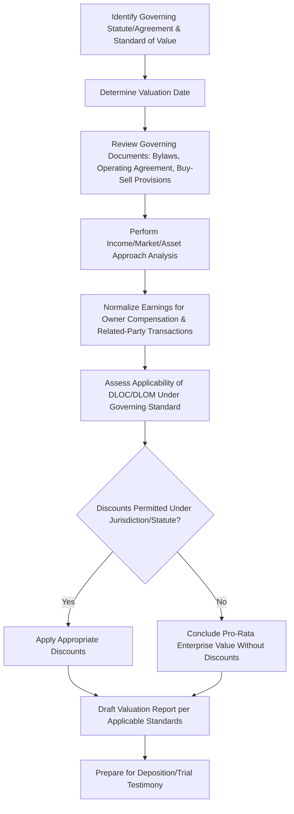

## Valuation in Shareholder and Partnership Disputes

### Overview

Valuation in shareholder and partnership disputes applies core business valuation methodology within a distinctive legal context shaped by statutory frameworks, fiduciary duty principles, and the specific procedural posture of the dispute. Unlike a general commercial valuation, these engagements are frequently governed by jurisdiction-specific statutes defining the applicable standard of value, and are complicated by the closely held nature of the entities involved, the frequent absence of a ready market for the ownership interest at issue, and the adversarial dynamics between owners who often have direct, detailed knowledge of the business.

### Common Dispute Contexts Requiring Valuation

**Key Points**

- **Shareholder oppression/dissent actions**: A minority shareholder alleges oppressive conduct by controlling shareholders and seeks a buyout of their interest, or dissents from a merger/corporate action and exercises statutory appraisal rights
- **Partnership/LLC dissolution or withdrawal**: A partner or member withdraws, is expelled, or the entity dissolves, triggering a buyout obligation under the partnership/operating agreement or applicable statute
- **Breach of fiduciary duty claims**: Majority owners or managers are alleged to have engaged in self-dealing or usurped corporate opportunities, requiring valuation of the harm to minority interests
- **Divorce-related business valuation**: Where a closely held business interest is marital property subject to equitable distribution (addressed more fully as its own topic, but methodologically related)
- **Buy-sell agreement disputes**: Disagreement over the valuation methodology or resulting price under a contractual buy-sell provision

### The "Fair Value" Standard in Statutory Appraisal and Oppression Contexts

**Key Points**

- Many jurisdictions apply a "fair value" standard (distinct from "fair market value") in statutory appraisal rights and shareholder oppression proceedings
- Fair value is often interpreted to exclude discounts that would otherwise apply under a fair market value framework — most notably, courts in many jurisdictions decline to apply a discount for lack of marketability (DLOM) or discount for lack of control (DLOC) in these specific statutory contexts, reasoning that the oppressed or dissenting shareholder should not bear a discount created by the very conduct or transaction giving rise to the claim
- The specific treatment of discounts under "fair value" varies significantly by state/jurisdiction and by the specific statutory provision at issue

[Unverified] The application (or non-application) of marketability and minority discounts under a "fair value" standard is one of the most jurisdiction-dependent aspects of forensic valuation practice; case law varies considerably even within the same country, and some jurisdictions permit discounts in oppression cases while disallowing them in statutory appraisal cases, or vice versa. Applicable case law must be confirmed with counsel for the specific jurisdiction and proceeding type before finalizing a discount methodology.

### Valuation Date Determination

| Dispute Type | Typical Valuation Date Consideration |
| --- | --- |
| Statutory appraisal (dissenting shareholder) | Often the date immediately before the corporate action giving rise to appraisal rights (e.g., date of merger) |
| Shareholder oppression buyout | May be the date of the petition, date of trial, or a date set by court discretion, depending on jurisdiction |
| Partnership/LLC withdrawal | Often governed by the specific withdrawal/dissolution date under the partnership agreement or applicable statute |
| Buy-sell agreement dispute | Governed by the specific triggering event date defined in the agreement (death, disability, withdrawal, termination) |

[Inference] Valuation date selection can materially affect the concluded value, particularly in dynamic or rapidly growing/declining businesses, making this an important threshold determination to confirm with counsel early in the engagement rather than an incidental detail addressed after the valuation analysis is substantially complete.

### The Valuation Workflow in Shareholder/Partnership Disputes

### Normalization Adjustments Specific to Closely Held Entity Disputes

**Key Points**

- **Owner/officer compensation normalization**: Closely held business owners frequently set their own compensation at levels reflecting tax planning or personal preference rather than fair market value for services rendered; normalizing to fair market compensation is essential to isolate true economic earnings
- **Related-party transaction scrutiny**: Transactions with entities controlled by the majority owner (rent, management fees, intercompany loans) require careful review for arm's-length pricing, as non-arm's-length terms can distort reported profitability
- **Perquisites and discretionary expenses**: Personal expenses run through the business (vehicles, travel, family member "no-show" positions) must be identified and added back to normalize earnings
- These adjustments are often more contested and more central to the dispute in shareholder/partnership litigation than in arm's-length commercial valuations, precisely because the alleged oppressive or wrongful conduct often manifests through these same mechanisms

### Interaction with Alleged Oppressive or Wrongful Conduct

**Example**

> In a shareholder oppression case, the minority shareholder alleges the majority owner paid themselves excessive compensation and diverted a corporate opportunity to a separate entity they control, both actions depressing the company's reported profitability and, by extension, the value attributable to the minority interest.
>
> The forensic accountant's valuation analysis must therefore incorporate:
>
> - Normalization of majority owner compensation to fair market levels
> - Quantification of profits from the diverted corporate opportunity, added back to the subject company's earnings base
> - Sensitivity analysis showing the valuation impact of these adjustments, since the magnitude of alleged oppression is often directly reflected in the delta between reported and normalized value

### Buy-Sell Agreement Valuation Disputes

**Key Points**

- Buy-sell agreements often specify a valuation methodology (formula-based, fixed price with periodic updates, or "fair market value as determined by an appraiser") — the forensic accountant's first task is to interpret and apply the specific contractual methodology rather than defaulting to a generic valuation approach
- Disputes commonly arise where: (a) the agreement's formula produces a result the parties believe no longer reflects economic reality, (b) the agreement is ambiguous as to methodology, or (c) multiple appraisers reach materially different conclusions under the same nominal standard
- Where the agreement calls for appraisal by multiple experts with a reconciliation mechanism (e.g., "average of two appraisals" or a third, independent appraiser resolving a disputed range), the forensic accountant should understand this mechanism's effect on incentives and framing of the opinion

### Marketability and Control Discounts: Partnership-Specific Considerations

| Interest Type | Discount Considerations |
| --- | --- |
| General partnership interest with management control | DLOC typically not applicable (or minimal); DLOM may still apply given lack of public market |
| Limited partnership/passive LLC member interest | Both DLOC and DLOM often applicable, reflecting lack of control and lack of liquidity |
| Withdrawing partner under a specific statutory buyout | Discount treatment governed by the specific partnership statute and any governing agreement language, which may explicitly address (permit or prohibit) discounts |

[Unverified] Statutory partnership/LLC buyout provisions vary considerably in whether they explicitly address discount treatment; some statutes and operating agreements are silent, leaving discount applicability to case law interpretation or negotiation between the parties' experts.

### Fiduciary Duty and Corporate Opportunity Doctrine: Valuation Implications

**Key Points**

- Where a breach of fiduciary duty claim involves usurpation of a corporate opportunity, the forensic accountant may need to value the opportunity itself (as a hypothetical business or asset) rather than, or in addition to, valuing the existing entity
- Disgorgement-based damages in this context require quantifying the profits earned by the fiduciary (or an entity they control) from the diverted opportunity, using techniques similar to unjust enrichment analysis in commercial tort disputes

### Documentation and Access Challenges Unique to These Disputes

**Key Points**

- Minority shareholders/partners in dispute with controlling owners often have limited access to complete financial records, requiring the forensic accountant to work with counsel to pursue formal discovery of financial data
- Controlling parties may have incentive to understate profitability during the dispute period (opposite incentive from typical arm's-length sale contexts), requiring heightened scrutiny of discretionary expense classification and related-party dealings
- Prior tax returns, management-prepared financials, and audited financials (where available) should be reconciled to identify inconsistencies that may signal manipulation

### Common Analytical Pitfalls

**Key Points**

- Applying fair market value discount conventions (DLOM/DLOC) by default without first confirming the applicable statutory or case-law standard of value for the specific proceeding and jurisdiction
- Failing to adequately normalize owner compensation and related-party transactions, understating true economic value where oppressive conduct has depressed reported earnings
- Misapplying or misinterpreting a governing buy-sell agreement's specified valuation methodology
- Selecting an incorrect valuation date, materially skewing the result in a business with significant value change over the relevant period
- Inadequate documentation of the rationale for discount application (or non-application), leaving the conclusion vulnerable on cross-examination

### Illustrative Discount Applicability Decision Path

<svg xmlns="http://www.w3.org/2000/svg" viewBox="0 0 850 260" font-family="Arial, sans-serif">
<text x="425" y="22" font-size="16" font-weight="bold" text-anchor="middle">Discount Applicability by Proceeding Type (svg_diagram)</text>
<rect x="30" y="60" width="200" height="60" fill="#e8f0fe" stroke="#4285f4" />
<text x="130" y="85" font-size="10" text-anchor="middle">Statutory Appraisal /</text>
<text x="130" y="100" font-size="10" text-anchor="middle">Oppression ("Fair Value")</text>
<rect x="270" y="60" width="200" height="60" fill="#fef7e0" stroke="#fbbc04" />
<text x="370" y="85" font-size="10" text-anchor="middle">Voluntary Buy-Sell /</text>
<text x="370" y="100" font-size="10" text-anchor="middle">Arm's-Length Transfer</text>
<rect x="510" y="60" width="200" height="60" fill="#e6f4ea" stroke="#34a853" />
<text x="610" y="85" font-size="10" text-anchor="middle">Divorce / Marital</text>
<text x="610" y="100" font-size="10" text-anchor="middle">Property Distribution</text>
<rect x="30" y="160" width="200" height="60" fill="#fce8e6" stroke="#ea4335" />
<text x="130" y="185" font-size="10" text-anchor="middle">Discounts often</text>
<text x="130" y="200" font-size="10" text-anchor="middle">disallowed (jurisdiction-dependent)</text>
<rect x="270" y="160" width="200" height="60" fill="#e6f4ea" stroke="#34a853" />
<text x="370" y="185" font-size="10" text-anchor="middle">Discounts typically</text>
<text x="370" y="200" font-size="10" text-anchor="middle">applicable per FMV standard</text>
<rect x="510" y="160" width="200" height="60" fill="#fef7e0" stroke="#fbbc04" />
<text x="610" y="185" font-size="10" text-anchor="middle">Treatment varies</text>
<text x="610" y="200" font-size="10" text-anchor="middle">significantly by jurisdiction</text>
<line x1="130" y1="120" x2="130" y2="160" stroke="black" marker-end="url(#arrow6)" />
<line x1="370" y1="120" x2="370" y2="160" stroke="black" marker-end="url(#arrow6)" />
<line x1="610" y1="120" x2="610" y2="160" stroke="black" marker-end="url(#arrow6)" />
</svg>

### Conclusion

Valuation in shareholder and partnership disputes demands close integration of standard business valuation methodology with jurisdiction-specific statutory frameworks and governing agreement language, particularly regarding the applicable standard of value, valuation date, and treatment of marketability and control discounts. These engagements are further distinguished by heightened scrutiny of owner compensation, related-party transactions, and discretionary expenses, since the alleged wrongful conduct at the heart of the dispute frequently operates through the same financial levers that a valuation analysis must normalize. Rigorous attention to the specific legal and contractual framework governing each engagement — confirmed early and explicitly with retaining counsel — is essential to producing a defensible valuation conclusion in this procedurally complex and often highly adversarial category of forensic work.

**Related Topics**

- Income, market, and asset-based valuation approaches in depth
- Discount for lack of marketability and lack of control quantification
- Fair value vs. fair market value standards by jurisdiction
- Owner compensation and related-party transaction normalization techniques
- Buy-sell agreement drafting and valuation methodology interpretation
- Breach of fiduciary duty and corporate opportunity doctrine damages
- Business valuation in divorce and matrimonial dissolution
- Statutory appraisal rights and dissenting shareholder proceedings
- Discovery and financial record access challenges in closely held entity disputes
- Rebuttal analysis of opposing valuation experts in ownership disputes