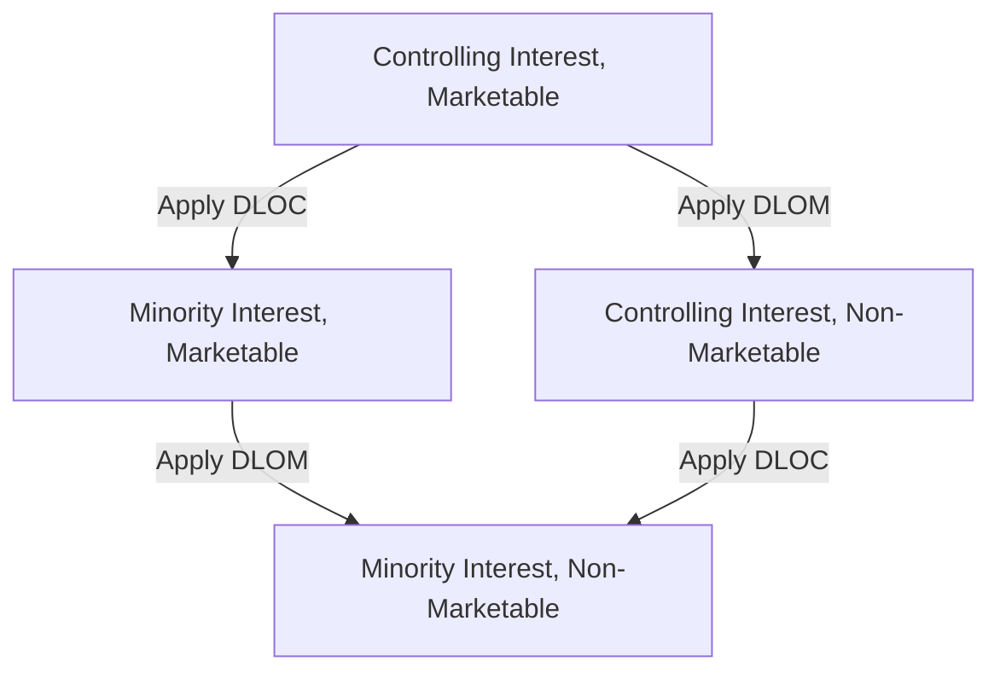

## Discounts for Lack of Marketability and Control

### Overview

Discounts for lack of marketability (DLOM) and lack of control (DLOC) are valuation adjustments applied to reflect characteristics of the specific ownership interest being valued that differ from the characteristics implicit in the base valuation methodology. These discounts sit conceptually "downstream" of the core income, market, or asset-based valuation approaches: the base approach typically produces an indication of value for a control, marketable interest (or a minority, marketable interest, depending on methodology), which must then be adjusted to reflect the actual attributes of the specific interest at issue.

### Conceptual Framework: The Levels of Value

**Key Points**

- Valuation theory commonly organizes value into a hierarchy of "levels," each reflecting a different combination of control and marketability characteristics
- Moving from the top of the hierarchy downward, discounts are applied to reflect the absence of characteristics present at higher levels

| Level | Description | Typical Source of Base Value |
| --- | --- | --- |
| Controlling, Marketable | Value of a control block as if freely tradable | Guideline transaction method (control premium embedded) |
| Controlling, Non-Marketable | Control value adjusted for lack of a ready market | Controlling marketable value less DLOM |
| Minority, Marketable | Value as if a freely tradable minority interest | Guideline public company method |
| Minority, Non-Marketable | The most common "real-world" level for closely held minority interests | Minority marketable value less DLOM |

[Inference] The specific starting point and directional application of discounts depends on which base methodology was used (e.g., guideline public company data typically starts at a minority-marketable level, requiring only DLOM to reach minority-non-marketable, whereas guideline transaction data often starts at a controlling level, requiring both a minority discount and DLOM if valuing a non-controlling, non-marketable interest); confusing the starting level with the target level is a common source of double-counting or omission errors.

### Discount for Lack of Control (DLOC)

**Key Points**

- Reflects the reduced value of an ownership interest that cannot unilaterally direct corporate policy, declare distributions, hire/fire management, set compensation, or force a sale/liquidation of the company
- Often quantified as the inverse of an observed control premium: if control transactions trade at a premium over minority-interest trading prices, the minority discount can be derived mathematically from that premium

$$DLOC = 1 - \frac{1}{1 + \text{Control Premium}}$$

**Example**

> If empirical control premium studies indicate an average control premium of 30% (i.e., acquirers pay 30% more than the pre-announcement minority trading price to obtain control):
>
> $$DLOC = 1 - \frac{1}{1.30} = 1 - 0.769 = 0.231 \text{ (approximately 23.1\%)}$$

- Sources of control premium data include published control premium studies (e.g., aggregating data from completed M&A transactions), though the applicability of general studies to a specific subject company requires judgment regarding comparability
- The degree of control actually exercisable by the specific interest matters: a large minority block with certain veto rights or blocking power under governing documents may warrant a smaller DLOC than a truly powerless minority interest

### Discount for Lack of Marketability (DLOM)

**Key Points**

- Reflects the reduced value of an interest that cannot be readily converted to cash compared to a freely tradable, liquid security (e.g., a public company stock that can be sold within days)
- Applies to both controlling and minority interests in closely held companies, though the magnitude often differs (control interests are sometimes viewed as somewhat more marketable due to the ability to force a sale or initiate a public offering, though this is not universally accepted)
- DLOM is widely regarded as one of the most subjective and heavily litigated elements of business valuation, given the absence of a single universally accepted quantification method

### DLOM Quantification Methods

| Method | Description |
| --- | --- |
| **Restricted stock studies** | Analyze discounts observed when publicly traded companies issue restricted (non-registered) shares that cannot be immediately resold, as a proxy for illiquidity discounts |
| **Pre-IPO studies** | Compare private transaction prices in a company's stock before its IPO to the eventual IPO price, with the difference used as an illiquidity proxy |
| **Option-pricing models (e.g., Black-Scholes-based approaches)** | Model the cost of a hypothetical put option that would allow the holder to sell the illiquid interest at a future date, using the option premium as an implied discount |
| **Quantitative Marketability Discount Model (QMDM)** | A specific model incorporating expected holding period, expected growth, and required rate of return to derive an implied discount, developed as an alternative to empirical study-based approaches |
| **Empirical/judgmental synthesis** | Many practitioners triangulate across multiple methods and studies, applying professional judgment to select a discount range appropriate to the specific facts (holding period expectations, dividend policy, transfer restrictions, company size and risk) |

[Inference] Restricted stock and pre-IPO studies have both faced methodological criticism in professional and judicial commentary (e.g., changes in SEC restricted stock holding period rules over time affecting the comparability of older studies, and selection bias concerns in pre-IPO studies limited to companies that successfully completed an IPO), which is why many practitioners use a synthesis of methods rather than relying on a single study or model; specific critiques and their current acceptance should be verified against current literature for any given engagement.

### Factors Affecting DLOM Magnitude

**Key Points**

- **Dividend/distribution policy**: Companies with regular distributions are generally considered more marketable (lower DLOM) than those retaining all earnings
- **Financial performance and risk profile**: More stable, profitable companies are generally viewed as more marketable than volatile or distressed companies
- **Size of the block being valued**: Larger blocks may face a smaller pool of potential buyers, potentially increasing illiquidity discount in some analyses
- **Transfer restrictions**: Contractual restrictions on transfer (e.g., rights of first refusal, buy-sell agreement restrictions) generally increase DLOM
- **Prospect of liquidity event**: A reasonably anticipated near-term sale, IPO, or other liquidity event may reduce DLOM relative to a company with no foreseeable exit
- **Company size and information availability**: Smaller companies with less publicly available financial information are often viewed as less marketable than larger, more transparent companies

### Interaction with Standard of Value

**Key Points**

- As addressed in valuation approach selection, the applicable standard of value governs whether DLOC and DLOM are appropriate at all
- Under a fair market value standard, both discounts are generally applicable when valuing a non-controlling, non-marketable interest
- Under a "fair value" standard in many statutory appraisal/oppression contexts, courts in numerous jurisdictions have declined to apply DLOM and/or DLOC, reasoning that the shareholder should receive their proportionate share of the going-concern enterprise value without penalty for the illiquidity or minority status the dispute itself may have created or aggravated

[Unverified] As noted in the discussion of shareholder/partnership valuation disputes, the specific treatment of DLOM and DLOC under fair value standards is highly jurisdiction- and case-law-dependent, and some jurisdictions permit discounts in certain fair value contexts while disallowing them in others; this must be confirmed against controlling authority for the specific forum before finalizing discount application.

### Sequencing and Avoiding Double-Counting

**Key Points**

- DLOC and DLOM are typically applied multiplicatively, not additively, since they represent distinct, sequential adjustments:

$$V_{\text{minority, non-marketable}} = V_{\text{control, marketable}} \times (1 - DLOC) \times (1 - DLOM)$$

**Example**

> A controlling, marketable base value of $10,000,000, with a DLOC of 20% and a DLOM of 25% applicable to a minority, non-marketable interest being valued:
>
> $$V = 10{,}000{,}000 \times (1 - 0.20) \times (1 - 0.25) = 10{,}000{,}000 \times 0.80 \times 0.75 = 6{,}000{,}000$$

- A common analytical error is applying both discounts additively (e.g., simply subtracting 45% in the example above), which produces a different and generally less theoretically sound result than the multiplicative approach
- Practitioners must also avoid double-counting risk factors already embedded in the discount rate used in the base income approach valuation — if company-specific risk (including some liquidity-related risk) has already been reflected in a higher discount rate, applying a full, undiminished DLOM on top of that adjusted value may overstate the total illiquidity adjustment

### Documentation Standards for Discount Support

**Key Points**

- Professional standards (e.g., AICPA Statement on Standards for Valuation Services, ASA Business Valuation Standards) generally require the valuator to disclose and support the basis for discount selection, not merely assert a percentage
- A defensible discount analysis typically documents: which empirical studies or models were considered, why the selected discount falls within (or outside) observed study ranges, and how subject-company-specific factors informed the final selected percentage within that range
- Bare assertion of a discount percentage without supporting analysis is a common and significant vulnerability exploited in cross-examination and rebuttal reports

### Common Analytical Pitfalls

**Key Points**

- Applying discounts additively rather than multiplicatively
- Applying DLOM and/or DLOC without confirming their permissibility under the applicable standard of value for the specific proceeding
- Selecting a discount percentage from a study range without articulating the subject-company-specific factors justifying that particular point within the range
- Double-counting illiquidity or minority-status risk already reflected in the discount rate used within the income approach
- Confusing the base level of value implied by the chosen methodology (e.g., guideline public company data yields a minority-marketable base, not a controlling base) and applying the wrong discount

### Illustrative Discount Application Bridge

<svg xmlns="http://www.w3.org/2000/svg" viewBox="0 0 850 260" font-family="Arial, sans-serif">
<text x="425" y="22" font-size="16" font-weight="bold" text-anchor="middle">DLOC and DLOM Applied Sequentially (svg_diagram)</text>
<rect x="30" y="90" width="160" height="80" fill="#e8f0fe" stroke="#4285f4" />
<text x="110" y="120" font-size="9" text-anchor="middle">Control, Marketable</text>
<text x="110" y="140" font-size="11" font-weight="bold" text-anchor="middle">$10,000,000</text>
<rect x="240" y="90" width="160" height="80" fill="#fef7e0" stroke="#fbbc04" />
<text x="320" y="115" font-size="9" text-anchor="middle">Less DLOC 20%</text>
<text x="320" y="135" font-size="11" font-weight="bold" text-anchor="middle">$8,000,000</text>
<text x="320" y="150" font-size="8" text-anchor="middle">(Minority, Marketable)</text>
<rect x="450" y="90" width="160" height="80" fill="#fce8e6" stroke="#ea4335" />
<text x="530" y="115" font-size="9" text-anchor="middle">Less DLOM 25%</text>
<text x="530" y="135" font-size="11" font-weight="bold" text-anchor="middle">$6,000,000</text>
<text x="530" y="150" font-size="8" text-anchor="middle">(Minority, Non-Marketable)</text>
<rect x="660" y="90" width="150" height="80" fill="#e6f4ea" stroke="#34a853" />
<text x="735" y="120" font-size="9" text-anchor="middle">Final Concluded Value</text>
<text x="735" y="140" font-size="11" font-weight="bold" text-anchor="middle">$6,000,000</text>
<line x1="190" y1="130" x2="240" y2="130" stroke="black" marker-end="url(#arrow7)" />
<line x1="400" y1="130" x2="450" y2="130" stroke="black" marker-end="url(#arrow7)" />
<line x1="610" y1="130" x2="660" y2="130" stroke="black" marker-end="url(#arrow7)" />
</svg>

### Conclusion

Discounts for lack of marketability and control adjust base valuation indications to reflect the specific, real-world attributes of the ownership interest actually being valued — its degree of control and its liquidity. Proper application requires careful attention to the "level of value" implied by the base methodology, correct multiplicative (rather than additive) sequencing, jurisdiction-specific confirmation of permissibility under the applicable standard of value, and — perhaps most critically — robust, fact-specific documentation supporting the selected discount magnitude rather than reliance on generic study averages. Because DLOM and DLOC calculations often materially affect the final concluded value and are frequently the subject of the most intense scrutiny in forensic valuation disputes, transparent and well-supported discount methodology is essential to a defensible expert opinion.

**Related Topics**

- Income, market, and asset-based valuation approaches in depth
- Levels of value framework and control premium studies
- Restricted stock studies, pre-IPO studies, and option-pricing DLOM models
- Fair value vs. fair market value discount treatment by jurisdiction
- Valuation in shareholder and partnership disputes
- AICPA Statement on Standards for Valuation Services (SSVS) documentation requirements
- Rebuttal analysis and critique of opposing discount methodologies
- Buy-sell agreement discount provisions and interpretation
- Quantitative Marketability Discount Model (QMDM) mechanics
- Business valuation in divorce and estate/gift tax contexts