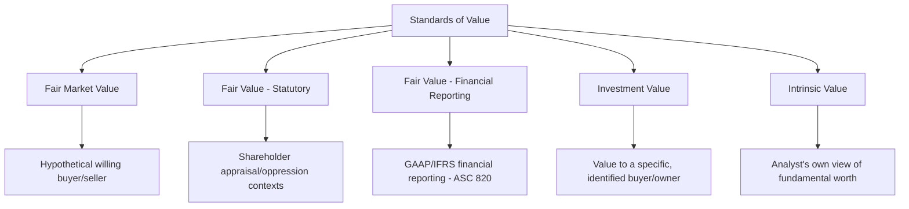
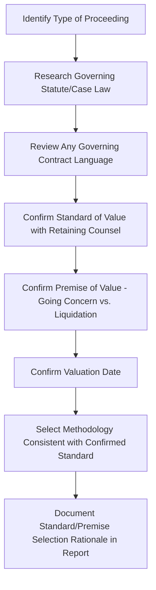

## Standards of Value in Litigation Contexts

### Overview

The standard of value is the threshold definitional question in any business valuation engagement, establishing precisely what concept of "value" is being measured before any methodology is applied. In litigation contexts, the standard of value is frequently dictated by statute, case law, or the specific governing agreement rather than left to the valuator's discretion, and selecting the wrong standard — even while applying otherwise sound methodology — can render an entire valuation analysis inadmissible or unpersuasive. Understanding the distinctions among the major standards, and knowing which applies to which type of proceeding, is foundational to defensible forensic valuation work.

### The Major Standards of Value

### Fair Market Value

**Key Points**

- The most widely used standard, generally defined as the price at which property would change hands between a hypothetical willing buyer and a hypothetical willing seller, neither being under compulsion to buy or sell, both having reasonable knowledge of relevant facts
- Rooted in U.S. tax law and regulation (originating in estate and gift tax valuation contexts) but broadly adopted across many valuation contexts as a default standard absent a more specific governing standard
- Because the buyer and seller are hypothetical (not the actual, specific parties to the dispute), fair market value generally incorporates discounts for lack of control and lack of marketability where applicable to the specific interest being valued
- Commonly applied in: estate and gift tax matters, ESOP transactions, general commercial disputes without a more specific governing standard, and many buy-sell agreement contexts (where the agreement specifies "fair market value")

### Fair Value (Statutory/Litigation Context)

**Key Points**

- A distinct standard from fair market value, typically defined by state corporate statutes (in the U.S. context) or equivalent legal frameworks elsewhere, most commonly arising in:
  - **Dissenting shareholder/statutory appraisal proceedings**: Where a shareholder dissents from a merger, sale of substantially all assets, or other extraordinary corporate transaction and exercises a statutory right to have their shares valued and purchased
  - **Shareholder oppression proceedings**: Where a court orders a buyout of an oppressed minority shareholder's interest as an equitable remedy
- The precise definition of "fair value" is generally left to case law interpretation within each jurisdiction's statutory framework, since most statutes do not provide a detailed valuation methodology
- As addressed in prior discounts-related material, courts in many (though not all) jurisdictions have interpreted fair value to exclude discounts for lack of marketability and/or lack of control in these specific contexts, on the equitable rationale that the shareholder should not be penalized with discounts arising from the very transaction or oppressive conduct giving rise to their claim

[Unverified] The scope of "fair value" case law is highly fragmented across jurisdictions, with some courts applying different discount rules to appraisal proceedings versus oppression proceedings even within the same state, and other jurisdictions taking materially different approaches altogether. This is an area where controlling authority must be identified and confirmed with counsel for each specific engagement rather than assumed based on general practice patterns.

### Fair Value (Financial Reporting Context) — Distinguished from Litigation Fair Value

**Key Points**

- A separate and conceptually distinct use of the term "fair value" arises in financial reporting/accounting standards contexts (e.g., ASC 820 in U.S. GAAP, IFRS 13), generally defined as an exit price in an orderly transaction between market participants at the measurement date
- This financial reporting standard is more conceptually similar to fair market value than to the statutory litigation "fair value" standard discussed above, despite sharing the same terminology
- Forensic accountants must take care to clarify which "fair value" concept is relevant to a given engagement, since the same term carries substantively different meaning and discount implications depending on context (litigation/statutory vs. financial reporting)

### Investment Value

**Key Points**

- Reflects the value of an asset or business interest to a specific, identified buyer or owner, incorporating that party's unique synergies, strategic objectives, tax situation, or other buyer-specific factors
- Distinct from fair market value's hypothetical, generic buyer/seller framework — investment value can differ substantially between different potential buyers of the same asset
- Relevant in disputes involving: a specific strategic acquirer's valuation of a target, disputes over the value of synergies in a completed or contemplated transaction, and certain buy-sell agreements that explicitly reference the value to a specific remaining owner rather than a hypothetical market participant

### Intrinsic Value

**Key Points**

- Represents the valuator's own assessment of the "true" or fundamental economic value of an asset, based on an analysis of its investment characteristics, independent of the price at which it might currently trade in the market
- Less commonly the explicit governing standard in litigation contexts compared to fair market value or statutory fair value, but the underlying analytical concept (fundamental value based on expected future cash flows) often informs the income approach methodology regardless of which formal standard ultimately governs the engagement

### Mapping Proceeding Type to Applicable Standard

| Proceeding Type | Typical Governing Standard | Key Consideration |
| --- | --- | --- |
| Estate and gift tax valuation | Fair market value | Well-established regulatory framework and extensive case law |
| Dissenting shareholder appraisal | Fair value (statutory) | Discount treatment highly jurisdiction-dependent |
| Shareholder oppression buyout | Fair value (statutory) or fair market value, depending on jurisdiction | Some jurisdictions apply fair market value in oppression contexts even while applying fair value in appraisal contexts |
| Divorce/marital dissolution | Varies by jurisdiction — some apply fair market value, others a variant excluding certain discounts | Highly state/jurisdiction-specific in the U.S. context; other countries have their own frameworks |
| Buy-sell agreement dispute | Governed by the specific contract language | May reference fair market value, a formula, or a custom-defined standard |
| Commercial damages (lost business value) | Often fair market value, or a case-specific "but-for" value construct | May blend valuation standard with damages causation framework |
| Financial reporting/purchase price allocation | Fair value (ASC 820/IFRS 13) | Distinct from litigation fair value; governed by accounting standards, not case law |

[Inference] Divorce/marital dissolution valuation standards are particularly variable, with some jurisdictions explicitly excluding personal goodwill from the marital estate while including enterprise goodwill, and applying discount conventions that may differ from both fair market value and statutory fair value frameworks used elsewhere; this area in particular requires jurisdiction-specific confirmation rather than reliance on general valuation practice.

### The Premise of Value: A Related but Distinct Concept

**Key Points**

- Separate from the standard of value, the premise of value addresses the assumed use of the business or asset being valued:
  - **Going concern**: Assumes continued operation of the business as an ongoing enterprise
  - **Liquidation (orderly or forced)**: Assumes cessation of operations and sale of individual assets
- The appropriate premise depends on the specific facts (e.g., a company in genuine financial distress facing imminent closure may warrant a liquidation premise even where the standard of value is fair market value)
- Both the standard of value AND the premise of value must be explicitly identified and justified before methodology selection, as conflating or omitting either can undermine the analytical foundation of the entire valuation

### Practical Workflow for Standard of Value Determination

### Consequences of Selecting the Wrong Standard

**Key Points**

- A valuation performed under the wrong standard of value may be excluded or given little weight even if the underlying methodology (DCF construction, multiple selection, etc.) is technically sound, because the analysis answers a different question than the one the court or statute requires
- Opposing counsel and rebuttal experts frequently challenge standard-of-value selection as a threshold issue, since a successful challenge can undermine the entire report without needing to attack detailed calculations
- Courts may also reject a valuation that fails to address governing case law's specific treatment of discounts, goodwill components, or other standard-specific nuances, even where the general approach (income, market, asset) is appropriate

### Documentation Requirements

**Key Points**

- Professional standards (e.g., AICPA SSVS) require the valuator to identify and disclose the standard of value and premise of value used, along with the source of that determination (statute, case law, engagement agreement, or valuator's independent selection where no governing authority dictates the standard)
- Where the standard of value is genuinely ambiguous or contested between the parties, the forensic accountant should clearly state the standard applied and, where useful to the trier of fact, may present alternative conclusions under competing standards with clear labeling of each

### Common Analytical Pitfalls

**Key Points**

- Defaulting to fair market value methodology (including automatic application of DLOM/DLOC) without confirming whether a jurisdiction-specific fair value standard governs the proceeding
- Confusing litigation/statutory "fair value" with financial reporting "fair value" under ASC 820/IFRS 13, given the shared terminology but different conceptual frameworks
- Failing to separately identify and justify the premise of value (going concern vs. liquidation) independent of the standard of value determination
- Applying a generic, jurisdiction-agnostic standard-of-value framework without researching the specific controlling statute and case law for the forum at issue
- Omitting documentation of the basis for standard-of-value selection, leaving the report vulnerable to a threshold challenge

### Illustrative Standard-of-Value Decision Framework

<svg xmlns="http://www.w3.org/2000/svg" viewBox="0 0 850 260" font-family="Arial, sans-serif">
<text x="425" y="22" font-size="16" font-weight="bold" text-anchor="middle">Standard of Value Selection Framework (svg_diagram)</text>
<rect x="30" y="60" width="180" height="50" fill="#e8f0fe" stroke="#4285f4" />
<text x="120" y="90" font-size="10" text-anchor="middle">Proceeding Type</text>
<rect x="260" y="60" width="180" height="50" fill="#fef7e0" stroke="#fbbc04" />
<text x="350" y="90" font-size="10" text-anchor="middle">Governing Statute /</text>
<text x="350" y="102" font-size="9" text-anchor="middle">Case Law / Contract</text>
<rect x="490" y="60" width="180" height="50" fill="#fce8e6" stroke="#ea4335" />
<text x="580" y="90" font-size="10" text-anchor="middle">Applicable Standard</text>
<rect x="30" y="160" width="640" height="60" fill="#e6f4ea" stroke="#34a853" />
<text x="350" y="185" font-size="10" text-anchor="middle">Discount Treatment, Goodwill Treatment, and Methodology</text>
<text x="350" y="203" font-size="10" text-anchor="middle">All Flow From the Confirmed Standard — Not Assumed in Advance</text>
<line x1="210" y1="85" x2="260" y2="85" stroke="black" marker-end="url(#arrow8)" />
<line x1="440" y1="85" x2="490" y2="85" stroke="black" marker-end="url(#arrow8)" />
<line x1="580" y1="110" x2="350" y2="160" stroke="black" marker-end="url(#arrow8)" />
</svg>

### Conclusion

Standards of value in litigation contexts establish the definitional foundation upon which every subsequent valuation decision — methodology selection, discount application, goodwill treatment — must rest. Because the governing standard is frequently dictated by statute, case law, or contract rather than left to the valuator's preference, and because the same terminology (particularly "fair value") carries different meanings across different legal contexts, confirming the correct standard with retaining counsel at the outset of an engagement is an essential, non-negotiable first step. A valuation conclusion built on sound methodology but the wrong standard of value risks exclusion or diminished weight regardless of its technical rigor, making this threshold determination one of the highest-leverage decisions in any forensic valuation engagement.

**Related Topics**

- Income, market, and asset-based valuation approaches in depth
- Discounts for lack of marketability and control by standard of value
- Valuation in shareholder and partnership disputes
- Premise of value: going concern vs. liquidation determinations
- Personal vs. enterprise goodwill treatment in divorce valuations
- AICPA Statement on Standards for Valuation Services (SSVS) requirements
- ASC 820/IFRS 13 fair value measurement distinguished from litigation fair value
- Estate and gift tax valuation methodology and IRS Revenue Ruling 59-60
- Jurisdiction-specific case law research for statutory appraisal proceedings
- Rebuttal analysis challenging opposing expert's standard-of-value selection