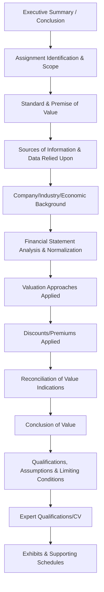

## Valuation Report Writing for Litigation Support

### Overview

Valuation report writing for litigation support translates technical valuation analysis into a formal, structured document designed to withstand judicial scrutiny, opposing expert critique, and cross-examination. Unlike valuation reports prepared for internal, transactional, or advisory purposes, litigation valuation reports must satisfy specific procedural disclosure requirements, professional reporting standards, and evidentiary reliability standards (Daubert/Kumho Tire), while remaining comprehensible to judges and juries without specialized financial training.

### Governing Standards and Frameworks

**Key Points**

- **AICPA Statement on Standards for Valuation Services (SSVS)**: Governs valuation engagements performed by AICPA members, establishing required report content, developmental standards, and disclosure requirements (SSVS distinguishes between a "detailed report" and a "summary report," with litigation contexts often calling for the more comprehensive detailed format)
- **ASA Business Valuation Standards** and **NACVA professional standards**: Parallel frameworks applicable depending on the valuator's credentialing body
- **USPAP (Uniform Standards of Professional Appraisal Practice)**: Applicable primarily to real property and certain personal property appraisals, relevant where real estate or tangible asset valuation intersects with the business valuation
- **FRCP 26(a)(2)(B)** (U.S. federal context) or equivalent state rules: Impose specific procedural content requirements for expert reports intended to be used at trial, including a complete statement of all opinions, the basis and reasons for them, and the facts/data considered

[Unverified] The specific applicability and interaction of professional valuation standards (SSVS, ASA, NACVA) versus procedural court rules (FRCP or state equivalents) can create layered, sometimes overlapping requirements; a report must generally satisfy both simultaneously, and any conflicts or ambiguities should be resolved in consultation with counsel.

### Core Structural Components of a Litigation Valuation Report

#### Assignment Identification and Scope

- Clearly state the purpose of the valuation, the interest being valued (entire entity, specific percentage interest, specific class of equity), and the intended use and users of the report
- Identify the retaining party and, where relevant to independence disclosures, the relationship between the valuator and the parties to the litigation

#### Standard and Premise of Value

- Explicitly state the standard of value applied (fair market value, statutory fair value, investment value) and the basis for that selection (governing statute, case law, contract, or engagement instruction)
- State the premise of value (going concern vs. liquidation) and the supporting rationale

#### Sources of Information Relied Upon

- Comprehensive listing of documents reviewed: financial statements, tax returns, management interviews, industry data, comparable company/transaction data sources
- This section is critical for satisfying disclosure rules requiring a statement of facts and data considered, and for enabling opposing counsel/experts to assess the adequacy of the information base

#### Company, Industry, and Economic Background

- Provides context necessary for the trier of fact to understand the business being valued and the environment in which it operates
- Should be tailored to information genuinely relevant to the valuation conclusion, not generic boilerplate

#### Financial Statement Analysis and Normalization

- Presents the historical financial statements as reported, followed by any normalization adjustments (owner compensation, non-recurring items, related-party transactions) with clear explanation and support for each adjustment
- Adjustments should be presented in a transparent bridge format (reported figures → adjustments → normalized figures) rather than merely presenting final adjusted numbers without reconciliation

#### Valuation Approaches Applied

- For each approach used (income, market, asset-based), present the specific method, key inputs and assumptions, supporting calculations, and the resulting indication of value
- Approaches considered but not used should be addressed with a brief explanation of why they were not applied, particularly where professional standards expect consideration of all three approaches

#### Discounts and Premiums

- Document the basis for any DLOM, DLOC, or control premium applied, referencing specific studies, models, or company-specific factors supporting the selected magnitude (see prior discussion of discount documentation standards)

#### Reconciliation and Conclusion of Value

- Explain how multiple approach-level indications were weighted or reconciled into the final conclusion, articulating the reasoning rather than presenting only a final number

#### Qualifications, Assumptions, and Limiting Conditions

- Standard language addressing the conditions and assumptions under which the analysis was performed, reliance on information provided by others, and the intended use restrictions of the report

#### Expert Qualifications

- Curriculum vitae or qualifications summary supporting the valuator's expertise, often required by procedural disclosure rules (e.g., FRCP 26(a)(2)(B) requires a statement of qualifications and a list of publications and prior testimony)

### Writing for the Trier of Fact: Clarity and Persuasion Balance

**Key Points**

- Litigation valuation reports serve a dual audience: technical reviewers (opposing experts, sophisticated counsel) who will scrutinize methodology in detail, and non-technical decision-makers (judges, juries) who must understand the conclusion and its basis without specialized training
- Effective reports use plain-language summaries and visual aids (charts, tables, bridges) to make complex financial concepts accessible, while preserving full technical rigor and support in the body and appendices
- Avoid unnecessary jargon in the narrative sections; where technical terms are necessary, define them clearly on first use

### Distinguishing Detailed vs. Summary Report Formats

| Report Type | Characteristics | Litigation Suitability |
| --- | --- | --- |
| **Detailed report** | Comprehensive documentation of all information, analyses, and conclusions per professional standards | Generally preferred/required for testifying expert reports subject to full disclosure and cross-examination |
| **Summary report** | Condensed presentation with less comprehensive documentation of underlying data and analysis | Less common for testifying contexts; may be used in early consulting phases before a decision to proceed to full disclosure |
| **Calculation report/engagement** (where applicable under governing standards) | Limited-scope engagement using agreed-upon procedures rather than a full valuation | Generally unsuitable for a testifying expert opinion intended to withstand Daubert scrutiny, given reduced procedures |

[Inference] Courts and opposing counsel often specifically scrutinize whether a report reflects a full valuation engagement versus a more limited calculation engagement, since the latter's reduced procedures can be used to challenge the reliability of the opinion under Daubert/Kumho Tire factors; the type of engagement performed should be clearly and accurately disclosed in the report itself.

### Addressing Anticipated Weaknesses and Alternative Scenarios

**Key Points**

- A well-constructed litigation report anticipates likely critique points and addresses them proactively rather than leaving them for a rebuttal report or deposition to surface
- Presenting sensitivity analysis on key assumptions (discount rate, growth rate, normalization adjustments) within the report itself demonstrates analytical rigor and reduces the persuasive impact of an opposing expert's attempt to show the conclusion is fragile

### Consistency with Prior Statements and Testimony

**Key Points**

- The report must be internally consistent and consistent with the valuator's prior testimony, publications, and previously issued reports in other matters, since inconsistencies are prime cross-examination material
- FRCP 26(a)(2)(B) and equivalent rules typically require disclosure of a list of other cases in which the expert has testified as an expert at trial or by deposition within a specified prior period, along with compensation information — reviewing this history for consistency before finalizing a new report is a prudent practice

### Common Structural and Substantive Pitfalls

**Key Points**

- Presenting a conclusion without adequate supporting reasoning connecting the underlying data and methodology to the final number
- Omitting explicit statement of standard and premise of value, or the basis for their selection
- Insufficient disclosure of all information relied upon, creating vulnerability to a motion to exclude on completeness grounds
- Failing to address approaches not used, when professional standards contemplate consideration of all three
- Overly technical, jargon-heavy narrative sections that fail to serve the report's function of assisting a lay trier of fact
- Inconsistency between the written report and anticipated deposition/trial testimony on key assumptions or conclusions

### Illustrative Report Structure Flow

<svg xmlns="http://www.w3.org/2000/svg" viewBox="0 0 850 260" font-family="Arial, sans-serif">
<text x="425" y="22" font-size="16" font-weight="bold" text-anchor="middle">Litigation Valuation Report Flow (svg_diagram)</text>
<rect x="30" y="60" width="150" height="50" fill="#e8f0fe" stroke="#4285f4" />
<text x="105" y="90" font-size="9" text-anchor="middle">Scope &amp; Standard</text>
<rect x="210" y="60" width="150" height="50" fill="#fef7e0" stroke="#fbbc04" />
<text x="285" y="90" font-size="9" text-anchor="middle">Data &amp; Normalization</text>
<rect x="390" y="60" width="150" height="50" fill="#fce8e6" stroke="#ea4335" />
<text x="465" y="90" font-size="9" text-anchor="middle">Approaches Applied</text>
<rect x="570" y="60" width="150" height="50" fill="#e6f4ea" stroke="#34a853" />
<text x="645" y="90" font-size="9" text-anchor="middle">Discounts &amp; Reconciliation</text>
<rect x="750" y="60" width="70" height="50" fill="#f3e8fd" stroke="#a142f4" />
<text x="785" y="90" font-size="8" text-anchor="middle">Conclusion</text>
<line x1="180" y1="85" x2="210" y2="85" stroke="black" marker-end="url(#arrow9)" />
<line x1="360" y1="85" x2="390" y2="85" stroke="black" marker-end="url(#arrow9)" />
<line x1="540" y1="85" x2="570" y2="85" stroke="black" marker-end="url(#arrow9)" />
<line x1="720" y1="85" x2="750" y2="85" stroke="black" marker-end="url(#arrow9)" />
<rect x="30" y="160" width="790" height="60" fill="#f8f9fa" stroke="#ccc" />
<text x="45" y="180" font-size="9" font-weight="bold">Supporting Content Throughout:</text>
<text x="45" y="200" font-size="9">Qualifications/CV • Assumptions &amp; Limiting Conditions • Exhibits &amp; Schedules • Prior Testimony Disclosure</text>
</svg>

### Conclusion

Valuation report writing for litigation support requires simultaneous compliance with professional valuation reporting standards, court procedural disclosure rules, and evidentiary reliability expectations, all while communicating complex financial analysis in a manner accessible to a lay trier of fact. A defensible report transparently documents the standard and premise of value, the complete information base relied upon, the methodology and reasoning behind each approach applied, and the basis for any discounts and final reconciliation — anticipating likely critique rather than leaving gaps for opposing experts to exploit. Because the written report is often the primary artifact scrutinized in pre-trial motions, deposition, and cross-examination, its structural completeness and analytical transparency directly determine the credibility and ultimate persuasive weight of the valuation opinion.

**Related Topics**

- Standards of value in litigation contexts
- Discounts for lack of marketability and control documentation
- FRCP 26(a)(2)(B) expert report content and disclosure requirements
- AICPA SSVS detailed vs. summary report requirements
- Daubert and Kumho Tire admissibility challenges to valuation methodology
- Rebuttal analysis and critique of opposing valuation reports
- Deposition and trial testimony preparation for valuation experts
- Sensitivity analysis presentation techniques in expert reports
- Income, market, and asset-based valuation approaches in depth
- Prior testimony consistency review and impeachment risk management