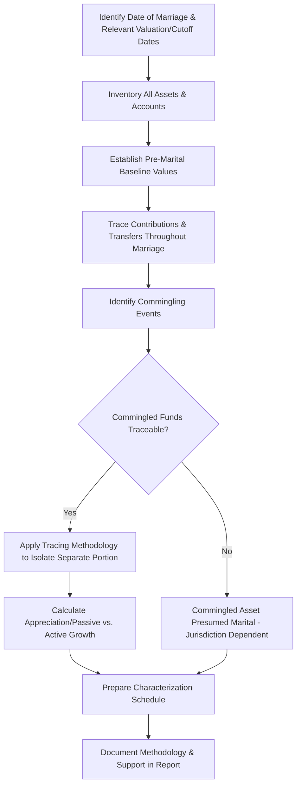

## Marital Asset Tracing and Characterization

### Overview

Marital asset tracing and characterization is the forensic accounting process of identifying, classifying, and following the flow of assets through a marriage to determine which assets (or portions of assets) constitute marital (community) property subject to division, versus separate (non-marital) property retained solely by one spouse. This work sits at the intersection of forensic accounting and family law, requiring both rigorous financial reconstruction techniques and close familiarity with the specific characterization rules of the governing jurisdiction, which vary substantially between community property and equitable distribution states/regimes.

### Foundational Property Classification Frameworks

**Key Points**

- **Community property jurisdictions**: Generally treat most property acquired during marriage as jointly owned in equal (or defined) shares, with property owned before marriage or acquired by gift/inheritance during marriage typically remaining separate
- **Equitable distribution jurisdictions**: Classify property as marital or separate, then divide marital property equitably (not necessarily equally) based on statutory factors, while separate property generally remains with the owning spouse
- Regardless of framework, three foundational categories typically apply:

| Category | General Treatment |
| --- | --- |
| **Separate/non-marital property** | Owned before marriage, or acquired during marriage by gift or inheritance to one spouse individually; generally excluded from division |
| **Marital/community property** | Acquired during the marriage through the efforts or income of either spouse; generally subject to division |
| **Commingled/transmuted property** | Originally separate property that has been mixed with marital assets or otherwise treated in a manner that converts some or all of it to marital character |

[Unverified] The specific rules governing classification, commingling, and transmutation vary substantially not only between community property and equitable distribution frameworks broadly, but also among individual states/jurisdictions within each framework; applicable law must be confirmed with family law counsel for the specific jurisdiction before finalizing a characterization analysis.

### The Tracing Analysis Workflow

#### Step 1: Establish Key Dates

- Date of marriage, date of separation, and any other jurisdiction-specific cutoff dates (some jurisdictions value/classify assets as of separation, others as of filing, others as of trial) fundamentally frame the entire analysis

#### Step 2: Inventory and Baseline Establishment

- Compile a complete inventory of assets and accounts held by either spouse, with historical documentation establishing pre-marital balances/values where separate property claims exist
- Pre-marital brokerage statements, bank statements, real property deeds, and business ownership records are key baseline evidence

#### Step 3: Trace Contributions and Transfers

- Follow the movement of funds through accounts over the course of the marriage, identifying deposits, withdrawals, transfers between accounts, and reinvestments
- This often requires reconstructing years (sometimes decades) of financial history from bank and brokerage records, particularly where formal accounting was never contemporaneously maintained

#### Step 4: Identify and Analyze Commingling

- Commingling occurs when separate and marital funds are mixed in the same account or asset, potentially converting some or all of the separate property to marital character depending on jurisdictional rules and whether tracing can still identify the separate component

### Tracing Methodologies for Commingled Assets

| Methodology | Description | Typical Application |
| --- | --- | --- |
| **Direct tracing** | Follows specific, identifiable dollars from their separate-property source through to their current form, using contemporaneous documentation | Preferred method where complete records exist |
| **Total recapitulation method** | Presumes property acquired during marriage is marital unless traced to a separate source, comparing total marital-source funds against total expenditures/acquisitions | Used when partial records exist but complete direct tracing is not feasible |
| **Family living expense (community-out-first) presumption** | Assumes commingled funds used for ordinary living expenses are drawn first from community/marital funds, preserving separate funds to the extent possible | Common judicially recognized presumption in several community property jurisdictions to resolve ambiguous commingled withdrawals |
| **Pro rata/proportional tracing** | Where exact tracing is impossible, allocates the account or asset's current value proportionally based on the ratio of separate to marital contributions at the time of commingling | Used as a fallback approach where direct tracing fails but some contribution data exists |

[Inference] The "family living expense" or "community funds exhausted first" presumption is a recognized principle in several community property jurisdictions to help resolve otherwise untraceable commingled withdrawals, but its specific formulation, name, and acceptance vary by jurisdiction, and equitable distribution states may apply different or no equivalent presumption; the applicable presumption (if any) should be confirmed with counsel.

### Active vs. Passive Appreciation

**Key Points**

- Where separate property appreciates in value during the marriage, many jurisdictions distinguish between:
  - **Passive appreciation**: Growth attributable to market forces or inflation, generally remaining separate property
  - **Active appreciation**: Growth attributable to the efforts, contributions, or management of either spouse during the marriage, which may be characterized as marital property (or the marital estate may be entitled to reimbursement/credit for the value added)
- This distinction is particularly significant for separately owned businesses, real estate, and investment portfolios that grew substantially during the marriage

**Example**

> A spouse owned a business valued at $500,000 at the date of marriage. At separation, the business is valued at $2,000,000. If the increase in value is attributable primarily to the owning spouse's active management and labor during the marriage (rather than passive market appreciation), a portion or all of the $1,500,000 increase may be characterized as marital property, subject to the specific legal framework and any applicable reimbursement doctrines in the jurisdiction.

[Inference] Quantifying the active vs. passive split typically requires an approach similar to a "with and without" or comparable-industry benchmarking analysis (e.g., comparing the business's actual growth to an industry or market index as a proxy for the passive component), though the specific methodology accepted varies by jurisdiction and is often a significant point of dispute between opposing experts.

### Common Asset Categories Requiring Specialized Tracing Analysis

| Asset Category | Tracing Considerations |
| --- | --- |
| **Real property** | Track down payment source (separate vs. marital funds), mortgage paydown source during marriage, and any capital improvements funded by marital vs. separate funds |
| **Retirement accounts** | Segregate pre-marital vs. marital contribution periods and associated growth, often requiring actuarial or coverture fraction calculations |
| **Closely held business interests** | Requires business valuation (see related valuation topics) combined with active/passive appreciation analysis for any pre-marital ownership component |
| **Inheritance and gifts received during marriage** | Generally separate property if kept segregated; tracing required if commingled with marital accounts |
| **Investment/brokerage accounts** | Requires transaction-level reconstruction where pre-marital holdings were sold and reinvested, or where marital contributions were added to a pre-marital account |
| **Stock options and deferred compensation** | Often requires a coverture fraction approach to allocate the marital portion based on the vesting period relative to the marriage period |

### The Coverture Fraction Approach

For assets (commonly retirement benefits or stock options) that accrue value over a period spanning both pre-marital and marital periods, a coverture fraction allocates the marital share:

$$\text{Marital Share} = \text{Total Benefit} \times \frac{\text{Period of Marriage Overlapping Accrual}}{\text{Total Accrual Period}}$$

**Example**

> An employee stock option grant vests over 4 years (48 months), of which 30 months occurred during the marriage before separation.
>
> $$\text{Marital Portion} = \frac{30}{48} = 62.5\%$$
>
> If the option's value at the relevant valuation date is $200,000:
>
> $$\text{Marital Value} = 200{,}000 \times 0.625 = 125{,}000$$

### Documentation and Evidentiary Support

**Key Points**

- Contemporaneous financial records (bank statements, brokerage statements, tax returns, deeds, loan documents) are the essential evidentiary foundation for any tracing analysis; the strength of a characterization opinion is directly tied to the completeness of the documentary record
- Where records are incomplete or missing (common in long-term marriages or informally managed finances), the forensic accountant must clearly disclose these limitations and the resulting impact on the reliability of conclusions
- Affidavits, deposition testimony, and other non-documentary evidence may supplement gaps in the financial record, but generally carry less evidentiary weight than contemporaneous financial documentation

### Common Analytical Pitfalls

**Key Points**

- Applying a tracing methodology or presumption without confirming it is recognized in the governing jurisdiction
- Failing to distinguish active from passive appreciation where the jurisdiction draws this distinction, resulting in over- or under-inclusion of separate property growth in the marital estate
- Inadequate documentation of the specific transactional path of funds, relying instead on generalized assertions of tracing without supporting schedules
- Overlooking commingling events that occurred years before the relevant dispute, requiring reconstruction of historical account activity that may span decades
- Misapplying coverture fraction calculations by using an incorrect accrual period or marriage period boundary

### Illustrative Tracing Schedule Concept

<svg xmlns="http://www.w3.org/2000/svg" viewBox="0 0 850 260" font-family="Arial, sans-serif">
<text x="425" y="22" font-size="16" font-weight="bold" text-anchor="middle">Asset Characterization Tracing Bridge (svg_diagram)</text>
<rect x="30" y="60" width="180" height="60" fill="#e8f0fe" stroke="#4285f4" />
<text x="120" y="85" font-size="9" text-anchor="middle">Pre-Marital Separate</text>
<text x="120" y="100" font-size="10" font-weight="bold" text-anchor="middle">$500,000</text>
<rect x="250" y="60" width="180" height="60" fill="#fef7e0" stroke="#fbbc04" />
<text x="340" y="85" font-size="9" text-anchor="middle">+ Marital Contributions</text>
<text x="340" y="100" font-size="10" font-weight="bold" text-anchor="middle">$300,000</text>
<rect x="470" y="60" width="180" height="60" fill="#fce8e6" stroke="#ea4335" />
<text x="560" y="85" font-size="9" text-anchor="middle">+ Active Appreciation</text>
<text x="560" y="100" font-size="10" font-weight="bold" text-anchor="middle">$700,000</text>
<rect x="690" y="60" width="140" height="60" fill="#e6f4ea" stroke="#34a853" />
<text x="760" y="85" font-size="9" text-anchor="middle">Current Total</text>
<text x="760" y="100" font-size="10" font-weight="bold" text-anchor="middle">$1,500,000</text>
<rect x="30" y="160" width="400" height="50" fill="#e8f0fe" stroke="#4285f4" />
<text x="230" y="190" font-size="10" text-anchor="middle">Separate Property: $500,000 + Passive Appreciation</text>
<rect x="450" y="160" width="380" height="50" fill="#fef7e0" stroke="#fbbc04" />
<text x="640" y="190" font-size="10" text-anchor="middle">Marital Property: $300,000 + Active Appreciation ($700,000)</text>
<line x1="120" y1="120" x2="230" y2="160" stroke="gray" stroke-dasharray="3" />
<line x1="340" y1="120" x2="640" y2="160" stroke="gray" stroke-dasharray="3" />
<line x1="560" y1="120" x2="640" y2="160" stroke="gray" stroke-dasharray="3" />
</svg>

### Conclusion

Marital asset tracing and characterization requires the forensic accountant to reconstruct often extensive financial histories, applying jurisdiction-specific rules to classify assets as separate, marital, or a traced combination of both. The analysis demands careful attention to commingling events, the active-versus-passive appreciation distinction, and coverture-based allocation for assets accruing value across both pre-marital and marital periods, all grounded in the strongest available contemporaneous documentation. Because characterization conclusions directly determine what enters the marital estate for division, the rigor, transparency, and jurisdictional accuracy of the tracing methodology are frequently the central battleground in complex matrimonial forensic engagements.

**Related Topics**

- Income normalization and lifestyle analysis in matrimonial matters
- Business valuation in divorce and marital dissolution contexts
- Active vs. passive appreciation quantification methodologies
- Coverture fraction calculations for retirement and deferred compensation
- Hidden asset identification and dissipation of marital assets
- Community property vs. equitable distribution jurisdictional frameworks
- Documentation standards and evidentiary support for tracing opinions
- Personal vs. enterprise goodwill in divorce business valuations
- Rebuttal analysis of opposing tracing and characterization experts
- Reimbursement and credit doctrines for marital contributions to separate property