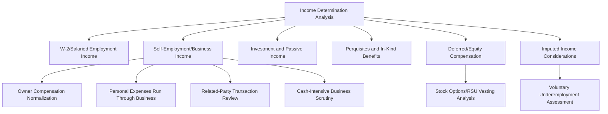

## Income Determination for Support Calculations

### Overview

Income determination for support calculations is the forensic accounting process of establishing a party's true, sustainable income available for child support and/or spousal support (alimony/maintenance) purposes. This analysis frequently diverges significantly from a party's reported taxable income, particularly for self-employed individuals, business owners, and high-net-worth individuals with complex compensation structures, because support statutes and guidelines generally define "income" more broadly than tax law and are designed to capture the actual economic resources available to a party, not merely what is reported to tax authorities.

### The Gap Between Taxable Income and Support Income

**Key Points**

- Support statutes and guidelines in most jurisdictions define income expansively, often including items not subject to income tax, not reflected on a tax return, or reported in a manner that understates true economic benefit
- Self-employed individuals and business owners have substantially greater opportunity (and, in contested support cases, sometimes greater incentive) to structure compensation and expenses in ways that minimize reported income relative to true economic benefit
- The forensic accountant's role is to reconstruct actual income available for support purposes, which may differ materially from the figure reported on tax returns or pay stubs

### Categories of Income Requiring Forensic Scrutiny

### Self-Employment and Business Owner Income Analysis

**Key Points**

- **Owner compensation reasonableness**: Comparing reported owner salary/draws to fair market compensation data for comparable roles, industries, and company sizes to identify understated compensation retained within the business
- **Personal expenses run through the business**: Identifying discretionary personal expenditures classified as business expenses (vehicles, travel, meals, family member "no-show" employment, personal use of company assets)
- **Related-party transactions**: Scrutinizing payments to entities controlled by the party or family members that may serve to divert income or inflate expenses artificially
- **Retained earnings and business cash flow**: Assessing whether retained earnings represent legitimate reinvestment needs or discretionary accumulation that could otherwise be distributed and treated as available income
- **Depreciation and non-cash expenses**: Many support guidelines require adding back non-cash expenses (depreciation, amortization) that reduce taxable income without reducing actual cash available to the owner

### Normalization Adjustment Categories

| Adjustment Category | Description | Typical Treatment |
| --- | --- | --- |
| Excess/below-market owner compensation | Difference between actual and fair-market compensation for role performed | Add back to income if below market; may reduce if above market and unreasonable |
| Personal expenses in business | Non-business expenditures deducted as business costs | Add back to available income |
| Non-cash expenses (depreciation, amortization) | Reduce taxable income without cash outflow | Frequently added back per support guideline definitions, subject to jurisdiction |
| One-time/non-recurring business expenses | Unusual, non-repeating deductions | May be added back to reflect sustainable ongoing income |
| Retained earnings beyond legitimate business needs | Cash retained in the business without clear operational justification | May be imputed as available income in closely held business contexts |

[Unverified] The specific statutory or guideline definition of "income" for support purposes—including which normalization adjustments are explicitly required, permitted, or excluded—varies considerably by jurisdiction; some guidelines provide detailed statutory definitions while others rely more heavily on case law and judicial discretion. Applicable guideline language must be confirmed with family law counsel for the specific jurisdiction.

### Cash-Intensive Business Considerations

**Key Points**

- Businesses with significant cash transactions (restaurants, retail, service businesses) present heightened risk of unreported or underreported income
- Analytical techniques include:
  - **Bank deposit analysis**: Comparing total bank deposits to reported gross receipts, investigating unexplained variances
  - **Markup/gross margin analysis**: Comparing the business's reported gross margin to industry benchmarks, investigating unexplained shortfalls that may indicate skimming
  - **Lifestyle/net worth analysis**: Comparing the party's personal spending and asset accumulation to reported income, identifying unexplained excess consistent with unreported income sources (see related net worth method discussion in fraud investigation contexts)

### Perquisites and In-Kind Compensation

**Key Points**

- Employer-provided benefits with personal economic value (company car, housing allowance, expense accounts, employer-paid personal expenses) may constitute income for support purposes even where not fully taxable as such
- Requires review of employment agreements, expense reimbursement policies, and W-2/1099 supplemental compensation disclosures to identify the full scope of in-kind benefits

### Deferred and Equity-Based Compensation

**Key Points**

- Stock options, restricted stock units (RSUs), and other deferred compensation present timing challenges: income may be earned/granted in one period but vest, and become available as an economic resource, in a later period
- Support calculations must determine whether to treat such compensation as income in the year granted, the year vested, or on an amortized/averaged basis, which varies by jurisdiction and guideline language
- Where equity compensation is a significant, recurring component of overall compensation (common in technology and finance sectors), excluding it from the income analysis can materially understate true available resources

### Averaging and Income Volatility

**Key Points**

- For self-employed individuals or those with variable/commission-based income, support determinations often require averaging income over multiple years (commonly 2-5 years, per applicable guideline) to smooth volatility and establish a representative, sustainable income figure
- The forensic accountant should assess whether a simple average is appropriate or whether a trend analysis (giving greater weight to more recent periods, or identifying a genuine change in circumstances) better reflects current and prospective earning capacity

**Example**

> A self-employed consultant's reported net business income over the past three years:
>
> - Year 1: $180,000
> - Year 2: $220,000
> - Year 3: $260,000
>
> Simple three-year average: $220,000
>
> If the upward trend reflects a genuine, sustainable growth trajectory rather than a one-time anomaly, a trend-weighted approach or reliance on the most recent year's figure (with supporting explanation) may better represent current earning capacity than a simple average — the appropriate approach depends on the specific facts and the governing guideline's methodology.

### Imputed Income and Earning Capacity

**Key Points**

- Where a party is voluntarily unemployed or underemployed relative to their demonstrated skills, education, and work history, courts may impute income based on earning capacity rather than actual current earnings
- Forensic accountants may be asked to support (or rebut) an imputed income analysis using labor market data, the party's employment history and credentials, and comparable compensation benchmarks, sometimes in conjunction with a vocational expert
- This analysis is distinct from, but may work alongside, a business/self-employment income normalization analysis where the party's reduced income is attributed to business practices rather than employment status

[Inference] Imputed income determinations typically involve significant legal and factual judgment about voluntariness and reasonableness that extends beyond pure financial analysis (e.g., whether a career change was made in good faith), making this an area where the forensic accountant's quantitative income capacity analysis is typically one input among several the court considers, rather than the sole determinant.

### Interaction with Marital Asset Characterization and Business Valuation

**Key Points**

- Income determination for support and business valuation for property division are related but analytically distinct exercises, sometimes creating tension: aggressive normalization for valuation purposes (maximizing business value) can be in some tension with a party's incentive to minimize reported income for support purposes, and the forensic accountant must apply consistent, defensible adjustments across both analyses within the same engagement to avoid an appearance of result-driven inconsistency

### Documentation and Data Sources

**Key Points**

- Personal and business tax returns (multiple years), W-2s, 1099s, K-1s, pay stubs, employment agreements, business financial statements and general ledgers, bank and credit card statements, and loan applications (which often disclose a party's own representation of income to third parties, useful for identifying inconsistencies)
- Loan applications in particular can be valuable evidentiary tools where a party has represented a higher income to a lender than reported for support purposes, or vice versa

### Common Analytical Pitfalls

**Key Points**

- Relying solely on tax return figures without independent normalization analysis for self-employed or business-owner parties
- Failing to add back non-cash expenses (depreciation/amortization) where the applicable guideline requires it
- Overlooking related-party transactions or personal expenses embedded in business financial statements
- Applying an inconsistent set of normalization adjustments between the income-for-support analysis and any concurrent business valuation analysis in the same matter
- Using an averaging period inconsistent with the applicable guideline's methodology, or failing to consider whether a trend adjustment better reflects sustainable income

### Illustrative Income Normalization Bridge

<svg xmlns="http://www.w3.org/2000/svg" viewBox="0 0 850 260" font-family="Arial, sans-serif">
<text x="425" y="22" font-size="16" font-weight="bold" text-anchor="middle">Support Income Normalization Bridge (svg_diagram)</text>
<rect x="30" y="90" width="150" height="70" fill="#e8f0fe" stroke="#4285f4" />
<text x="105" y="120" font-size="9" text-anchor="middle">Reported Taxable</text>
<text x="105" y="133" font-size="9" text-anchor="middle">Income</text>
<text x="105" y="150" font-size="10" font-weight="bold" text-anchor="middle">$150,000</text>
<rect x="210" y="90" width="150" height="70" fill="#fef7e0" stroke="#fbbc04" />
<text x="285" y="115" font-size="8" text-anchor="middle">+ Personal Expenses</text>
<text x="285" y="128" font-size="8" text-anchor="middle">in Business</text>
<text x="285" y="150" font-size="10" font-weight="bold" text-anchor="middle">$40,000</text>
<rect x="390" y="90" width="150" height="70" fill="#fce8e6" stroke="#ea4335" />
<text x="465" y="115" font-size="8" text-anchor="middle">+ Non-Cash</text>
<text x="465" y="128" font-size="8" text-anchor="middle">Depreciation Add-Back</text>
<text x="465" y="150" font-size="10" font-weight="bold" text-anchor="middle">$25,000</text>
<rect x="570" y="90" width="150" height="70" fill="#f3e8fd" stroke="#a142f4" />
<text x="645" y="115" font-size="8" text-anchor="middle">+ Below-Market</text>
<text x="645" y="128" font-size="8" text-anchor="middle">Compensation Add-Back</text>
<text x="645" y="150" font-size="10" font-weight="bold" text-anchor="middle">$35,000</text>
<rect x="750" y="90" width="70" height="70" fill="#e6f4ea" stroke="#34a853" />
<text x="785" y="115" font-size="8" text-anchor="middle">True</text>
<text x="785" y="128" font-size="8" text-anchor="middle">Income</text>
<text x="785" y="145" font-size="9" font-weight="bold" text-anchor="middle">$250,000</text>
<line x1="180" y1="125" x2="210" y2="125" stroke="black" marker-end="url(#arrow10)" />
<line x1="360" y1="125" x2="390" y2="125" stroke="black" marker-end="url(#arrow10)" />
<line x1="540" y1="125" x2="570" y2="125" stroke="black" marker-end="url(#arrow10)" />
<line x1="720" y1="125" x2="750" y2="125" stroke="black" marker-end="url(#arrow10)" />
</svg>

### Conclusion

Income determination for support calculations requires the forensic accountant to look well beyond reported taxable income, systematically identifying and quantifying compensation normalization adjustments, perquisites, deferred and equity compensation, and — where cash-intensive businesses or income volatility are present — applying specialized analytical techniques to reconstruct true, sustainable economic resources available to the party. Because support determinations directly affect ongoing financial obligations and are frequently revisited as circumstances change, the reliability, transparency, and jurisdictional accuracy of the income determination methodology are central to both the initial support order and any subsequent modification proceedings.

**Related Topics**

- Business valuation in divorce and marital dissolution contexts
- Marital asset tracing and characterization
- Lifestyle analysis and net worth method for unreported income
- Owner compensation normalization techniques across forensic contexts
- Imputed income and vocational earning capacity assessment
- Deferred and equity compensation valuation (stock options, RSUs)
- Cash-intensive business income reconstruction techniques
- Child support and spousal support guideline calculation frameworks
- Documentation and evidentiary sources for income reconstruction
- Modification proceedings and changed-circumstances income analysis