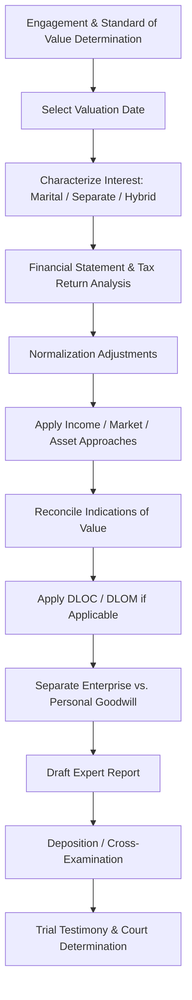

## Business Valuation in Divorce Proceedings

### Overview

Business valuation in divorce proceedings is a specialized branch of forensic accounting concerned with determining the value of a privately held business interest owned by one or both spouses for purposes of equitable distribution or community property division. Unlike valuations performed for M&A, tax, or financing purposes, matrimonial valuations are conducted within an adversarial legal framework, are governed by state-specific statutory and case law standards, and frequently involve two opposing experts whose divergent conclusions must be reconciled by a trier of fact.

### Legal Framework Governing Standard of Value

**Key Points**

- The **standard of value** is a legal question, not an accounting question, and is dictated by the jurisdiction's divorce statutes and case law rather than by professional valuation standards (e.g., ASA, AICPA).
- The two dominant standards are:
  - **Fair Market Value (FMV):** the price at which the business would change hands between a hypothetical willing buyer and willing seller, neither under compulsion, both having reasonable knowledge of relevant facts. FMV typically permits discounts for lack of control (DLOC) and lack of marketability (DLOM).
  - **Fair Value (FV) / Intrinsic Value / "Value to the Holder":** used in many equitable-distribution states; often rejects DLOC and DLOM on the theory that the spouse is not actually selling the business, so no hypothetical transaction discount should reduce the marital estate.
- Some jurisdictions (e.g., New York under *O'Brien v. O'Brien*) have historically included the value of professional licenses or enhanced earning capacity as marital property; this treatment has been narrowed or overturled in various states over time and must be verified against current local law. [Unverified — jurisdiction-specific and subject to change; verify current statutory and case law in the applicable state.]
- Community property states (e.g., California, Texas) versus equitable distribution states apply different frameworks for characterizing and dividing the business interest itself, independent of the valuation methodology used.

### The Valuation Date

The choice of valuation date is frequently the single most contentious issue in a matrimonial business valuation, because business value can move materially between candidate dates.

- **Date of separation:** commonly used in community property states; freezes the marital estate at the point the economic partnership functionally ended.
- **Date of filing:** the date the divorce petition was filed.
- **Date of trial:** used in many equitable distribution states; captures value up to the most current point, which can be advantageous or disadvantageous depending on business trajectory.
- **Hybrid/bifurcated approaches:** some courts value marital efforts and passive/market-driven appreciation differently, particularly for **separate property businesses that appreciated during the marriage** (see Active vs. Passive Appreciation below).

### Characterization: Marital vs. Separate Property Component

Before valuation, the business interest must be characterized:

1. **Wholly marital** — founded and grown entirely during the marriage.
2. **Wholly separate** — founded before marriage or received by gift/inheritance, with no marital contribution.
3. **Hybrid (commingled)** — a separate-property business that appreciated during the marriage due to either:
   - **Active appreciation** — attributable to the efforts, skill, or capital contributions of either spouse during the marriage (often deemed marital, subject to reimbursement/appreciation-sharing doctrines).
   - **Passive appreciation** — attributable to market forces, inflation, or third-party factors unrelated to marital effort (often deemed separate).

Tracing active versus passive appreciation typically requires the forensic accountant to perform a **before-and-after comparative analysis**, isolating the portion of value increase driven by owner/spouse labor versus external market conditions.

### Core Valuation Approaches

**Income Approach**

- **Capitalization of Earnings Method:** applies a capitalization rate to a normalized, single-period benefit stream (typically normalized net cash flow):

  $$Value = \frac{NCF}{(r-g)}$$

  where $NCF$ is normalized net cash flow, $r$ is the discount rate, and $g$ is the expected long-term sustainable growth rate.
- **Discounted Cash Flow (DCF) Method:** projects multi-period cash flows and discounts them to present value using a risk-adjusted discount rate (often derived via the build-up method or CAPM), plus a terminal value.

  $$Value = \sum_{t=1}^{n} \frac{CF_t}{(1+r)^t} + \frac{TV_n}{(1+r)^n}$$
- Normalization adjustments are critical in the matrimonial context because closely-held business owners often run personal expenses through the business or take compensation above/below fair market levels — see Normalization Adjustments below.

**Market Approach**

- **Guideline Public Company Method:** applies multiples derived from comparable publicly traded companies, adjusted for size and marketability differences.
- **Guideline Transaction (M&A) Method:** applies multiples derived from actual sales of comparable private companies, sourced from databases such as DealStats, BIZCOMPS, or Pratt's Stats.
- Market approach reliability in divorce matters is often limited by the scarcity of truly comparable private-company transaction data for small, closely-held businesses.

**Asset (Cost) Approach**

- **Adjusted Net Asset Method:** restates the balance sheet to fair value, appropriate for holding companies, asset-heavy businesses, or companies with minimal goodwill/going-concern value.
- Generally considered a floor value rather than the primary method for operating businesses with earnings capacity.

### Normalization Adjustments Specific to Matrimonial Engagements

Because one spouse (the "in-spouse") typically controls the business and has both the ability and incentive to depress reported earnings pending divorce, normalization scrutiny is heightened:

- **Owner compensation adjustment:** replacing actual owner salary/bonus with a fair market **reasonable compensation** benchmark (using sources such as RMA, IBISWorld, ERI, or the Bureau of Labor Statistics), since above- or below-market compensation directly and artificially shifts reported earnings.
- **Perquisites and discretionary expenses:** personal vehicles, travel, country club dues, family members on payroll performing no real services, and related-party lease arrangements at above-market rates.
- **Non-recurring items:** litigation settlements, one-time write-offs, COVID-related disruptions, or other anomalous events excluded from normalized earnings.
- **Related-party transactions:** below-market rent to a family-owned real estate entity, or intercompany transfers designed to shift income to a non-marital entity.

### Discounts and Premiums

- **Discount for Lack of Control (DLOC):** applied when valuing a minority, non-controlling interest; reflects the inability to direct company policy, compensation, or distributions.
- **Discount for Lack of Marketability (DLOM):** reflects the absence of a ready market for interests in a private company; commonly derived from restricted stock studies, pre-IPO studies, or option-pricing models (e.g., Chaffe, Finnerty).
- **Control Premium:** the inverse of DLOC, applied when converting a minority-interest indication to a controlling-interest value.
- Applicability of DLOC/DLOM is the area of sharpest divergence between FMV and FV standards; under FV standards common in many equitable-distribution states, courts frequently disallow these discounts on the rationale that the divorcing spouse is not selling the business on the open market, so a hypothetical-sale discount would understate the true value available to the marital estate. [Inference — practice varies significantly by state and by specific case facts; confirm applicable precedent.]

### Goodwill: Enterprise vs. Personal

This distinction is one of the most litigated issues in matrimonial business valuation, particularly for professional practices (medical, dental, legal, accounting):

- **Enterprise (Business/Institutional) Goodwill:** attributable to the business itself — location, workforce, brand, systems, client base — and is generally treated as a divisible marital asset in nearly all jurisdictions.
- **Personal (Professional) Goodwill:** attributable to the individual owner's personal reputation, skill, and relationships, and is treated as non-marital (not subject to division) in many, though not all, jurisdictions, since it is viewed as inseparable from the person and cannot be sold independent of the owner's continued involvement.
- Distinguishing the two typically requires analysis of: transferability of the client/patient base, existence of non-compete agreements, dependency of revenue on the specific owner's personal skill or referral relationships, and length of operating history without the owner.
- Jurisdictional treatment varies substantially: some states divide all goodwill as marital, some exclude all personal goodwill, and some apply hybrid tests. [Unverified — confirm current treatment under the applicable state's case law, as this area has evolved meaningfully across jurisdictions.]

### The Dueling Experts Problem

- Each spouse typically retains their own valuation expert, producing a **battle of the experts** where conclusions can diverge by wide margins due to differing standard-of-value interpretations, discount rate assumptions, normalization judgments, and goodwill characterization.
- Courts may appoint a **neutral joint expert** to reduce cost and conflicting testimony, particularly in cases with limited marital estate value relative to litigation cost.
- Cross-examination in these matters focuses heavily on: support for discount rate build-up components, reasonableness of normalization adjustments, comparability of selected guideline companies/transactions, and internal consistency between the expert's report and prior work product or deposition testimony.
- **Daubert** (federal and many state courts) or **Frye** standards govern the admissibility of expert valuation testimony, requiring the methodology to be reliable, generally accepted, and properly applied to the facts of the case.

### Illustrative Process Flow

### Illustrative Example

A closely-held HVAC contracting business is owned 100% by the husband, founded three years before marriage, with the wife not employed in the business. Valuation date is set at date of filing per local statute (equitable distribution state, FV standard).

- Normalized EBITDA after adjusting owner compensation to a fair market benchmark and removing a family member's no-show payroll: $480,000.
- Capitalization rate derived via build-up method (risk-free rate + equity risk premium + industry risk premium + size premium − sustainable growth rate): 22%.
- Capitalized value: $480{,}000 / 0.22 \approx \$2{,}181{,}818$.
- No DLOC/DLOM applied, consistent with the state's FV standard for a controlling, 100%-owned interest not being sold.
- Active appreciation during the marriage (attributable to husband's continued full-time management) is deemed marital; passive appreciation attributable to regional HVAC demand growth prior to husband's post-marriage involvement is not separately quantified here since the business was actively operated by husband throughout the marriage — the full post-marriage increase in value is treated as active/marital appreciation.
- Enterprise goodwill (established customer contracts, branded fleet, technician workforce) is separated from any personal goodwill tied to the husband's individual reputation for purposes of the court's goodwill determination.

### Common Pitfalls in Matrimonial Valuation Engagements

- Failing to obtain and reconcile personal and business tax returns, bank statements, and general ledger detail — a critical step given the heightened risk of income concealment discussed under **Concealed Income and Lifestyle Analysis** engagements.
- Applying a valuation date inconsistent with the jurisdiction's controlling statute or the parties' stipulated date.
- Misapplying discounts under a jurisdiction that follows FV rather than FMV, or vice versa.
- Inadequate documentation of reasonable compensation benchmarks, leaving the normalization adjustment vulnerable on cross-examination.
- Conflating enterprise and personal goodwill without a defensible, fact-specific analytical framework.

**Related Topics**

- Reasonable compensation analysis and benchmarking methodologies
- Discount for lack of marketability (DLOM) quantification models (Chaffe, Finnerty, restricted stock studies)
- Active vs. passive appreciation tracing methodologies
- Concealed income and lifestyle analysis in matrimonial disputes
- Professional practice valuation (medical, legal, dental) and personal goodwill doctrine by jurisdiction
- Daubert/Frye admissibility challenges to valuation expert testimony
- Tracing separate property in commingled marital estates