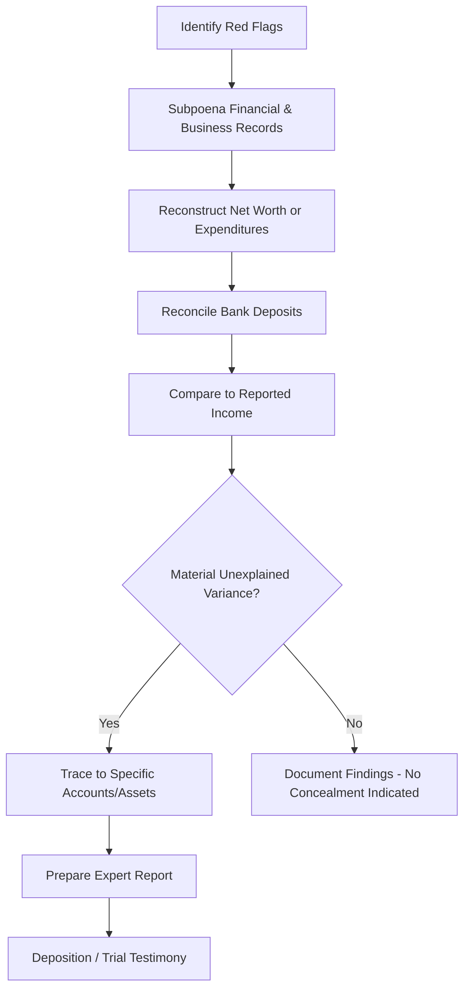

## Hidden Asset and Lifestyle Analysis

### Overview

Hidden asset and lifestyle analysis is a forensic accounting technique used in matrimonial disputes to detect unreported income, concealed assets, and understated wealth by a spouse who has an incentive to minimize the apparent marital estate or reported income available for support calculations. The analysis reconstructs a spouse's true economic position through indirect methods when direct financial disclosures are incomplete, manipulated, or not credible.

### When Hidden Asset Analysis Is Warranted

**Key Points**

- Triggered by "red flags" observed in financial disclosures, deposition testimony, or the marital lifestyle itself.
- Common triggers include:
  - A cash-intensive business (restaurants, salons, contractors, retail) with reported income inconsistent with observed lifestyle.
  - A significant, unexplained decline in reported income or business profitability coinciding with separation or filing.
  - Complex ownership structures involving multiple related entities, offshore accounts, or trusts.
  - Sole control of finances by one spouse, with the other spouse historically excluded from financial decision-making ("financial abuse" pattern).
  - Discrepancies between loan applications (which tend to overstate income/assets) and tax returns (which tend to understate them) for the same period.
  - Large, unexplained cash withdrawals, transfers to family members, or new accounts opened shortly before separation.

### The Lifestyle (Net Worth / Expenditure) Method

This is the core indirect method used to test the reasonableness of reported income against actual spending and asset accumulation.

**Net Worth Method**

$$\text{Unreported Income} = (\Delta \text{Net Worth}) + \text{Living Expenses} - \text{Known/Reported Income} - \text{Non-Taxable Sources}$$

Steps:

1. Establish opening net worth (assets minus liabilities) at the start of the analysis period, typically a period of several years preceding separation.
2. Establish closing net worth at a later date (e.g., date of separation or trial).
3. Compute the change in net worth over the period.
4. Add personal living expenses paid during the period (since spent funds do not appear in a net worth comparison but still required a source of funds).
5. Subtract reported taxable income and identifiable non-taxable sources (gifts, inheritances, loan proceeds, tax refunds).
6. The residual, if material and unexplained, represents an indication of unreported income or undisclosed assets.

**Expenditure (Cash) Method**

$$\text{Unreported Income} = \text{Total Expenditures} - \text{Identified Sources of Funds}$$

- Focuses on reconstructing actual cash outflows (spending, asset purchases, debt reduction) during the period and comparing the total to all identified legitimate sources of funds.
- Particularly effective in cases with minimal formal recordkeeping, where the net worth method's balance-sheet approach is harder to apply due to unclear asset records.

**Bank Deposit and Cash Transaction Analysis**

$$\text{Unreported Income} = \text{Total Deposits} - \text{Non-Income Deposits (transfers, loan proceeds, redeposits)} - \text{Reported Income}$$

- Aggregates all deposits across every identified personal and business account.
- Deposits are then reconciled: intra-account transfers, loan proceeds, gifts, and redeposited checks are excluded to avoid double-counting.
- The remaining unexplained deposit total is compared against reported income for the same period.

### Data Sources and Document Requests

A comprehensive analysis typically requires subpoenaing or requesting:

- Personal and business federal/state tax returns (minimum 3–5 years), including all schedules and K-1s.
- All bank, brokerage, and credit card statements for every account, including accounts the non-controlling spouse may not have known existed.
- Loan applications and financial statements submitted to lenders (often reveal inflated income/asset claims inconsistent with tax filings).
- Business general ledgers, QuickBooks/accounting software backup files, point-of-sale system reports (for cash-intensive businesses), and payroll records.
- Property records, vehicle registrations, and UCC filings in the subject's name or related entities.
- Credit reports and public records searches for undisclosed accounts, loans, or real property.
- Cryptocurrency exchange records and wallet activity, where digital assets are suspected.

### Common Concealment Techniques and Detection Methods

| Concealment Technique | Detection Approach |
| --- | --- |
| Skimming cash receipts before deposit (cash-intensive businesses) | Compare reported gross receipts to industry-standard margins, point-of-sale Z-tapes, vendor purchase volumes, and mystery-shopper/observational data |
| Deferring compensation, bonuses, or client billings until after valuation/filing date | Compare historical billing/collection patterns to the period surrounding separation; analyze accounts receivable aging trends |
| Overstating business expenses or creating fictitious vendors | Vendor verification, related-party analysis, review of expense documentation and approval trails |
| Transferring assets to family members or friends ("parking" assets) | Trace fund flows to related parties; review gift tax returns (or absence thereof) and subsequent asset movements |
| Undisclosed offshore or out-of-state accounts | Review loan applications, prior joint tax returns for foreign account disclosures (FBAR/FATCA indicators), and international wire transfer records |
| Creating debt with related parties or shell entities to reduce apparent net worth | Scrutinize loan terms, repayment history (or lack thereof), and whether the "creditor" is a family member or controlled entity |
| Undervaluing or omitting business interests, collectibles, or cryptocurrency | Independent business valuation, appraisal of tangible property, blockchain/exchange record analysis |

### Cash-Intensive Business Analysis Techniques

- **Markup/gross margin analysis:** compares the reported gross margin to published industry benchmarks (e.g., RMA Annual Statement Studies) to identify understated revenue relative to cost of goods sold.
- **Unit/volume analysis:** for businesses with a measurable unit of production (e.g., meals served, haircuts given, gallons pumped), estimates revenue from inventory purchases or utility usage and compares it to reported sales.
- **Point-of-sale/void and discount pattern analysis:** examines abnormal patterns of voided transactions, discounts, or "no-sale" register openings that may indicate skimming.
- **Third-party corroboration:** vendor confirmations, merchant credit card processor statements (which are harder to manipulate than internally reported cash sales), and industry association data.

### Illustrative Example — Net Worth Method

A spouse operates a landscaping business reporting modest taxable income, while the marital lifestyle includes a recently renovated home, two late-model vehicles, and private school tuition for three children.

|  | Beginning of Period | End of Period |
| --- | --- | --- |
| Total Assets | $620,000 | $1,050,000 |
| Total Liabilities | $380,000 | $410,000 |
| **Net Worth** | $240,000 | $640,000 |

- Change in net worth: $640{,}000 - 240{,}000 = \$400{,}000$
- Personal living expenses paid during the period (reconstructed from bank/credit card statements): $310,000
- Total funds required: $400{,}000 + 310{,}000 = \$710{,}000$
- Reported taxable income for the period: $260,000
- Identified non-taxable sources (inheritance from a documented estate distribution): $50,000
- **Unexplained/unreported income indication:** $710{,}000 - 260{,}000 - 50{,}000 = \$400{,}000$

This $400,000 residual becomes the subject of further investigation (e.g., tracing to specific unreported cash deposits, undisclosed accounts, or asset transfers) and forms the basis of the expert's report and testimony regarding understated income available for support and/or an understated marital estate.

### Process Flow

### Report Documentation and Testimony Considerations

- Findings must clearly distinguish between **quantified, traced unreported income/assets** (supported by direct documentary evidence) and **indirect method indications** (net worth or expenditure method residuals that are inferential rather than directly traced).
- The expert should address and rule out (or quantify) legitimate explanations for any variance: gifts, loan proceeds, prior savings drawn down, or non-taxable sources, since opposing counsel will challenge the analysis on completeness of source identification.
- Chain of custody and authentication of subpoenaed records must be maintained for admissibility.
- Behavioral and circumstantial evidence (lifestyle observations, third-party witness statements) can corroborate but does not substitute for the quantitative reconstruction.

### Limitations and Challenges

- Indirect methods produce an *indication* of unreported income, not a directly traced dollar-for-dollar finding; courts and opposing experts frequently scrutinize the completeness of the "known sources of funds" used in the calculation.
- Incomplete record production (whether due to spoliation, non-cooperation, or genuinely missing records) can understate or overstate findings; the expert should disclose the scope limitations clearly.
- Cryptocurrency and offshore assets pose ongoing detection challenges given limited subpoena reach and the pseudonymous nature of some blockchain activity. [Inference — the practical difficulty of tracing cryptocurrency varies significantly based on the specific exchanges, wallets, and jurisdictions involved.]

**Related Topics**

- Business valuation in divorce proceedings (interaction between concealed income and normalized earnings)
- Reasonable compensation and owner-compensation normalization
- Cryptocurrency tracing and blockchain forensic techniques
- Subpoena practice and third-party record production in family law matters
- Support/alimony income determination and imputed income analysis
- Fraudulent conveyance and transfers to related parties