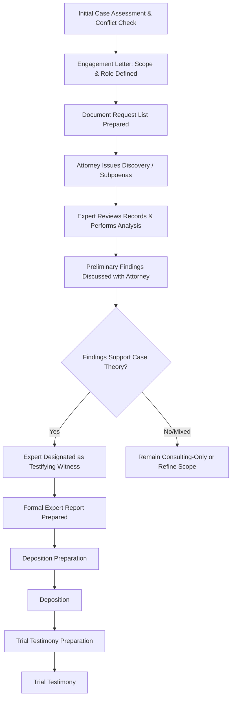

## Working with Family Law Attorneys

### Overview

Effective collaboration between the forensic accountant and retaining family law attorney is central to the success of a matrimonial engagement. Unlike audit or tax engagements, the forensic accountant here operates as part of a litigation team, and the working relationship must account for privilege protections, evolving case strategy, and the ultimate requirement that expert work product withstand adversarial challenge.

### Engagement Structure and Retention

**Key Points**

- The forensic accountant should generally be retained by the **attorney**, not directly by the client, in order to maximize the potential for **attorney work-product** and, in non-testifying/consulting roles, **attorney-client privilege** protection over communications and preliminary analyses.
- The **engagement letter** should clearly define:
  - Scope of work (valuation, lifestyle analysis, support calculation, tracing, etc.).
  - Role designation: **consulting expert** (non-testifying, work generally protected from discovery) versus **testifying expert** (subject to full discovery of opinions, data considered, and often draft reports/communications under rules such as **FRCP 26**).
  - Fee arrangement — matrimonial engagements are typically billed hourly against a retainer; contingent fees are prohibited under professional ethics standards (AICPA, NACVA, ASA) for expert witness work.
  - Conflict-of-interest screening, since forensic accountants may have prior relationships with the business, the opposing spouse, or related entities.
- Engagements frequently begin as **consulting-only** and later convert to a **testifying** role once the analysis supports a position the attorney intends to present at trial; this transition has discovery implications that must be understood by both attorney and expert from the outset.

### Privilege and Work Product Considerations

- **Attorney work-product doctrine** may protect materials prepared in anticipation of litigation, but this protection is substantially narrowed or eliminated once an expert is designated to testify — in most jurisdictions/federal practice, the testifying expert's **opinions, the facts/data considered, and (under FRCP 26) certain communications and draft reports** become discoverable.
- Because designation as a testifying expert can expose prior drafts and communications, attorneys and experts typically take care regarding what is put in writing during the consulting phase, and clarify early which categories of communication remain protected once the expert is later designated to testify. [Inference — the precise scope of protection for draft reports and attorney-expert communications varies by jurisdiction and by whether state or federal rules of civil procedure apply; confirm current local rules.]
- The forensic accountant should maintain organized, defensible work papers throughout, understanding that anything relied upon to form an opinion is generally discoverable regardless of when it was created.

### The Attorney-Expert Collaboration Process

### Defining Scope and Case Theory Alignment

- Early in the engagement, the attorney communicates the **legal theory of the case** (e.g., arguing for a low business valuation because the client is the non-owner spouse seeking a buyout, or a high valuation because the client is the owner seeking to retain the business and buy out the other spouse) so the expert understands the strategic context — while the expert's ultimate opinion must remain independent and defensible, not result-driven.
- The expert should proactively flag to the attorney when preliminary findings **do not support** the desired case theory, allowing the attorney to adjust strategy (e.g., settlement posture) before incurring the cost of a full report or before the position is locked into pleadings.
- Scope should explicitly address which standard of value and valuation date apply, since these are legal determinations the attorney — not the expert — is responsible for specifying, informed by applicable statute and case law in the jurisdiction.

### Document Requests and Discovery Support

- The forensic accountant typically drafts or substantially contributes to the **document request list** and proposed **subpoena duces tecum** language, since the accountant best understands what records are needed to perform net worth, lifestyle, or business valuation analyses.
- The expert often assists the attorney in preparing **financial discovery questions** for interrogatories and requests for production, and in formulating **deposition questions** for the opposing party or opposing expert on financial matters.
- When the opposing party is uncooperative, the expert may assist counsel in articulating to the court why specific records are necessary and relevant, supporting motions to compel.

### Reviewing the Opposing Expert's Report

- A core function of the retained expert is a **critical review of the opposing expert's report**, identifying:
  - Methodological weaknesses (e.g., unsupported discount rate components, inappropriate standard of value applied, stale valuation date).
  - Normalization adjustments that appear unsupported or asymmetric (aggressive adjustments favoring one party's position without comparable rigor applied to both).
  - Selective use of guideline companies or transactions.
  - Internal inconsistencies between the report and the expert's deposition testimony or prior published work.
- This rebuttal analysis directly supports the attorney's cross-examination outline and may result in a formal **rebuttal report**, where permitted under the jurisdiction's scheduling order.

### Report Preparation Collaboration

- While the **conclusions and analysis must remain the expert's own independent opinion** (a requirement under both professional standards and admissibility rules such as Daubert/Frye), attorneys commonly review drafts for clarity, organization, and to ensure the report addresses all issues relevant to the pending motions or trial.
- The expert should resist any attorney pressure to alter substantive conclusions to fit a desired outcome; professional and ethical standards (AICPA Code of Professional Conduct, NACVA/ASA standards) require independence and objectivity regardless of who retained the expert.
- Reports should be written with the understanding that they will be read by a judge (often without a jury in family law matters), requiring clear, non-technical explanations of methodology alongside the technical support needed to withstand cross-examination.

### Deposition and Trial Testimony Preparation

- The attorney and expert typically conduct a **mock cross-examination** or preparation session covering:
  - Foundational qualifications and prior testimony history (including any prior exclusions under Daubert/Frye challenges).
  - Key assumptions and their support, anticipating challenges to normalization adjustments, discount rate build-up, or comparability of selected guideline data.
  - Consistency between the written report, deposition testimony, and any prior publications or CPE materials authored by the expert.
- The expert should be prepared to explain complex concepts (e.g., capitalization rates, discounts for lack of marketability) in plain language accessible to a judge or, where applicable, a jury.
- Attorneys generally coach on courtroom demeanor and communication style but must not coach the expert on substantive conclusions, which would compromise independence and could be a basis for admissibility challenges or credibility attacks.

### Communication Practices Throughout the Engagement

- Regular status updates on record production gaps, emerging red flags (e.g., signs of hidden assets discovered mid-engagement), and budget/fee status help the attorney manage case strategy and client expectations.
- The expert should promptly disclose any conflicts, changes in findings, or newly discovered information that could affect prior preliminary conclusions.
- Clear internal protocols for what is documented in writing (email, memos) versus discussed verbally help manage privilege exposure, particularly during the consulting phase before a testifying designation is made.

### Common Pitfalls in the Attorney-Expert Relationship

- Retention structured directly by the client rather than the attorney, unnecessarily weakening privilege protection.
- Ambiguity about consulting versus testifying role early in the engagement, leading to unintended discovery exposure of draft work product.
- Expert allowing the attorney's case theory to influence methodology selection or normalization judgments, undermining independence and creating cross-examination vulnerability.
- Inadequate coordination on document requests, resulting in incomplete records discovered too late to properly analyze before report deadlines.
- Failure to disclose adverse preliminary findings early, leading to wasted cost or unfavorable surprises at deposition/trial.

**Related Topics**

- Business valuation in divorce proceedings
- Hidden asset and lifestyle analysis
- Daubert/Frye admissibility standards for expert testimony
- Expert witness report writing standards (AICPA, NACVA, ASA)
- Deposition and cross-examination techniques for forensic experts
- Discovery procedures and subpoena practice in family law litigation