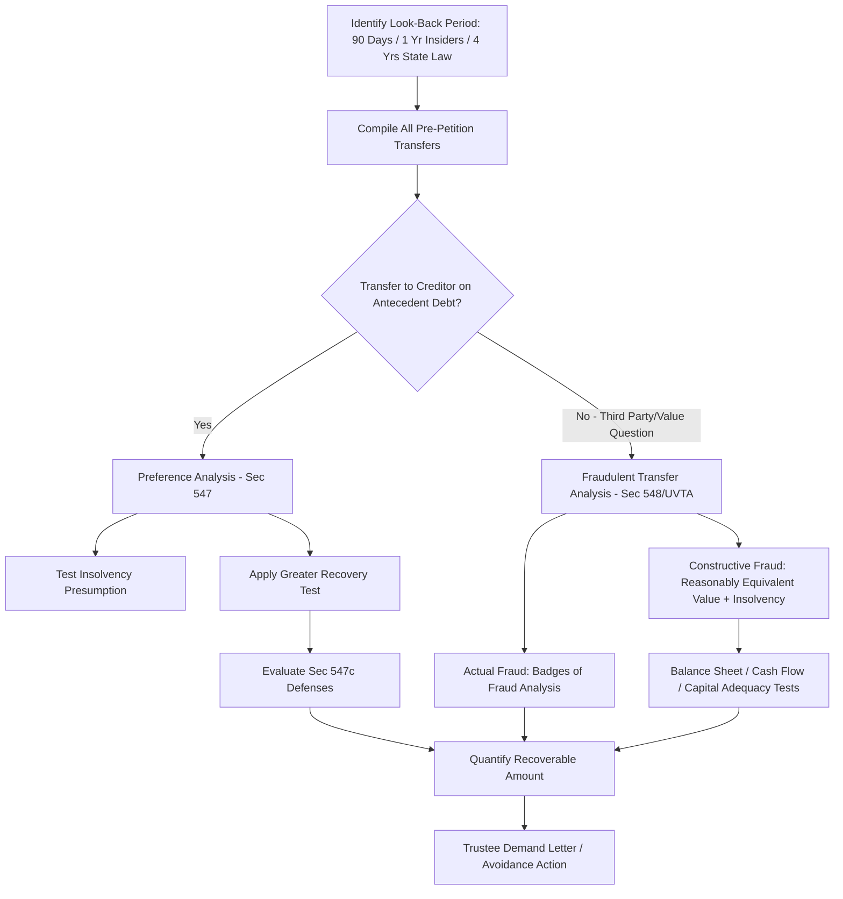

## Fraudulent Transfer and Preference Analysis

### Overview

Fraudulent transfer and preference analysis is a core forensic accounting function within bankruptcy and insolvency proceedings, focused on identifying pre-petition transfers of a debtor's assets that either improperly favored one creditor over others (preferences) or were made to hinder, delay, or defraud creditors, or for less than reasonably equivalent value while the debtor was insolvent (fraudulent transfers). These claims allow a bankruptcy trustee or debtor-in-possession to "claw back" value into the estate for equitable distribution among all creditors.

### Statutory Framework

**Key Points**

- **Preferences** are governed in U.S. bankruptcy cases primarily by **Bankruptcy Code § 547**.
- **Fraudulent transfers** are governed by **Bankruptcy Code § 548** (federal, look-back generally 2 years) and, via **§ 544(b)**, by applicable **state fraudulent transfer/conveyance statutes** — most commonly versions of the **Uniform Voidable Transactions Act (UVTA)**, formerly the Uniform Fraudulent Transfer Act (UFTA), or the older Uniform Fraudulent Conveyance Act (UFCA) — which typically offer a longer look-back period (often 4 years or more depending on the state).
- The trustee/DIP may pursue claims under whichever statute (federal or state, via § 544(b)) provides the most favorable look-back period and elements for the facts at hand.
- These are separate causes of action with distinct elements, timing windows, and defenses, and a forensic accountant may be asked to analyze transactions under both frameworks in the same engagement. [Unverified — specific statutory citations, look-back periods, and state adoption of UVTA vs. UFTA vary and should be confirmed against current law in the applicable jurisdiction.]

### Preference Analysis Under § 547

**Elements of an Avoidable Preference**

A transfer is potentially avoidable as a preference if it was:

1. A transfer of an interest of the debtor in property.
2. To or for the benefit of a **creditor**.
3. **On account of an antecedent debt** owed before the transfer was made.
4. Made while the debtor was **insolvent** (insolvency is presumed for transfers made within 90 days before filing, under § 547(f)).
5. Made within **90 days before filing** (or within **1 year** if the transferee is an **insider**, such as an officer, director, or affiliate).
6. That enabled the creditor to receive **more than it would have received in a Chapter 7 liquidation** had the transfer not been made.

**The Preference Analysis Formula**

The forensic accountant's core task is reconstructing all payments and transfers to each creditor during the applicable look-back period and testing each against the statutory elements, then calculating the **greater recovery test**:

$$\text{Preferential Amount} = \text{Payment Received} - \text{Value the Creditor Would Have Received in a Hypothetical Ch. 7 Liquidation}$$

For an undersecured or unsecured creditor in a case where unsecured creditors would receive less than 100 cents on the dollar in liquidation, essentially the full payment amount is typically preferential, since the creditor received more than its pro rata liquidation share.

**Common Defenses to Preference Claims**

- **Contemporaneous exchange for new value** (§ 547(c)(1)): the transfer was intended as, and was in fact, a substantially contemporaneous exchange for new value given to the debtor.
- **Ordinary course of business defense** (§ 547(c)(2)): the debt and transfer were made in the ordinary course of business or financial affairs of both parties, and either consistent with ordinary business terms or consistent with the parties' historical dealings.
- **Subsequent new value** (§ 547(c)(4)): the creditor extended new, unsecured credit to the debtor after receiving the preferential transfer, which was not itself repaid.
- **Purchase money security interest** (§ 547(c)(3)).
- **De minimis/small transfer thresholds** under § 547(c)(8)–(9), which vary by debtor type (consumer vs. non-consumer) and are subject to periodic statutory adjustment.

**Ordinary Course Analysis Methodology**

Because the ordinary course defense is frequently the most heavily litigated, forensic accountants typically build a **historical baseline** comparing the challenged payments to a pre-preference-period "historical" set of payments between debtor and creditor, analyzing:

- Average days-to-pay before versus during the preference period.
- Consistency of payment method (check, wire, ACH).
- Presence of unusual collection pressure (late notices, threatened credit holds, changed payment terms) suggesting the payments were coerced rather than ordinary.

$$\text{Weighted Average Days to Pay} = \frac{\sum (\text{Days to Pay}_i \times \text{Payment Amount}_i)}{\sum \text{Payment Amount}_i}$$

A statistically significant deviation from the historical baseline during the preference period tends to undermine the ordinary-course defense.

### Fraudulent Transfer Analysis Under § 548 / UVTA

Fraudulent transfers fall into two categories, each with distinct proof requirements:

**Actual Fraud (Intentional Fraudulent Transfer)**

- Requires a transfer made with **actual intent to hinder, delay, or defraud** creditors.
- Because direct evidence of intent is rare, courts and forensic accountants rely on circumstantial **"badges of fraud,"** which commonly include:
  - Transfer to an insider or family member.
  - Debtor retained possession or control of the property after the transfer.
  - Transfer was concealed.
  - Debtor had already been sued or threatened with suit before the transfer.
  - Transfer was of substantially all the debtor's assets.
  - Debtor absconded or removed assets.
  - Debtor received less than reasonably equivalent value.
  - Debtor was insolvent or became insolvent shortly after the transfer.
  - Transfer occurred shortly before or after a substantial debt was incurred.
  - Transfer was to an entity that then transferred the assets to an insider of the debtor.

**Constructive Fraud**

Does not require proof of intent; instead requires showing both:

1. The debtor received **less than reasonably equivalent value** in exchange for the transfer, AND
2. The debtor was insolvent at the time, became insolvent as a result, was left with unreasonably small capital, or intended to incur debts beyond its ability to pay as they matured.

### Reasonably Equivalent Value Analysis

This is frequently the central forensic accounting task in constructive fraud claims:

- Requires a **valuation of the consideration exchanged** on both sides of the transaction (what the debtor gave up versus what the debtor received).
- For transfers involving intercompany transactions, upstream/downstream guarantees, or dividend/distribution payments, the analysis often requires assessing indirect or intangible benefits received by the debtor (e.g., synergies within a corporate group), which courts scrutinize carefully.
- Common methodologies mirror standard business valuation approaches (income, market, asset) applied to the specific asset or business interest transferred, as of the transfer date.

### Insolvency Analysis

Insolvency is a required element for most fraudulent transfer claims and is tested under multiple standards, often analyzed in parallel:

- **Balance Sheet Test:** fair value of assets less than the sum of liabilities (using fair valuation rather than book/GAAP value, which frequently requires the forensic accountant to restate the balance sheet).
- **Cash Flow (Equitable Insolvency) Test:** debtor is generally not paying debts as they become due.
- **Unreasonably Small Capital Test:** debtor was left without sufficient capital to reasonably continue operations following the transfer, often assessed through cash flow projections and working capital analysis as of the transfer date.

$$\text{Balance Sheet Insolvency} = \text{Fair Value of Assets} < \text{Total Liabilities (including contingent)}$$

Solvency analyses frequently require reconstructing a **contemporaneous solvency opinion** retrospectively, using financial data as it existed at the transfer date (not with hindsight bias from subsequent business failure), which is an important methodological safeguard against improperly working backward from the bankruptcy filing.

### Process Flow

### Illustrative Example — Preference Analysis

A manufacturing debtor filed Chapter 11 on October 1. A key supplier received the following payments in the 90 days prior:

| Payment Date | Amount | Invoice Date | Days to Pay | Historical Avg. Days to Pay (Pre-Period) |
| --- | --- | --- | --- | --- |
| July 15 | $45,000 | June 1 | 44 | 30 |
| Aug 20 | $60,000 | July 1 | 50 | 30 |
| Sep 25 | $38,000 | Aug 5 | 51 | 30 |

- Total transfers within the 90-day preference period: $45{,}000 + 60{,}000 + 38{,}000 = \$143{,}000$.
- The debtor's insolvency is presumed under § 547(f) for the 90-day period.
- Days-to-pay analysis shows a consistent, material lengthening of payment terms (44–51 days versus a 30-day historical average), undermining an ordinary-course-of-business defense — the deviation suggests collection pressure rather than routine dealings.
- Assuming the supplier was an unsecured creditor and the estate's projected unsecured recovery in liquidation is 15 cents on the dollar, the supplier received substantially more (100 cents on the dollar for these invoices) than it would have received in a hypothetical Chapter 7 liquidation.
- **Preliminary preference exposure:** $143,000, subject to reduction for any subsequent new value the supplier extended and was not paid for after August 20 and September 25 (§ 547(c)(4)).

### Illustrative Example — Constructive Fraudulent Transfer

A closely-held company transferred real estate valued at $800,000 fair market value to the majority owner's spouse for stated consideration of $150,000, six months before filing.

- **Reasonably equivalent value test:** $150,000 received versus $800,000 fair value transferred — a shortfall of $650,000, well below any threshold likely to be considered reasonably equivalent value.
- **Insolvency test:** balance sheet analysis as of the transfer date shows total liabilities of $2.1 million against fair value of assets (excluding the transferred property) of $1.4 million — indicating balance sheet insolvency at the time of transfer.
- **Badges of fraud present:** transfer to an insider (spouse of majority owner), for substantially less than fair value, while insolvent, shortly before a bankruptcy filing.
- This transaction presents strong indications of both **constructive fraud** (inadequate value + insolvency) and potential **actual fraud** (multiple badges present), supporting an avoidance action to recover the property or its value for the estate.

### Recovery and Remedies

- Under § 550, once a transfer is avoided, the trustee may recover the property itself or its value from the initial transferee or, in certain circumstances, from subsequent transferees (subject to a good-faith-for-value defense for subsequent transferees).
- Recovered value is returned to the bankruptcy estate for distribution according to the Bankruptcy Code's priority scheme, benefiting creditors generally rather than the single creditor who received the original transfer.

### Common Pitfalls in Preference/Fraudulent Transfer Analysis

- Applying the wrong look-back period (failing to identify insider status, which extends the preference window from 90 days to 1 year).
- Overlooking indirect or non-cash transfers (asset swaps, forgiveness of debt, guarantees) that qualify as "transfers" under the broad statutory definition.
- Conducting insolvency analysis with hindsight bias rather than reconstructing conditions as they existed at the transfer date.
- Failing to net subsequent new value or properly apply the ordinary-course historical baseline, overstating preference exposure.
- Inadequate documentation of the "badges of fraud" analysis, leaving actual-fraud claims vulnerable to challenge given the higher evidentiary burden typically associated with intent-based claims.

**Related Topics**

- Insolvency and balance sheet reconstruction methodologies
- Business valuation for solvency opinions
- Trustee avoidance powers and the bankruptcy claims process
- Insider transaction identification and related-party analysis
- Ponzi scheme forensic investigations and fraudulent transfer overlap
- Chapter 7 liquidation analysis and creditor recovery modeling