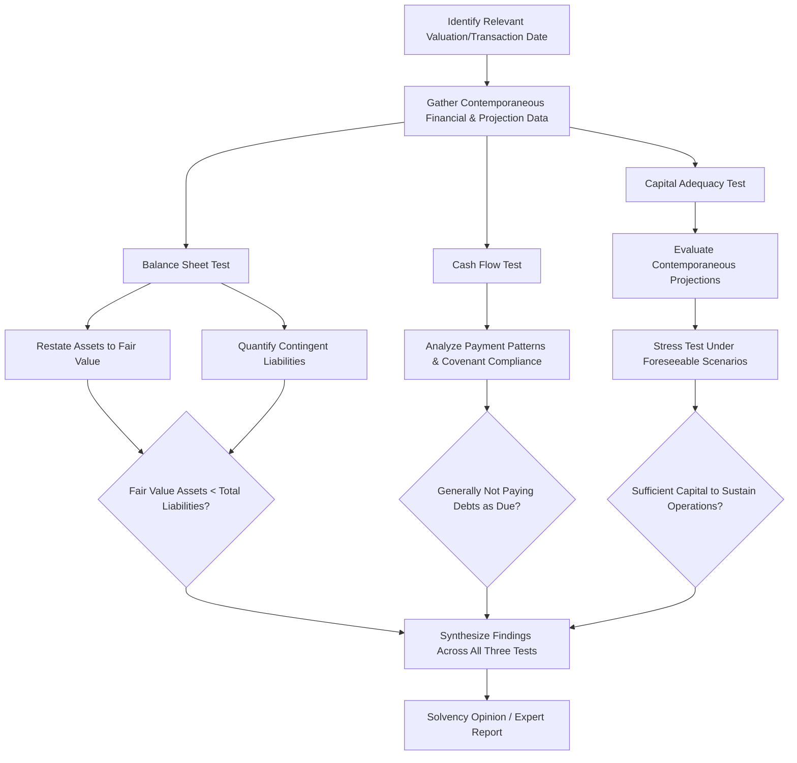

## Solvency and Insolvency Analysis

### Overview

Solvency and insolvency analysis is the forensic accounting discipline of determining a company's financial condition — its ability to meet obligations and the fair value relationship between its assets and liabilities — at a specific point in time, most often the date of a challenged transaction, dividend, leveraged buyout (LBO), or the eve of bankruptcy filing. This analysis underlies fraudulent transfer claims, preference litigation, director/officer liability determinations, and formal solvency opinions issued in connection with corporate transactions.

### Legal and Contextual Importance of Solvency Determination

**Key Points**

- Solvency is a **required element** in most constructive fraudulent transfer claims under § 548 and the Uniform Voidable Transactions Act (UVTA), where the transferor's insolvency (or resulting insolvency, or unreasonably small capital) must be shown alongside inadequate consideration.
- Insolvency also triggers or affects:
  - **Directors' fiduciary duty shifts** in many jurisdictions, where duties may extend to creditors as the company approaches or enters the "zone of insolvency" (the precise legal effect varies by jurisdiction and corporate form). [Unverified — confirm current law, as this doctrine has been narrowed in some jurisdictions, e.g., Delaware's treatment following *North American Catholic Educational Programming Foundation v. Gheewalla*.]
  - **Preference presumption** under Bankruptcy Code § 547(f), which presumes insolvency for the 90 days preceding a bankruptcy filing.
  - **LBO/dividend recapitalization litigation**, where post-transaction insolvency is central to shareholder and creditor clawback claims.
  - **Formal solvency opinions** required by lenders or boards in connection with leveraged transactions, dividend recapitalizations, or spin-offs.

### The Three Solvency Tests

Forensic accountants typically apply three distinct, and sometimes independently dispositive, tests, since a company can be "insolvent" under one test while technically passing another.

**1. Balance Sheet Test**

$$\text{Balance Sheet Insolvency} = \text{Fair Value of Assets} < \text{Total Liabilities (including contingent and unliquidated)}$$

- Requires restating the balance sheet from historical GAAP book value to **fair value**, since book value (particularly for depreciated fixed assets, self-generated intangibles/goodwill not recorded under GAAP, and appreciated real estate) frequently diverges materially from fair value.
- Liabilities must include **contingent liabilities** (pending litigation, guarantees, warranty obligations, environmental liabilities) at their estimated present value or expected value, not merely liabilities recorded on the GAAP balance sheet.

**2. Cash Flow (Equitable Insolvency) Test**

- Tests whether the debtor is **generally not paying its debts as they become due**, or is unable to pay debts as they mature in the ordinary course of business.
- Often evaluated through a **debt service coverage analysis** and pattern-of-payment review (similar in method to the ordinary-course payment analysis used in preference litigation), examining whether the company has been stretching payables, defaulting, or relying on new borrowing to meet existing obligations.

**3. Capital Adequacy Test (Unreasonably Small Capital)**

- Assesses whether the debtor was left with **unreasonably small capital** to continue its business operations following the transaction in question.
- Requires forward-looking **cash flow projection analysis**, testing whether reasonably foreseeable business operations, under reasonably foreseeable conditions, could be sustained with the capital structure and liquidity remaining after the transfer.
- Distinguished from balance sheet insolvency in that a company can have assets nominally exceeding liabilities yet still lack sufficient **working capital or liquidity** to function, particularly following a large dividend, leveraged recapitalization, or asset stripping.

### Balance Sheet Test: Fair Value Restatement Methodology

The forensic accountant's core task under the balance sheet test is converting book value to fair value across all material asset and liability categories:

| Balance Sheet Item | Typical Restatement Approach |
| --- | --- |
| Accounts receivable | Adjust for collectibility; write down for aged/doubtful accounts beyond GAAP allowance |
| Inventory | Restate from cost to net realizable value or liquidation value depending on going-concern assumption |
| Fixed assets (PP&E) | Appraisal-based fair value, which may differ materially from depreciated book value |
| Intangibles/goodwill | Purchased goodwill/intangibles restated to fair value (often written down); self-generated intangibles not on GAAP books may be added if they have identifiable fair value |
| Investments in subsidiaries | Consolidated or look-through valuation of the underlying business |
| Contingent liabilities | Estimated at expected value (probability-weighted) or, where a range exists, a reasonable best estimate supported by legal counsel input |
| Off-balance-sheet obligations | Identified and quantified (e.g., unfunded pension liabilities, operating lease commitments under applicable accounting framework, guarantees) |

The valuation of operating assets/business enterprise value is typically performed using standard business valuation approaches (income, market, asset), analogous to methodologies applied in general business valuation engagements, but anchored specifically to the **transaction date** or **filing date** under examination.

### Going Concern vs. Liquidation Premise

A critical threshold determination affecting every subsequent valuation input:

- **Going concern premise:** assumes continued operation of the business; assets valued based on their ability to generate ongoing cash flow.
- **Liquidation premise (orderly or forced):** assumes assets will be sold off, typically producing materially lower values, particularly for specialized fixed assets, work-in-process inventory, and intangibles/goodwill (which often have minimal liquidation value).
- The selection of premise should reflect the **actual facts and reasonable expectations as of the valuation date** — not hindsight knowledge of the company's eventual bankruptcy filing — since courts scrutinize solvency opinions that appear to improperly assume liquidation based on outcomes unknown at the time.

### The Hindsight Bias Problem

- One of the most litigated methodological issues in solvency analysis: the expert must reconstruct the company's financial condition using information **reasonably available as of the transaction date**, avoiding the temptation to use subsequent negative developments (declining industry conditions, loss of a major customer, later-discovered fraud) that were not known or reasonably foreseeable at that time.
- Courts distinguish between information that existed and was knowable at the valuation date (permissible) versus purely retrospective knowledge of how events actually unfolded (impermissible hindsight).
- Contemporaneous documents — board minutes, management projections, lender covenant compliance certificates, and rating agency reports from the actual transaction date — are heavily relied upon as the most reliable evidence of what was known and reasonably foreseeable at the time.

### Cash Flow Test: Debt Service and Liquidity Analysis

- Reconstructs the company's actual payment history against obligations in the periods before and after the transaction date, similar in technique to preference-period ordinary-course analysis.
- Key indicators of cash flow insolvency include:
  - Extending payment terms with vendors beyond historical/contractual norms.
  - Drawing on revolving credit facilities to fund operating shortfalls rather than growth.
  - Covenant defaults or waiver requests under credit agreements.
  - Factoring receivables or other non-standard financing to generate liquidity.
- Debt service coverage ratio is frequently computed as a summary indicator:

$$\text{Debt Service Coverage Ratio} = \frac{\text{EBITDA (or Operating Cash Flow)}}{\text{Scheduled Principal + Interest Payments}}$$

A ratio below 1.0x, sustained over a relevant period, is a strong indicator of cash flow insolvency.

### Capital Adequacy Test: Projection-Based Analysis

- Requires building or critically evaluating **management's contemporaneous financial projections** as of the transaction date, assessing:
  - Reasonableness of revenue growth, margin, and capital expenditure assumptions against historical performance and industry conditions known at the time.
  - Sensitivity/stress testing against reasonably foreseeable adverse scenarios (not extreme or purely hypothetical worst cases).
  - Sufficiency of remaining liquidity (cash, undrawn revolver capacity) to fund working capital needs and debt service under the projected scenarios.
- A company that "runs out of cash" shortly after a transaction under even moderately adverse, foreseeable scenarios is a strong indicator of unreasonably small capital, independent of whether the balance sheet test alone would show insolvency.

### Process Flow

### Illustrative Example

A private equity sponsor executes a leveraged dividend recapitalization, adding $200 million in new debt to a portfolio company and distributing the proceeds as a dividend. Eighteen months later, the company files for bankruptcy. The litigation trust alleges the dividend was a constructive fraudulent transfer.

**Balance Sheet Test at Transaction Date:**

- Restated fair value of assets (using income approach on operating business plus fair value of real property): $540 million.
- Total liabilities post-transaction, including the new $200 million debt tranche and contingent litigation reserves: $510 million.
- Under the balance sheet test alone, the company shows a thin positive equity cushion of $30 million — not clearly balance-sheet insolvent at the transaction date, absent further adjustment.

**Cash Flow Test:**

- Post-transaction debt service coverage ratio computed at 0.85x based on then-current EBITDA and the new debt service schedule — below 1.0x, indicating the company could not service its new debt load from operating cash flow without additional financing or asset sales, a significant red flag under the cash flow test.

**Capital Adequacy Test:**

- Management's contemporaneous projections assumed 12% annual revenue growth, well above the company's 3–4% historical trend and inconsistent with then-known industry conditions.
- Under a stress-tested scenario using historical growth rates, the company's projected liquidity turns negative within 9 months post-transaction — indicating unreasonably small capital under reasonably foreseeable conditions.

**Synthesis:** Although the balance sheet test alone shows a modest positive net worth, the cash flow test and capital adequacy test both indicate insolvency/inadequate capital at the transaction date. Because a company need only fail **one** applicable test to support an insolvency finding for fraudulent transfer purposes, the cash flow and capital adequacy findings support a conclusion of insolvency notwithstanding the balance sheet test result. [Inference — the ultimate weighting and legal sufficiency of any single test versus the totality of the evidence depends on the specific statute and jurisdiction's case law.]

### Common Pitfalls in Solvency Analysis

- Relying on GAAP book value rather than restating to fair value for the balance sheet test.
- Omitting contingent liabilities (litigation exposure, guarantees, environmental claims) from the liabilities side of the balance sheet test.
- Using hindsight-informed assumptions (later-known industry downturns, discovered fraud) rather than information reasonably available at the transaction date.
- Applying only the balance sheet test while ignoring cash flow and capital adequacy tests, each of which can independently establish insolvency.
- Failing to critically test the reasonableness of management's contemporaneous projections before relying on them for the capital adequacy analysis.
- Inconsistent selection of going-concern versus liquidation premise without clear support tied to facts known as of the valuation date.

**Related Topics**

- Fraudulent transfer and preference analysis
- Business valuation approaches (income, market, asset) applied to insolvency contexts
- Leveraged buyout and dividend recapitalization litigation
- Directors' and officers' fiduciary duty in the zone of insolvency
- Contemporaneous management projection analysis and reasonableness testing
- Chapter 7 liquidation analysis and creditor recovery modeling