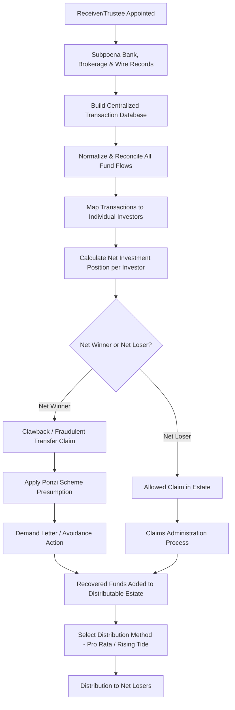

## Forensic Accounting in Ponzi Scheme Unwinding

### Overview

Forensic accounting in Ponzi scheme unwinding involves the reconstruction of a fraudulent investment scheme's cash flows, identification of investor gains and losses, and quantification of amounts recoverable from participants to fund an equitable distribution to defrauded victims. This work typically occurs under the direction of a court-appointed **receiver** or bankruptcy **trustee** and combines forensic tracing, statistical/database reconstruction, and specialized legal doctrines unique to fraud recovery.

### The Ponzi Scheme Mechanic and Why Forensic Reconstruction Is Necessary

**Key Points**

- A Ponzi scheme pays purported "returns" to earlier investors using principal contributed by later investors, rather than from any legitimate underlying investment activity or business operations.
- Because the scheme's books and records are typically fabricated, incomplete, commingled, or destroyed, the forensic accountant must **reconstruct the true flow of funds** from underlying source documents (bank records, wire transfers, brokerage statements) rather than relying on the scheme's own reporting to investors.
- The reconstruction serves multiple purposes: establishing that a Ponzi scheme existed (often invoking the **"Ponzi scheme presumption"** of fraudulent intent under fraudulent transfer law), identifying net winners and net losers among investors, and calculating each investor's recoverable claim.

### The Ponzi Scheme Presumption

- Courts in many jurisdictions apply a **presumption of actual fraudulent intent** for transfers made by an entity operating as a Ponzi scheme, eliminating the need to prove badges of fraud transfer-by-transfer once the existence of the scheme itself is established.
- This presumption significantly streamlines fraudulent transfer avoidance actions (see **Fraudulent transfer and preference analysis**) against investors who received payouts, since the receiver/trustee need only establish the Ponzi nature of the enterprise as a whole rather than the fraudulent intent behind each individual investor distribution.
- The forensic accountant's reconstruction of the scheme's cash flows is typically the primary evidentiary basis for establishing this presumption. [Inference — the precise application, scope, and rebuttability of the Ponzi presumption varies by jurisdiction; confirm current case law.]

### Net Winner / Net Loser Analysis

This is the central quantitative task in Ponzi scheme forensic accounting, determining each investor's position relative to their own cash invested.

$$\text{Net Investment Position} = \text{Total Cash Withdrawn by Investor} - \text{Total Cash Deposited by Investor}$$

- **Net Winners:** investors who withdrew more than they deposited (i.e., received fictitious "profits" funded by other victims' principal). These investors are typically subject to **clawback claims** for some or all of their net withdrawals.
- **Net Losers:** investors who deposited more than they withdrew and have an allowed claim against the estate for their net loss.
- Critically, this analysis is based strictly on **cash in versus cash out** — the fictitious account statements, purported investment gains, and reported balances issued by the scheme operator are disregarded entirely, since they reflect fabricated returns rather than real economic activity.

**Illustrative Net Winner/Loser Table**

| Investor | Total Deposits | Total Withdrawals | Net Position | Classification |
| --- | --- | --- | --- | --- |
| A | $500,000 | $780,000 | +$280,000 | Net Winner (clawback exposure) |
| B | $300,000 | $310,000 | +$10,000 | Net Winner (clawback exposure) |
| C | $400,000 | $150,000 | -$250,000 | Net Loser (allowed claim) |
| D | $200,000 | $0 | -$200,000 | Net Loser (allowed claim) |

### The "Money In / Money Out" (Cash) Method vs. Rising Tide/Other Distribution Methods

Two distinct methodological questions arise in Ponzi unwinding: (1) how to calculate each investor's *net position* (addressed above), and (2) how to allocate scarce recovered assets among the pool of net losers, which is a distribution-methodology question typically decided by the court based on receiver/trustee recommendation:

- **Pro Rata / "Money In, Money Out" Method:** the most common approach; distributes available funds among net losers proportional to each investor's net loss, so an investor who lost $250,000 receives twice the distribution of an investor who lost $125,000.
- **Rising Tide Method:** an alternative that seeks to bring all investors up to the same percentage recovery of their principal, adjusting for amounts already received, before any investor's recovery percentage is allowed to exceed another's — often favored where some claimants received partial "clawback" repayments before the scheme's collapse.
- **Last Money In, First Money Out and other variants:** less commonly applied; each distribution methodology has different equitable implications and is typically the subject of contested motions before the court.
- Selection of distribution method is ultimately a legal/equitable determination made by the court, though the forensic accountant typically models the financial impact of each candidate method for the receiver/trustee and the court's consideration.

### Fund Flow Reconstruction and Database Methodology

Given the volume of transactions in a typical Ponzi scheme (often spanning years and thousands of investors), forensic accountants typically build a **centralized transaction database**:

1. **Source document aggregation:** subpoena and collect bank statements, wire records, check images, brokerage statements, and any internal records maintained by the scheme operator across all accounts (personal, business, and any commingled entities).
2. **Data normalization:** standardize transaction data (dates, amounts, payor/payee, account references) into a consistent schema suitable for querying and reconciliation.
3. **Investor account mapping:** link every deposit and withdrawal to the specific investor or investor entity, addressing complications such as third-party payments, joint accounts, and transfers between related investor entities.
4. **Reconciliation and quality control:** cross-reference bank records against any available internal scheme records to identify gaps, and resolve discrepancies (e.g., wire transfers routed through intermediate accounts, cash transactions, uncashed or voided checks).
5. **Exclusion of non-investment transactions:** distinguish legitimate personal or unrelated business transactions of the scheme operator from investor-related fund flows, since not every transaction through commingled accounts represents an investor deposit or withdrawal.

### Tracing Through Commingled and Layered Accounts

- Ponzi scheme operators frequently commingle investor funds across multiple bank accounts, shell entities, and layered transfers to obscure the fund flow — requiring the forensic accountant to apply **tracing methodologies** analogous to those used in general fraud investigations.
- Common tracing approaches include:
  - **Lowest Intermediate Balance Rule (LIBR):** used to trace identifiable funds through commingled accounts, based on the principle that when funds are commingled, a claimant's traceable interest is limited to the lowest balance the account held between the deposit and the withdrawal/dissipation being traced — funds cannot be traced through an account that dropped to zero (or below the claimed amount) at any intervening point.
  - **First-In-First-Out (FIFO) and pro rata tracing:** alternative presumptions applied by some courts when LIBR is not used or does not resolve the tracing question, though LIBR is often preferred by courts as more protective of victims in Ponzi/fraud contexts. [Unverified — the specific tracing doctrine applied varies by jurisdiction and case-specific facts.]

### Process Flow

### Third-Party and "Net Winner" Recipient Complications

- **Fictitious profits paid to third parties** (e.g., an investor directs scheme payouts to a family trust or related entity) can extend clawback exposure to those downstream recipients under subsequent-transferee recovery principles (see **Fraudulent transfer and preference analysis**), subject to good-faith-for-value defenses.
- **In-kind transfers:** some Ponzi schemes involve non-cash distributions (real property, vehicles, jewelry) to certain investors or insiders, requiring valuation of the transferred property as of the transfer date to properly incorporate it into the net winner/loser calculation.
- **Fees paid to feeder funds, introducing brokers, or affiliated advisors** on top of investor principal are frequently a separate category of recovery target, since these parties received compensation funded by the fraudulent scheme without necessarily being "investors" themselves.

### Illustrative Example — Reconstructing a Simplified Scheme

A receiver is appointed over a purported real estate investment fund that operated for 6 years. Bank record reconstruction reveals:

- Total investor deposits across all identified accounts: $85 million.
- Total investor withdrawals (labeled as "distributions" or "returns" in scheme communications): $62 million.
- Operating expenses, operator's personal expenditures, and fees paid to third-party promoters: $18 million.
- Remaining cash and recoverable assets at the time of receivership: $5 million.

Reconstruction confirms no legitimate underlying real estate investment activity generated the reported "returns" — deposits from later investors directly funded withdrawals to earlier investors, consistent with Ponzi scheme mechanics and supporting application of the Ponzi presumption for subsequent avoidance actions against net winners.

- Aggregate net winner clawback exposure (sum of all individual investors' net positive withdrawals over deposits): approximately $14 million (illustrative).
- Aggregate net loser claims (sum of all individual investors' net negative positions): approximately $37 million (illustrative — total deposits of $85M less total withdrawals of $62M, allocated across the investor base rather than evenly, since individual investor experiences vary widely).
- Available distributable estate, before litigation recovery costs, includes the $5 million on hand plus any amounts successfully clawed back from net winners, less receivership administrative expenses.

### Common Pitfalls in Ponzi Scheme Forensic Reconstruction

- Relying on the scheme's own reported account statements or investor communications rather than independently reconstructing cash flows from primary bank and brokerage records.
- Failing to properly trace funds through layered, commingled accounts, leading to inaccurate net winner/loser classifications.
- Inconsistent treatment of in-kind transfers or third-party payments, understating true clawback exposure.
- Applying an inappropriate tracing doctrine (e.g., simple FIFO where LIBR would more accurately protect victim interests) without proper legal/jurisdictional analysis.
- Underestimating the data reconciliation effort required for large, multi-year, multi-account schemes, leading to unreliable investor-level net position calculations.

**Related Topics**

- Fraudulent transfer and preference analysis
- Solvency and insolvency analysis
- Receivership accounting and reporting obligations
- Claims administration and bar date procedures in fraud recoveries
- Tracing methodologies (Lowest Intermediate Balance Rule, FIFO, pro rata)
- Hidden asset and lifestyle analysis (overlap in tracing techniques)