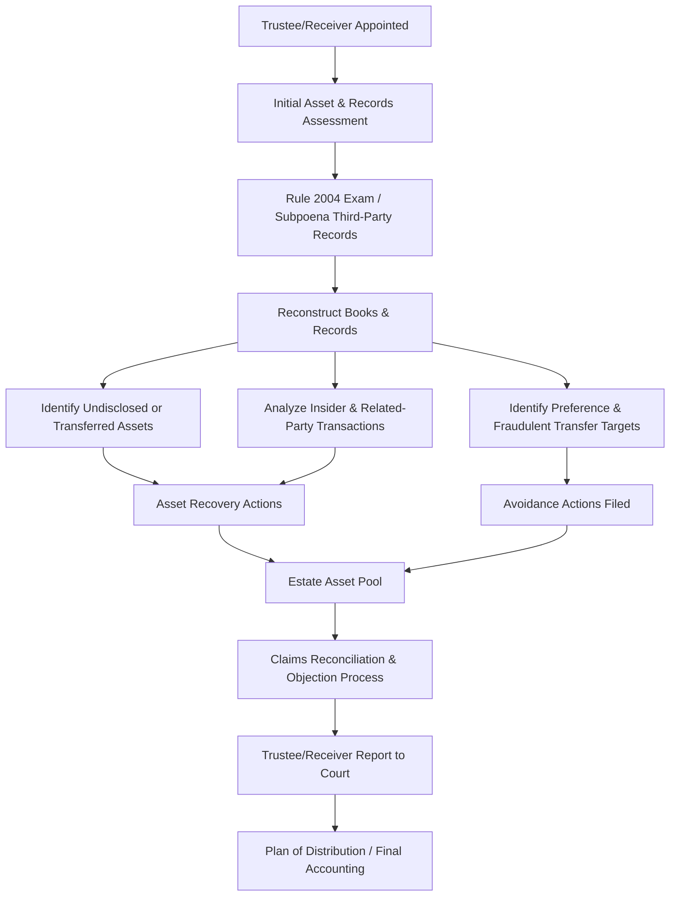

## Trustee and Receiver Investigative Engagements

### Overview

Trustee and receiver investigative engagements involve forensic accountants retained by, or serving as, a bankruptcy trustee or court-appointed receiver to investigate a debtor's or defendant's financial affairs, identify estate assets (including avoidable transfers and causes of action), and support the administration and eventual distribution of a bankruptcy or receivership estate. These engagements differ structurally from party-retained litigation support in that the forensic accountant frequently serves the court-appointed fiduciary directly, carrying independent statutory duties rather than advocating for a single litigant.

### Roles and Appointment Mechanisms

**Key Points**

- **Bankruptcy Trustee:** appointed in Chapter 7 liquidations (and sometimes Chapter 11 cases, where a trustee is appointed for cause) under the Bankruptcy Code, charged with collecting and liquidating estate assets, investigating the debtor's financial affairs, and objecting to improper claims.
- **Chapter 11 Debtor-in-Possession (DIP):** in most Chapter 11 cases, the debtor's existing management remains in control as a fiduciary (the "debtor-in-possession") rather than a trustee being appointed, though a trustee or examiner may be appointed where fraud, gross mismanagement, or conflicts are alleged.
- **Examiner:** appointed under § 1104 in certain Chapter 11 cases to investigate specific allegations (fraud, mismanagement, conflicts of interest) without necessarily displacing existing management, producing an **examiner's report** to the court.
- **Receiver:** typically appointed by a state or federal court (outside the Bankruptcy Code) in equity receiverships, SEC enforcement actions, or secured creditor remedies, to take custody of and manage assets/operations pending resolution of underlying claims — commonly used in fraud cases (including Ponzi schemes) and shareholder/partnership disputes.
- The forensic accountant may be retained directly by the trustee/receiver as a **financial advisor or forensic investigator**, or may itself be **appointed as the trustee or receiver** in some engagements, particularly where the case is primarily financial/accounting in nature.

### Sources of Investigative Authority

- **Rule 2004 Examinations** (Federal Rules of Bankruptcy Procedure): broad discovery tool allowing a trustee (or other party in interest) to examine the debtor, its officers, and third parties regarding "the acts, conduct, or property or to the liabilities and financial condition of the debtor," without the procedural constraints applicable to ordinary civil discovery.
- **Trustee's statutory duties** under § 704 (Chapter 7) or § 1106 (Chapter 11 trustee), including the duty to investigate the debtor's financial affairs and file a report of that investigation.
- **Receivership orders:** the appointing court's order typically defines the receiver's specific powers, which can range from narrow (oversight of specific assets) to broad (full operational and investigative control equivalent to a Chapter 11 trustee).
- **Subpoena power:** trustees and receivers typically have authority to subpoena third-party records (banks, business partners, professional advisors) well beyond what the debtor/defendant voluntarily discloses.

### Scope of a Trustee/Receiver Investigation

**Key Points**

- **Asset identification and recovery:** locating all estate property, including concealed, transferred, or undervalued assets not disclosed in the debtor's schedules or the receivership defendant's initial accounting.
- **Avoidance action identification:** analyzing pre-petition/pre-receivership transactions for preferences and fraudulent transfers (see **Fraudulent transfer and preference analysis**), which often represent a primary source of estate recovery.
- **Books and records reconstruction:** where records are incomplete, commingled, or destroyed, reconstructing the debtor's/defendant's financial history from banking and third-party records (methodology closely parallel to Ponzi scheme fund-flow reconstruction).
- **Related-party and insider transaction review:** identifying self-dealing, excessive compensation, or improper distributions to insiders, officers, or affiliated entities.
- **Claims analysis:** reviewing creditor claims filed against the estate for validity, proper classification, and potential objections (duplicate claims, time-barred claims, claims subject to setoff).
- **Solvency analysis:** where required to support avoidance actions or to establish the timing of insolvency for other purposes (see **Solvency and insolvency analysis**).
- **Operational oversight (for operating receiverships/DIPs):** ongoing monitoring of cash flow, budget-to-actual performance, and financial reporting during the pendency of the case.

### The Investigation Process

### Books and Records Reconstruction

- Many trustee/receiver engagements begin with **incomplete or unreliable financial records** — the debtor may have poor recordkeeping, destroyed records, or (in fraud-driven receiverships) intentionally fabricated books.
- Reconstruction methodology mirrors techniques used in hidden asset analysis and Ponzi scheme unwinding:
  - Aggregating all bank, brokerage, and credit card statements from primary sources (banks and third parties) rather than relying on the debtor's internal accounting software output.
  - Rebuilding a general ledger or transaction database from source documents when internal accounting records are unreliable or unavailable.
  - Cross-referencing tax returns, payroll records, and vendor/customer confirmations to corroborate the reconstructed financial picture.
- The forensic accountant's reconstructed financials often become the primary evidentiary basis for the trustee's/receiver's report to the court and any subsequent avoidance litigation.

### Asset Tracing and Recovery

- **Real and personal property searches:** title searches, UCC lien searches, vehicle and vessel registries, and public records to identify undisclosed debtor/defendant assets.
- **Business interest identification:** searching secretary of state filings and related-entity databases for undisclosed ownership interests in other businesses, particularly where the debtor may have transferred operations to a newly formed entity to evade creditors.
- **Bank and brokerage account tracing:** identifying all accounts controlled by or associated with the debtor/defendant, including accounts held in the names of family members, related entities, or nominees.
- **International asset tracing:** in cases involving suspected offshore concealment, coordination with counsel regarding letters rogatory, foreign discovery mechanisms, and international asset recovery specialists. [Inference — international tracing mechanisms and their practical effectiveness vary substantially by jurisdiction and are highly fact-specific.]

### Insider and Related-Party Transaction Review

- Trustees and receivers give particular scrutiny to transactions with **insiders** (officers, directors, family members, affiliated entities), given both the extended one-year preference look-back for insiders under § 547(b)(4)(B) and the heightened fraud risk in related-party dealings.
- Common areas of focus:
  - Excessive or undocumented officer/insider compensation, bonuses, or loans.
  - Below-market leases or asset sales to related entities.
  - Corporate opportunities diverted to insider-controlled entities.
  - Guarantees or pledges of estate assets to secure insider or related-party obligations.

### Interaction with the Claims Process

- The trustee/receiver's investigative findings directly inform **claims objections**, where the forensic accountant may be asked to analyze the basis, amount, and priority of filed creditor claims, identifying:
  - Duplicate or overstated claims.
  - Claims subject to equitable subordination (e.g., insider claims arising from inequitable conduct).
  - Claims that should be offset against amounts the creditor owes the estate (e.g., a creditor who also received an avoidable preference).
- This work requires close coordination between the forensic accountant's investigative findings and the trustee's/receiver's counsel, who ultimately files and litigates formal objections.

### Reporting Obligations

- Trustees and receivers typically owe periodic reporting obligations to the court and/or creditors, which the forensic accountant frequently drafts or substantially supports:
  - **Initial report of investigation**, summarizing preliminary findings regarding assets, potential avoidance actions, and estate administration recommendations.
  - **Periodic operating reports** (for operating receiverships or Chapter 11 cases), reflecting cash flow, budget-to-actual variance, and financial condition.
  - **Final report and accounting**, reconciling all funds received and disbursed by the estate and supporting the proposed plan of distribution.
- Given the fiduciary nature of the trustee's/receiver's role, these reports are held to a high standard of completeness, accuracy, and supportability, since they are subject to review by the court, creditors, and often the U.S. Trustee's office (in bankruptcy matters).

### Illustrative Example

A Chapter 7 trustee is appointed over a mid-sized wholesale distribution company after a rapid, unexplained business failure. Initial schedules disclose minimal assets, but the trustee's forensic accountant identifies several investigative leads:

- Bank record reconstruction reveals **$1.2 million in payments** to a newly formed entity, owned by the debtor's principal's adult child, in the 10 months preceding filing — for services with no supporting documentation of value provided. This is analyzed as a potential insider preference (within the 1-year look-back) and/or fraudulent transfer.
- UCC and secretary of state searches reveal the principal formed a new company, using a similar trade name, three months before filing, which began servicing several of the debtor's largest customers — raising questions about diverted corporate opportunity and potential undisclosed business assets.
- Reconstructed accounts receivable aging shows the debtor collected approximately $400,000 from customers in the final 60 days pre-filing that does not appear in the debtor's disclosed bank accounts, prompting further tracing to identify an undisclosed account.

These findings collectively support: (1) an insider preference/fraudulent transfer action to recover the $1.2 million in insider payments, (2) further investigation into the new entity as a potential estate asset or basis for a fraudulent transfer/successor liability claim, and (3) continued tracing of the missing $400,000 in collected receivables — illustrating how trustee investigative work typically generates multiple, interconnected recovery threads rather than a single isolated finding.

### Common Pitfalls in Trustee/Receiver Investigative Work

- Relying solely on the debtor's/defendant's voluntary disclosures rather than independently verifying through third-party subpoenas and public records searches.
- Failing to distinguish preliminary investigative leads (requiring further corroboration) from findings sufficiently supported to include in formal court reports.
- Inadequate documentation of the reconstruction methodology, undermining the report's credibility if later challenged in avoidance litigation.
- Overlooking the extended insider preference look-back period, understating potential recovery from insider transactions.
- Insufficient coordination between the forensic accountant's investigative timeline and the trustee's/receiver's statutory reporting deadlines, risking incomplete findings in required court filings.

**Related Topics**

- Fraudulent transfer and preference analysis
- Solvency and insolvency analysis
- Forensic accounting in Ponzi scheme unwinding
- Rule 2004 examination practice and third-party subpoena strategy
- Claims administration, objections, and equitable subordination
- Successor liability and corporate opportunity doctrine in insolvency contexts