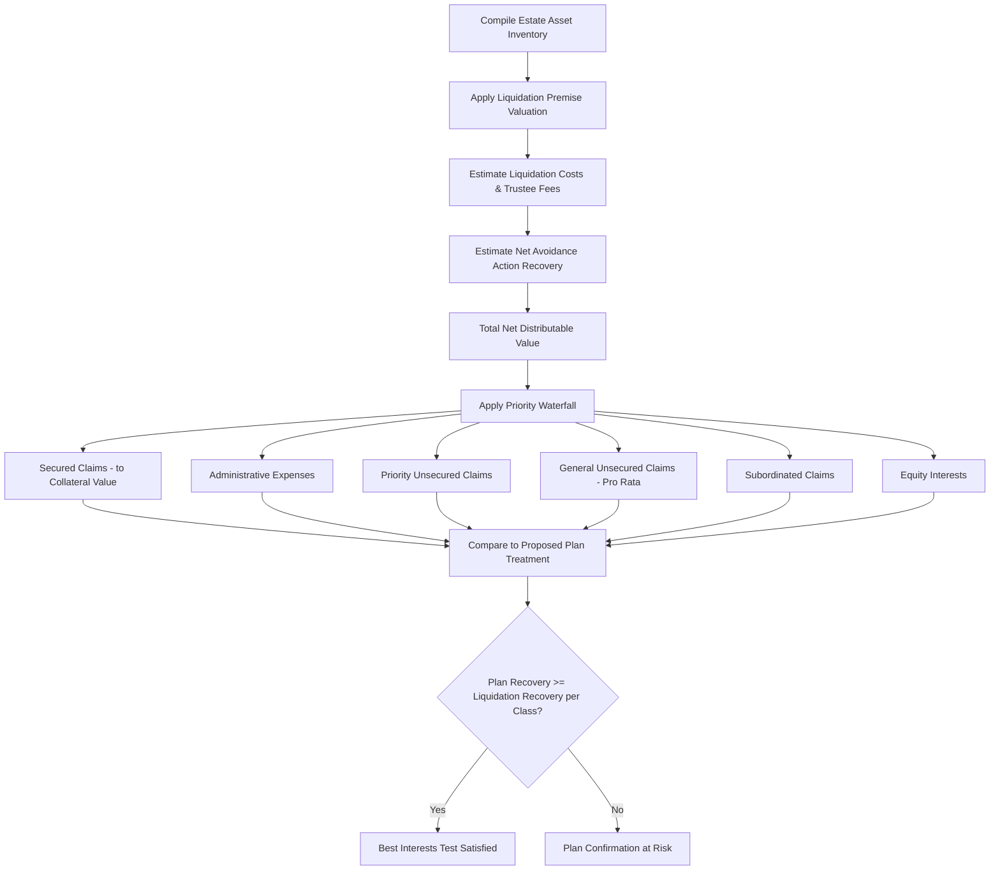

## Creditor Recovery Analysis

### Overview

Creditor recovery analysis is the forensic accounting process of estimating how much value creditors of different classes and priority levels are likely to receive from a bankruptcy estate or receivership, both to satisfy statutory disclosure requirements (such as the liquidation analysis in a Chapter 11 disclosure statement) and to inform strategic decisions by creditors, trustees, and the court throughout the case. It sits at the intersection of asset valuation, the Bankruptcy Code's priority scheme, and claims quantification.

### Purpose and Contexts of Recovery Analysis

**Key Points**

- **Chapter 11 Plan Confirmation — Best Interests Test:** § 1129(a)(7) requires that each impaired creditor receive at least as much under the proposed plan as it would receive in a hypothetical Chapter 7 liquidation — the **"best interests of creditors" test** — making a liquidation analysis a mandatory component of virtually every Chapter 11 disclosure statement.
- **Chapter 7 Trustee Administration:** the trustee's forensic accountant estimates recoveries to guide administration decisions (e.g., whether pursuing a given avoidance action or asset recovery effort is cost-justified relative to expected estate benefit).
- **Preference/Fraudulent Transfer "Greater Recovery" Test:** as discussed in preference analysis, quantifying the hypothetical Chapter 7 recovery percentage for unsecured creditors is a required input to the § 547(b)(5) preference test.
- **Secured Creditor Adequate Protection and Cramdown Analysis:** valuing collateral to determine a secured creditor's recovery under a proposed plan, including cramdown scenarios under § 1129(b).
- **Receivership Distribution Planning:** similar recovery modeling supports distribution recommendations in equity receiverships (including Ponzi scheme unwindings).

### The Priority Waterfall

Creditor recovery analysis is fundamentally a **waterfall modeling exercise**, applying the Bankruptcy Code's statutory priority scheme to the estate's available value:

1. **Secured claims** — paid first, but only to the extent of the value of their collateral (the "secured" portion); any shortfall becomes an unsecured deficiency claim.
2. **Administrative expenses** (§ 503/§ 507(a)(2)) — costs of administering the estate, including trustee fees, professional fees (attorneys, accountants), and post-petition operating expenses in Chapter 11.
3. **Priority unsecured claims** (§ 507(a)) — a specific statutory hierarchy including certain wage claims, employee benefit contributions, consumer deposits, and priority tax claims, each subject to statutory dollar caps that are periodically adjusted.
4. **General unsecured claims** — paid pro rata from remaining value after all senior classes are satisfied in full.
5. **Subordinated claims** (contractually or equitably subordinated, e.g., certain insider claims or claims subject to § 510 subordination).
6. **Equity interests** — receive value only if all classes above are paid in full (the **absolute priority rule** in Chapter 11 cramdown contexts).

$$\text{Recovery \%}_{\text{class}} = \frac{\text{Value Available to Class}}{\text{Total Allowed Claims in Class}}$$

### Liquidation Analysis Methodology

**Step 1 — Asset Valuation Under Liquidation Premise**

- Assets are valued at their **estimated net liquidation proceeds**, not going-concern fair value, reflecting a forced or orderly liquidation scenario (typically over a defined wind-down period, e.g., 3–6 months).
- Common liquidation value discounts applied relative to book or fair value:

| Asset Category | Typical Liquidation Recovery Range (Illustrative) |
| --- | --- |
| Cash and cash equivalents | ~100% |
| Accounts receivable | 50%–85%, depending on age and collectibility |
| Inventory (finished goods) | 30%–70%, depending on nature and marketability |
| Inventory (work-in-process/raw materials) | 10%–40% |
| Machinery and equipment | 20%–60%, depending on specialization |
| Real property | Appraisal-based, often with a liquidation discount to fair market value |
| Intangibles/goodwill | Often minimal to negligible in forced liquidation |

These ranges are illustrative only; actual liquidation recovery rates are highly fact- and industry-specific and should be supported by appraisals, industry data, or actual sale/auction results where available. [Inference — ranges will vary meaningfully by industry, asset condition, and liquidation timeline; not a substitute for asset-specific appraisal.]

**Step 2 — Estimate Liquidation Costs**

- Chapter 7 trustee statutory commission (calculated under § 326 on a graduated percentage basis).
- Liquidating professional fees (auctioneers, liquidators, broker commissions on real property).
- Wind-down period operating costs (security, insurance, utilities to preserve asset value pending sale).
- Legal and accounting fees associated with the liquidation process itself.

**Step 3 — Add Recoverable Avoidance Action Value**

- Estimated net recovery from preference and fraudulent transfer actions (see **Fraudulent transfer and preference analysis**), net of anticipated litigation costs and expected settlement discounts, since avoidance actions typically settle for less than full claimed value given litigation risk and collectability concerns.

**Step 4 — Apply the Priority Waterfall**

- Allocate total net liquidation proceeds (Step 1 minus Step 2, plus Step 3) according to the priority scheme described above, producing an estimated recovery percentage for each creditor class.

**Step 5 — Compare to Proposed Plan Treatment**

- For Chapter 11 best interests testing, compare the hypothetical Chapter 7 liquidation recovery percentage per class against the recovery percentage each class would receive under the proposed plan; the plan must provide equal or greater value to satisfy § 1129(a)(7).

### Process Flow

### Claims Quantification and Reconciliation

- Recovery analysis is only as reliable as the underlying **claims pool estimate**; the forensic accountant typically works from the claims register, adjusting for:
  - Disputed, contingent, and unliquidated claims requiring estimation under § 502(c).
  - Duplicate claims (e.g., same debt filed by both an original creditor and a subsequent assignee).
  - Claims subject to pending objections likely to reduce or disallow the claimed amount.
  - Reclassification risk (claims asserted as secured or priority that may be reclassified as general unsecured upon review).
- Because the ultimate allowed claims pool is often not finalized until well into the case, recovery percentage estimates are typically presented as a **range** rather than a single point estimate, with sensitivity analysis around key assumptions (asset values, avoidance action recovery, claims pool size).

### Secured Creditor Recovery and Collateral Valuation

- Secured creditor recovery analysis requires a **collateral-specific valuation**, since § 506(a) bifurcates an undersecured claim into a secured portion (up to collateral value) and an unsecured deficiency claim for the excess.
- The valuation standard applied (liquidation value, going-concern value, or replacement value) depends on the context — e.g., replacement value standard often applies in Chapter 13/11 cramdown contexts under case law such as *Associates Commercial Corp. v. Rash*, while liquidation value may be more relevant in a Chapter 7 or liquidating Chapter 11 context. [Unverified — confirm current applicable standard for the specific proceeding type and jurisdiction.]
- Disputes over collateral valuation (e.g., real estate appraisal disputes, equipment valuation methodology) are common sources of contested confirmation hearings and often require the forensic accountant/valuation expert to testify.

### Illustrative Example — Simplified Liquidation Analysis

A Chapter 11 debtor proposes a reorganization plan. The forensic accountant prepares a liquidation analysis to test compliance with the best interests test:

**Hypothetical Chapter 7 Liquidation:**

| Item | Amount |
| --- | --- |
| Cash | $800,000 |
| Accounts receivable (net of 65% recovery estimate) | $1,300,000 |
| Inventory (net of 45% recovery estimate) | $900,000 |
| Equipment (net of 35% recovery estimate) | $700,000 |
| Estimated avoidance action net recovery | $500,000 |
| **Gross Liquidation Proceeds** | **$4,200,000** |
| Less: Trustee commission (§ 326) | ($180,000) |
| Less: Liquidation professional fees | ($220,000) |
| Less: Wind-down operating costs | ($150,000) |
| **Net Distributable Estate** | **$3,650,000** |

**Priority Waterfall Application:**

- Secured creditor (collateral value $2,100,000): paid in full to collateral value → $2,100,000; remaining unsecured deficiency claim of $400,000 (on a $2,500,000 total secured debt) added to general unsecured pool.
- Administrative expenses (Chapter 11 professional fees, post-petition trade payables): $650,000, paid in full.
- Priority unsecured claims (employee wage claims within statutory cap): $200,000, paid in full.
- **Remaining for general unsecured claims:** $3{,}650{,}000 - 2{,}100{,}000 - 650{,}000 - 200{,}000 = \$700,000$.
- Total general unsecured claims pool (including the $400,000 secured deficiency claim): $4,200,000.
- **Estimated general unsecured recovery: ** $700{,}000 / 4{,}200{,}000 \approx 16.7\%$.

**Best Interests Comparison:** The proposed Chapter 11 plan offers general unsecured creditors a 22% recovery paid over three years. Since 22% exceeds the hypothetical Chapter 7 liquidation recovery of approximately 16.7%, the plan satisfies the § 1129(a)(7) best interests test for this class, subject to appropriate present-value/discounting analysis if the plan recovery is paid over time rather than immediately (since a deferred payment stream must be discounted to compare fairly against an immediate hypothetical liquidation distribution).

### Common Pitfalls in Creditor Recovery Analysis

- Valuing assets at going-concern or book value rather than the liquidation premise required for best interests testing.
- Overstating expected avoidance action recovery without appropriately discounting for litigation risk, collectability, and settlement dynamics.
- Failing to properly bifurcate secured claims under § 506(a), overstating the secured creditor's position and understating the unsecured deficiency claim added to the general pool.
- Omitting or understating liquidation costs (trustee commission, wind-down expenses), overstating net distributable value.
- Comparing a plan's deferred payment stream to a liquidation analysis's immediate distribution without appropriate present-value discounting, producing an invalid apples-to-oranges comparison.
- Treating claims pool estimates as fixed rather than presenting a defensible range given the inherent uncertainty in unresolved disputed/contingent claims.

**Related Topics**

- Solvency and insolvency analysis
- Fraudulent transfer and preference analysis
- Trustee and receiver investigative engagements
- Chapter 11 plan confirmation and disclosure statement requirements
- Secured creditor collateral valuation and cramdown litigation
- Claims estimation under § 502(c) for contingent and unliquidated claims