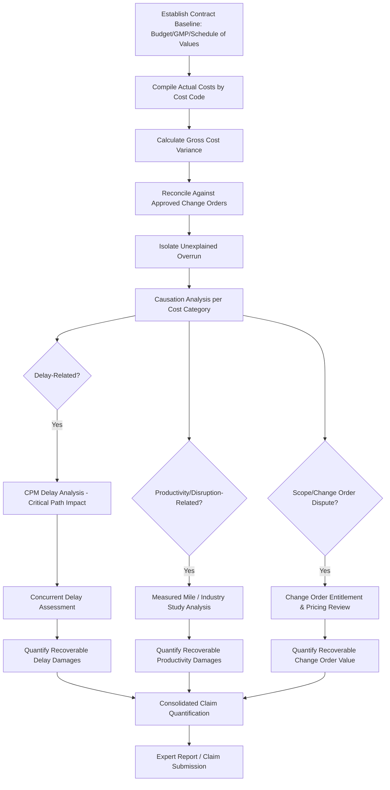

## Construction Cost Overrun and Claims Analysis

### Overview

Construction cost overrun and claims analysis is the forensic accounting discipline of investigating, quantifying, and evaluating cost increases, delays, and disputed entitlements arising on construction projects. It combines cost accounting reconstruction, contract interpretation support, and causation analysis to determine responsibility for overruns and to quantify recoverable damages in construction claims and disputes.

### Common Sources of Construction Claims

**Key Points**

- **Delay claims:** damages arising from project completion later than the contractually scheduled date, whether caused by the owner, contractor, or excusable/non-excusable third-party events.
- **Disruption/loss of productivity claims:** damages arising when work is performed less efficiently than planned, even without a discrete delay, often due to trade stacking, out-of-sequence work, or repeated design changes.
- **Differing site conditions claims:** damages arising when actual physical conditions materially differ from those represented in contract documents or reasonably anticipated.
- **Change order and extra work disputes:** disagreements over the scope, pricing, or entitlement to compensation for work outside the original contract scope.
- **Defective/deficient work and back-charge disputes:** costs incurred to correct non-conforming work, and disputes over responsibility for those costs.
- **Termination-related claims:** costs and damages arising from termination for cause or convenience, including wind-down costs and lost profit claims.

### Types of Contracts and Their Effect on Claims Analysis

The applicable contract type materially shapes both the nature of likely claims and the forensic accounting methodology used:

| Contract Type | Cost Overrun Risk Allocation | Typical Forensic Focus |
| --- | --- | --- |
| Lump Sum / Fixed Price | Contractor bears most cost risk absent owner-caused changes | Change order entitlement, differing site conditions, scope creep documentation |
| Cost-Plus / Cost-Reimbursable | Owner bears cost risk; contractor reimbursed actual costs plus fee | Cost reasonableness, audit of actual costs incurred, verification against contract-allowable cost definitions |
| Guaranteed Maximum Price (GMP) | Hybrid — contractor bears risk above the GMP absent qualifying changes | GMP basis/buyout analysis, shared savings calculations, change order impact on the GMP ceiling |
| Unit Price | Risk allocated per unit of measured work | Quantity verification, measurement disputes, unit price escalation for over-runs beyond estimated quantities |

### Delay Analysis Methodologies

Delay analysis is a specialized sub-discipline, often performed jointly by forensic accountants and scheduling/CPM (Critical Path Method) experts, since delay damages quantification depends on first establishing which delays affected the **critical path**.

**Common Delay Analysis Techniques**

- **As-Planned vs. As-Built Analysis:** compares the original baseline schedule to the actual sequence of work performed, identifying variances and their apparent causes — a relatively simple method but less rigorous in isolating concurrent or overlapping delay causes.
- **Impacted As-Planned Analysis:** inserts alleged delay events into the original baseline schedule to model their theoretical impact on the completion date, without accounting for actual project changes that occurred independently of the delay events.
- **Collapsed As-Built (But-For) Analysis:** starts with the actual as-built schedule and theoretically removes ("collapses out") the alleged delay events, showing what completion date would have resulted "but for" those events — often considered a more rigorous, factually-grounded method since it starts from what actually happened.
- **Time Impact Analysis (TIA):** a contemporaneous, periodic method that inserts delay events into the schedule as they occur throughout the project, using the schedule update in effect immediately before each delay event — widely regarded as one of the more defensible methods when performed contemporaneously, though often reconstructed retrospectively in litigation when not performed in real time.
- Method selection significantly affects the quantified delay period and is frequently a contested issue between opposing experts. [Inference — no single method is universally accepted as superior across all jurisdictions and forums; selection often depends on contract requirements, data availability, and forum/expert preference.]

### Concurrent Delay

- Arises when two or more independent delay events — at least one attributable to each party (or one excusable and one non-excusable) — occur during overlapping time periods, each independently capable of causing the same period of project delay.
- Many jurisdictions hold that neither party may recover delay damages for the concurrently delayed period (each bears its own costs), though treatment varies by jurisdiction and contract language. [Unverified — confirm applicable jurisdiction's treatment, as approaches range from strict concurrent delay bars to apportionment-based approaches.]
- Properly identifying concurrency (versus sequential or pacing delays) is a critical and often disputed step, requiring detailed schedule analysis to determine whether delay events truly overlapped on the critical path versus merely occurring in the same general timeframe.

### Cost Overrun Reconstruction and Verification

**Step 1 — Establish the Cost Baseline**

- Reconstruct the original approved budget/estimate, GMP, or schedule of values as the baseline against which actual costs are compared.

**Step 2 — Compile and Categorize Actual Costs**

- Aggregate actual project costs from job cost ledgers, subcontractor invoices, payroll records, and change order logs, categorized by cost code/CSI division to enable variance analysis by trade or scope area.

**Step 3 — Variance Analysis**

$$\text{Cost Overrun} = \text{Actual Costs Incurred} - \text{Original Budget/Contract Value} - \text{Approved Change Order Value}$$

- Isolates the "unexplained" overrun — the portion of cost growth not attributable to approved, priced change orders — which becomes the focus of the causation and entitlement analysis.

**Step 4 — Causation Analysis**

- For each significant cost variance, determine the underlying cause: owner-directed change, differing site conditions, contractor inefficiency, defective work rework, weather/force majeure, or design error — since entitlement to recovery depends heavily on causation and contractual risk allocation.

### Loss of Productivity/Disruption Damages Quantification

Because productivity losses are often difficult to isolate through simple cost variance analysis, several specialized quantification methods are used:

- **Measured Mile Analysis:** compares labor productivity (e.g., cost or hours per unit of work) during an unimpacted period of the project to productivity during the impacted period, with the difference representing the productivity loss — widely regarded as one of the more reliable methods when a clean, comparable unimpacted period exists within the same project.

  $$\text{Productivity Loss} = (\text{Actual Productivity Rate}_{\text{impacted}} - \text{Baseline Productivity Rate}_{\text{unimpacted}}) \times \text{Impacted Quantity}$$
- **Industry Studies Method:** applies published productivity loss factors from industry studies (e.g., studies addressing the effects of trade stacking, overtime, or out-of-sequence work) when a project-specific measured mile baseline is unavailable.
- **Total Cost Method:** calculates damages as the difference between total actual project costs and the original bid/estimate, without isolating discrete causation — generally viewed by courts as the **least reliable** method and typically requires the claimant to show the bid was reasonable, actual costs were reasonable, and the overrun was not the claimant's own fault, since it does not affirmatively isolate a specific causal link between each cost increase and the alleged wrongful conduct.
- **Modified Total Cost Method:** adjusts the total cost method to remove costs attributable to the claimant's own errors or known non-recoverable items, improving reliability somewhat over the unmodified total cost approach but still generally viewed as less rigorous than measured mile analysis.

### Process Flow

### Illustrative Example — Combined Delay and Cost Overrun Claim

A general contractor on a fixed-price commercial project submits a claim alleging owner-caused delays and disruption.

**Delay Component:**

- As-built schedule shows actual completion 95 calendar days beyond the contractual date.
- Collapsed as-built analysis, removing owner-directed design changes issued in months 4–7, indicates the project would have completed only 30 days late absent those changes — attributing 65 days of critical-path delay to the owner.
- A separate 20-day period during month 5 shows concurrent delay: both an owner-caused design clarification delay and an independent contractor equipment mobilization delay affected the same critical path activities simultaneously — this 20-day period is treated as concurrent and excluded from the contractor's recoverable delay damages under the jurisdiction's concurrent delay doctrine.
- **Net recoverable owner-caused delay: 65 − 20 = 45 days** (illustrative, subject to the specific concurrency treatment applicable).
- Delay damages calculated using the contractor's actual extended field overhead rate for the 45-day period: $8,200/day × 45 days = **$369,000**.

**Productivity Component:**

- Measured mile analysis compares electrical trade labor productivity during an unimpacted early project period (0.85 labor hours per linear foot of conduit) to the impacted period during the owner-directed design change window (1.40 labor hours per linear foot).
- Productivity loss rate: $1.40 - 0.85 = 0.55$ labor hours per linear foot.
- Impacted quantity during the disrupted period: 18,000 linear feet.
- Lost labor hours: $0.55 \times 18{,}000 = 9{,}900$ hours.
- At a blended labor rate of $68/hour: $9{,}900 \times 68 = $ **$673,200** in productivity loss damages.

**Total Quantified Claim (before overhead/profit markup and any contractual damage caps):** $369{,}000 + 673{,}200 = \textbf{\$1,042,200}$, subject to further reduction for any offsetting contractor-caused delay/inefficiency, contractual notice/limitation provisions, and negotiated settlement dynamics.

### Contractual and Procedural Considerations Affecting Recovery

- **Notice provisions:** most construction contracts require timely written notice of claims within a specified period; failure to comply can bar or limit recovery regardless of the claim's underlying merit.
- **No-damage-for-delay clauses:** many contracts limit the contractor's delay remedy to a time extension only, barring monetary delay damages except in limited circumstances (e.g., owner bad faith, active interference) — the enforceability and exceptions to these clauses vary significantly by jurisdiction. [Unverified — confirm current enforceability standards and recognized exceptions in the applicable jurisdiction.]
- **Liquidated damages provisions:** where the owner asserts liquidated damages for contractor-caused delay, the forensic accountant may need to analyze whether the liquidated damages rate constitutes a reasonable pre-estimate of actual damages (as opposed to an unenforceable penalty) as of contract formation.
- **Total claim value vs. negotiated settlement:** quantified claim amounts frequently differ substantially from eventual negotiated or awarded amounts, reflecting litigation risk, partial entitlement findings, and negotiation dynamics.

### Common Pitfalls in Construction Claims Analysis

- Using the total cost method without adequate justification when a more rigorous method (measured mile, collapsed as-built) is feasible given available project data.
- Failing to properly identify and exclude concurrent delay periods, overstating recoverable delay damages.
- Conflating schedule delay analysis (a scheduling/CPM discipline) with cost/damages quantification (an accounting discipline) without proper coordination between the scheduling expert and forensic accountant.
- Inadequate documentation linking specific cost variances to specific causation events, weakening entitlement arguments under cross-examination.
- Overlooking contractual notice and limitation-of-damages provisions that may bar or cap otherwise well-quantified claims.

**Related Topics**

- Fraud investigation in construction and government contracts (bid rigging, false certification)
- CPM scheduling analysis and critical path methodology
- Change order pricing and entitlement disputes
- Differing site conditions claims and geotechnical documentation review
- Damages quantification standards and reasonable certainty requirements
- Dispute resolution boards and construction arbitration procedures