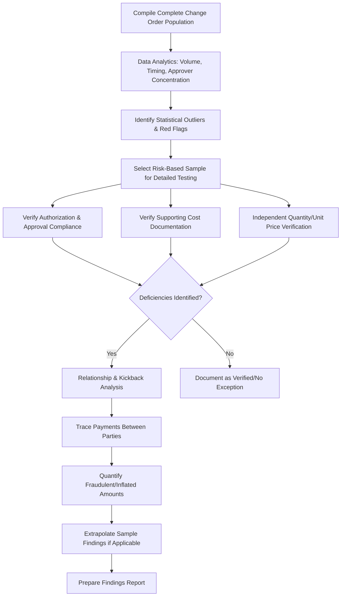

## Change Order and Contract Fraud Schemes

### Overview

Change order and contract fraud schemes encompass a range of deceptive practices employed by contractors, subcontractors, owners' representatives, or colluding project participants to improperly inflate costs, bill for work not performed, or manipulate the change order process for illicit financial gain. Forensic accountants investigating these schemes combine construction cost accounting expertise with fraud examination methodology to detect, quantify, and document improper billing and contract manipulation.

### Common Change Order Fraud Schemes

**Key Points**

- **Fictitious or phantom change orders:** billing for change order work that was never actually performed or authorized.
- **Duplicate billing:** billing for the same scope of work under both the base contract and a change order, or billing the same change order to multiple funding sources/owners.
- **Change order padding/cost inflation:** overstating labor hours, material quantities, or equipment usage on legitimate change order work to inflate the billed amount beyond actual cost plus reasonable markup.
- **Scope manipulation ("bait and switch"):** deliberately underbidding the base contract with the intent to recover profit through inflated or unnecessary change orders after contract award, when the owner has reduced ability to competitively re-bid the work.
- **Unbundling/artificial change order splitting:** breaking a single scope of work into multiple smaller change orders to stay below approval thresholds that would otherwise require additional owner review, competitive bidding, or higher-level authorization.
- **Collusive change order approval:** an owner's representative (project manager, inspector, or engineer) approving inflated or fictitious change orders in exchange for kickbacks from the contractor.
- **False certification of completion:** certifying change order work as complete to trigger payment before the work is actually finished, or certifying work to a higher percentage of completion than actually achieved.

### Related Bid and Procurement Fraud Schemes

Change order fraud frequently co-occurs with, or follows from, fraud earlier in the procurement lifecycle:

- **Bid rigging:** collusive agreements among ostensibly competing bidders to allocate contracts, rotate winning bids, or submit intentionally non-competitive "complementary" bids to create an appearance of competition.
- **Bid splitting:** dividing a project into components specifically to fall below competitive bidding or additional-approval thresholds (a procurement-stage analog to change order unbundling).
- **False certification/qualification fraud:** misrepresenting bidder qualifications, licensing, bonding capacity, minority/disadvantaged business enterprise (MBE/DBE/WBE) status, or past performance history to win contract awards.
- **Defective pricing:** in cost-reimbursable or negotiated contracts (particularly government contracts), failing to disclose accurate, current, and complete cost/pricing data at the time of negotiation, resulting in an inflated negotiated price.

### Detection Indicators ("Red Flags")

| Red Flag Category | Specific Indicators |
| --- | --- |
| Change order volume/timing | Unusually high change order volume relative to contract value or industry norms; change orders clustered shortly after contract award (suggesting bid manipulation) |
| Documentation quality | Missing or generic supporting documentation (no detailed labor/material backup); change orders approved without required competitive quotes or engineering justification |
| Approval patterns | Change orders consistently approved by the same individual just below their authorization threshold; unusual speed of approval relative to typical project governance |
| Vendor/subcontractor relationships | Change order work repeatedly awarded to the same subcontractor without competitive bidding, particularly where undisclosed relationships with project personnel exist |
| Pricing anomalies | Unit prices for change order work significantly exceeding unit prices for comparable base contract scope; inconsistent markup percentages across similar change orders |
| Personnel behavior | Project personnel exhibiting lifestyle inconsistent with reported income; reluctance to provide documentation; resistance to independent verification of completed work |

### Investigative Methodology

**Step 1 — Change Order Population Analysis**

- Compile the complete change order log and perform **data analytics** across the population: total volume, dollar value trends over time, approval timing patterns, and concentration by approver or recipient contractor/subcontractor — often the first step in identifying statistical outliers warranting further investigation.

**Step 2 — Documentation and Support Verification**

- For each change order (or a risk-based sample), verify:
  - Existence of proper authorization consistent with contract requirements and delegated authority levels.
  - Adequacy of supporting cost documentation (labor timesheets, material invoices/receipts, equipment logs) reconciled to the billed amount.
  - Consistency between the change order's described scope and any physical/photographic/inspection evidence of work actually performed.

**Step 3 — Quantity and Unit Price Verification**

- Independent quantity take-offs or field measurement/observation (often coordinated with an engineering or construction consultant) to verify billed quantities against actual installed quantities.
- Comparison of unit prices charged against the base contract's established unit prices, published cost data (e.g., RSMeans), or competitive market rates for comparable work.

**Step 4 — Relationship and Conflict-of-Interest Analysis**

- Review of vendor master files, subcontractor ownership records, and personnel disclosures for undisclosed relationships between project approvers and contractors/subcontractors receiving change order awards.
- Bank record analysis (where kickback schemes are suspected) tracing payments between the contractor/subcontractor and project personnel, similar in methodology to general kickback investigation techniques.

**Step 5 — Damages Quantification**

- Aggregate identified fictitious, duplicated, or inflated change order amounts into a total damages figure, distinguishing between amounts supported by direct documentary evidence versus statistically extrapolated findings from sample testing.

### Process Flow

### Sampling and Extrapolation Methodology

- Given the frequently large volume of change orders on major projects, forensic accountants commonly apply **statistical or judgmental sampling** rather than 100% testing:
  - **Statistical (random) sampling** supports extrapolation of error rates found in the sample to the full population within a calculated confidence interval and precision range, useful for quantifying likely total damages across a large population.
  - **Judgmental/risk-based sampling** targets change orders exhibiting the highest concentration of red flags (large dollar value, single-approver pattern, minimal documentation), useful for identifying the most significant individual instances of fraud but not statistically valid for population-wide extrapolation.
- Extrapolated findings are typically presented with appropriate caveats regarding the confidence level and margin of error, since courts and opposing experts scrutinize extrapolation methodology closely, particularly in government contract fraud contexts (e.g., False Claims Act cases) where extrapolated damages are frequently challenged.

### Illustrative Example — Combined Padding and Kickback Scheme

A forensic accountant is engaged after an owner's internal audit flags an unusually high change order volume on a public infrastructure project managed by a single project engineer.

- **Data analytics** reveal that 68% of all change order dollar value on the project was approved by a single project engineer, at amounts consistently just under his $50,000 individual approval threshold — a strong indicator of potential unbundling to avoid higher-level review.
- **Documentation testing** on a risk-based sample of 40 change orders (representing $3.2 million of the $9.8 million total change order value) finds that 14 change orders totaling $1.1 million lack adequate supporting labor/material documentation, with generic lump-sum invoices from the subcontractor providing no itemized backup.
- **Quantity verification**, performed jointly with an independent field engineer, finds that billed quantities for underground utility work on 6 of the 14 flagged change orders exceed actual field-verified installed quantities by an average of 35%.
- **Bank record tracing** (obtained via subpoena in the subsequent investigation) reveals the subcontractor made 11 payments totaling $210,000 to an LLC subsequently traced to an account controlled by the project engineer's spouse, occurring within days of each flagged change order's approval — supporting a kickback scheme allegation.
- **Damages quantification:** direct documentary evidence supports approximately $1.1 million in inadequately supported change order billings, of which field verification confirms at least $385,000 (the quantified 35% overbilling on the 6 tested quantity items) as demonstrably fraudulent overbilling; the remaining flagged amounts require further investigation or may support a broader extrapolated damages claim if statistically sampled testing is subsequently performed across the full change order population.

### Interaction with Government Contract Fraud Statutes

- Where the project involves public funds, identified change order fraud may implicate the **federal False Claims Act** or analogous state statutes, which impose treble damages and per-claim penalties for knowingly submitted false claims for payment.
- **Qui tam (whistleblower) actions** are a common trigger for these investigations, often initiated by a subcontractor, former employee, or competitor with insider knowledge of the scheme.
- Forensic accountants supporting False Claims Act matters must be particularly attentive to the **materiality** and **scienter (knowledge)** elements required under the statute, in addition to the underlying damages quantification. [Inference — the specific elements, damages multipliers, and procedural requirements of False Claims Act and analogous state statutes should be confirmed against current statutory text and case law for the applicable jurisdiction.]

### Common Pitfalls in Change Order Fraud Investigations

- Testing change orders in isolation without population-level data analytics, missing systemic patterns (approver concentration, timing clustering) that indicate a broader scheme.
- Relying solely on documentary review without independent field verification of quantities and completed work, particularly for below-grade or concealed work that is difficult to verify after the fact.
- Applying statistical extrapolation without adequate sample design, undermining the defensibility of aggregate damages claims.
- Overlooking the procurement/bidding stage entirely, missing upstream bid rigging or bid splitting schemes that set the stage for downstream change order abuse.
- Failing to coordinate with legal counsel early regarding potential False Claims Act implications when public funds are involved, which affects both investigative scope and evidentiary requirements.

**Related Topics**

- Construction cost overrun and claims analysis
- False Claims Act and qui tam whistleblower investigations
- Bid rigging and procurement fraud detection
- Kickback scheme investigation and vendor relationship analysis
- Statistical sampling and extrapolation methodology in fraud damages
- Government contract cost/pricing data compliance (defective pricing)