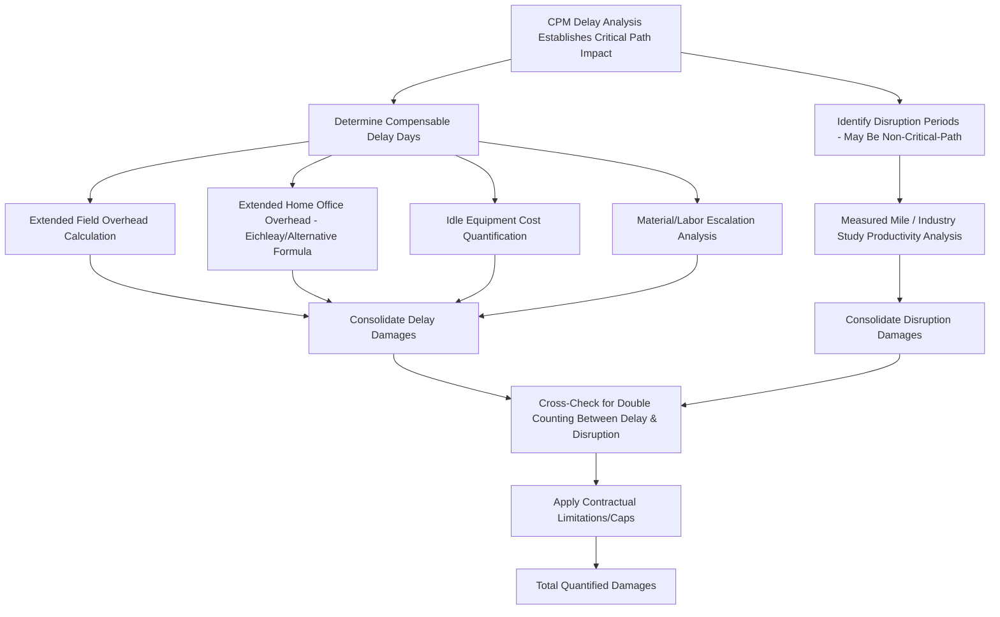

## Delay and Disruption Damages Analysis

### Overview

Delay and disruption damages analysis is the forensic accounting discipline of quantifying the financial consequences of construction project delays (time-related impacts) and disruption (efficiency-related impacts) once entitlement and causation have been established, typically through coordinated schedule (CPM) analysis. While closely related to the delay analysis methodologies introduced in general construction claims work, this discipline focuses specifically on translating quantified delay/disruption periods into defensible dollar damages, covering both contractor-side and owner-side damage categories.

### Distinguishing Delay from Disruption

**Key Points**

- **Delay** refers to time-related impacts — the project (or a specific activity) takes longer than planned, potentially pushing the overall completion date later. Delay damages are generally time-based (e.g., extended field overhead per day of critical-path delay).
- **Disruption** refers to efficiency-related impacts — work is performed, but at reduced productivity, without necessarily extending the overall project completion date. Disruption damages are generally productivity-based (e.g., additional labor hours required to complete the same scope of work).
- A single causative event (e.g., a major design change) can produce **both** delay and disruption damages simultaneously — delaying certain critical-path activities while also disrupting productivity on concurrent, non-critical-path work.
- Properly separating these two damage categories, and avoiding double-counting between them, is a central methodological challenge in comprehensive damages quantification.

### Contractor-Side Delay Damage Categories

**Extended Field (General Conditions) Overhead**

- Costs incurred at the job-site level that continue to accrue for the duration of the delay period regardless of productive work being performed: site supervision, field office costs, equipment rental/standby, temporary utilities, security.

  $$\text{Extended Field Overhead} = \text{Daily Field Overhead Rate} \times \text{Compensable Delay Days}$$
- The daily rate is typically derived from the contractor's actual historical field overhead costs (from job cost records) divided by the original planned project duration, though disputes commonly arise over whether to use actual historical costs or the contractor's original bid estimate.

**Extended Home Office Overhead**

- Indirect costs incurred at the contractor's home office (executive salaries, corporate insurance, accounting, general administration) that are not directly billable to any specific project but are theoretically "extended" when a project's duration is prolonged, since home office overhead is typically absorbed across all of a contractor's active projects.
- Quantified almost universally using a formula-based approach rather than direct cost tracing, since home office overhead cannot practically be traced to a specific project's delay period.

**Eichleay Formula (Federal Contract Context)**

The most widely recognized formula-based method, historically developed in federal government contract disputes:

$$\text{Step 1: Allocable Overhead} = \frac{\text{Contract Billings}}{\text{Total Firm Billings}} \times \text{Total Firm Overhead for Contract Period}$$

$$\text{Step 2: Daily Contract Overhead} = \frac{\text{Allocable Overhead}}{\text{Actual Days of Performance}}$$

$$\text{Step 3: Eichleay Damages} = \text{Daily Contract Overhead} \times \text{Days of Compensable Delay}$$

- Eichleay requires the contractor to demonstrate it was on **standby** during the delay period (unable to take on and absorb overhead from replacement work), which is a frequently contested threshold requirement. [Inference — applicability and specific requirements of the Eichleay formula vary between federal and state/private contexts, and some jurisdictions apply alternative home office overhead formulas (e.g., Carteret, Eichleay variants); confirm the governing standard for the applicable forum.]
- Alternative formulas (e.g., Carteret formula, Allegheny formula) exist in various jurisdictions and may be more or less favorable depending on the specific facts.

**Unabsorbed/Idle Equipment Costs**

- Costs associated with owned equipment sitting idle on-site during delay periods, typically quantified using published equipment rate guides (e.g., the AED/EquipmentWatch "Blue Book" or similar industry rate references) applied to the idle period.

**Escalation Damages**

- Increased material and labor costs incurred because the delay pushed procurement or installation into a later period with higher prevailing prices, quantified by comparing actual costs incurred during the delayed period to what costs would have been at the originally scheduled time, using published cost indices (e.g., producer price indices for relevant materials) where direct project-specific pricing data is unavailable.

### Owner-Side Delay Damage Categories

- **Liquidated damages:** contractually pre-agreed per-day damages for contractor-caused delay beyond the contract completion date, generally enforceable if representing a reasonable pre-estimate of actual anticipated damages at contract formation rather than an unenforceable penalty.
- **Actual delay damages (where no liquidated damages clause applies or is inapplicable):** lost revenue/rental income (for income-producing property), extended financing/interest carrying costs, extended consultant/construction management fees, and relocation or temporary facility costs.
- **Lost profits:** for owner-operated facilities where delayed opening directly impacts revenue-generating operations, requiring the forensic accountant to apply standard lost profits methodologies (see general lost profits/business interruption quantification approaches), including appropriate mitigation and but-for revenue projection analysis.

### Disruption/Loss of Productivity Damages

As introduced in general construction claims analysis, productivity loss quantification methods carry particular importance in disruption-specific damage claims:

- **Measured Mile Analysis** remains the preferred method where a comparable unimpacted period exists within the same project, isolating productivity loss attributable specifically to the disruptive event(s) rather than general project difficulty.
- **Baseline (Specialty/Industry) Studies:** where no reliable measured mile period exists, industry-published studies quantifying productivity loss factors associated with specific disruption causes (e.g., trade stacking percentage impacts, overtime fatigue factors, out-of-sequence work impacts) may be applied, though these are generally considered less reliable than project-specific measured mile data since they rely on external, non-project-specific data.
- **Jury Verdict/Total Cost Method:** as discussed generally in construction claims analysis, this remains the least preferred method for disruption damages specifically, given the difficulty of isolating disruption-specific causation from an aggregate cost overrun figure.

### Process Flow — Comprehensive Delay/Disruption Damages

### Avoiding Double Counting

A critical quality-control step in comprehensive delay/disruption damages models:

- Extended field overhead (a time-based delay measure) and productivity loss on the same activities (an efficiency-based disruption measure) must be carefully reconciled to ensure the same underlying cost impact is not captured twice.
- Where escalation damages are claimed alongside extended overhead, verify the escalation calculation isolates price increases specifically, rather than incidentally including inefficiency-related cost increases already captured in the productivity loss claim.
- Eichleay/home office overhead formulas and direct field overhead calculations address different cost pools (home office vs. job-site) and are not inherently duplicative, but the underlying delay day count used in each calculation must be consistent and properly supported by the same underlying CPM analysis.

### Illustrative Example — Combined Damages Calculation

A contractor's CPM delay analysis (using collapsed as-built methodology) establishes 60 days of net compensable, non-concurrent, owner-caused delay on a $22 million commercial project. The contractor separately identifies a 4-month disruption period affecting mechanical trade productivity due to repeated design revisions, occurring on activities that were not themselves critical-path.

**Extended Field Overhead:**

- Actual field overhead costs from job cost records over the original 500-day planned duration: $3,000,000 → daily rate of $6,000.
- $6{,}000 \times 60 \text{ days} = \$360{,}000$.

**Extended Home Office Overhead (Eichleay):**

- Contract billings during the contract period: $22,000,000; total firm billings for the same period: $140,000,000.
- Total firm overhead for the period: $8,400,000.
- Allocable overhead: $(22{,}000{,}000 / 140{,}000{,}000) \times 8{,}400{,}000 = \$1{,}320{,}000$.
- Actual days of performance: 560 days (500 planned + 60 compensable delay).
- Daily contract overhead: $1{,}320{,}000 / 560 \approx \$2{,}357$.
- Eichleay damages: $2{,}357 \times 60 \approx \$141{,}420$.

**Mechanical Trade Disruption (Measured Mile):**

- Unimpacted period productivity: 12 labor hours per fixture installed; impacted period productivity: 19 labor hours per fixture.
- Productivity loss: $19 - 12 = 7$ hours per fixture.
- Fixtures installed during the impacted period: 850.
- Lost labor hours: $7 \times 850 = 5{,}950$ hours.
- At a blended mechanical labor rate of $74/hour: $5{,}950 \times 74 = \$440{,}300$.

**Total Quantified Delay and Disruption Damages:**

$$360{,}000 + 141{,}420 + 440{,}300 = \$941{,}720$$

This total remains subject to further reduction for any concurrent delay findings, contractual limitation-of-liability provisions, and the ultimate negotiated or adjudicated outcome — illustrating how delay and disruption damages are typically built as distinct, separately-supported components consolidated into a single comprehensive claim.

### Common Pitfalls in Delay and Disruption Damages Analysis

- Applying a home office overhead formula (e.g., Eichleay) without properly establishing the required standby condition, exposing the claim to a threshold entitlement challenge independent of the calculation's mathematical accuracy.
- Using the contractor's original bid estimate rather than actual historical costs (or vice versa, depending on the applicable standard) for extended field overhead without justifying the chosen basis.
- Failing to segregate disruption damages from delay damages, or double-counting the same cost impact within both categories.
- Applying industry productivity study factors without adequately establishing that the studied conditions are reasonably comparable to the actual project circumstances.
- Ignoring contractual damage caps, liquidated damages provisions, or no-damage-for-delay clauses that may limit or bar otherwise well-quantified damages.

**Related Topics**

- Construction cost overrun and claims analysis
- Change order and contract fraud schemes
- CPM scheduling analysis and critical path methodology
- Lost profits and business interruption quantification
- Concurrent delay doctrine and apportionment approaches
- Construction arbitration and dispute resolution board procedures