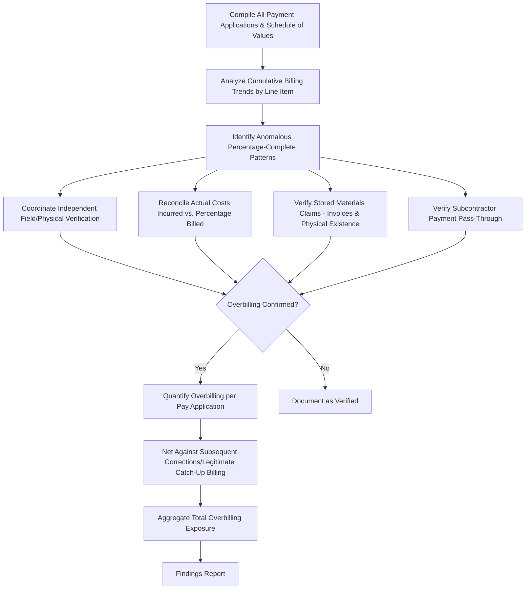

## Progress Billing Fraud

### Overview

Progress billing fraud involves the deliberate misrepresentation of work completed, materials stored, or costs incurred on a construction project in order to obtain payment in excess of what has actually been earned under the contract's payment terms. Because construction projects are typically paid incrementally against a schedule of values or percentage-of-completion basis rather than upon final delivery, progress billing structures create a distinct and recurring fraud exposure throughout the life of a project, separate from the change order and contract fraud schemes addressed elsewhere in this chapter.

### The Progress Billing Mechanism

**Key Points**

- Most construction contracts pay the contractor periodically (typically monthly) based on the **percentage of work completed** relative to the total contract value, using a **schedule of values (SOV)** that allocates the total contract price across defined line items or cost categories (e.g., AIA G702/G703 pay application forms are a widely used industry standard format).
- Payment applications typically require: (1) the percentage or dollar value of work completed to date for each SOV line item, (2) the value of materials stored on-site or in an approved off-site storage location, (3) less retainage withheld (a percentage, commonly 5–10%, held back until substantial/final completion), and (4) less amounts previously billed.
- Because payment is based on **self-reported completion percentages**, subject to owner/architect/engineer certification, the process creates inherent opportunity for overstatement absent rigorous independent verification.

$$\text{Current Payment Due} = (\text{\% Complete} \times \text{SOV Line Item Value}) + \text{Stored Materials} - \text{Retainage} - \text{Previous Billings}$$

### Common Progress Billing Fraud Schemes

- **Overstated percentage of completion:** billing for a higher completion percentage than actually achieved for a given SOV line item, often across multiple pay applications cumulatively, so the overstatement compounds over the project duration.
- **Front-loading (unbalanced billing):** allocating disproportionately high values to early-stage SOV line items (e.g., mobilization, site preparation) relative to their actual cost, allowing the contractor to receive cash flow ahead of actual cost incurrence — while not always fraudulent (some front-loading is a common, if aggressive, cash-flow management practice), extreme front-loading can indicate an intent to extract funds disproportionate to progress, creating owner exposure if the contractor later defaults or is terminated before completing the undervalued later-stage work.
- **Fictitious stored materials claims:** billing for materials represented as purchased and stored (on-site or off-site) that do not exist, were never purchased, or were already installed and billed under a separate line item.
- **Double billing across line items:** billing the same physical work or materials under multiple SOV categories, or across both the base contract and a related change order, as addressed in change order fraud but also occurring purely within base contract progress billing.
- **Retainage manipulation:** improperly calculating or withholding retainage inconsistent with contract terms, or a contractor's own subcontractors mischarging retainage to preserve cash flow.
- **Subcontractor pass-through billing without payment:** general contractor bills and collects payment for subcontractor work, represents to the owner that subcontractors have been or will be paid, but fails to actually pay the subcontractor — creating lien exposure for the owner and misrepresenting the true payment status of the project.

### Detection Indicators ("Red Flags")

| Red Flag Category | Specific Indicators |
| --- | --- |
| Completion percentage patterns | Reported percentage complete significantly exceeds physical observation or photographic documentation; percentage complete increases inconsistently with labor/material costs actually incurred per job cost records |
| Schedule of values structure | Heavily front-loaded SOV with early line items priced well above reasonable cost estimates relative to later line items |
| Stored materials claims | Large or recurring stored materials claims without corresponding invoices, delivery tickets, or physical verification; stored materials claimed for items with long lead times inconsistent with the project schedule |
|   | Payment application consistency |
| Lien waiver/subcontractor payment | Subcontractor liens filed despite general contractor certification that subcontractors were paid; inconsistencies between conditional and unconditional lien waivers submitted |
| Approval patterns | Pay applications approved by the same reviewer with minimal or no supporting field verification; approval turnaround unusually fast relative to the complexity of the application |

### Investigative Methodology

**Step 1 — Payment Application Population Analysis**

- Compile the complete series of payment applications for the project and analyze cumulative billing trends by SOV line item over time, identifying line items with unusual percentage-complete trajectories or values inconsistent with the overall project timeline.

**Step 2 — Physical/Field Verification**

- Coordinate with an independent engineer, architect, or construction consultant to perform **physical inspection and quantity verification** of claimed completed work, comparing actual observed progress against the percentages billed for the corresponding period — often the single most direct method of detecting overstated completion claims.
- For stored materials claims, verify physical existence and condition of materials through site inspection (for on-site storage) or third-party warehouse confirmation (for off-site storage), along with supporting purchase invoices and delivery documentation.

**Step 3 — Cost Reconciliation**

- Compare the contractor's **actual incurred costs** (from job cost ledgers, payroll, and subcontractor/vendor invoices) to the percentage of completion billed, since actual cost incurrence should reasonably correlate with legitimate progress — a line item billed at 80% complete with only 40% of budgeted cost actually incurred is a strong indicator of overbilling (absent a documented, favorable cost variance explanation).

$$\text{Cost-to-Complete Ratio Check} = \frac{\text{Actual Costs Incurred to Date}}{\text{Budgeted Cost for Line Item}} \text{ vs. } \text{Billed \% Complete}$$

**Step 4 — Subcontractor Payment Verification**

- Reconcile amounts the general contractor certified as paid to subcontractors against actual subcontractor bank deposits and lien waiver documentation, identifying any gap between billed/collected amounts and amounts actually disbursed downstream.

**Step 5 — Damages Quantification**

- Aggregate the identified overbilling across all flagged pay applications and SOV line items, netting any subsequent corrections, back-charges, or legitimate catch-up billings in later periods to avoid overstating the net fraud exposure.

### Process Flow

### Illustrative Example

An owner's forensic accountant is engaged after a contractor is terminated for cause at 75% of the contracted project duration, with payment applications reflecting 92% cumulative completion billed and paid.

- **Field verification** by an independent engineer estimates actual physical completion at approximately 68% at the time of termination — a 24-percentage-point gap between billed and actual completion.
- **Cost reconciliation** confirms the discrepancy: actual job costs incurred by the contractor (obtained via subpoena of the contractor's accounting records in the subsequent dispute) total approximately 65% of the total budgeted contract cost, closely corroborating the independently observed 68% physical completion and materially below the 92% billed.
- **Stored materials review** finds $340,000 in claimed stored materials for specialty HVAC equipment with no corresponding delivery documentation, purchase order, or physical evidence of the equipment on-site or at any verifiable storage location — indicating this entire stored materials claim was fictitious.
- **Quantified overbilling:** applying the 24-percentage-point completion gap to the total contract value of $14,000,000: $0.24 \times 14{,}000{,}000 = \$3{,}360{,}000$ in overstated completion billing, **plus** the separately identified $340,000 fictitious stored materials claim, for a combined quantified overbilling exposure of approximately **$3,700,000**, before consideration of retainage held (which partially mitigates the owner's net cash exposure) and any offsetting legitimate claims the contractor may assert regarding termination-related costs.

### Interaction with Surety and Lien Claims

- Progress billing fraud frequently surfaces in connection with **payment bond and performance bond claims**, where a surety investigating a contractor default performs similar billing reconciliation work to determine its own exposure and any recovery rights against the contractor.
- Overbilling that results in subcontractors going unpaid despite owner payment to the general contractor commonly triggers **mechanic's lien claims** by unpaid subcontractors and suppliers, requiring reconciliation of the owner's total payments, the general contractor's certified subcontractor payment status, and actual subcontractor payment records to determine the owner's lien exposure and any double-payment risk.
- Where public funds are involved, confirmed progress billing fraud may similarly implicate False Claims Act or analogous statutory exposure, as discussed in the context of change order fraud schemes.

### Common Pitfalls in Progress Billing Fraud Investigations

- Relying solely on documentary review of pay applications without independent physical/field verification, missing overstated completion claims that are only detectable through direct observation.
- Failing to reconcile actual cost incurrence against billed percentage complete, missing a key corroborating (or contradicting) data point available from the contractor's own job cost records.
- Overlooking subcontractor payment verification, missing pass-through billing schemes that create owner lien exposure independent of the general contractor's own billing accuracy.
- Treating aggressive front-loading as automatically fraudulent without assessing whether it reflects legitimate cash-flow practice versus a scheme designed to extract disproportionate value before contractor default or termination.
- Failing to net subsequent period corrections or legitimate catch-up billing when quantifying total overbilling exposure, overstating the net fraud damages.

**Related Topics**

- Change order and contract fraud schemes
- Construction cost overrun and claims analysis
- Delay and disruption damages analysis
- Surety bond claims and performance/payment bond investigations
- Mechanic's lien claims and subcontractor payment tracing
- False Claims Act exposure in publicly funded construction projects