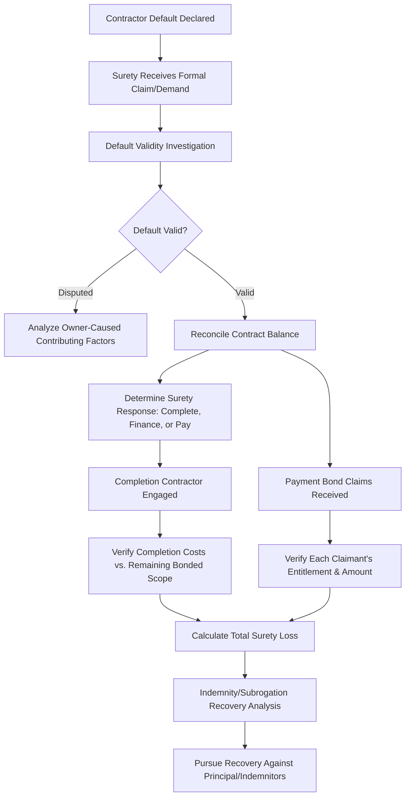

## Surety and Performance Bond Claims

### Overview

Surety and performance bond claims arise when a contractor defaults on a bonded construction obligation, triggering the surety's contractual obligations under the performance bond, payment bond, or both. Forensic accountants play a central role in these engagements — whether retained by the surety, the obligee (owner), or the principal (contractor) — in quantifying default-related costs, reconciling contract balances, tracing bonded funds, and supporting the surety's claims handling and subrogation recovery process.

### The Surety Bond Framework

**Key Points**

- **Performance Bond:** guarantees the obligee (typically the project owner) that the bonded work will be completed in accordance with the contract if the principal (contractor) defaults; the surety's obligation is generally to complete the work, arrange for completion, or pay damages up to the bond penal sum.
- **Payment Bond:** guarantees that subcontractors, laborers, and material suppliers on the bonded project will be paid; protects these parties (who typically lack lien rights against public property) by giving them a direct claim against the bond.
- **Penal Sum:** the maximum dollar amount of the surety's liability under the bond, typically set at 100% of the original contract value, though this is a ceiling rather than an automatic payout amount — the surety's actual liability is determined by the actual costs/damages properly attributable to the default, subject to that cap.
- **Indemnity Agreement:** a separate contract (typically executed by the contractor and often personally by its principals) obligating the contractor/indemnitors to reimburse the surety for all losses, expenses, and fees incurred in connection with bond claims — this indemnity obligation is a critical driver of the surety's own investigative and cost-control incentives.
- **Three-Party Relationship:** the surety-principal-obligee structure differs fundamentally from insurance in that the surety expects to be made whole through indemnity rather than absorbing losses as a risk pool, which shapes the surety's claims investigation approach.

### Triggering Events and the Default/Termination Process

- A performance bond claim is typically triggered by the obligee's **declaration of default** and **formal demand** on the surety, following the contractual default and termination procedures specified in the underlying construction contract (which usually require notice, an opportunity to cure, and often a pre-termination meeting).
- Sureties generally have contractual options upon a valid default declaration, which may include: (1) financing the existing contractor to complete the work, (2) arranging for a **completion contractor** to finish the work under a new completion agreement, (3) tendering a completion contractor for the obligee's selection, or (4) paying the obligee's damages up to the penal sum without completing the work directly — the specific options and sequence depend on the bond form and applicable law. [Unverified — specific procedural requirements and available surety options vary by bond form (e.g., AIA A312) and jurisdiction; confirm applicable bond language and law.]
- Before responding to a claim, the surety typically conducts (often through a forensic accountant and a construction consultant) an **investigation into the validity of the default declaration**, since a wrongful or improper termination by the obligee can affect the surety's obligations.

### The Forensic Accountant's Role in Surety Claims

**For the Surety**

- **Default validity assessment:** analyzing whether the contractor was genuinely in material default under the contract terms, or whether the termination itself was improper (e.g., owner-caused delays or non-payment contributed materially to the contractor's performance issues).
- **Contract balance reconciliation:** determining the "contract balance" remaining at the time of default — the unpaid contract value less amounts already earned/paid — which represents funds theoretically available to fund completion before the surety's bond penal sum is accessed.

  $$\text{Contract Balance} = \text{Total Contract Value (incl. approved changes)} - \text{Amount Already Paid to Principal}$$
- **Completion cost verification:** reviewing and testing the reasonableness of costs incurred by a completion contractor, ensuring completion costs reflect the remaining bonded scope rather than betterment, upgrades, or unrelated work.
- **Payment bond claim verification:** for each subcontractor/supplier payment bond claim, verifying the claimant actually furnished labor/materials to the bonded project, the amount claimed reconciles to underlying invoices and delivery records, and payments were not already received from the principal.
- **Subrogation and indemnity recovery analysis:** quantifying the surety's total loss for pursuit of indemnity recovery against the contractor/indemnitors, and analyzing the contractor's assets and financial condition to assess recovery prospects (methodology overlapping with general asset tracing techniques).

**For the Obligee (Owner)**

- Quantifying actual damages resulting from the contractor's default (delay costs, increased completion costs, consequential damages where recoverable) to support the demand against the surety.
- Reconciling amounts paid to the defaulted contractor against work actually completed (overlapping directly with progress billing fraud investigation methodology), since overpayment to the defaulted contractor can reduce the funds theoretically available and complicate the surety's completion obligations.

**For the Principal (Contractor)**

- Where the contractor disputes the validity of the default or the surety's/obligee's damages calculation, supporting the contractor's position regarding entitlement, causation, and the reasonableness of costs — often overlapping with standard construction claims and delay/disruption damages methodology.

### Contract Balance and Completion Cost Analysis

The surety's ultimate financial exposure is generally driven by the relationship between the remaining contract balance and the actual cost to complete the bonded work:

$$\text{Surety Exposure (Performance Bond)} = \max(0, \text{Actual Completion Cost} - \text{Remaining Contract Balance}) + \text{Delay Damages (if applicable)}$$

- If the remaining contract balance is sufficient to fund completion at reasonable market cost, the surety's net exposure under the performance bond may be minimal even though a default has clearly occurred.
- Where the original contract was significantly underpriced (a "bad bid") or where substantial defective work must be corrected before completion can proceed, the completion cost frequently exceeds the remaining contract balance, creating direct surety exposure up to the penal sum.
- Forensic accountants scrutinize completion contractor costs carefully, since completion contracts negotiated under time pressure post-default (often without full competitive bidding) can carry inflated pricing that the surety may seek to challenge or negotiate down.

### Process Flow

### Payment Bond Claim Verification

- Each payment bond claimant (subcontractor, supplier, or lower-tier party depending on the bond's privity requirements) must generally establish: (1) it furnished labor or materials that were actually incorporated into or consumed on the bonded project, (2) the claimed amount is unpaid, and (3) the claim was submitted within the bond's applicable notice and limitations periods.
- Forensic verification typically includes:
  - Reconciling the claimant's invoices/billing to the principal's job cost records and subcontract agreements.
  - Confirming no duplicate or overlapping claims exist between multiple tiers of subcontractors for the same underlying work.
  - Verifying amounts previously paid by the principal to avoid double payment by the surety.
  - Assessing the claimant's compliance with statutory notice requirements applicable to the specific bond (which can vary significantly, particularly for public project payment bonds under statutes analogous to the federal Miller Act).

### Illustrative Example

A general contractor is terminated for cause on a $9.5 million public building project after falling significantly behind schedule and exhibiting signs of financial distress. The surety receives a performance bond claim from the owner and multiple payment bond claims from subcontractors.

**Contract Balance Reconciliation:**

- Total contract value including approved change orders: $9,700,000.
- Amount previously paid to the defaulted contractor per owner's payment records: $6,200,000.
- **Remaining contract balance: $3,500,000.**

**Completion Cost Verification:**

- A completion contractor is engaged, providing a completion proposal of $4,650,000 for the remaining scope.
- The surety's forensic accountant, working with an independent estimator, reviews the completion scope and finds $310,000 of the proposal reflects upgraded finishes not included in the original bonded scope (owner-requested betterment) — this amount is excluded from the surety's completion cost responsibility.
- **Adjusted verified completion cost: $4,650,000 − $310,000 = $4,340,000.**
- **Performance bond exposure (before delay damages):** $4{,}340{,}000 - 3{,}500{,}000 = \$840{,}000$.

**Payment Bond Claims:**

- Total payment bond claims received from subcontractors/suppliers: $1,150,000.
- Verification against job cost records and prior payment history confirms $980,000 as valid, properly documented, unpaid claims; $170,000 is disallowed due to duplicate billing between a subcontractor and its lower-tier supplier for the same materials.
- **Verified payment bond exposure: $980,000.**

**Total Surety Exposure (before delay damages and recovery efforts):** $840{,}000 + 980{,}000 = \$1{,}820{,}000$, against a bond penal sum of $9,700,000 — well within the bond limit, and subject to further reduction through the surety's subsequent indemnity recovery efforts against the defaulted contractor and its indemnitors.

### Common Pitfalls in Surety Claims Investigation

- Accepting a completion contractor's proposal without independently verifying it reflects only the original bonded scope, missing embedded betterment or unrelated work that inflates apparent surety exposure.
- Failing to verify payment bond claims against underlying job cost and prior payment records, risking duplicate payment across subcontractor tiers.
- Overlooking the default validity investigation, potentially exposing the surety to liability where the termination itself was procedurally or substantively improper.
- Inadequate contract balance reconciliation, particularly where change orders, back-charges, or liquidated damages assessments complicate the calculation.
- Underestimating the importance of the indemnity agreement and available indemnitor assets in assessing the surety's true net economic exposure after recovery efforts.

**Related Topics**

- Progress billing fraud
- Construction cost overrun and claims analysis
- Delay and disruption damages analysis
- Hidden asset and lifestyle analysis (indemnitor asset tracing overlap)
- Mechanic's lien claims and payment bond statutory notice requirements
- Contractor financial distress indicators and default risk assessment