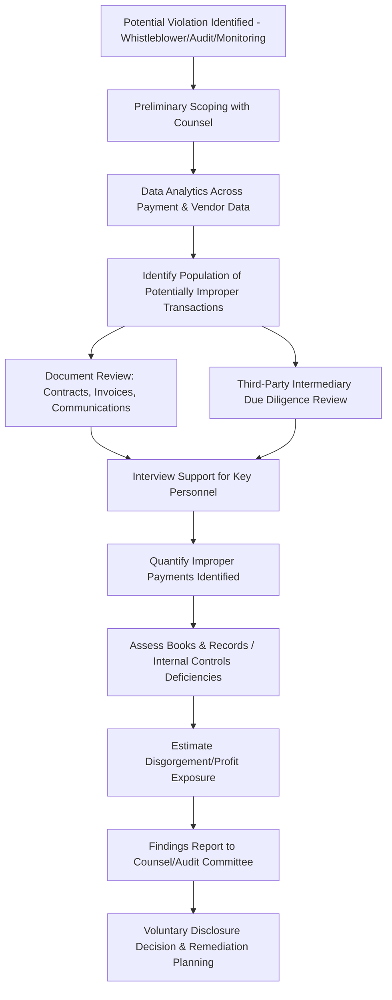

## Foreign Corrupt Practices Act Provisions

### Overview

The Foreign Corrupt Practices Act (FCPA) is a U.S. federal statute enacted in 1977 that prohibits bribery of foreign officials to obtain or retain business, and separately imposes accounting and internal controls requirements on issuers of U.S. securities. Forensic accountants play a central role in FCPA compliance and investigations, applying transaction testing, internal controls assessment, and third-party due diligence review to detect and quantify potential violations.

### The Two Core Components

**Key Points**

- The FCPA consists of two substantively distinct sets of provisions, enforced by different agencies and subject to different jurisdictional and evidentiary requirements:
  - **Anti-Bribery Provisions:** prohibit corruptly offering, paying, promising, or authorizing payment of anything of value to a foreign official to influence an official act or secure improper business advantage; enforced primarily by the **Department of Justice (DOJ)**, with criminal penalties available.
  - **Accounting Provisions (Books and Records and Internal Controls):** apply specifically to **issuers** (companies with securities registered under the Exchange Act, or required to file periodic reports), requiring accurate books and records and adequate internal accounting controls; enforced primarily by the **Securities and Exchange Commission (SEC)**, with both civil and, in willful cases, criminal exposure.
- A company can violate the accounting provisions even absent any underlying bribery — for example, through inaccurate recordkeeping alone — and can equally face anti-bribery liability without an accounting provisions violation if the entity is not an issuer (e.g., a purely domestic concern or foreign national acting within U.S. territory).

### Anti-Bribery Provisions: Elements

To establish an anti-bribery violation, enforcement authorities generally must show:

1. **A covered person or entity** — issuers, domestic concerns (U.S. persons/entities), or any person while in the territory of the United States, and, under certain provisions, officers, directors, employees, agents, or stockholders acting on behalf of these covered parties.
2. **Corrupt intent** — the payment or offer was made with a corrupt intent to influence the recipient's official action or secure an improper advantage (not merely to expedite a routine, non-discretionary governmental action — see facilitating payments exception below).
3. **Payment, offer, promise, or authorization** of money or **anything of value** — a broad category encompassing not only cash but gifts, travel, entertainment, charitable contributions made at an official's direction, job offers to an official's relatives, and other non-cash benefits.
4. **To a foreign official** — broadly defined to include officers/employees of foreign governments or their departments/agencies/instrumentalities (including state-owned or state-controlled enterprises, where the entity's degree of government ownership/control is analyzed on a case-specific basis), foreign political parties/officials, candidates for foreign political office, and international organization officials (e.g., UN, World Bank).
5. **For the purpose of obtaining or retaining business, or securing an improper advantage** — the "business purpose" test, generally interpreted broadly by enforcement authorities to include not only new contract awards but favorable regulatory treatment, tax benefits, customs clearance, and similar advantages. [Unverified — specific application and judicial interpretation of these elements, particularly the scope of "foreign official" as applied to state-owned enterprise employees, has been subject to ongoing litigation and should be confirmed against current case law.]

### The Facilitating (Grease) Payments Exception

- A narrow exception exists for payments made to expedite or secure the performance of a **routine governmental action** that the official would be required to perform regardless (e.g., processing routine paperwork, obtaining a permit or license to which the payer is legitimately entitled, providing police protection or mail service) — this exception does **not** extend to payments to influence a discretionary decision (e.g., a decision to award a contract or grant a license the payer would not otherwise be entitled to).
- This exception is narrowly construed and frequently misapplied by companies in practice; many companies have adopted internal policies eliminating reliance on this exception entirely given its narrow scope, the difficulty of reliably distinguishing routine from discretionary action in practice, and the fact that many other countries' anti-corruption laws (e.g., the UK Bribery Act) do not recognize an equivalent exception at all. [Inference — company-specific policy choices regarding reliance on this exception vary and reflect risk tolerance rather than a legal requirement to eliminate the exception.]

### Affirmative Defenses

- **Local Law Defense:** the payment was lawful under the written laws of the foreign official's country (rarely successful in practice, since few countries have laws affirmatively legalizing bribery of their own officials).
- **Reasonable and Bona Fide Business Expenditure Defense:** the payment constituted a reasonable, bona fide expenditure directly related to the promotion, demonstration, or explanation of products/services, or execution/performance of a contract (e.g., reasonable travel and lodging costs for a foreign official to inspect company facilities) — subject to close scrutiny regarding the reasonableness of the expenditure and whether it was disguised personal benefit.

### Accounting Provisions

**Books and Records Provision**

- Requires issuers to make and keep books, records, and accounts that, **in reasonable detail, accurately and fairly reflect** the transactions and dispositions of the issuer's assets.
- Violations commonly arise from mischaracterizing bribe payments as legitimate business expenses (consulting fees, commissions, marketing expenses, "miscellaneous" or discretionary funds) in the company's books, even where the underlying bribery itself might otherwise fall outside strict anti-bribery provision jurisdiction (e.g., payments made by a foreign subsidiary not independently reachable under the anti-bribery provisions).

**Internal Accounting Controls Provision**

- Requires issuers to devise and maintain a system of internal accounting controls sufficient to provide reasonable assurances that transactions are executed in accordance with management's authorization, recorded properly to permit accurate financial statement preparation, and that access to assets is permitted only in accordance with management's authorization.
- SEC enforcement actions frequently cite internal controls deficiencies such as: inadequate due diligence on third-party agents/intermediaries, insufficient documentation requirements for expense reimbursements involving government interactions, inadequate approval thresholds for gifts/entertainment/travel involving officials, and insufficient monitoring of high-risk payment channels (e.g., cash payments, payments to offshore accounts, payments routed through intermediaries in high-corruption-risk jurisdictions).

### Third-Party Intermediary Risk

- A substantial proportion of FCPA enforcement actions involve payments made **indirectly** through third parties — agents, distributors, consultants, joint venture partners, or local "fixers" — rather than direct payments by the company itself, since liability generally extends to payments made "knowing" that all or a portion will be passed to a foreign official (including situations of willful blindness/conscious disregard, not only actual knowledge).
- Forensic accountants performing FCPA-related due diligence and investigation typically scrutinize third-party relationships for red flags including:
  - Commission or fee rates significantly above market/industry norms for the services purportedly rendered.
  - Vague or minimal contractual scope of work with limited or no documented deliverables.
  - Payment requests routed to accounts in jurisdictions unrelated to where services were performed, or to personal rather than business accounts.
  - Close personal or family relationships between the intermediary and government officials with decision-making authority over the relevant business.
  - Intermediary's own reluctance to complete standard due diligence questionnaires or provide beneficial ownership information.
  - Requests for payment in cash or through unusual payment structures inconsistent with the intermediary's normal business practices.

### The Forensic Accountant's Role in FCPA Matters

**Proactive Compliance Support**

- **Risk assessment:** evaluating a company's geographic footprint, industry sector, third-party relationship structure, and transaction types to identify areas of elevated FCPA exposure.
- **Third-party due diligence:** reviewing prospective and existing agents, distributors, and consultants against the red flag indicators above, often supported by background investigation databases and public records searches.
- **Transaction testing:** sample-based or data-analytics-driven testing of expense reports, gift/entertainment logs, and payments to government-adjacent counterparties for compliance with company policy and FCPA requirements.
- **Internal controls gap assessment:** evaluating existing approval workflows, documentation requirements, and monitoring mechanisms against the accounting provisions' requirements.

**Internal Investigations**

- Where a potential violation is identified (via whistleblower report, internal audit finding, or routine monitoring), forensic accountants typically lead or support the investigative workstream, including:
  - Data analytics across payment, expense, and vendor master data to identify the scope of potentially improper payments beyond the initially identified transaction(s).
  - Document review (contracts, invoices, email communications, approval records) to establish the factual pattern and intent indicators.
  - Interview support, providing financial context and follow-up questions for witness interviews conducted by counsel.
  - Quantification of the total improper payment exposure and any associated improperly obtained business/profit (relevant to disgorgement calculations).

### Process Flow — FCPA Investigation

### Disgorgement and Penalty Exposure

- FCPA resolutions frequently involve **disgorgement** of profits obtained through the improper conduct, in addition to civil and/or criminal monetary penalties, requiring the forensic accountant to quantify the profits attributable to business obtained through bribery — a causation-intensive exercise analogous to lost profits/unjust enrichment quantification in other forensic contexts.
- Corporate resolutions frequently take the form of **Deferred Prosecution Agreements (DPAs)** or **Non-Prosecution Agreements (NPAs)**, often requiring the company to engage an **independent compliance monitor**, self-report periodically, and remediate identified internal controls deficiencies over a defined term.
- The DOJ and SEC have both published guidance regarding voluntary self-disclosure, cooperation, and remediation credit, which materially affects the ultimate penalty outcome and is a key strategic consideration informed by the forensic accountant's investigative findings. [Unverified — specific current penalty guidelines, self-disclosure policies, and enforcement priorities change periodically; verify against current DOJ/SEC published guidance.]

### Illustrative Example

A U.S.-based issuer's internal audit function flags unusually high "consulting fees" paid to a local agent in a foreign subsidiary's jurisdiction, coinciding with the subsidiary's successful award of several government infrastructure contracts.

- **Data analytics** across three years of vendor payment data show the agent received $2.8 million in fees, structured as a percentage of each contract awarded, with the percentage rate approximately triple the documented market rate for comparable legitimate agent services in the region.
- **Contract and invoice review** finds the agent's scope of work is vaguely described as "government relations and business development support," with no specific deliverables, work product, or documented services rendered corresponding to the fee amounts.
- **Due diligence file review** reveals the agent was never subjected to the company's standard third-party due diligence questionnaire, and subsequent background research reveals the agent is the brother-in-law of a senior procurement official at the government agency awarding the contracts.
- **Books and records analysis** confirms these payments were recorded simply as "professional fees" in the general ledger, without any internal documentation connecting the payments to the specific contract awards or identifying the close relationship between the agent and the procurement official — supporting both a potential anti-bribery provision violation (corrupt payment to influence contract awards, made through an intermediary with knowledge/willful blindness as to the likely onward payment or benefit) and a books and records violation (mischaracterized recordkeeping).
- **Quantified exposure:** the $2.8 million in agent payments represents the population under investigation; the government contracts awarded during the relevant period totaled $47 million in revenue, requiring further profit-margin analysis to estimate the potential disgorgement exposure attributable to the improperly obtained business.

### Common Pitfalls in FCPA Compliance and Investigation Work

- Relying on the facilitating payments exception for payments that in fact relate to discretionary governmental decisions rather than truly routine, non-discretionary actions.
- Inadequate third-party due diligence, particularly failing to identify beneficial ownership or close relationships between intermediaries and government officials.
- Treating the books and records/internal controls provisions as secondary to the anti-bribery provisions, when in practice many enforcement actions and voluntary disclosures center primarily on accounting provision deficiencies.
- Conducting transaction testing using only keyword searches or superficial sampling, missing sophisticated concealment through mischaracterized expense categories or split transactions designed to stay below approval thresholds.
- Failing to properly scope the investigation beyond the initially identified transaction(s), missing a broader pattern that data analytics across the full payment population might reveal.

**Related Topics**

- UK Bribery Act and comparative international anti-corruption frameworks
- Third-party due diligence program design and risk-based monitoring
- Books and records and internal controls assessment methodology
- Disgorgement and unjust enrichment damages quantification
- Whistleblower programs and internal investigation protocols
- Deferred prosecution agreements and independent compliance monitorships