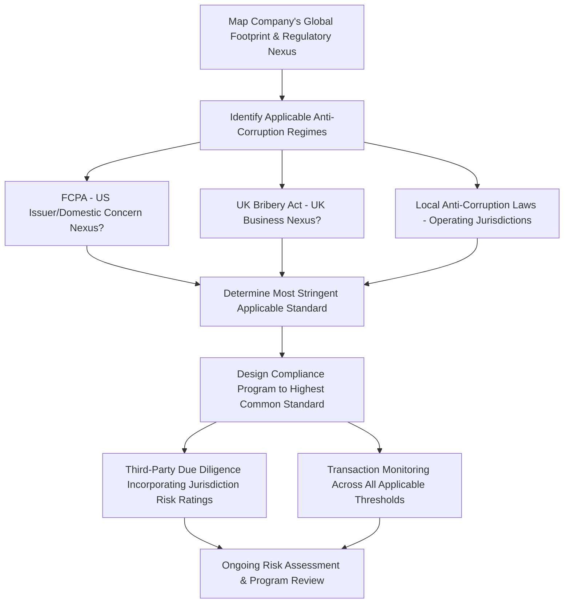

## UK Bribery Act and Other Global Anti-Corruption Regimes

### Overview

While the U.S. Foreign Corrupt Practices Act was the first modern comprehensive anti-bribery statute with extraterritorial reach, a growing body of national and multilateral anti-corruption laws now governs cross-border business conduct. Forensic accountants supporting multinational compliance programs and investigations must understand these overlapping — and sometimes conflicting — regimes, since a single set of facts can trigger simultaneous exposure under multiple jurisdictions' laws.

### The UK Bribery Act 2010

**Key Points**

- Widely regarded as one of the most stringent anti-corruption statutes globally, the UK Bribery Act 2010 covers **both public and private sector bribery**, unlike the FCPA's focus on foreign officials.
- **Four principal offenses:**
  1. **Section 1 — Offering, promising, or giving a bribe** (active bribery), applicable to bribery of any person, not limited to government officials.
  2. **Section 2 — Requesting, agreeing to receive, or accepting a bribe** (passive bribery).
  3. **Section 6 — Bribery of a foreign public official**, a standalone offense analogous to (but broader than) the FCPA's anti-bribery provisions, notably **without** a facilitating payments exception and **without** a "business purpose" limitation requiring the payment be tied to obtaining/retaining business.
  4. **Section 7 — Failure of a commercial organization to prevent bribery**, a strict liability corporate offense triggered when a person associated with the organization bribes another person intending to benefit the organization, subject to the organization's own **"adequate procedures" defense**.
- The Section 7 corporate offense is a defining feature of the Act: unlike the FCPA, which generally requires proof of corporate knowledge or willful blindness for corporate liability, Section 7 liability attaches automatically upon an associated person's bribery unless the organization can affirmatively demonstrate it had adequate anti-bribery procedures in place.

**No Facilitating Payments Exception**

- The UK Bribery Act does not recognize any exception for facilitating/grease payments, in contrast to the FCPA — even small payments to expedite routine governmental action can constitute an offense under the Act, requiring multinational companies with both FCPA and Bribery Act exposure to apply the stricter standard.

**Extraterritorial Jurisdiction**

- The Act applies to conduct by UK companies and UK nationals/residents anywhere in the world, and, critically, the Section 7 corporate offense can apply to **any company that carries on business, or part of a business, in the UK**, regardless of where the underlying bribery occurred or the company's jurisdiction of incorporation — creating extraterritorial exposure for many non-UK multinational companies with even limited UK operations. [Unverified — the precise scope of what constitutes "carrying on business" in the UK for jurisdictional purposes has been subject to judicial interpretation and should be confirmed against current guidance and case law.]

**The Adequate Procedures Defense**

- UK Ministry of Justice guidance identifies six principles generally used to assess adequate procedures: proportionate procedures, top-level commitment, risk assessment, due diligence, communication (including training), and monitoring and review.
- This framework has become a widely referenced benchmark for anti-bribery compliance program design even outside strictly UK-exposed organizations, given its detailed and practical structure. [Inference — while widely referenced as good practice, the specific "adequate procedures" standard is a UK legal defense and does not itself constitute a universal compliance requirement in other jurisdictions.]

### Comparing the FCPA and UK Bribery Act

| Feature | FCPA | UK Bribery Act |
| --- | --- | --- |
| Scope of bribery covered | Foreign public officials only (anti-bribery provisions) | Both public officials and private commercial bribery |
| Facilitating payments exception | Yes (narrow) | No |
| Corporate liability standard | Generally requires knowledge/willful blindness | Section 7: strict liability, subject to adequate procedures defense |
| Business purpose requirement | Yes — must relate to obtaining/retaining business | Section 6: no business purpose limitation required |
| Accounting/books and records provisions | Yes, for issuers | No direct equivalent provision |
| Extraterritorial reach | Issuers, domestic concerns, territorial jurisdiction | UK nexus (incorporation, nationality/residency) or carrying on business in UK |

### Other Significant National Anti-Corruption Regimes

**Key Points — illustrative, not exhaustive, given the continually evolving global regulatory landscape**

- **Brazil — Clean Companies Act (Lei Anticorrupção):** imposes strict/objective corporate liability for bribery of public officials (domestic and foreign), with significant civil and administrative penalties; leniency agreements are available for cooperating companies, administered primarily by Brazil's Comptroller General (CGU) and, for certain matters, state-level authorities.
- **France — Sapin II Law:** requires large companies to implement specific anti-corruption compliance programs (risk mapping, third-party due diligence, internal alert/whistleblower mechanisms, training, disciplinary sanctions, internal controls) and created the French Anti-Corruption Agency (AFA) to monitor compliance; also introduced a French equivalent of the U.S. deferred prosecution agreement mechanism (the CJIP, Convention Judiciaire d'Intérêt Public).
- **China — Anti-Unfair Competition Law and Criminal Law provisions:** prohibit both commercial bribery and bribery of government officials, with enforcement historically involving significant scrutiny of pharmaceutical, medical device, and other sectors with heavy government/state-owned enterprise interaction.
- **India — Prevention of Corruption Act:** primarily targets public official bribery, with amendments expanding corporate liability for bribing public servants.
- **OECD Anti-Bribery Convention:** a multilateral framework (not itself directly enforceable against companies) under which signatory countries commit to criminalizing bribery of foreign public officials in international business transactions, driving convergence — though not uniformity — among many national anti-bribery laws.

### Overlapping Jurisdiction and Multi-Jurisdictional Exposure

- A single set of facts — for example, a U.S.-listed multinational's subsidiary bribing a foreign government official to win a contract in a third country — can simultaneously trigger:
  - FCPA anti-bribery and accounting provisions exposure (if the parent is a U.S. issuer).
  - UK Bribery Act Section 6/Section 7 exposure (if the group carries on business in the UK).
  - The anti-corruption law of the country where the bribery occurred.
  - The anti-corruption law of the bribed official's home country (if different).
- This overlapping exposure has driven a trend toward **coordinated multi-jurisdictional resolutions**, where a company may resolve related conduct with multiple regulators (e.g., DOJ, SEC, UK Serious Fraud Office, and a national authority) simultaneously or in close sequence, often with credit given by one regulator for penalties paid to another to avoid duplicative punishment — though the extent and consistency of such coordination varies by case. [Inference — coordination practices and anti-duplication policies continue to evolve and vary by regulator and specific case circumstances.]

### Forensic Accounting Implications of Multi-Regime Exposure

- **Compliance program design:** forensic accountants supporting compliance function design must account for the **most stringent applicable standard** across all regimes a multinational is subject to — in practice, this frequently means designing policies to the UK Bribery Act's stricter standard (no facilitating payments exception, private-sector bribery coverage) even for companies whose primary regulatory exposure is the FCPA.
- **Investigation scoping:** an internal investigation triggered by a specific incident must consider **all potentially applicable regimes** from the outset, since evidence-gathering, privilege considerations, and potential self-disclosure strategy can differ materially across jurisdictions (e.g., differing legal privilege protections for internal investigation materials in various countries).
- **Risk assessment methodology:** risk-scoring frameworks for third-party due diligence and transaction monitoring should incorporate jurisdiction-specific risk factors (e.g., Transparency International's Corruption Perceptions Index or similar country risk ratings) alongside company-specific factors (industry sector, transaction type, relationship structure).
- **Damages/disgorgement quantification:** where multiple regulators pursue parallel or coordinated resolutions, the forensic accountant may need to support disgorgement or penalty calculations under multiple distinct legal standards simultaneously, requiring careful segregation of the underlying financial data to support each regime's specific calculation methodology.

### Process Flow — Multi-Jurisdictional Risk Assessment

### Illustrative Example — Compliance Program Calibration

A U.S.-headquartered issuer with a UK sales office and operations in Brazil and India is designing its global anti-bribery compliance program.

- **Facilitating payments:** because the company carries on business in the UK (triggering potential Bribery Act Section 7 exposure), the company adopts a **global no-facilitating-payments policy**, even though the FCPA would technically permit narrow facilitating payments for its U.S. operations — calibrating to the stricter UK standard avoids maintaining inconsistent regional policies and reduces the risk of inadvertent Bribery Act exposure.
- **Private commercial bribery:** because Section 1/2 of the Bribery Act covers private-sector bribery (not just government officials), the company's gift/entertainment and third-party due diligence policies are extended to cover interactions with private commercial counterparties (e.g., private-sector customer procurement officials), not solely government officials — an area the FCPA alone would not require.
- **Third-party due diligence intensity:** the company applies enhanced due diligence procedures for intermediaries in Brazil and India, incorporating both countries' specific corruption risk ratings and local law requirements (e.g., Brazil's Clean Companies Act strict liability standard, which increases the importance of robust third-party vetting given the reduced ability to rely on a "lack of knowledge" defense).
- **Books and records:** because the parent is a U.S. issuer, the FCPA's accounting provisions apply globally to the consolidated entity's books and records, requiring the compliance program's internal controls testing to extend to the UK, Brazilian, and Indian subsidiaries' recordkeeping even though those jurisdictions' own local anti-corruption laws may not independently impose an equivalent accounting provision.

This calibration exercise — identifying the most stringent applicable requirement across the company's full jurisdictional footprint for each specific compliance element — is the core methodological task forensic accountants support in multi-jurisdictional anti-corruption program design.

### Common Pitfalls in Multi-Jurisdictional Anti-Corruption Work

- Designing a compliance program solely to FCPA standards without accounting for the UK Bribery Act's broader scope (private bribery, no facilitating payments exception) where UK nexus exists.
- Failing to identify UK "carrying on business" nexus for non-UK-headquartered multinationals with limited but present UK operations, missing Section 7 corporate offense exposure entirely.
- Treating all national anti-corruption regimes as substantively equivalent to the FCPA, missing jurisdiction-specific features (e.g., Brazil's strict liability standard, France's Sapin II specific procedural requirements) that materially affect both compliance program design and investigation strategy.
- Inadequate coordination of internal investigation strategy across jurisdictions, risking inconsistent findings, privilege waiver issues, or duplicative/conflicting voluntary disclosure decisions across regulators.
- Overlooking country-specific risk-rating tools and local regulatory guidance when calibrating third-party due diligence intensity across a diverse jurisdictional footprint.

**Related Topics**

- Foreign Corrupt Practices Act provisions
- Third-party due diligence program design and risk-based monitoring
- Deferred prosecution agreements and coordinated multi-regulator resolutions
- Whistleblower programs and internal investigation protocols across jurisdictions
- Disgorgement and unjust enrichment damages quantification
- Corporate compliance program effectiveness assessment methodology