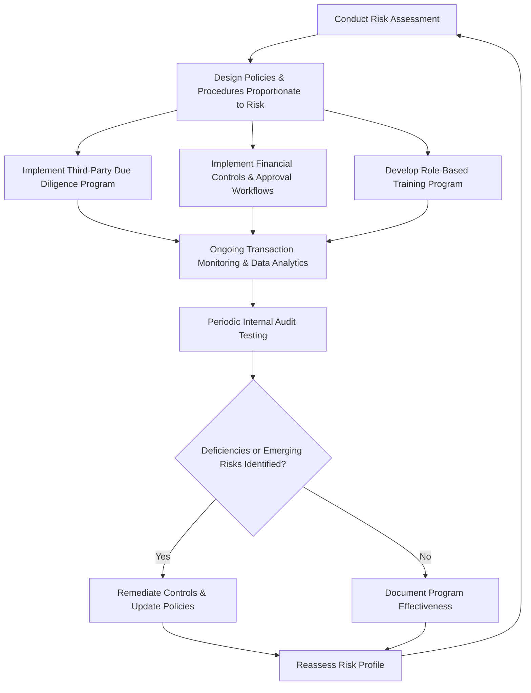

## Anti-Corruption Compliance Program Design

### Overview

Anti-corruption compliance program design is the process of building and maintaining an organizational framework of policies, controls, training, and monitoring mechanisms intended to prevent, detect, and remediate bribery and corruption risk. Forensic accountants contribute financial controls expertise, data analytics capability, and risk assessment methodology to this multidisciplinary effort, which also typically involves legal, internal audit, and compliance function stakeholders.

### Regulatory Guidance Frameworks Underlying Program Design

**Key Points**

- **DOJ/SEC "Resource Guide" and Evaluation of Corporate Compliance Programs:** U.S. enforcement authorities have published guidance (including a specific DOJ memorandum on evaluating corporate compliance programs) outlining the factors prosecutors consider in assessing program effectiveness, commonly organized around three core questions: (1) Is the program well designed? (2) Is it applied earnestly and in good faith (adequately resourced and empowered)? (3) Does it work in practice?
- **UK Ministry of Justice "Six Principles":** as discussed in the context of the UK Bribery Act's adequate procedures defense — proportionate procedures, top-level commitment, risk assessment, due diligence, communication/training, and monitoring/review — widely used as a design benchmark even beyond UK-exposed organizations.
- **ISO 37001 (Anti-Bribery Management Systems):** an international standard providing a certifiable management systems framework for anti-bribery compliance, covering similar core elements (leadership, risk assessment, due diligence, controls, training, reporting, investigation, and continual improvement).
- While these frameworks differ in specific terminology and emphasis, they converge on a common set of core structural elements, discussed below. [Unverified — specific current regulatory guidance documents are periodically updated; verify against the most current published DOJ, SEC, UK MOJ, and ISO guidance.]

### Core Structural Elements of an Effective Program

**1. Risk Assessment**

- The foundational step, since a compliance program's design and resource allocation should be proportionate to the company's actual risk profile rather than a generic, one-size-fits-all approach.
- Key risk factors typically assessed: geographic footprint (operating in higher corruption-risk jurisdictions), industry sector (heavily regulated or government-facing sectors carry elevated risk), business model (reliance on third-party intermediaries, government customers/counterparties, licensing/permitting-intensive operations), and historical incident/enforcement history (own or industry peers').
- Forensic accountants often support risk assessment through **data-driven risk scoring**, incorporating transaction volume/value by jurisdiction, third-party spend concentration, and payment channel characteristics (cash-intensive operations, high volume of discretionary/miscellaneous expense categories) into a quantified risk heat map.

**2. Policies and Procedures**

- Written anti-corruption policy addressing prohibited conduct (bribery, facilitating payments position, gifts/entertainment limits, charitable/political contributions involving government-adjacent recipients), tailored to the company's risk assessment rather than a generic template.
- Supporting procedures translating policy into operational practice: approval workflows and dollar thresholds for gifts/entertainment/travel, expense documentation requirements, third-party engagement and payment approval processes, and escalation protocols for red-flag transactions.

**3. Third-Party Due Diligence**

- A risk-tiered due diligence process for agents, distributors, consultants, joint venture partners, and other intermediaries, typically scaled to the intermediary's risk profile:

| Risk Tier | Typical Due Diligence Scope |
| --- | --- |
| Low risk (e.g., routine vendor, low-risk jurisdiction, no government interaction) | Standard onboarding questionnaire, sanctions/watchlist screening |
| Medium risk (e.g., sales agent in moderate-risk jurisdiction) | Enhanced questionnaire, beneficial ownership verification, adverse media search, references |
| High risk (e.g., agent with government interaction in high-corruption-risk jurisdiction, or compensation structure tied to specific contract awards) | Full background investigation, in-person or detailed interview, contract terms review, ongoing monitoring, senior management approval |

- Due diligence should be **refreshed periodically** (not merely a one-time onboarding exercise), particularly for high-risk relationships, and should incorporate red flags of the type discussed in FCPA-specific third-party risk analysis (above-market commission rates, vague scope of work, unusual payment routing).

**4. Financial Controls and Approval Workflows**

- Segregation of duties over payment initiation, approval, and reconciliation for transactions involving third-party intermediaries and government-adjacent counterparties.
- Defined approval thresholds and escalation requirements for gifts, entertainment, travel, and charitable/political contributions, with lower thresholds and additional review layers for interactions involving government officials.
- Controls specifically addressing high-risk payment channels: restrictions or enhanced approval for cash payments, payments to accounts in jurisdictions unrelated to the underlying transaction, and payments to accounts not matching the contracted counterparty's name.

**5. Training and Communication**

- Role-based training (e.g., enhanced training for sales, procurement, and government affairs personnel operating in higher-risk contexts, versus general awareness training for the broader employee population).
- Communication of the policy through employee handbooks, codes of conduct, and periodic certifications, along with clear internal reporting/whistleblower channels for reporting suspected violations.

**6. Monitoring, Auditing, and Testing**

- Ongoing **transaction monitoring** using data analytics to flag anomalous patterns: payments to newly onboarded vendors immediately following contract awards, expense report patterns inconsistent with policy thresholds, round-dollar or split transactions designed to avoid approval thresholds, and unusual concentration of spend with specific intermediaries.
- Periodic **internal audit testing** of compliance program controls, distinct from routine financial statement audit procedures, specifically targeting anti-corruption control design and operating effectiveness.
- **Program effectiveness review**, periodically reassessing whether the program's design remains proportionate to the company's evolving risk profile (new markets entered, M&A activity, changes in business model).

### Data Analytics Techniques in Ongoing Monitoring

Forensic accountants frequently design and operate the quantitative monitoring layer of a compliance program:

- **Threshold/structuring detection:** identifying transactions clustered just below approval thresholds, a common indicator of deliberate structuring to avoid required review.
- **Vendor master data analytics:** cross-referencing vendor records against employee address/bank account data (detecting potential shell vendors or conflicts of interest), and screening against sanctions/politically exposed persons (PEP) databases.
- **Payment pattern anomaly detection:** statistical outlier analysis on payment timing, amount, and frequency by vendor/geography, flagging deviations from established historical patterns for further review.
- **Expense report text analytics:** keyword and pattern-based screening of expense report descriptions and supporting documentation for indicators of government official involvement, entertainment at high-risk venues, or vague/generic descriptions inconsistent with policy documentation requirements.

### Process Flow — Compliance Program Design Lifecycle

### Assessing Program Effectiveness — "Paper Program" Risk

- A recurring theme in enforcement guidance and post-incident program reviews is the distinction between a **"paper program"** (well-documented policies that exist on paper but are not meaningfully implemented, resourced, or enforced) and a program that functions effectively in practice.
- Indicators enforcement authorities and forensic reviewers look for in assessing genuine effectiveness include: whether compliance personnel have adequate seniority, independence, and resources; whether the program has actually detected and led to remediation of real issues (a program that has never identified any violation in a high-risk environment may itself be a red flag of ineffective monitoring rather than evidence of a clean operation); and whether disciplinary action has been consistently applied to policy violations regardless of the violator's seniority or performance.
- Forensic accountants supporting program effectiveness reviews typically test **actual operation** of controls (e.g., sampling whether approval workflows were genuinely followed, whether flagged transactions were actually investigated and resolved) rather than relying solely on the existence of documented policies.

### Illustrative Example — Risk-Based Program Redesign

Following an internal investigation that identified improper third-party agent payments in one foreign subsidiary, a multinational manufacturer engages forensic accountants to redesign its global compliance program.

- **Risk assessment** identifies that the company's existing program applied uniform, relatively light-touch due diligence across all third-party intermediaries regardless of risk profile — a key contributing factor to the missed red flags in the investigated matter, where a high-risk agent (government-facing, commission tied to specific contract awards, operating in a high-corruption-risk jurisdiction) received only the same basic onboarding questionnaire applied to low-risk vendors.
- **Redesigned due diligence tiering** is implemented, requiring enhanced due diligence (beneficial ownership verification, in-person interview, senior management approval) for any intermediary meeting defined high-risk criteria (government interaction, contract-contingent compensation, operation in a jurisdiction scoring below a defined threshold on recognized corruption risk indices).
- **Transaction monitoring enhancement:** the forensic accounting team implements automated analytics flagging any third-party payment where the payment timing falls within 30 days of a related contract award — a pattern directly present in the originally investigated matter but not previously monitored.
- **Approval threshold recalibration:** gift/entertainment approval thresholds involving government officials are reduced, and a mandatory secondary approval layer is added specifically for any expenditure involving a government official above a low materiality threshold.
- **Effectiveness testing:** six months post-implementation, internal audit performs a targeted test of the redesigned controls, sampling 50 third-party onboarding files to confirm the risk-tiering methodology was actually applied and enhanced due diligence documentation exists for all files meeting the high-risk criteria — validating the program is operating as designed rather than existing only on paper.

### Common Pitfalls in Compliance Program Design

- Adopting a generic, template-based policy without a genuine underlying risk assessment, resulting in a program that is either disproportionately burdensome for low-risk operations or inadequately protective for high-risk ones.
- Treating third-party due diligence as a one-time onboarding exercise rather than an ongoing, periodically refreshed process, missing changes in an intermediary's risk profile over time.
- Underinvesting in the monitoring and testing layer relative to the policy-drafting layer, resulting in a well-documented but poorly enforced ("paper") program.
- Failing to calibrate approval thresholds and controls to the most stringent applicable regulatory standard when the company has multi-jurisdictional exposure (see the FCPA/UK Bribery Act comparison).
- Inadequate coordination between the compliance function's policy design and the forensic/internal audit function's monitoring and testing capability, resulting in a program that cannot actually detect the violations its own risk assessment identifies as most likely.

**Related Topics**

- Foreign Corrupt Practices Act provisions
- UK Bribery Act and other global anti-corruption regimes
- Third-party due diligence program design and risk-based monitoring
- Data analytics techniques in fraud detection and continuous monitoring
- Internal investigation protocols and whistleblower program design
- Corporate compliance program effectiveness assessment methodology