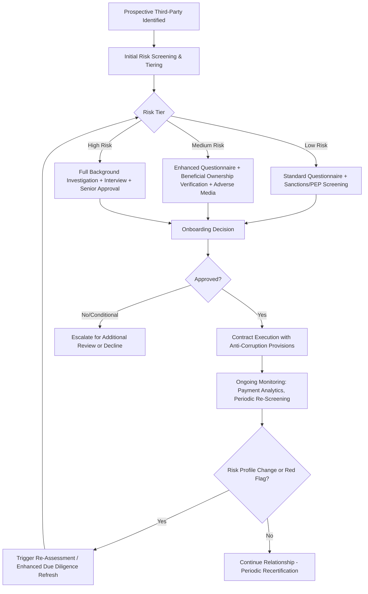

## Third-Party and Agent Due Diligence

### Overview

Third-party and agent due diligence is the systematic process of investigating and vetting intermediaries — agents, distributors, consultants, joint venture partners, resellers, and other business partners acting on a company's behalf — before and during a business relationship, in order to identify and mitigate bribery, corruption, and related integrity risks. Because a substantial proportion of anti-corruption enforcement actions involve payments made indirectly through third parties rather than directly by the company, this function represents one of the highest-value control points in an anti-corruption compliance program.

### Why Third-Party Relationships Concentrate Corruption Risk

**Key Points**

- Third parties often serve as the **direct interface with government officials or private-sector decision-makers**, creating both legitimate business need (local market knowledge, relationships, regulatory navigation) and opportunity for improper payments to be made at arm's length from the principal company.
- The **"knowledge" and "willful blindness" standards** applied under the FCPA and similar statutes mean a company can face liability for a third party's bribery even without direct proof of actual knowledge, where the company consciously disregarded a high probability that improper payments would be made — making the adequacy of the due diligence process itself a central element of the company's defense and risk posture.
- Common structural risk indicators in third-party relationships include: compensation tied to specific contract or regulatory outcomes, minimal or unclear scope of services relative to fee levels, close personal/family relationships with government decision-makers, and operation in jurisdictions with elevated corruption risk ratings.

### Risk-Tiering Methodology

Effective due diligence programs scale the intensity of review to the intermediary's risk profile rather than applying uniform diligence across all relationships, since uniform light-touch diligence under-protects high-risk relationships while uniform heavy diligence is operationally unsustainable at scale.

**Common Risk Factors Used for Tiering**

| Risk Dimension | Higher-Risk Indicators |
| --- | --- |
| Government interaction | Direct or frequent interaction with government officials, regulators, or state-owned enterprise personnel |
| Compensation structure | Success fees or commissions contingent on specific contract awards, permits, or regulatory approvals |
| Jurisdiction | Operation in countries with lower scores on recognized corruption perception/risk indices |
| Industry sector | Heavily regulated, licensing-intensive, or historically high-enforcement sectors (extractives, defense, healthcare, infrastructure) |
| Relationship history | New, previously unvetted relationships; relationships originated through personal referral by a government-adjacent contact |
| Transaction value/materiality | High-value contracts or engagements where the intermediary's role could materially affect a significant business outcome |

- Risk scores derived from these factors typically drive a **tiered due diligence protocol** (illustrated in the compliance program design discussion), with low-risk relationships receiving standard screening and high-risk relationships receiving comprehensive investigation and senior-level approval.

### Core Due Diligence Components

**1. Identity and Beneficial Ownership Verification**

- Confirming the intermediary's legal identity, corporate registration status, and — critically — **beneficial ownership**, since bribery schemes frequently involve intermediary entities whose true ownership is obscured to conceal a relationship with a government official or the official's family members.
- Beneficial ownership verification often requires reviewing corporate registry filings (where publicly available), requesting direct disclosure from the intermediary, and cross-referencing against politically exposed persons (PEP) databases and adverse media.

**2. Sanctions, Watchlist, and PEP Screening**

- Automated screening against government sanctions lists (e.g., OFAC's Specially Designated Nationals list and equivalent lists maintained by other jurisdictions), denied parties lists, and PEP databases identifying individuals holding or closely connected to prominent public positions.
- Ongoing (not merely point-in-time) screening is generally preferable, since sanctions designations and PEP status can change during the life of a relationship.

**3. Adverse Media and Background Investigation**

- Search of news media, litigation records, and regulatory enforcement databases for indications of prior corruption allegations, litigation, regulatory sanctions, or other integrity concerns involving the intermediary or its principals.
- For higher-risk relationships, this frequently extends to a more comprehensive background investigation, potentially including on-the-ground inquiries, reference checks, and review of the intermediary's own compliance program and financial stability.

**4. Business Rationale and Scope of Services Review**

- Documenting and testing the **legitimate business rationale** for engaging the intermediary — what specific services will be performed, why the intermediary is qualified to perform them, and whether the proposed compensation is commensurate with the market value of those services.
- A vague or generic scope of work ("government relations and business development support") without specific, verifiable deliverables is a recurring red flag in enforcement actions and should trigger enhanced scrutiny before, not after, the relationship is established.

**5. Compensation Reasonableness Assessment**

- Benchmarking proposed commission rates, consulting fees, or other compensation against **market/industry norms** for comparable legitimate services in the relevant jurisdiction and sector.
- Particular scrutiny applied to success-fee or contingent-compensation structures directly tied to specific contract awards or regulatory outcomes, which create a direct financial incentive structure resembling a bribery payment mechanism even where the underlying relationship may be legitimate.

**6. Contractual Protections**

- Incorporating anti-corruption representations, warranties, and covenants into the intermediary agreement, including: certification of compliance with applicable anti-corruption laws, audit rights, termination rights for suspected violations, and (where appropriate) compensation clawback provisions.
- Requiring the intermediary to complete and periodically recertify compliance training and due diligence questionnaires as an ongoing contractual obligation, not merely a one-time onboarding step.

### Process Flow — Third-Party Due Diligence Lifecycle

### Ongoing Monitoring vs. Point-in-Time Diligence

- A common program weakness is treating due diligence as a one-time onboarding gate rather than a continuing obligation, since an intermediary's risk profile, ownership structure, or conduct can change materially over the life of a relationship.
- Effective ongoing monitoring typically includes:
  - **Periodic re-screening** against sanctions/PEP databases and adverse media at defined intervals (e.g., annually for high-risk relationships).
  - **Payment pattern analytics**, applying the transaction monitoring techniques discussed in compliance program design (threshold structuring detection, payment timing correlated with contract awards, unusual payment routing) specifically to the ongoing intermediary payment population.
  - **Periodic recertification** requiring the intermediary to reaffirm compliance with applicable anti-corruption representations and disclose any changes in ownership, government relationships, or circumstances relevant to the original risk assessment.

### The Forensic Accountant's Role in Due Diligence Execution

- **Program design:** developing risk-scoring methodologies, questionnaire content, and escalation criteria in coordination with legal and compliance stakeholders.
- **Compensation benchmarking:** applying market/industry data to assess whether proposed intermediary fees are commensurate with the scope of services, drawing on approaches similar to those used in reasonable compensation analysis in other forensic contexts.
- **Financial and beneficial ownership investigation:** tracing corporate structures, identifying ultimate beneficial owners, and cross-referencing intermediary bank account details against contracted counterparty information to detect mismatches suggestive of concealment.
- **Ongoing analytics:** designing and operating the payment monitoring analytics that flag anomalous third-party payment patterns for further review, as discussed above.
- **Post-incident review:** where a third-party relationship is later implicated in an investigation, reconstructing the due diligence record to assess what was known or reasonably discoverable at onboarding, which is frequently central to assessing the company's own knowledge/willful blindness exposure.

### Illustrative Example

A company evaluating a new sales agent relationship in a jurisdiction with elevated corruption risk applies its risk-tiering framework.

- **Initial screening** identifies the proposed agent as high-risk: the engagement involves government tender processes, the proposed compensation structure is a 12% success fee contingent on contract award (compared to a documented market range of 3–5% for comparable regional sales representation services), and the agent's principal previously held a mid-level position at the same government ministry that will evaluate the tender.
- **Enhanced due diligence** is triggered given the high-risk classification: beneficial ownership verification confirms the agent entity is wholly owned by the principal individually (no additional undisclosed owners identified); adverse media search reveals no prior enforcement history; however, the principal's prior government employment — ending only 14 months before the proposed engagement — raises a "revolving door" conflict-of-interest concern requiring legal assessment under local conflict-of-interest/cooling-off laws in addition to anti-corruption risk assessment.
- **Compensation reasonableness assessment** flags the proposed 12% success fee as significantly above market benchmark; following escalation, the fee structure is renegotiated to a 4% flat fee not contingent on the specific tender outcome, paid for defined, documented advisory services (market entry guidance, translation/logistics support, and introductions to potential local partners) rather than success-based compensation tied to the government contract award.
- **Contractual protections** are incorporated, including anti-corruption representations, an audit right, and a termination-for-cause provision tied to any indication of improper payments or misrepresentation in the due diligence process.
- **Ongoing monitoring** is established, including annual re-screening and payment analytics flagging any payment to the agent occurring within 30 days of any government tender decision affecting the company's business in that jurisdiction.

### Common Pitfalls in Third-Party Due Diligence

- Treating due diligence questionnaires as a check-the-box exercise without independent verification of self-reported information, particularly beneficial ownership disclosures.
- Failing to apply risk-based tiering consistently, resulting in high-risk relationships receiving only standard-level diligence due to inconsistent risk scoring or override of the risk assessment by business sponsors eager to finalize a deal.
- Treating due diligence as complete at onboarding without ongoing re-screening or payment monitoring, missing changes in risk profile or emerging red flags over the life of the relationship.
- Failing to benchmark compensation against market norms, allowing above-market or success-fee compensation structures to proceed without adequate scrutiny of their bribery-facilitation risk.
- Inadequate documentation of the due diligence record itself, which is frequently the single most important evidentiary artifact if the relationship is later implicated in a regulatory investigation, since it demonstrates what the company knew or should have known at the time of onboarding.

**Related Topics**

- Foreign Corrupt Practices Act provisions
- Anti-corruption compliance program design
- UK Bribery Act and other global anti-corruption regimes
- Beneficial ownership tracing and corporate structure investigation
- Reasonable compensation and market benchmarking methodology
- Data analytics techniques in ongoing third-party payment monitoring