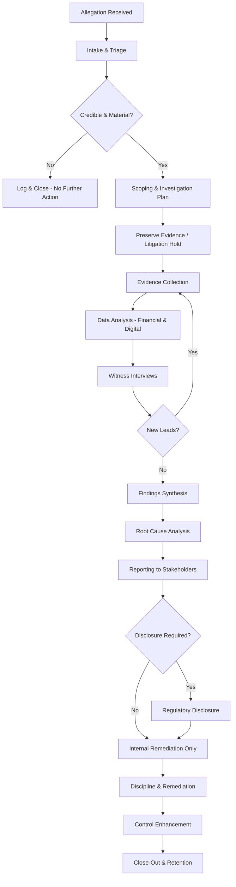
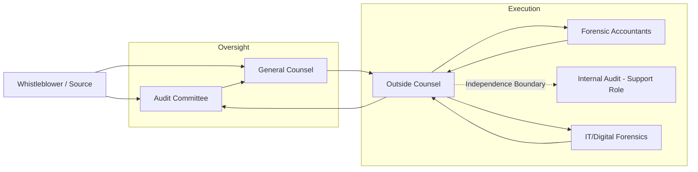

## Internal Investigations of Corruption Allegations

### Overview

Internal investigations of corruption allegations are structured, evidence-driven inquiries conducted within an organization to determine whether bribery, corruption, or related misconduct has occurred, to what extent, who was involved, and what remedial or disciplinary action is warranted. Within Anti-Bribery and Anti-Corruption (ABAC) compliance programs, these investigations are a core detective and responsive control, operating alongside preventive controls (due diligence, policies, training) and monitoring controls (audits, transaction testing, whistleblower hotlines).

The forensic accountant's role in this process is distinct from that of external or internal auditors: investigations are allegation-driven, adversarial in posture, and oriented toward findings that may support disciplinary action, regulatory disclosure (e.g., FCPA, UK Bribery Act, or local anti-graft statutes), litigation, or law enforcement referral. The work product must withstand scrutiny from regulators, opposing counsel, and courts, which drives the emphasis on chain of custody, privilege, and defensible methodology throughout.

### Regulatory and Legal Context

**Key Points**

- **U.S. Foreign Corrupt Practices Act (FCPA)**: Requires issuers to maintain internal controls and accurate books and records; corruption findings often trigger both anti-bribery and accounting provisions violations.
- **UK Bribery Act 2010**: Section 7 creates strict corporate liability for failing to prevent bribery, with "adequate procedures" as the only defense — internal investigation quality is direct evidence of procedure adequacy.
- **DOJ/SEC FCPA Resource Guide and DOJ Evaluation of Corporate Compliance Programs**: Both explicitly assess the quality, independence, and thoroughness of a company's internal investigations when determining charging decisions, penalties, and monitorships.
- **Self-disclosure incentives**: DOJ's FCPA Corporate Enforcement Policy offers a presumption of declination for voluntary self-disclosure, full cooperation, and timely remediation — all of which depend on a credible internal investigation having occurred first.
- [Inference] Many jurisdictions with anti-graft statutes modeled on UNCAC (UN Convention Against Corruption) impose parallel expectations on corporate self-policing, though specific evidentiary standards vary by jurisdiction.

An investigation that is procedurally deficient can itself become a source of liability — for obstruction, spoliation, or failure to remediate — independent of the underlying corruption allegation.

### Investigation Lifecycle

### Phase 1 — Intake and Triage

The intake phase determines whether an allegation warrants a full investigation and, if so, its urgency and initial scope.

**Sources of allegations:**

- Whistleblower hotlines (internal or third-party administered)
- Internal audit findings
- External audit management letters
- Regulatory inquiries or subpoenas
- Employee exit interviews
- Media reports or NGO disclosures (e.g., Transparency International, OCCRP)
- Third-party due diligence red flags (agents, distributors, joint venture partners)
- Anomalies surfaced by continuous monitoring / data analytics

**Triage criteria:**

- Credibility of the source and specificity of the allegation
- Materiality (financial magnitude, jurisdictional exposure, seniority of individuals implicated)
- Legal/regulatory exposure (public official involvement raises FCPA/UK Bribery Act stakes materially)
- Urgency (ongoing conduct vs. historical, risk of evidence destruction)

A **decision log** should be created at intake recording who received the allegation, when, its substance, and the triage decision with rationale — this becomes a key document if regulators later question whether the company acted promptly.

### Phase 2 — Scoping and the Investigation Plan

**Key Points**

- Define the **factual hypothesis** to be tested (not a presumption of guilt) — e.g., "Did Vendor X receive inflated payments that were partially kicked back to Employee Y to influence contract award?"
- Determine **who leads** the investigation: in-house legal, outside counsel, forensic accounting firm, or a combination. For allegations involving senior management or potential regulatory exposure, engaging **outside counsel** is standard practice to preserve attorney-client privilege and ensure independence.
- Establish **independence** from implicated individuals — no one under suspicion should have visibility into or influence over the investigation's direction, staffing, or findings.
- Define **scope boundaries**: time period, entities, individuals, transaction types, geographic locations.
- Identify applicable **privilege framework** (attorney-client privilege, work product doctrine) and structure the investigation so that forensic accountants work at counsel's direction to maximize privilege protection — this is often referred to as investigations conducted "at the direction of counsel."
- Assess **data protection and labor law constraints**, particularly in jurisdictions with strict employee privacy regimes (EU GDPR, works councils) — these can materially affect what data can be reviewed and how interviews may be conducted.

### Phase 3 — Evidence Preservation

Before substantive evidence collection begins, a **litigation hold** (legal hold) must be issued to prevent destruction of relevant records.

**Typical hold scope:**

- Emails and instant messages (including personal devices used for business, where policy permits access)
- Financial system records (ERP, sub-ledgers, payment logs)
- Physical documents (contracts, expense reports, gift/hospitality logs)
- Access logs and system metadata
- Travel and expense records
- Third-party intermediary records (agents, consultants, distributors)

**Key Points**

- Hold notices must be specific enough to be actionable but should avoid disclosing full investigative theory to custodians who may be involved.
- IT should be engaged early to image relevant devices/mail accounts before hold notices go out, where legally permissible, to prevent pre-notice destruction.
- [Unverified] Whether covert forensic imaging is permissible before notifying a custodian depends heavily on jurisdiction-specific employment and privacy law; this should be confirmed with local counsel in each relevant jurisdiction.

### Phase 4 — Evidence Collection and Financial Analysis

This is the core forensic accounting phase, where the investigation's factual record is built.

**Documentary evidence typically reviewed:**

- General ledger and sub-ledger detail (accounts payable, travel & entertainment, consulting fees, commissions)
- Vendor master file data (creation dates, changes to bank details, duplicate addresses/tax IDs)
- Contracts and statements of work, particularly for agents, consultants, and intermediaries
- Approval workflows and delegation of authority records
- Gift, hospitality, and entertainment logs
- Political and charitable contribution records
- Customs and import/export documentation (relevant where corruption facilitates regulatory approvals)
- Bank statements and wire transfer records
- Communications (email, chat, calendar entries)

**Forensic financial analytic techniques:**

| Technique | Purpose | Typical Red Flags Detected |
| --- | --- | --- |
| Benford's Law analysis | Detect anomalous digit distributions in transaction amounts | Fabricated or manipulated invoice amounts |
| Duplicate payment testing | Identify same-invoice or near-duplicate payments | Payments split to stay below approval thresholds |
| Vendor-employee matching | Cross-reference vendor master data against employee/HR data (address, phone, bank account) | Shell companies controlled by employees |
| Round-dollar/just-below-threshold analysis | Flag amounts clustered just under approval limits | Structuring to avoid scrutiny |
| Commission rate outlier analysis | Compare agent/distributor commission rates against market norms and contract terms | Excessive commissions functioning as bribe conduits |
| Timing analysis | Correlate payment dates with contract awards, permit approvals, or regulatory decisions | Payments timed to precede favorable government action |
| Journal entry testing | Review manual journal entries for unusual account combinations, round amounts, weekend/after-hours postings | Concealment of improper payments in misclassified accounts |
| Geographic risk overlay | Cross-reference transaction counterparties against Transparency International CPI scores and sanctioned-jurisdiction lists | Elevated corruption risk exposure |

$$\text{Commission Rate Variance} = \frac{\text{Actual Commission Rate} - \text{Market Benchmark Rate}}{\text{Market Benchmark Rate}} \times 100$$

A variance significantly exceeding typical dispersion for the industry and region — combined with limited documented services rendered by the intermediary — is a classic proxy for a disguised bribe channel.

**Digital forensics integration:**

- Email and chat review using keyword and pattern searches (code words for bribes are common: "commission," "special fee," "facilitation," "gift," "thank you payment," local slang terms)
- Metadata analysis to detect backdated documents
- Deleted file recovery where legally permissible
- [Inference] Predictive coding / technology-assisted review (TAR) is increasingly used in large-document investigations to prioritize review, though its use in corruption investigations specifically (versus general e-discovery) depends on document volume and available tooling.

### Phase 5 — Witness Interviews

**Key Points**

- Interviews are typically sequenced from peripheral witnesses to central subjects, so that documentary evidence and background facts are gathered before confronting potentially implicated individuals.
- **Upjohn warnings** (in U.S. contexts) must be given at the start of interviews conducted by counsel, clarifying that counsel represents the company, not the individual employee, and that privilege belongs to the company, which may choose to waive it.
- Interviews should be documented via **contemporaneous memoranda** (often prepared by counsel to preserve work-product protection), not verbatim transcripts, unless recording is required or advisable.
- Two interviewers are standard practice: one to lead questioning, one to take notes, preserving a witness to what was said if the interview is later challenged.
- Behavioral and inconsistency analysis (comparing witness statements against documentary evidence and against each other) is central to corroboration.

**Structured interview approach (funnel technique):**

1. Open-ended background questions (role, responsibilities, general processes)
2. Narrowing to specific transactions or relationships
3. Confrontation with documentary evidence (where appropriate and properly sequenced)
4. Closing questions to memorialize final position and identify further witnesses/documents

### Phase 6 — Findings Synthesis and Root Cause Analysis

**Key Points**

- Findings should be organized around the original factual hypotheses, with each either substantiated, unsubstantiated, or inconclusive based on the evidentiary record.
- Distinguish clearly between **facts established by evidence**, **reasonable inferences**, and **unresolved questions** — mirroring the same evidentiary discipline expected of the final report.
- Root cause analysis should extend beyond individual culpability to **control failures**: Why did the control environment fail to prevent or detect this? Was it a design gap, an override, or a monitoring failure?
- Assess whether the conduct reflects an **isolated incident** or a **systemic pattern**, since this materially affects both remediation design and regulatory risk assessment (regulators weigh "tone at the top" and pervasiveness heavily).

### Phase 7 — Reporting

**Output**

A typical internal investigation report (often prepared as privileged attorney work product) includes:

- Executive summary of allegations and conclusions
- Scope and methodology (including limitations)
- Factual findings organized by hypothesis or transaction
- Individuals implicated and their role in the conduct
- Financial quantification of improper payments/benefits
- Control deficiencies identified
- Root cause assessment
- Recommended remediation and disciplinary actions
- Disclosure recommendation (if regulatory self-reporting is being considered)

**Key Points**

- Reports intended to remain privileged should avoid unnecessary editorializing, be factually precise, and be clearly marked as privileged and prepared at the direction of counsel.
- Where regulatory disclosure is contemplated, a parallel non-privileged summary may be prepared for submission, carefully scoped to avoid broader privilege waiver.
- [Inference] The decision on privilege waiver scope is highly fact- and jurisdiction-specific and is typically made by counsel weighing cooperation credit against litigation exposure; forensic accountants generally support this decision with quantification rather than making it.

### Phase 8 — Remediation and Control Enhancement

Following findings, remediation typically addresses both individuals and systems:

- **Disciplinary action**: proportionate to role, seniority, and culpability, applied consistently to avoid disparate treatment claims
- **Contract remediation**: termination or renegotiation of intermediary/agent relationships implicated in findings
- **Control redesign**: closing the specific gaps identified (e.g., enhanced vendor onboarding due diligence, dual approval for commission payments, mandatory gift/hospitality pre-clearance)
- **Training refresh**: targeted at the business unit or function where the conduct occurred
- **Monitoring enhancement**: increased transaction testing frequency or scope in the affected area for a defined period

### Governance and Reporting Lines

**Key Points**

- Independence from management under investigation is preserved by routing findings through the audit committee (or equivalent independent body) rather than through the reporting line of implicated executives.
- Internal audit may support the investigation (data extraction, process knowledge) but typically does not lead investigations involving senior management, to preserve independence and privilege structure.

### Documentation and Chain of Custody

**Key Points**

- Every piece of evidence collected should be logged with source, collection date, collector identity, and storage location.
- Digital evidence should be preserved via forensically sound imaging (write-blocked, hash-verified) to prevent spoliation challenges.
- Access to the evidence repository should be restricted and logged.
- [Inference] The specific chain-of-custody standard applied often mirrors criminal forensic standards even in purely internal/civil investigations, as a defensive measure in case findings are later used in litigation or referred to law enforcement.

### Common Pitfalls

**Key Points**

- Failing to establish independence early, allowing implicated individuals to influence scope or staffing
- Delaying the litigation hold, resulting in evidence spoliation
- Conducting interviews before adequate documentary review, weakening the ability to test witness credibility
- Conflating the investigator role with the auditor role, applying insufficiently skeptical, allegation-driven methodology
- Over-broad initial disclosure statements to regulators before the investigation has substantiated facts, creating later credibility or consistency problems
- Inconsistent discipline across similarly situated individuals, undermining both fairness and the "adequate procedures" defense

### Example

**Example**

A whistleblower alleges that a regional sales manager directed inflated invoices through a "marketing consultant" to fund payments to a government procurement official.

1. **Triage**: Allegation involves a public official and senior manager — escalated immediately to General Counsel and outside counsel engaged same week.
2. **Scoping**: Investigation covers the consultant relationship, all related invoices over the past 3 years, and the manager's expense reports and communications.
3. **Preservation**: Litigation hold issued; consultant's invoices and the manager's email/laptop imaged before hold notice sent to the manager.
4. **Analysis**: Commission rate analysis shows the consultant was paid 22% against a market benchmark of 5–8% for comparable services, with no documented deliverables. Timing analysis shows payments clustered in the two weeks preceding each of three favorable procurement decisions.
5. **Interviews**: Finance staff interviewed first (process/context), then the consultant (external, via counsel-arranged interview), then the manager last.
6. **Findings**: Substantiated — commission structure functioned as a bribe conduit; root cause traced to absence of documented deliverable requirements in the vendor approval workflow for "marketing consultants."
7. **Remediation**: Manager terminated, consultant contract terminated, mandatory deliverable documentation added to consulting vendor approval workflow, retroactive review of all consultants above a $50,000 threshold initiated.
8. **Disclosure**: Outside counsel advises voluntary self-disclosure to DOJ under the FCPA Corporate Enforcement Policy given the public official nexus and cooperation credit incentives.

### Related Topics

- Whistleblower hotline design and case management systems
- Third-party due diligence and risk-based intermediary monitoring
- Attorney-client privilege and work-product doctrine in cross-border investigations
- Voluntary self-disclosure decision frameworks (DOJ FCPA Corporate Enforcement Policy)
- Data privacy constraints on cross-border e-discovery (GDPR vs. U.S. discovery obligations)
- Books and records / internal controls provisions under FCPA
- Deferred Prosecution Agreements (DPAs) and independent compliance monitorships
- Benford's Law and other forensic data analytics techniques
- Root cause analysis frameworks for compliance control failures
- Disciplinary consistency frameworks and employment law intersections in misconduct cases