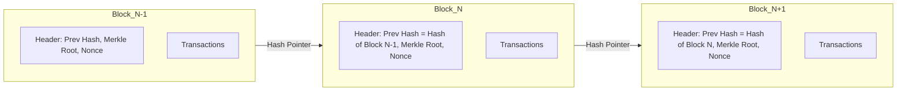
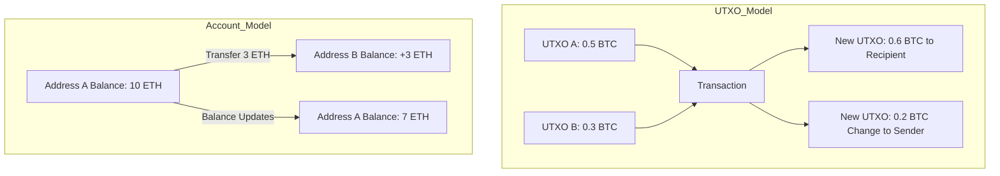

## Blockchain Fundamentals for Investigators

### Overview

Blockchain fundamentals for investigators covers the technical architecture of distributed ledgers, cryptographic primitives, and transaction structures that forensic accountants and fraud examiners must understand to trace illicit fund flows, identify wallet ownership, and build admissible evidence in cases involving cryptocurrency and digital assets. Unlike traditional financial forensics, blockchain investigation requires fluency in cryptography, distributed systems, and address-level transaction graph analysis, since the "books and records" being examined are public, immutable, and pseudonymous rather than private, mutable, and identity-linked.

This foundation underpins subsequent chapter topics such as wallet clustering, exchange subpoena practice, mixer/tumbler analysis, and NFT fraud, all of which depend on correctly understanding how blocks, transactions, and addresses actually function.

### Core Architecture

**Key Points**

- A **blockchain** is a distributed, append-only ledger maintained by a network of nodes, where data is grouped into **blocks** that are cryptographically linked in sequence via hash pointers.
- Each block contains a **header** (previous block hash, timestamp, nonce, Merkle root) and a **body** (the list of transactions).
- The **Merkle root** is a single hash summarizing all transactions in the block, enabling efficient verification that a transaction is included in a block without downloading the entire block (Merkle proofs).
- Altering any historical transaction changes its hash, which changes the Merkle root, which changes the block header hash, which breaks the chain — this is the structural basis of blockchain immutability.

### Cryptographic Primitives

**Key Points**

- **Cryptographic hash functions** (e.g., SHA-256 for Bitcoin, Keccak-256 for Ethereum) take arbitrary input and produce a fixed-length, deterministic, collision-resistant output. Any change to input produces an unpredictably different output (avalanche effect).
- **Public-key cryptography** (asymmetric cryptography) underlies wallet ownership: a user holds a **private key** (secret, used to sign transactions) and a corresponding **public key** (derived from the private key, used to verify signatures and, after hashing, to generate the public address).
- **Digital signatures** (ECDSA for Bitcoin/Ethereum, increasingly Schnorr signatures for Bitcoin post-Taproot) prove that the holder of a private key authorized a specific transaction, without revealing the private key itself.
- Addresses are typically derived as: `Address = Hash(Public Key)`, often with additional encoding (Base58Check for Bitcoin legacy addresses, Bech32 for SegWit, hex with checksum for Ethereum).

$$\text{Private Key} \xrightarrow{\text{Elliptic Curve Multiplication}} \text{Public Key} \xrightarrow{\text{Hash + Encode}} \text{Address}$$

**[Inference]** The one-way nature of these derivations (address cannot be reversed to recover the public key or private key) is what makes blockchain "pseudonymous" rather than anonymous — the cryptography itself does not reveal identity, but transaction patterns and off-chain data linkage frequently do.

### Consensus Mechanisms

| Mechanism | How It Works | Investigative Relevance |
| --- | --- | --- |
| Proof of Work (PoW) | Miners compete to solve a computationally expensive puzzle; winner proposes the next block | Bitcoin, pre-2022 Ethereum. Finality is probabilistic — deeper confirmations = higher certainty a transaction won't be reversed |
| Proof of Stake (PoS) | Validators are selected to propose/attest blocks based on staked capital, not computation | Current Ethereum, many altcoins. Often faster finality; staking addresses can be a distinct identity signal |
| Delegated PoS / other variants | Token holders vote for a limited set of validators/delegates | Relevant to governance-token fraud and validator-related investigations |

**Key Points**

- Consensus determines **finality** — the point at which a transaction is considered irreversible. Investigators should understand a chain's typical confirmation depth for "settled" evidence (e.g., 6 confirmations is a common Bitcoin heuristic; Ethereum finality post-Merge follows epoch/checkpoint logic).
- [Unverified] Specific confirmation-depth conventions vary by exchange, custodian, and use case, and are not a fixed protocol rule — they are risk-based operational thresholds set by each participant.

### Transaction Models

Two dominant models exist, and confusing them is a common investigative error:

**UTXO Model (Bitcoin, Litecoin, Bitcoin Cash, etc.):**

- No account balances exist on-chain; instead, the ledger tracks discrete **Unspent Transaction Outputs (UTXOs)**.
- Every transaction consumes one or more existing UTXOs as inputs and creates new UTXOs as outputs.
- A wallet's "balance" is the sum of all UTXOs it can spend (i.e., all UTXOs locked to addresses it controls).
- Investigative implication: tracing requires following **specific UTXOs** through the transaction graph, not simply "account balances."

**Account/Balance Model (Ethereum, BNB Chain, most EVM chains):**

- Each address has a running balance, updated by each transaction, similar to a traditional bank ledger.
- Transactions specify sender, recipient, amount, and (for smart contract interactions) call data.
- Investigative implication: tracing more closely resembles traditional ledger analysis, but is complicated by smart contract logic (a single transaction can trigger dozens of internal transfers).

### Anatomy of a Transaction

**Bitcoin transaction (simplified fields):**

- `txid` — unique transaction identifier (hash of the transaction)
- `vin` (inputs) — references to prior UTXOs being spent, each with a scriptSig/witness proving authorization
- `vout` (outputs) — new UTXOs created, each with a value and a scriptPubKey (locking script, e.g., pay-to-public-key-hash)
- `locktime` — earliest time/block the transaction can be included

**Ethereum transaction (simplified fields):**

- `from` / `to` — sender and recipient addresses (or contract address)
- `value` — ETH amount transferred
- `data` — call data for smart contract interaction (function selector + arguments)
- `gas` / `gasPrice` (or `maxFeePerGas`/`maxPriorityFeePerGas` post-EIP-1559) — computational cost and fee mechanics
- `nonce` — sequential counter preventing replay attacks
- Internal transactions (traces) — transfers triggered by contract logic within a single top-level transaction, **not directly visible on-chain** without trace-level tooling (critical for tracing funds through DeFi protocols)

**Key Points**

- [Inference] Internal transactions are frequently the most overlooked evidentiary gap in less rigorous investigations, since standard block explorers may not surface them without querying `debug_traceTransaction` or equivalent trace APIs.

### Address Types and Wallet Structures

**Key Points**

- **Externally Owned Accounts (EOAs)**: controlled directly by a private key (a "normal" user wallet).
- **Contract accounts**: controlled by code, not a private key — includes exchange hot wallets, DeFi protocol contracts, multisig wallets.
- **Hierarchical Deterministic (HD) wallets** (BIP-32/BIP-44): a single seed phrase can generate a near-infinite tree of addresses, meaning a single individual may control hundreds of addresses that appear unrelated without clustering analysis.
- **Multisignature (multisig) wallets**: require M-of-N signatures to authorize a transaction, common in exchange cold storage and DAO treasuries — relevant when investigating custodial control and internal fraud/collusion.
- **Change addresses**: in UTXO chains, "change" from a transaction is often sent to a newly generated address controlled by the same sender, which is a foundational heuristic for wallet clustering.

### Wallet Clustering Heuristics (Foundational Concepts)

While full clustering methodology belongs to a dedicated blockchain analytics topic, investigators must understand the underlying logic:

- **Common input ownership heuristic**: if multiple UTXO inputs are spent in the same transaction, they are typically controlled by the same private key holder (since all inputs must be authorized by their respective key owners), allowing addresses to be clustered as belonging to one entity.
- **Change address detection**: heuristics (e.g., address type matching, round-number output analysis) can often identify which output is "change" returning to the sender.
- [Inference] These heuristics are probabilistic, not certain — sophisticated actors use techniques like CoinJoin specifically to defeat the common-input-ownership heuristic, which is why heuristic-based clustering results should be corroborated with off-chain evidence (KYC data, IP logs, exchange records) before being treated as conclusive in a report.

### Public Ledger Transparency vs. Pseudonymity

**Key Points**

- All transaction data (amounts, addresses, timestamps) on public blockchains is permanently visible to anyone running a node or using a block explorer — this is a fundamental difference from traditional banking secrecy.
- Pseudonymity means addresses are not inherently linked to real-world identity, but **deanonymization** commonly occurs through: exchange KYC records (subpoena target), IP address logging by nodes/services, on-chain behavioral patterns, address reuse, and cross-referencing with public data (social media posts of wallet addresses, ENS domain registrations).
- **Privacy coins and techniques** (Monero's ring signatures/stealth addresses, Zcash's zk-SNARKs shielded transactions, CoinJoin mixing on Bitcoin) are designed specifically to defeat this transparency and represent a materially higher investigative difficulty tier.

### Smart Contracts and DeFi (Investigative Relevance)

**Key Points**

- A **smart contract** is self-executing code deployed on-chain at a fixed address; interactions with it are transactions that trigger its logic.
- Common fraud-relevant contract types: token contracts (ERC-20), NFT contracts (ERC-721/1155), decentralized exchange (DEX) routers, lending protocols, and bridge contracts (cross-chain transfers).
- **Bridges** are a particularly high-risk tracing chokepoint: funds moving cross-chain (e.g., Ethereum to a Layer 2, or Ethereum to Bitcoin via wrapped assets) require specialized tooling, since the transaction graph does not continue seamlessly across chains without bridge-specific event log analysis.
- [Inference] DeFi protocol interactions often generate multiple internal transfers and token swaps within a single user-initiated transaction, meaning "one transaction" in a case timeline may represent dozens of underlying value movements requiring trace-level decomposition.

### Investigative Data Sources

| Source Type | Examples | Use Case |
| --- | --- | --- |
| Block explorers | Etherscan, Blockchain.com, Blockchair | Manual transaction lookup, contract verification, basic tracing |
| Blockchain analytics platforms | Chainalysis Reactor, Elliptic, TRM Labs | Wallet clustering, entity attribution, risk scoring, visualization |
| Node/RPC access | Self-hosted or provider (Infura, Alchemy, QuickNode) | Raw data queries, trace-level analysis, custom tooling |
| Exchange records (via subpoena/MLAT) | KYC data, deposit/withdrawal logs, IP logs | Identity attribution of pseudonymous addresses |
| Open-source intelligence (OSINT) | Social media, forum posts, ENS/domain registries | Corroborating address-to-identity links |

### Common Investigative Pitfalls

**Key Points**

- Treating clustering heuristic output as definitive proof of ownership without off-chain corroboration
- Failing to capture internal/trace-level transactions when tracing funds through smart contracts, understating true fund flow
- Assuming confirmation finality equivalent across chains with materially different consensus and finality models
- Overlooking cross-chain bridge hops, causing an apparent "dead end" in the transaction trail
- Misinterpreting exchange hot wallet addresses as belonging to a single suspect, when in fact they pool funds from thousands of unrelated customers
- [Inference] This last pitfall is a frequent source of investigative error in less experienced teams, since exchange deposit addresses can visually resemble any other address without platform-specific attribution data

### Example

**Example**

An investigator is tracing a $2M ransomware payment made in Bitcoin.

1. The ransom transaction (`txid`) is identified via the victim's payment confirmation, showing outputs to a specific address.
2. The investigator uses a block explorer to trace forward: the received UTXO is later combined with several other UTXOs in a subsequent transaction — applying the common-input-ownership heuristic, all input addresses are tentatively clustered as controlled by the same actor.
3. Funds are split across multiple "peeling chain" transactions (small amounts repeatedly peeled off to new addresses) — a common obfuscation pattern — before a final tranche moves into a deposit address later identified, via blockchain analytics platform attribution data, as belonging to a specific offshore exchange.
4. A subpoena or Mutual Legal Assistance Treaty (MLAT) request is issued to the exchange for KYC records tied to that deposit address, seeking to unmask the account holder's identity, IP logs at deposit time, and any linked fiat off-ramp activity.
5. The final report documents the full transaction path (with `txid` references at each hop), the heuristic basis for each clustering conclusion, and clearly flags which conclusions are heuristic-based (probabilistic) versus confirmed via exchange KYC data (high-confidence).

### Related Topics

- Wallet clustering and entity attribution methodologies
- Cryptocurrency mixers, tumblers, and CoinJoin analysis
- Cross-chain bridge tracing and Layer 2 forensics
- Exchange subpoena and MLAT practice for digital asset cases
- Privacy coin investigation (Monero, Zcash)
- Smart contract exploit forensics and DeFi hack tracing
- NFT fraud and wash trading detection
- Seizure and custody of digital assets in criminal/civil proceedings
- Blockchain analytics tool methodology (Chainalysis, Elliptic, TRM Labs)
- Token standards (ERC-20/721/1155) and rug pull mechanics