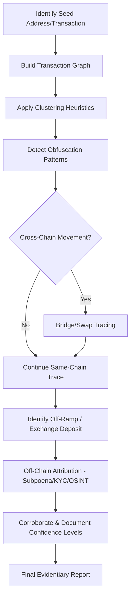
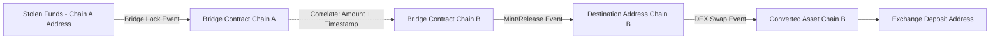

## Cryptocurrency Transaction Tracing Techniques

### Overview

Cryptocurrency transaction tracing techniques comprise the analytical methods investigators use to follow the flow of digital assets across blockchain networks, cluster pseudonymous addresses into real-world entities, and construct an evidentiary chain linking illicit proceeds to their source and ultimate destination. Building on blockchain fundamentals (block structure, transaction models, address derivation), this topic focuses on the applied methodology: heuristic clustering, graph analysis, obfuscation-pattern recognition, cross-chain tracing, and the tooling that operationalizes these techniques at scale.

Tracing is fundamentally a **graph traversal problem** — addresses are nodes, transactions are edges — combined with **probabilistic entity resolution**, since the blockchain itself records only cryptographic addresses, not identities.

### Tracing Methodology Overview

### Address Clustering Heuristics

Clustering groups pseudonymous addresses believed to be controlled by a single entity, forming the foundation of practical tracing.

**Common Input Ownership Heuristic (UTXO chains):**

- When a transaction spends multiple UTXOs as inputs, all input addresses must have been authorized by their respective private key holders in that single transaction — the standard inference is that all inputs are controlled by the same entity.

$$\text{If } TX_i \text{ has inputs } \{A_1, A_2, ..., A_n\}, \text{ then } A_1 \equiv A_2 \equiv ... \equiv A_n \text{ (same controller)}$$

**Change Address Heuristic:**

- In a typical UTXO transaction with one payment output and one "change" output, the change address is often identifiable by: address-type matching the input (e.g., same script type), being a freshly-used address (no prior transaction history), or having a non-round value consistent with leftover balance.
- Identifying the change output allows the cluster to be extended to the next "hop" without the counterparty payment address contaminating the cluster.

**Behavioral and Temporal Heuristics:**

- **Address reuse**: entities that reuse the same address across multiple transactions create direct linkage without needing input-clustering inference.
- **Temporal correlation**: transactions occurring in tight time clusters across nominally separate addresses can suggest common automated control (e.g., a script managing a wallet farm).
- **Dust attack correlation**: sending tiny "dust" amounts to many addresses and monitoring how recipients later consolidate them (deliberately or as a deanonymization attack) can reveal clustering relationships — investigators should be aware this technique is also used adversarially against targets.

**Key Points**

- [Inference] All clustering heuristics are probabilistic, not deterministic; their reliability degrades against sophisticated actors specifically using techniques (CoinJoin, PayJoin) designed to break the common-input-ownership assumption. Findings based purely on heuristic clustering should be labeled with appropriate confidence levels in investigative reports rather than presented as established fact.

### Graph-Based Transaction Analysis

**Key Points**

- Transaction data is modeled as a **directed graph**: addresses/clusters are nodes, transactions are directed edges weighted by value and timestamped.
- **Path analysis** identifies routes between a source (e.g., victim's stolen funds) and destination (e.g., exchange deposit address) across potentially thousands of intermediate hops.
- **Flow analysis / taint tracking** quantifies what proportion of funds at a given address can be traced back to a known illicit source, typically using either:
  - **Poison (taint) propagation**: any address that receives even partial illicit funds is "tainted" at 100%, propagating conservatively
  - **Proportional tracing**: taint is apportioned based on the fraction of illicit funds mixed with legitimate funds at each hop

$$\text{Proportional Taint}_{\text{out}} = \text{Taint}_{\text{in}} \times \frac{\text{Illicit Value In}}{\text{Total Value In}}$$

- [Inference] Proportional tracing is generally considered more evidentially defensible than poison tracing for quantification purposes (e.g., asset forfeiture calculations), since poison tracing can overstate the illicit-funds fraction of a mixed pool, though the appropriate methodology can depend on the specific legal standard applied in a given jurisdiction.

### Obfuscation Techniques and Counter-Analysis

| Obfuscation Technique | Mechanism | Tracing Counter-Approach |
| --- | --- | --- |
| **Peeling chains** | Small amounts repeatedly "peeled off" from a larger UTXO across many sequential transactions | Follow the largest remaining output at each hop (the "peel"); pattern is visually and algorithmically distinctive |
| **CoinJoin** | Multiple parties combine inputs into one transaction with equal-value outputs, breaking common-input-ownership heuristic | Statistical analysis of output equality, amount subset-sum matching, timing correlation with pre/post-mix activity |
| **Chain hopping** | Converting assets across multiple different blockchains via swaps/bridges | Correlate swap transaction timing and amounts on DEX/bridge contracts; bridge-specific event log parsing |
| **Mixers/Tumblers (custodial)** | Centralized service pools and redistributes funds, breaking on-chain linkage entirely | Primarily requires off-chain attribution (service logs, subpoena) since on-chain linkage may be deliberately severed |
| **Privacy coin conversion** | Swapping traceable assets (BTC/ETH) into Monero or similar, then back | Timing/amount correlation at swap chokepoints (the swap service is often the only traceable seam) |
| **Layered smart contract routing** | Funds routed through multiple DeFi protocols/contracts in rapid succession | Trace-level (internal transaction) decomposition of each contract interaction |
| **NFT wash trading / value transfer** | Using NFT purchases as a disguised value transfer mechanism between colluding wallets | Cross-reference NFT transaction pricing against floor price/market norms; identify circular ownership patterns |

**Key Points**

- Peeling chains are among the most common obfuscation patterns because they are cheap and simple to execute, but they are also among the most tractable to follow algorithmically, since the "main chain" of value typically remains identifiable at each hop.
- CoinJoin defeats naive common-input clustering but does not achieve perfect anonymity — statistical de-anonymization techniques (analyzing which combination of inputs and outputs is most consistent with known wallet behavior) have demonstrated partial success in academic and industry research. [Unverified] Effectiveness varies significantly by CoinJoin implementation (equal-output vs. variable-amount protocols) and by the number of participants in a given mix.

### Cross-Chain and DeFi Tracing

**Key Points**

- **Bridges** lock/burn assets on the source chain and mint/release equivalent assets on the destination chain — tracing requires correlating the lock/burn event on Chain A with the corresponding mint/release event on Chain B, typically via bridge contract event logs and matching amounts/timestamps.
- **Decentralized exchange (DEX) swaps** (e.g., Uniswap-style automated market makers) convert one token to another within a single transaction; tracing requires parsing swap event logs (e.g., `Swap` events) to follow value across token boundaries, since the asset itself changes identity mid-trace.
- **Internal transaction / trace-level analysis** is essential for account-model chains: a single user-facing transaction interacting with a DeFi protocol may generate dozens of internal transfers not visible in a standard transaction list, requiring tools that query execution traces (e.g., `debug_traceTransaction`, `trace_block` on Ethereum-compatible nodes).

### Confidence Scoring and Evidentiary Documentation

**Key Points**

- Investigative reports should explicitly grade each link in a traced chain by confidence level, distinguishing:
  - **Confirmed** — established via off-chain corroboration (exchange KYC, subpoena response, admission)
  - **High confidence** — strong heuristic support with no contrary indicators (e.g., unambiguous common-input clustering with no mixing detected)
  - **Probable** — heuristic-supported but with some ambiguity (e.g., possible but unconfirmed change address identification)
  - **Speculative** — pattern-consistent but lacking strong heuristic or corroborating support
- Every hop in a documented trace should reference the specific `txid` (or transaction hash) and block height/timestamp, enabling independent verification by opposing experts, regulators, or courts.
- [Inference] Courts and regulators increasingly expect blockchain tracing methodology to be reproducible and independently verifiable, similar to expectations for traditional forensic accounting workpapers — this favors documenting the specific heuristics applied at each step over presenting only a final conclusory diagram.

### Tooling Landscape

| Category | Examples | Primary Function |
| --- | --- | --- |
| Commercial analytics platforms | Chainalysis Reactor/KYT, Elliptic Investigator, TRM Labs, Crystal Blockchain | Automated clustering, entity attribution databases, risk scoring, visualization |
| Open-source/manual tools | Etherscan, Blockchair, OXT, mempool.space | Manual lookup, verification of platform-reported data, cost-effective supplementary analysis |
| Node/RPC infrastructure | Self-hosted nodes, Infura, Alchemy, QuickNode | Raw trace-level data access for custom analysis pipelines |
| Custom scripting | Python (web3.py, bitcoinlib), graph libraries (NetworkX, Neo4j) | Bespoke analysis where commercial tooling attribution is insufficient or unavailable |

**Key Points**

- Commercial platforms provide proprietary **entity attribution databases** (labeling known exchange, mixer, darknet market, and sanctioned addresses) built from historical KYC linkages, OSINT, and law enforcement collaboration — this attribution data is often the single most valuable component, since raw graph analysis alone only identifies clusters, not real-world identity.
- [Unverified] The accuracy and completeness of any given platform's attribution database is proprietary and not independently auditable by investigators, which is a recognized methodological limitation when such attribution is relied upon as sole support for a conclusion in litigation.

### Common Investigative Pitfalls

**Key Points**

- Relying solely on automated clustering/attribution output without understanding or being able to explain the underlying heuristic if challenged
- Failing to account for internal/trace-level transactions in DeFi-heavy fund flows, understating the true trace
- Misapplying poison-taint methodology in contexts requiring proportional quantification (e.g., asset forfeiture value calculations)
- Treating an exchange hot wallet or omnibus address as a single suspect's wallet rather than a pooled custodial address
- Losing the trail at a cross-chain bridge hop due to failure to correlate lock/mint events
- Presenting confidence levels inconsistently or omitting them entirely, weakening the report's evidentiary defensibility

### Example

**Example**

Tracing funds stolen in a DeFi protocol exploit:

1. **Seed transaction**: The exploit transaction is identified on Ethereum, showing the attacker's contract draining $5M in tokens to Address X.
2. **Trace-level decomposition**: Internal transaction analysis reveals the exploit transaction actually triggered eight separate token transfers across three contracts within the single top-level transaction — full trace API queries were necessary since the standard transaction list showed only the top-level call.
3. **Same-chain hops**: Address X immediately swaps tokens via a DEX (swap event logs parsed to confirm token conversion and value), then splits funds across 12 addresses in a fan-out pattern.
4. **Cross-chain bridge**: Six of the twelve addresses send funds through a cross-chain bridge contract; lock events on Ethereum are correlated by amount and timestamp with mint events on a Layer 2 chain, confirming continuity of the trace.
5. **CoinJoin-style mixing attempt**: On the destination chain, funds pass through a mixing protocol; the investigator notes this as a confidence-reducing event and documents post-mix candidate addresses as "probable" rather than "confirmed" continuations.
6. **Off-ramp identification**: Despite reduced confidence, three post-mix addresses are observed depositing to a known centralized exchange's hot wallet cluster (per commercial attribution data).
7. **Off-chain attribution**: A subpoena is issued to the exchange for KYC and login IP data tied to the specific deposit addresses and timestamps, seeking to convert the "probable" on-chain link into a "confirmed" identity attribution.
8. **Report documentation**: The final report includes a hop-by-hop table with `txid`, timestamp, method (heuristic applied), and confidence rating for each link in the chain, clearly flagging the mixing event as the primary point of reduced certainty.

### Related Topics

- Blockchain fundamentals for investigators
- Cryptocurrency mixers, tumblers, and CoinJoin statistical de-anonymization
- Cross-chain bridge architecture and forensic event-log parsing
- Exchange subpoena, MLAT, and KYC record acquisition practice
- Asset seizure, freezing orders, and custody of traced digital assets
- Privacy coin (Monero/Zcash) investigation limitations
- DeFi protocol exploit forensics and smart contract vulnerability analysis
- NFT wash trading and marketplace fraud detection
- Sanctions screening and OFAC SDN list address monitoring
- Expert witness standards for blockchain forensic testimony