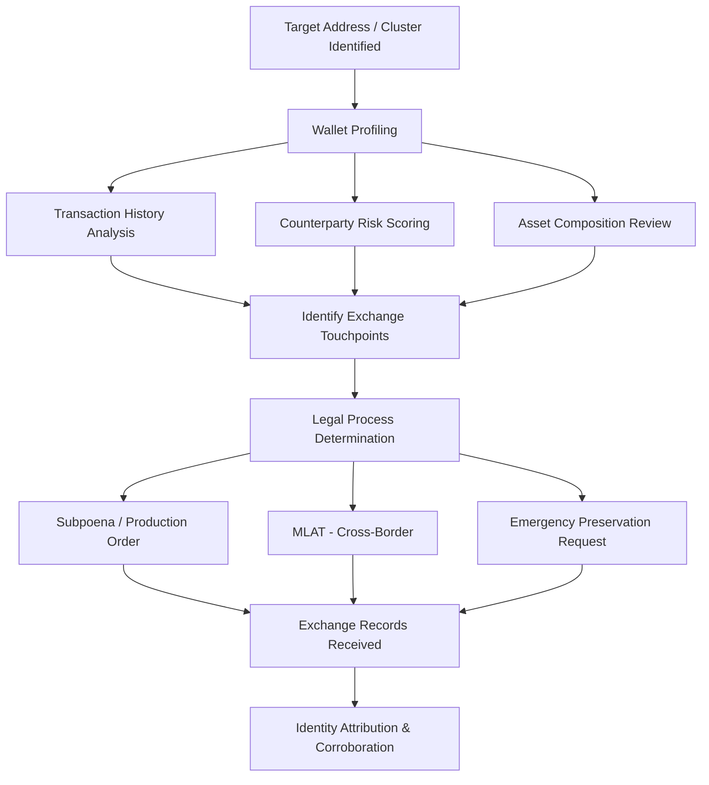
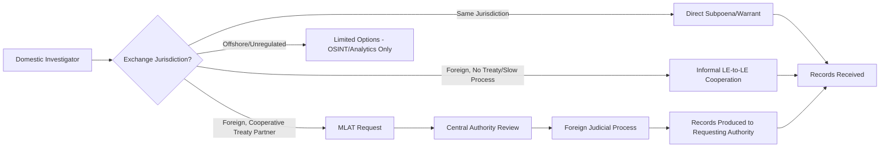

## Wallet Analysis and Exchange Cooperation

### Overview

Wallet analysis and exchange cooperation addresses the two complementary halves of converting on-chain tracing into an actionable, identity-attributed investigation: (1) deep analytical examination of wallet-level behavior, holdings, and transaction patterns to characterize an entity's activity and risk profile, and (2) the legal and procedural mechanisms for obtaining identity-linking records from centralized exchanges and Virtual Asset Service Providers (VASPs). Where prior topics in this chapter established how to trace value across the blockchain, this topic addresses the critical final step most investigations require: converting a pseudonymous cluster of addresses into a real-world identity capable of supporting prosecution, asset recovery, or regulatory action.

### Wallet Analysis Framework

**Key Points**

- **Wallet analysis** goes beyond single-transaction tracing to build a comprehensive behavioral and financial profile of a given address or entity cluster over time.
- Core analytical dimensions: transaction volume and frequency, counterparty diversity, holding period patterns (HODL vs. rapid turnover), interaction with known-risk entities (mixers, darknet markets, sanctioned addresses), and asset composition (native coin vs. tokens vs. NFTs).
- Wallet analysis typically precedes or runs parallel to formal exchange requests, since it determines *which* addresses warrant a subpoena and *what specific records* to request.

### Wallet Profiling Techniques

**Transaction pattern analysis:**

- **Frequency and volume trends**: sudden spikes in activity often correlate with specific events (receipt of illicit funds, liquidation ahead of legal action)
- **Counterparty diversity**: a wallet transacting with hundreds of unique addresses suggests a service (exchange, payment processor) rather than an individual; a wallet transacting with a small, stable set of counterparties suggests personal use
- **Dormancy and reactivation**: long dormant periods followed by sudden activity can indicate key recovery, ownership transfer, or coordinated cash-out timed to specific events (e.g., after a statute of limitations concern, or synchronized with co-conspirators)
- **Round-trip and circular transaction detection**: funds that move through multiple addresses and return to a related address, often indicative of wash trading, layering, or self-dealing

**Risk scoring via known-entity exposure:**

- Direct and indirect (multi-hop) exposure to labeled high-risk addresses (sanctioned entities, darknet markets, ransomware wallets, mixers) is quantified, typically as a percentage of total inbound/outbound value
- [Inference] Most commercial analytics platforms compute both **direct exposure** (funds received directly from a risk entity) and **indirect exposure** (funds received from an address that itself received funds from a risk entity, within a defined hop limit), though the specific hop-depth methodology and scoring weights are generally proprietary and vary by vendor.

**Asset composition review:**

- Token holdings can reveal DeFi protocol usage, NFT collecting behavior, or specific ecosystem affiliation relevant to jurisdiction or venue determination
- Stablecoin concentration (USDT, USDC) is often significant in cross-border fraud cases, since stablecoins are frequently used as a dollar-denominated settlement layer resistant to native-asset price volatility

### Exchange Touchpoint Identification

**Key Points**

- The critical investigative objective of wallet analysis is often identifying the specific **deposit address(es)** at a centralized exchange where traced funds terminate, since this is the point where pseudonymous blockchain data can be converted to real-world identity.
- Exchange deposit addresses are typically distinguishable from personal wallets by: high counterparty diversity (receiving from thousands of unrelated depositors), consolidation behavior (periodic sweeps to a smaller number of hot/cold wallet addresses), and, where available, commercial platform attribution labels.
- [Inference] Correctly distinguishing a genuine exchange deposit address from a peer-to-peer intermediary or another mixing service is important because it determines whether legal process should target a regulated VASP (with KYC obligations) versus a potentially uncooperative or unlicensed entity.

### Exchange Cooperation Mechanisms

| Mechanism | Use Case | Typical Timeline | Key Considerations |
| --- | --- | --- | --- |
| **Voluntary information sharing** | Exchange's own fraud/AML team proactively flags or shares with law enforcement | Fastest, often near-real-time | Depends entirely on exchange policy and existing relationships; not compellable |
| **Preservation letter / litigation hold request** | Urgent request to preserve records/freeze funds before formal legal process is finalized | Immediate (hours to days) | Does not compel production of records, only preservation; must be followed by formal process |
| **Subpoena (domestic)** | Compels production of KYC data, transaction logs, IP addresses, linked bank accounts | Weeks to months depending on jurisdiction and exchange responsiveness | Requires proper jurisdiction over the exchange entity; many exchanges have dedicated law enforcement request portals |
| **Search warrant** | Compels production with probable cause standard (criminal context); may compel more sensitive data | Weeks, requires judicial approval | Higher evidentiary threshold but stronger compulsion power |
| **Mutual Legal Assistance Treaty (MLAT) request** | Cross-border requests where the exchange is incorporated/operates outside the requesting jurisdiction | Months to years | Often the primary bottleneck in cross-border crypto investigations; some jurisdictions have expedited crypto-specific channels |
| **Civil discovery / third-party subpoena** | Private litigation seeking exchange records (e.g., asset recovery civil suits) | Weeks to months | Governed by civil procedure rules; exchange may object or require court order |
| **Asset freeze / restraining order** | Court order directing the exchange to freeze specific funds pending investigation/litigation | Days to weeks (expedited in urgent cases) | Distinct from records production — addresses fund preservation, not identity disclosure |

**Key Points**

- Given the speed at which crypto assets can be moved, **time-sensitive preservation requests** are frequently issued in parallel with, or immediately before, formal legal process to prevent dissipation while the compelling legal instrument is finalized.
- [Unverified] Specific response timelines vary enormously by exchange, jurisdiction, and the exchange's internal law enforcement liaison resourcing; larger, more established exchanges in regulated jurisdictions (US, EU, UK, Japan, Singapore) generally have more mature and faster-responding compliance teams than offshore or less-regulated platforms.

### Types of Records Typically Requested

**Key Points**

- **KYC/identity records**: full name, date of birth, government ID copies, proof of address, selfie/liveness verification data
- **Account activity logs**: login timestamps, IP addresses, device fingerprints, session history
- **Transaction records**: full deposit/withdrawal history including on-chain transaction hashes, internal (off-chain) transfers between platform users, and trading activity
- **Linked payment methods**: bank account details, linked payment cards, fiat on/off-ramp transaction records
- **Communications**: customer support tickets, chat logs (where retained and relevant)
- **Account linkage data**: referral relationships, shared device/IP usage across multiple accounts (relevant to identifying related or controlled accounts)

### Cross-Border Complications

**Key Points**

- **Jurisdictional determination** for a given exchange can be genuinely ambiguous: incorporation location, headquarters location, server location, and licensing jurisdiction may all differ, and some exchanges deliberately structure operations to complicate legal process.
- [Inference] The FATF (Financial Action Task Force) Travel Rule, requiring VASPs to share originator/beneficiary information for transfers above a threshold, is intended to improve cross-border traceability at the point of transfer, though implementation consistency and enforcement vary significantly by jurisdiction and is an evolving regulatory area.
- Some jurisdictions have established dedicated crypto-asset recovery units or expedited MLAT channels specifically to address the speed mismatch between rapid crypto movement and traditional cross-border legal process timelines.
- Uncooperative or offshore exchanges without meaningful regulatory nexus in the requesting jurisdiction may leave investigators reliant solely on on-chain analytics and OSINT, without a viable path to compelled identity disclosure.

### Corroboration and Multi-Source Identity Attribution

**Key Points**

- Exchange KYC data should not be treated as automatically conclusive — identity theft, synthetic identities, and "mule" accounts (where a legitimate KYC-verified account is used by someone else, knowingly or unknowingly) are recognized risks.
- Strong attribution typically corroborates exchange KYC data against: IP address consistency with other known activity, device fingerprint overlap with other accounts/investigations, linked bank account ownership, and behavioral consistency with the suspect's known patterns.
- [Inference] Building a defensible identity attribution generally benefits from triangulating at least two independent data sources (e.g., exchange KYC plus IP-login correlation, or exchange KYC plus linked bank account ownership) rather than relying on a single source, given the recognized risk of account takeover or synthetic identity use undermining a single-source conclusion.

### Common Investigative Pitfalls

**Key Points**

- Sending a broad, unfocused subpoena request rather than a scoped request tied to specific addresses/timeframes, resulting in slower response and potential objections
- Failing to issue a preservation request before formal legal process is finalized, risking fund dissipation or record deletion
- Treating KYC data as automatically conclusive of true ownership without corroborating IP, device, or banking data
- Misjudging exchange jurisdiction, leading to legal process directed at the wrong entity or authority
- Underestimating MLAT timelines in cross-border cases, creating case-management and statute-of-limitations risk
- Failing to distinguish an exchange's pooled hot wallet from an individual customer's actual holdings when reading on-chain balances

### Example

**Example**

Tracing funds from a business email compromise (BEC) fraud to a specific individual:

1. **Wallet profiling**: The destination cluster receiving diverted funds shows low counterparty diversity (consistent with individual use, not a service), rapid conversion to stablecoins upon receipt, and no history predating the fraud — consistent with a wallet created specifically to receive proceeds.
2. **Exchange touchpoint identification**: After several hops, funds are deposited to an address flagged by commercial attribution data as belonging to a mid-sized exchange licensed in a cooperative jurisdiction.
3. **Preservation request**: Given the speed of the fraud, investigators immediately send an emergency preservation letter to the exchange's law enforcement liaison team, requesting account and fund freezing pending formal legal process.
4. **Formal legal process**: A subpoena (domestic, since the exchange has a licensed entity in the requesting jurisdiction) is issued within days, requesting KYC records, login IP history, linked bank accounts, and full transaction logs for the identified account.
5. **Records received**: The exchange produces KYC documents showing an individual's name and ID, login IP logs showing consistent access from a specific geographic region, and a linked bank account used for a prior fiat withdrawal.
6. **Corroboration**: The linked bank account is cross-referenced against public records and found to match a name with known associations to the suspect identified through other investigative leads, and login IPs correlate with the suspect's known residential ISP — providing multi-source corroboration beyond the KYC record alone.
7. **Report documentation**: Findings are documented with the full on-chain trace (from prior tracing work), the specific legal process used to obtain exchange records, and an explicit corroboration section showing the independent data points supporting identity attribution.

### Related Topics

- Blockchain fundamentals for investigators
- Cryptocurrency transaction tracing techniques
- FATF Travel Rule and VASP compliance obligations
- Asset seizure, freezing orders, and civil/criminal forfeiture of digital assets
- Mutual Legal Assistance Treaty (MLAT) procedure for financial crime cases
- KYC/AML program design and customer due diligence standards
- OSINT techniques for cryptocurrency identity attribution
- Cryptocurrency mixers, tumblers, and obfuscation pattern analysis
- Expert witness standards and Daubert/Frye admissibility for blockchain evidence
- Cross-border digital asset recovery and repatriation mechanisms