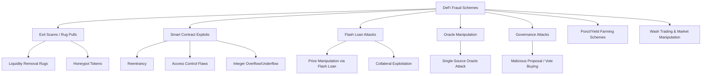
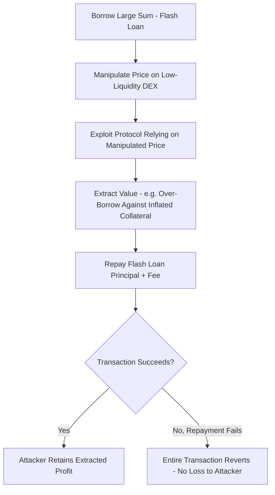

## Decentralized Finance Fraud Schemes

### Overview

Decentralized finance (DeFi) fraud schemes encompass the distinct fraud typologies enabled by permissionless, smart-contract-based financial protocols that operate without traditional intermediaries. Unlike centralized exchange fraud (which resembles traditional financial crime with a digital wrapper), DeFi fraud frequently exploits the specific technical properties of smart contracts, liquidity pools, and composable protocols — code vulnerabilities, governance mechanisms, and the absence of a central custodian to reverse transactions. For forensic accountants and investigators, DeFi fraud requires combining traditional fraud-triangle analysis with smart contract code review, on-chain event log interpretation, and an understanding of automated market maker (AMM) mechanics.

### DeFi Fraud Taxonomy

### Rug Pulls and Exit Scams

**Key Points**

- A **rug pull** occurs when project developers abandon a project and abscond with investor funds, typically by exploiting privileged control retained over the protocol or its liquidity.
- **Liquidity removal rugs**: developers create a token and pair it with a legitimate asset (e.g., ETH) in a liquidity pool, attract investment, then withdraw the paired legitimate asset (removing liquidity), leaving investors holding a worthless token with no way to sell.
- **Honeypot tokens**: contract code is written so that only the deployer's address (or a whitelist) can sell the token, while other buyers can purchase but never sell — victims see paper gains that can never be realized.
- **Hidden mint functions / backdoors**: contract retains an undisclosed function allowing the developer to mint unlimited new tokens, diluting holder value, or to directly drain pooled funds.

**Detection indicators (red flags):**

- Liquidity not locked (no time-locked liquidity pool tokens) or locked for a suspiciously short period
- Concentrated token holder distribution (a small number of wallets holding a large percentage of supply)
- Unverified or unaudited contract source code
- Ownership not renounced, or renouncement is superficial while retaining functional backdoors
- Anonymous or unverifiable development team
- [Inference] Contract functions with misleading or obfuscated names (e.g., a `setFee` function that can effectively set a 100% transfer tax) are a common pattern in honeypot-style rugs, since surface-level code review by non-technical investors often misses functional intent buried in seemingly innocuous function logic.

### Smart Contract Exploits

**Key Points**

- **Reentrancy attacks**: a malicious contract exploits a vulnerable contract's failure to update internal state before making an external call, allowing the attacker to recursively call back into the vulnerable function and drain funds before the balance is properly decremented. This was the mechanism behind the 2016 DAO hack.
- **Access control flaws**: functions intended to be restricted (e.g., `onlyOwner` modifiers) are missing, improperly implemented, or bypassable, allowing unauthorized parties to call privileged functions (minting, fund withdrawal, parameter changes).
- **Integer overflow/underflow**: arithmetic operations exceed a variable's storage capacity, wrapping to an unexpected value — largely mitigated in modern Solidity (0.8.x+) by default overflow checks, but remains a risk in older contracts or unchecked arithmetic blocks.
- **Logic errors in custom code**: bespoke protocol logic (fee calculations, reward distribution, collateral ratios) containing exploitable edge cases not caught by standard security audits.

$$\text{Reentrancy Exploit Pattern:} \quad \text{Call External Contract} \rightarrow \text{Attacker Re-enters Before} \rightarrow \text{State Update Completes}$$

**[Inference]** The persistence of reentrancy as an attack vector despite being well-documented since 2016 suggests that audit coverage and secure-by-default patterns (checks-effects-interactions ordering, reentrancy guards) are not uniformly applied across the rapidly growing volume of newly deployed protocols, though this is a general industry observation rather than a claim about any specific protocol.

### Flash Loan Attacks

**Key Points**

- **Flash loans** allow borrowing large sums of capital with no collateral, provided the loan is borrowed and repaid within a single atomic transaction — if repayment fails, the entire transaction reverts as if it never occurred.
- This mechanism, legitimate in its intended use (arbitrage, collateral swaps, liquidations), is frequently weaponized to temporarily acquire enough capital to manipulate a market or protocol state within a single transaction, extract value, and repay the loan — all atomically, with no capital risk to the attacker.
- **Typical flash loan attack pattern**: borrow a large sum → use it to manipulate an asset's price on a low-liquidity DEX or a vulnerable price oracle → exploit a protocol that references that manipulated price (e.g., to borrow against artificially inflated collateral value, or trigger favorable liquidation terms) → repay the flash loan → retain the extracted profit.

### Oracle Manipulation

**Key Points**

- **Price oracles** feed external price data to on-chain protocols (lending platforms, derivatives, stablecoins); if a protocol relies on a manipulable price source, an attacker can distort the reported price to their advantage.
- **Single-source/spot-price oracle attacks**: protocols that derive price directly from a single DEX's spot price (rather than a time-weighted average or multi-source aggregation) are vulnerable to flash-loan-funded price manipulation within a single block.
- **Time-Weighted Average Price (TWAP) oracles** and **decentralized oracle networks** (e.g., Chainlink-style multi-node aggregation) are standard mitigations, since they require sustained manipulation across multiple blocks or multiple independent data sources, raising attack cost substantially.
- [Inference] Forensic analysis of an oracle manipulation incident typically requires reconstructing the exact price feed the exploited protocol referenced at the moment of exploitation and comparing it against the "true" market price across other venues at that timestamp, to quantify the extent of manipulation and resulting loss.

### Governance Attacks

**Key Points**

- Many DeFi protocols are governed by token-holder voting (DAOs); an attacker who acquires sufficient governance tokens (often via flash loan, since voting power can sometimes be borrowed within a single block depending on the governance contract's snapshot mechanism) can pass malicious proposals.
- **Malicious proposal attacks**: a proposal disguised as routine (parameter adjustment, treasury allocation) contains hidden logic to drain treasury funds or grant the attacker privileged access.
- **Vote buying / flash-loan governance attacks**: where governance snapshots do not account for flash-loaned tokens, an attacker can temporarily acquire majority voting power, pass a proposal, and return the borrowed tokens — a protocol design flaw specifically addressed by snapshot-based (rather than real-time balance-based) voting mechanisms in well-designed governance systems.

### Yield Farming and Ponzi-Structured Schemes

**Key Points**

- Some "yield farming" protocols promise unsustainably high returns funded not by genuine protocol revenue but by new depositor inflows — structurally equivalent to a traditional Ponzi scheme, wrapped in DeFi terminology.
- Detection indicators mirror traditional Ponzi red flags: returns not correlated to any identifiable revenue-generating activity, heavy reliance on new deposits to pay existing "yields," aggressive referral/recruitment incentive structures, and opacity around actual treasury reserve composition.
- **Algorithmic stablecoin collapse risk** (as distinct from pure fraud, though sometimes alleged to involve fraudulent misrepresentation) occurs when a stablecoin's peg mechanism relies on reflexive tokenomics that can enter a death spiral under sufficient sell pressure — forensic analysis in such cases focuses on whether risk disclosures misrepresented the mechanism's actual stability properties.
- [Inference] Distinguishing a genuine (if high-risk) yield strategy from a fraudulent Ponzi structure typically requires forensic reconstruction of the protocol's actual revenue sources against its distributed yields, since publicly stated APY figures alone do not reveal the underlying funding mechanism.

### Wash Trading and Market Manipulation

**Key Points**

- **Wash trading** involves an entity (or colluding entities) trading with itself to create artificial volume, often to qualify for liquidity mining rewards, inflate a token's apparent trading activity, or manipulate price on low-liquidity pairs.
- Common in NFT markets as well as token trading, where NFT-to-NFT or NFT-to-token transactions between related wallets create the appearance of genuine market demand.
- **Detection approach**: identify circular fund flows (Address A → Address B → Address A, or through a short cycle of related addresses), timing correlation inconsistent with organic trading, and counterparty concentration (the vast majority of an address's trading volume occurring with a small set of related addresses).

### Investigative and Forensic Methodology for DeFi Fraud

**Key Points**

- **Smart contract code review**: examining verified source code (where available) on block explorers for function-level red flags — unrestricted minting, hidden owner privileges, disproportionate fee structures, pausable/blacklist functions that could freeze victim funds selectively.
- **Event log reconstruction**: DeFi transactions frequently involve multiple internal transfers and contract interactions within a single top-level transaction; forensic reconstruction requires parsing emitted events (e.g., `Transfer`, `Swap`, `Mint`, `Burn`) rather than relying solely on the top-level transaction summary.
- **Liquidity pool analysis**: tracking pool reserve changes over time to identify sudden, large liquidity withdrawals characteristic of rug pulls.
- **Cross-protocol correlation**: many exploits involve multiple protocols in sequence (borrow from Protocol A, manipulate price on DEX B, exploit lending logic on Protocol C) — full reconstruction requires tracing across all involved contracts within the exploit transaction(s).
- [Inference] Given that DeFi exploits are frequently executed and completed within a single atomic transaction or a very tight block range, the forensic timeline is often measured in seconds rather than the days-to-months timeline typical of traditional financial fraud, which shifts investigative emphasis toward rapid transaction-level reconstruction over extended behavioral pattern analysis.

### Common Investigative Pitfalls

**Key Points**

- Reviewing only the top-level transaction without decomposing internal/trace-level calls, missing the actual exploit mechanism
- Failing to distinguish a genuine protocol design flaw/bug (exploited without deceptive intent, arguably a security vulnerability) from deliberate fraudulent design (intentional backdoor) — this distinction can materially affect legal characterization
- Underestimating the speed and irreversibility of DeFi exploits, delaying preservation/freeze requests to cooperating exchanges where funds are ultimately routed
- Applying traditional Ponzi-detection timelines (months of financial statement analysis) to fast-moving DeFi schemes that may collapse within days or hours of inception
- Overlooking governance mechanisms as an attack vector when analyzing protocol treasury losses

### Example

**Example**

A lending protocol experiences a $12M loss attributed to a suspected exploit:

1. **Initial triage**: The protocol's TVL (total value locked) drops sharply within a single block; the transaction is flagged by monitoring and the on-chain forensic investigation begins immediately given the atomic, irreversible nature of the loss.
2. **Trace-level decomposition**: The exploit transaction is decomposed via trace API, revealing the attacker: (a) took out a flash loan of $50M in a stablecoin, (b) used it to swap heavily on a low-liquidity DEX pool, artificially depressing the price of the protocol's collateral asset as reported by its spot-price oracle, (c) used the manipulated low price to trigger favorable liquidation terms on existing positions, extracting excess collateral, (d) repaid the flash loan, netting $12M profit — all within one transaction.
3. **Code review**: Post-incident review of the protocol's (verified) oracle integration confirms it referenced a single DEX's spot price with no TWAP smoothing or multi-source aggregation — corroborating the mechanism inferred from trace analysis.
4. **Fund tracing**: The extracted $12M is traced through several hops, including a cross-chain bridge, before reaching a centralized exchange deposit address.
5. **Exchange cooperation**: A preservation request is issued immediately given the time-sensitive nature, followed by formal legal process seeking KYC and account data.
6. **Report characterization**: The forensic report distinguishes this as a deliberate market manipulation exploit of a design flaw (spot-price oracle dependency) rather than a rug pull or intentional backdoor, since the protocol's own code contained no evidence of privileged developer access being used — a legally relevant distinction for how the incident is characterized in any subsequent proceeding.

### Related Topics

- Blockchain fundamentals for investigators
- Cryptocurrency transaction tracing techniques
- Wallet analysis and exchange cooperation
- Smart contract audit methodology and common vulnerability classes (SWC Registry)
- NFT fraud and wash trading detection
- Flash loan mechanics and DeFi lending protocol architecture
- Decentralized oracle network design (Chainlink and alternatives)
- DAO governance structures and treasury management risk
- Algorithmic stablecoin mechanism design and depeg forensic analysis
- Digital asset incident response and post-exploit remediation frameworks