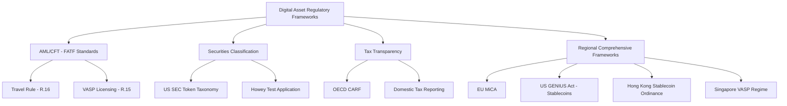
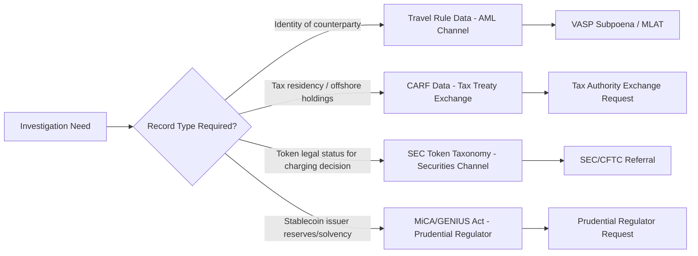

## Regulatory Frameworks for Digital Asset Investigations

### Overview

Regulatory frameworks for digital asset investigations comprise the overlapping international, national, and sector-specific legal instruments that define reporting obligations, licensing requirements, and investigative/enforcement authority over virtual assets and the entities that service them. For forensic accountants, this framework layer is not merely background — it determines which records must legally exist (and therefore can be subpoenaed), which entities are regulated (and therefore have compliance obligations that create an evidentiary trail), and which legal instruments (MLATs, production orders, freezing orders) are available to compel cooperation. As of 2026, this landscape has shifted from a fragmented, enforcement-driven patchwork toward converging, codified standards across AML, securities, and tax domains.

### Regulatory Framework Landscape

### FATF Standards: The AML/CFT Baseline

**Key Points**

- The **Financial Action Task Force (FATF)** sets the global floor for AML/CFT treatment of virtual assets through **Recommendation 15** (requiring jurisdictions to regulate/license Virtual Asset Service Providers, VASPs) and **Recommendation 16**, known as the **Travel Rule**, which requires VASPs to collect, verify, and transmit originator and beneficiary information (names, addresses, dates of birth for natural persons, wallet identifiers) for qualifying transfers.
- As of January 2026, 42 countries have fully implemented the Travel Rule, up from 29 in 2024, and 85 of 117 surveyed jurisdictions have passed or are actively developing legislation. The EU's Transfer of Funds Regulation, operational since December 2024, creates a unified Travel Rule framework across all member states, and the UK has been enforcing its version since September 2023 under FCA guidance. [blockeden](https://blockeden.xyz/blog/2026/03/20/2026-crypto-implementation-year-genius-act-mica-fatf-global-enforcement/)[blockeden](https://blockeden.xyz/blog/2026/03/20/2026-crypto-implementation-year-genius-act-mica-fatf-global-enforcement/)
- Roughly 59% of jurisdictions with Travel Rule legislation have not yet issued supervisory findings or enforcement actions, creating a patchwork where well-capitalized exchanges in regulated markets bear the full compliance cost while competitors in lagging jurisdictions face no consequences. [blockeden](https://blockeden.xyz/blog/2026/03/20/2026-crypto-implementation-year-genius-act-mica-fatf-global-enforcement/)
- FATF's 2026 targeted report found that only 34% of jurisdictions are largely compliant with Recommendation 15, while 22% remain non-compliant, and flagged scam investments, North Korean state-linked hacking, and DeFi regulatory gaps as key ongoing risks. [kucoin](https://www.kucoin.com/news/flash/fatf-releases-2026-virtual-asset-regulatory-report-global-compliance-progress-and-emerging-risks)
- The share of jurisdictions with a clear VASP regulatory path rose to 89% (128 of 144) in 2026, up from 82% in 2025, though the share choosing complete or partial VASP prohibition has also risen steadily, from 11% in 2023 to 23% in 2026. [kucoin](https://www.kucoin.com/news/flash/fatf-releases-2026-virtual-asset-regulatory-report-global-compliance-progress-and-emerging-risks)
- FATF's March 2026 targeted report on stablecoins and unhosted wallets found stablecoins accounted for 84% of illicit virtual-asset transaction volume in the prior year. [blockeden](https://blockeden.xyz/blog/tags/compliance/page/3)
- **Investigative relevance**: because VASPs in Travel-Rule-compliant jurisdictions must retain originator/beneficiary data, this creates a discoverable record even for transfers between two regulated platforms — a materially different evidentiary posture than a transfer to an unhosted wallet, where VASPs must still collect originator/beneficiary information for their own customer even without a counterparty VASP, and blockchain analytics are mandated as a core mitigation for peer-to-peer exposure risk. [gdf](https://www.gdf.io/wp-content/uploads/2026/06/Digital-Finance-Forum-Q2.pptx.pdf)

### Securities Classification: The US SEC Token Taxonomy

**Key Points**

- On March 3, 2026, the SEC submitted a formal four-category token classification framework for interagency review — the first Commission-level crypto classification in the agency's history, carrying substantially greater legal weight than prior staff guidance or no-action letters. [blockeden](https://blockeden.xyz/blog/2026/03/09/sec-token-taxonomy-crypto-classification-framework/)
- This followed SEC Chair Paul Atkins' November 2025 announcement of "Project Crypto," and a January 2026 joint initiative with the CFTC aimed at eliminating overlapping jurisdiction and duplicative registration requirements between the two agencies. [blockeden](https://blockeden.xyz/blog/2026/03/09/sec-token-taxonomy-crypto-classification-framework/)
- The taxonomy establishes categories including digital commodities, digital collectibles, and digital tools as non-securities, alongside a category for tokens conveying enforceable profit or governance rights that remain securities. [blockeden](https://blockeden.xyz/blog/2026/03/20/2026-crypto-implementation-year-genius-act-mica-fatf-global-enforcement/)
- [Inference] For investigators, the taxonomy's practical significance is that it changes which regulator has primary jurisdiction over a given token-related fraud (SEC for securities-classified tokens, CFTC for commodity-classified tokens), which in turn affects which agency's investigative and subpoena powers are the natural first avenue — though as an interagency-review-stage framework rather than finalized rule as of this writing, its ultimate legal effect should be independently verified against SEC releases at the time of any specific investigation.

### Tax Transparency: OECD CARF

**Key Points**

- The **Crypto-Asset Reporting Framework (CARF)**, developed by the OECD at the G20's request, extends automatic cross-border exchange of tax information to crypto-asset transactions, applying to **Reporting Crypto-Asset Service Providers (RCASPs)** — individuals and entities offering services to exchange or transfer crypto-assets for customers, or operating a trading platform, including exchanges, distributors, brokers, and dealers. [eyfinancialservicesthoughtgallery](https://eyfinancialservicesthoughtgallery.ie/wp-content/uploads/2025/08/V3_EY-IE_Crypto-Asset-Reporting-Framework_July-2025-CARF-1.pdf)
- Reporting obligations began in 2026, with the first reports generally to be filed in 2027, covering 2026 calendar-year activity. As of July 2026, 76 jurisdictions were formally committed to implementing CARF, with most expected to begin automatic exchanges by 2027. [paymentexpert](https://paymentexpert.com/2026/01/05/crypto-asset-reporting-framework/)[six-group](https://www.six-group.com/en/products-services/financial-information/knowledge-hub/tax-regulatory-insights/carf.html)
- CARF requires Crypto Asset Service Providers to report crypto asset transaction information to domestic tax authorities, which may then be exchanged with other participating jurisdictions to support international tax compliance; individual taxpayers do not report directly under CARF and continue declaring crypto activity through normal income tax returns. [sars](https://www.sars.gov.za/latest-news/the-carf-takes-effect-bringing-transparency-to-crypto-asset-reporting/)
- **Investigative relevance**: CARF-mandated RCASP records (customer due diligence data, transaction-level reporting) create a parallel, tax-authority-accessible data source distinct from AML/Travel-Rule records, potentially reachable through tax information exchange channels even where criminal MLAT processes are slow or unavailable. [Inference] Because first exchanges are not expected until 2027, the practical investigative utility of CARF-sourced cross-border data is likely to expand materially over the following several years as the exchange network matures, rather than being immediately available at full scope in 2026.

### Regional Comprehensive Frameworks

| Framework | Jurisdiction | Scope | 2026 Status |
| --- | --- | --- | --- |
| **MiCA** (Markets in Crypto-Assets Regulation) | European Union | Classifies digital assets into asset-referenced tokens (ARTs), e-money tokens (EMTs), and other crypto assets, each with distinct valuation, redemption, counterparty exposure, and disclosure obligations | Transitional grace period expires mid-2026 |
| **GENIUS Act** | United States | Federal stablecoin issuance and reserve framework | Implementing rules required by July 2026 |
| **Stablecoin Ordinance** | Hong Kong | Licensing framework for fiat-referenced stablecoin issuers, enacted August 2025 | First batch of licenses expected early 2026 |
| **VASP regime / Mutual Evaluation** | Singapore | Comprehensive VASP licensing and AML/CFT supervision | Completed fifth-round FATF Mutual Evaluation in 2025, first review to fully assess virtual-asset AML/CFT effectiveness |
| **Virtual Asset User Protection Act** | South Korea | Investor protection and market conduct | First prosecutions underway; competing stablecoin bills advancing |
| **EU AMLA** (Anti-Money Laundering Authority) | European Union | Direct supervision of largest cross-border crypto firms | Operationalizing direct supervisory capacity in 2026 |

**Key Points**

- [Inference] The near-simultaneous 2026 enforcement onset of MiCA's grace period expiry, GENIUS Act implementing rules, and Travel Rule maturation across 42+ jurisdictions represents a distinct shift from the pre-2026 enforcement-by-litigation approach in most major markets toward codified, ex-ante compliance obligations — this generally benefits investigators by expanding the universe of records VASPs are legally required to generate and retain, even before any specific investigation begins.

### Investigative Implications by Framework Layer

**Key Points**

- **Choosing the correct legal channel** depends on which regulatory regime generated the record sought: AML/Travel-Rule data typically requires a criminal or civil subpoena/MLAT route through the VASP directly; CARF data may be reachable via tax treaty information exchange mechanisms distinct from criminal process; securities-classification questions affect which US agency (SEC vs. CFTC) has natural enforcement jurisdiction and therefore investigative referral priority.
- **Jurisdiction shopping and regulatory arbitrage** remain a persistent investigative complication: well-capitalized exchanges in regulated markets bear the full cost of Travel Rule compliance while competitors in jurisdictions that have passed legislation without building supervisory infrastructure face no practical consequences, meaning the mere existence of a jurisdiction's Travel Rule legislation does not guarantee the VASP in question is actually generating or retaining the expected records. [blockeden](https://blockeden.xyz/blog/2026/03/20/2026-crypto-implementation-year-genius-act-mica-fatf-global-enforcement/)
- **Non-compliant or prohibition jurisdictions**: approximately 23% of jurisdictions in 2026 have chosen complete or partial VASP prohibition rather than a licensing path — investigations involving VASPs domiciled in these jurisdictions typically have no meaningful formal cooperation channel and rely primarily on blockchain analytics and OSINT rather than compelled record production. [kucoin](https://www.kucoin.com/news/flash/fatf-releases-2026-virtual-asset-regulatory-report-global-compliance-progress-and-emerging-risks)

### Common Investigative Pitfalls

**Key Points**

- Assuming Travel Rule legislation existing in a jurisdiction means supervisory enforcement and actual VASP compliance are occurring — a majority of jurisdictions with Travel Rule legislation have not yet issued supervisory findings or enforcement actions [blockeden](https://blockeden.xyz/blog/2026/03/20/2026-crypto-implementation-year-genius-act-mica-fatf-global-enforcement/)
- Directing legal process at the wrong regulator due to unresolved or evolving token securities classification, particularly for assets predating the 2026 SEC taxonomy
- Underestimating the multi-year lag in CARF's practical utility, given first automatic exchanges are not expected until 2027 despite 2026 reporting obligations beginning
- Failing to distinguish AML/CFT-driven record retention (identity of counterparty) from tax-driven record retention (CARF/RCASP reporting) when scoping a legal request, resulting in requests to the wrong regulatory contact within a VASP's compliance function
- Treating regulatory framework status as static — given the pace of change through 2026 (MiCA grace period expiry, GENIUS Act rules, SEC taxonomy finalization), investigators should verify current framework status at the time of each investigation rather than relying on prior-year understanding

### Example

**Example**

An investigator is building a case involving a stablecoin-denominated fraud scheme with counterparties across the US, EU, and an offshore jurisdiction:

1. **AML channel**: The US-based and EU-based exchanges involved are both Travel-Rule-compliant VASPs (US under FinCEN rules, EU under the Transfer of Funds Regulation); formal subpoena/production order requests are directed to each, seeking originator/beneficiary data for the flagged transfers.
2. **Securities classification check**: Counsel confirms the token involved falls under the SEC's 2026 taxonomy as a "digital commodity" rather than a security, directing the case's federal referral toward CFTC rather than SEC enforcement channels.
3. **Tax channel**: Given suspected offshore asset concealment, the investigative team separately flags the matter for potential CARF-based tax information exchange, while noting internally that any such exchange may not be practically available until 2027 reporting cycles mature.
4. **Offshore jurisdiction gap**: The third counterparty exchange operates in a jurisdiction that has chosen VASP prohibition rather than licensing; no formal legal process channel exists, so the investigation relies on blockchain analytics-based attribution and any voluntary cooperation the offshore platform may offer.
5. **Documentation**: The final report explicitly documents which evidentiary sources derive from compelled legal process (US/EU Travel Rule data) versus analytics-based inference (offshore jurisdiction), reflecting the differing evidentiary weight each channel supports.

### Related Topics

- Blockchain fundamentals for investigators
- Cryptocurrency transaction tracing techniques
- Wallet analysis and exchange cooperation
- Decentralized finance fraud schemes
- FATF Mutual Evaluations and jurisdictional AML/CFT risk assessment
- Stablecoin reserve auditing and prudential compliance
- Cross-border tax information exchange mechanisms (CRS and CARF)
- US securities law application to digital assets (Howey Test evolution, SEC/CFTC jurisdiction)
- MiCA compliance obligations for EU-facing crypto asset service providers
- Sanctions and OFAC compliance in the digital asset context

### Related Topics

- Blockchain fundamentals for investigators
- Cryptocurrency transaction tracing techniques
- Wallet analysis and exchange cooperation
- Decentralized finance fraud schemes
- FATF Mutual Evaluation methodology and jurisdictional risk scoring
- Stablecoin reserve auditing and prudential regulatory compliance
- Cross-border tax data exchange mechanisms (CRS, CARF, and bilateral treaties)
- US digital asset securities classification (SEC/CFTC jurisdictional boundaries)
- Sanctions compliance and OFAC SDN screening for VASPs
- Regulatory arbitrage detection in cross-jurisdictional digital asset structuring