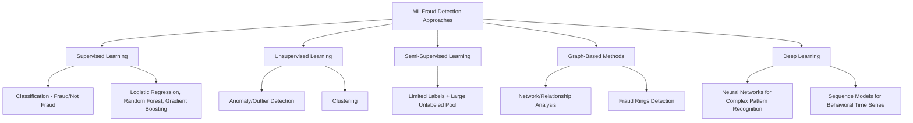
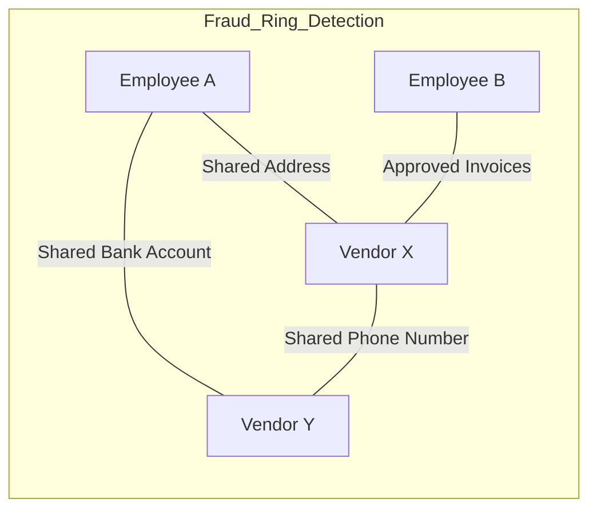

## Machine Learning Applications in Fraud Detection

### Overview

Machine learning applications in fraud detection encompass the algorithmic techniques used to identify anomalous financial patterns, classify transactions or entities as fraudulent, and prioritize investigative resources at a scale and speed unreachable through manual rule-based review alone. For forensic accountants, ML is not a replacement for professional judgment and investigative methodology but a force multiplier: it surfaces candidate anomalies from large datasets that human investigators then evaluate, corroborate, and translate into defensible findings. Understanding the underlying techniques — their assumptions, failure modes, and evidentiary limitations — is essential both for deploying these tools effectively and for critically evaluating ML-driven outputs (including those produced by opposing experts or vendor platforms) in an investigative or litigation context.

### ML Approaches to Fraud Detection

### Supervised Learning Methods

**Key Points**

- **Supervised learning** trains a model on historical, labeled data (transactions or entities already confirmed as fraudulent or legitimate) to predict labels on new, unseen data.
- **Logistic regression**: a baseline, highly interpretable model estimating the probability of fraud as a function of input features; coefficients directly indicate each feature's directional contribution, which is valuable when model explainability is required for regulatory or litigation purposes.

$$P(\text{fraud}) = \frac{1}{1 + e^{-(\beta_0 + \beta_1 x_1 + \beta_2 x_2 + \cdots + \beta_n x_n)}}$$

- **Decision trees and random forests**: trees split data recursively on feature thresholds to classify observations; random forests aggregate many trees trained on random data/feature subsets (bagging) to reduce overfitting and improve generalization. Feature importance scores from random forests are commonly used to identify which variables most strongly drive fraud classification.
- **Gradient boosting machines** (XGBoost, LightGBM, CatBoost): build trees sequentially, with each new tree correcting the errors of prior trees; these are widely used in production fraud systems due to strong predictive performance on structured/tabular financial data, which is the dominant data type in most forensic accounting contexts.
- **Support Vector Machines (SVMs)**: find an optimal separating boundary (hyperplane) between fraud and non-fraud classes in feature space, effective in high-dimensional settings but less commonly used in modern production systems compared to gradient boosting.

**Key Points**

- [Inference] The strong dominance of gradient boosting methods over deep neural networks for structured/tabular fraud data (as opposed to unstructured data like images or text) is a widely observed pattern in the applied ML literature, generally attributed to tabular data's lack of the spatial/sequential structure that deep learning architectures are specifically designed to exploit — though the relative performance gap depends on dataset size, feature engineering quality, and the specific fraud typology being modeled.

### Unsupervised and Anomaly Detection Methods

**Key Points**

- **Unsupervised learning** is critical in fraud detection because labeled fraud examples are typically scarce, and fraud schemes evolve — a purely supervised model can only detect patterns resembling previously identified fraud, missing novel schemes.
- **Isolation Forest**: isolates anomalies by randomly partitioning data; anomalous points require fewer partitions to isolate (since they are "few and different"), producing an anomaly score without requiring labeled data.
- **Autoencoders**: neural networks trained to reconstruct their own input through a compressed (bottleneck) representation; trained on predominantly legitimate transactions, they learn to reconstruct normal patterns well but produce high reconstruction error on anomalous (potentially fraudulent) transactions.

$$\text{Reconstruction Error} = \| x - \hat{x} \|^2$$

- **DBSCAN and density-based clustering**: identifies dense regions of "normal" behavior and flags points in sparse regions (that don't fit any cluster) as potential outliers, useful for detecting fraud that doesn't conform to any typical transaction pattern.
- **Statistical outlier methods**: z-score thresholds, Mahalanobis distance (accounting for feature correlation), and Benford's Law digit-distribution testing remain foundational, computationally cheap first-pass screening tools, often used to generate candidate populations before more complex ML methods are applied.

$$\text{Mahalanobis Distance} = \sqrt{(x - \mu)^T \Sigma^{-1} (x - \mu)}$$

**Key Points**

- [Inference] A practical implication of the label-scarcity problem is that many production fraud systems combine unsupervised anomaly scoring (to catch novel patterns) with supervised classification (to leverage known fraud patterns efficiently) in an ensemble or cascaded architecture, rather than relying on either approach alone.

### Graph-Based and Network Analysis Methods

**Key Points**

- Fraud frequently involves **coordinated actors** (collusion rings, shell company networks, money laundering structures) that are poorly captured by transaction-level, entity-independent models, since the fraud signal lies in the *relationships* between entities, not any single entity's attributes.
- **Graph representation**: entities (individuals, accounts, vendors, addresses) are modeled as nodes; relationships (transactions, shared addresses, shared phone numbers, shared bank accounts) are modeled as edges.
- **Community detection algorithms** (e.g., Louvain method) identify densely interconnected clusters of entities, which can reveal fraud rings, related-party networks, or collusive vendor-employee relationships not apparent from any individual transaction.
- **Graph Neural Networks (GNNs)**: extend deep learning to graph-structured data, learning entity representations that incorporate both an entity's own features and the features/behavior of its connected neighbors — increasingly used in advanced fraud platforms to detect coordinated fraud patterns that evade entity-independent models.
- [Inference] Graph-based methods are particularly well-suited to procurement fraud, vendor kickback schemes, and money laundering typology detection specifically because these fraud types are structurally relational (requiring coordination between at least two parties) rather than purely behavioral (a single actor's anomalous pattern), which is a core reason forensic accounting practice has increasingly incorporated network analysis alongside traditional transaction testing.

### Deep Learning and Sequence Models

**Key Points**

- **Recurrent Neural Networks (RNNs) and LSTMs (Long Short-Term Memory networks)**: designed to process sequential data, capturing a customer's or account's behavioral pattern over time — useful for detecting fraud that manifests as a deviation from an entity's own historical behavior rather than an absolute anomaly.
- **Transformer-based architectures**: increasingly applied to transaction sequences, leveraging attention mechanisms to weigh the relevance of different historical transactions when assessing a new one, analogous to their use in natural language processing.
- [Inference] Deep learning approaches generally require substantially larger labeled datasets and greater computational infrastructure than gradient boosting methods to achieve comparable or superior performance, which is a practical reason many mid-sized organizations' fraud programs rely primarily on gradient boosting and reserve deep learning for large-scale, well-resourced enterprise or platform-level deployments (e.g., major payment processors, large banks).

### Feature Engineering for Financial Fraud Detection

**Key Points**

- Model performance in fraud detection is frequently driven more by feature engineering quality than by algorithm choice — domain-informed features encode forensic accounting knowledge directly into the model's inputs.
- **Common feature categories:**
  - **Velocity features**: transaction frequency/volume within rolling time windows (e.g., number of transactions in the past hour/day), capturing burst patterns characteristic of account takeover or rapid cash-out
  - **Behavioral deviation features**: how far a given transaction deviates from an entity's own historical baseline (amount, time of day, counterparty, geography)
  - **Network/relationship features**: derived from graph analysis (e.g., number of shared attributes with known-fraudulent entities, centrality scores within a transaction network)
  - **Round-number and threshold-proximity features**: transactions clustered near approval thresholds or at suspiciously round amounts
  - **Benford's Law conformity scores**: deviation of a population's leading-digit distribution from the expected logarithmic distribution
  - **Text-derived features**: from invoice descriptions, vendor names, or transaction memos, using natural language processing techniques (keyword flagging, embedding similarity to known fraudulent language patterns)

### Model Evaluation for Imbalanced Fraud Data

**Key Points**

- Fraud is typically a **rare-event classification problem** — legitimate transactions vastly outnumber fraudulent ones, which materially affects appropriate evaluation methodology.
- **Accuracy is a misleading metric** in this context: a model predicting "not fraud" for every transaction can achieve high accuracy while catching zero actual fraud.
- **Precision and recall** are the standard evaluation metrics: precision measures what proportion of flagged cases are actually fraudulent (minimizing false positives, which waste investigative resources); recall measures what proportion of actual fraud cases are correctly flagged (minimizing false negatives, which represent undetected fraud).

$$\text{Precision} = \frac{TP}{TP + FP} \qquad \text{Recall} = \frac{TP}{TP + FN}$$

$$F_1 = 2 \times \frac{\text{Precision} \times \text{Recall}}{\text{Precision} + \text{Recall}}$$

- **Precision-Recall (PR) curves** are generally preferred over ROC curves for highly imbalanced fraud datasets, since PR curves are more sensitive to performance on the minority (fraud) class.
- **Techniques for class imbalance**: oversampling the minority class (e.g., SMOTE — Synthetic Minority Oversampling Technique), undersampling the majority class, class-weighted loss functions, and anomaly-detection framing (treating fraud as "rare/novel" rather than as a standard classification problem).
- [Inference] The appropriate precision/recall tradeoff point is fundamentally a business and risk-tolerance decision, not a purely statistical one — the acceptable false-positive rate depends on available investigative capacity, while the acceptable false-negative rate depends on the cost/materiality of undetected fraud, meaning model threshold-setting should generally involve the investigative or compliance stakeholders, not only data science teams.

### Model Interpretability and Evidentiary Considerations

**Key Points**

- **Explainability techniques** are important in forensic contexts because a model output alone ("this transaction scored 0.87 fraud probability") does not constitute an evidentiary finding — the underlying factual basis must be articulable.
- **SHAP (SHapley Additive exPlanations)** values decompose an individual prediction into each feature's contribution, providing a consistent, theoretically grounded way to explain why a specific transaction was flagged.
- **LIME (Local Interpretable Model-agnostic Explanations)** approximates a complex model's behavior locally (around a specific prediction) with a simpler, interpretable model, offering another route to case-level explanation.
- [Inference] Given the evidentiary and regulatory scrutiny applied to fraud findings, models used to support formal investigative conclusions (as opposed to purely internal triage/prioritization) generally benefit from being paired with an interpretability layer, since a "black box" score alone is unlikely to satisfy the reasoned, fact-based standard expected of forensic accounting work product — though the degree of interpretability required varies by the intended use (internal triage tool vs. formal litigation support).

### Common Pitfalls and Limitations

**Key Points**

- **Data leakage**: including features that would not be available at actual prediction time (e.g., a "chargeback occurred" flag when predicting fraud before the chargeback process completes), producing artificially inflated performance metrics that fail in production.
- **Concept drift**: fraud patterns evolve as perpetrators adapt to detection methods, meaning a model trained on historical data degrades over time without retraining — this is a well-documented, adversarial-environment-specific challenge distinct from typical ML deployment contexts.
- **Overreliance on model output without investigative corroboration**: an ML flag is a starting hypothesis for investigation, not a conclusion; treating a high fraud-probability score as itself proof of fraud conflates statistical pattern-matching with an evidentiary finding.
- **Bias and fairness concerns**: models trained on historical labeled data can inherit and perpetuate biases present in that data (e.g., if certain demographic groups were historically over-investigated, creating biased "confirmed fraud" labels), a concern with both ethical and legal (anti-discrimination) implications in contexts like lending fraud detection.
- **Base rate neglect in communication**: even a highly precise model applied to a very low base-rate fraud population will generate a meaningful absolute number of false positives, which must be communicated clearly to avoid overstating a flagged population's actual fraud likelihood.

$$P(\text{Fraud} \mid \text{Flagged}) = \frac{P(\text{Flagged} \mid \text{Fraud}) \cdot P(\text{Fraud})}{P(\text{Flagged})}$$

### Example

**Example**

A forensic accounting team builds an ML pipeline to detect vendor kickback fraud in a large organization's accounts payable data:

1. **Feature engineering**: Velocity features (invoice frequency per vendor per month), behavioral deviation features (invoice amount deviation from vendor's historical average), and Benford's Law conformity scores are constructed from the AP sub-ledger; graph features are added by linking vendors to employees via shared addresses, phone numbers, and bank routing/account numbers extracted from vendor master data.
2. **Unsupervised first pass**: An Isolation Forest is run across all vendor-employee relationship pairs to generate an initial anomaly score, since confirmed kickback fraud labels are scarce (only 15 historical confirmed cases exist across the organization).
3. **Graph analysis**: Community detection on the vendor-employee relationship graph surfaces a cluster of three vendors and two employees connected via a shared bank routing number, none of which were flagged by the transaction-level anomaly model alone.
4. **Supervised refinement**: A gradient boosting model, trained on the limited labeled historical cases plus the graph-derived features, is used to rank the unsupervised-flagged population by estimated fraud probability, prioritizing investigator review time.
5. **Explainability**: SHAP values for the top-ranked flagged relationship show the primary contributing factors are the shared bank routing number (graph feature), an invoice amount pattern clustered just below the $10,000 approval threshold, and a Benford's Law deviation in the vendor's invoice amount leading digits.
6. **Investigative handoff**: The flagged cluster, with its SHAP-based explanation, is handed to investigators as a prioritized lead — not a finding — triggering traditional forensic investigation methodology (document review, interviews) to establish or refute the underlying facts.
7. **Evaluation**: Post-investigation, the outcome (substantiated/unsubstantiated) is fed back into the labeled dataset, incrementally improving future supervised model performance — addressing concept drift and label scarcity simultaneously.

### Related Topics

- Data analytics techniques for fraud detection (Benford's Law, ratio analysis, continuous monitoring)
- Anomaly detection statistical foundations
- Natural language processing for financial document and communication analysis
- Network/graph analysis for fraud ring and collusion detection
- Model risk management and validation frameworks for AI-based compliance tools
- Explainable AI (XAI) standards for regulatory and litigation contexts
- Bias, fairness, and discrimination risk in AI-driven fraud/credit models
- Real-time transaction monitoring system architecture
- Predictive analytics for internal audit risk assessment
- Generative AI and large language model applications in fraud investigation