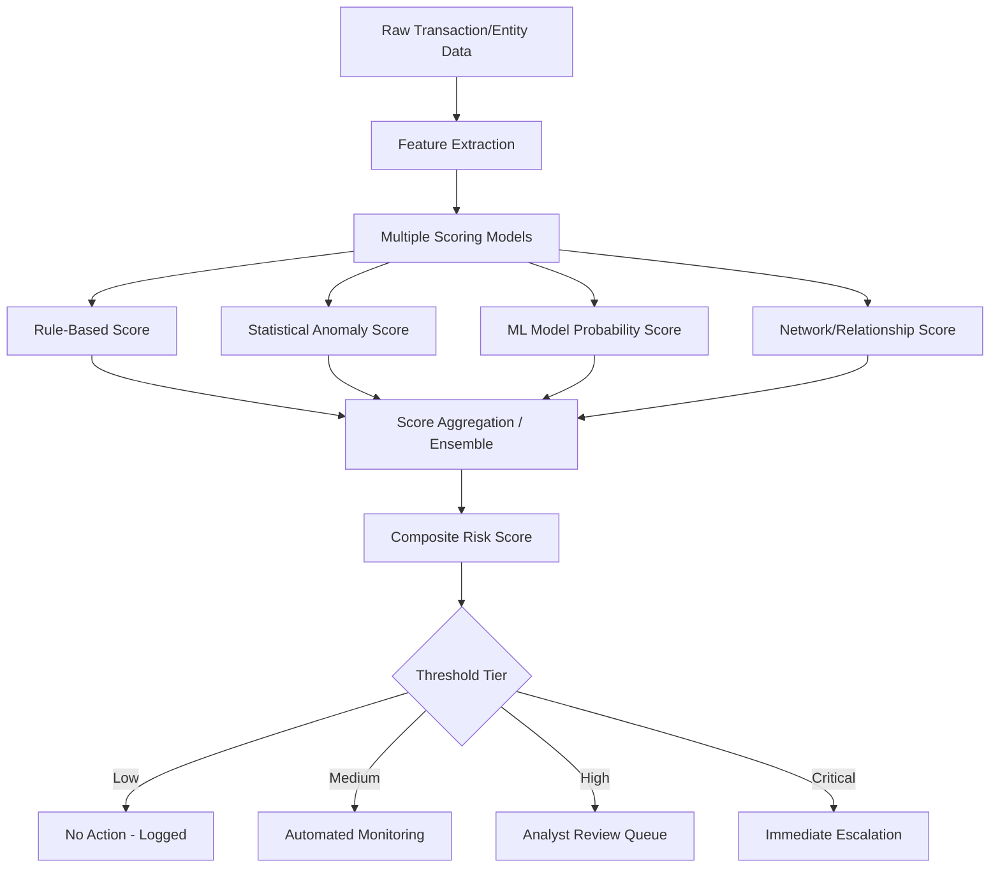
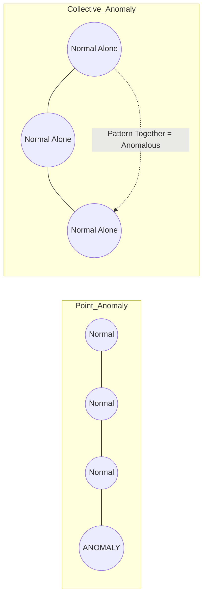
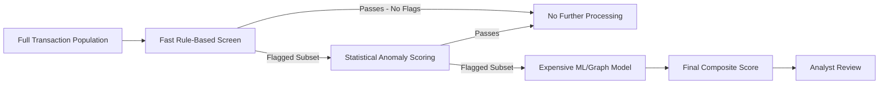

## Predictive Risk Scoring and Anomaly Detection Models

### Overview

Predictive risk scoring and anomaly detection models are the applied statistical and machine learning frameworks used to assign quantitative risk levels to transactions, entities, or relationships, and to surface data points that deviate meaningfully from expected patterns. While closely related to the broader machine learning applications covered elsewhere in this chapter, this topic focuses specifically on the **architecture and mechanics of scoring systems** — how raw model outputs become actionable risk scores, how thresholds are calibrated, and how anomaly detection is structured as a distinct discipline from supervised fraud classification. For forensic accountants, risk scoring models are most often encountered as the triage layer that determines which transactions, vendors, or employees receive investigative attention, making an understanding of their calibration and limitations essential to correctly interpreting and defending investigative prioritization decisions.

### Risk Scoring System Architecture

### Risk Scoring Fundamentals

**Key Points**

- A **risk score** is a numeric or categorical output representing the estimated likelihood or severity of fraud/risk associated with a given entity, transaction, or relationship, designed to be comparable across the population being scored (enabling ranking and prioritization).
- Risk scores are typically constructed from **multiple underlying signals** combined into a composite score, rather than a single model's raw output, since different signal types (rule violations, statistical outliers, ML predictions, network position) capture different fraud typologies and provide redundancy against any single model's blind spots.
- **Rule-based scoring components**: deterministic point additions for specific known-risk conditions (e.g., "+15 points: vendor address matches employee address," "+10 points: payment made outside business hours," "+20 points: new vendor with first payment exceeding $50,000"). Rule-based scores remain heavily used despite ML advances because they are fully interpretable and directly traceable to a specific, auditable condition.
- **Statistical/ML-based scoring components**: continuous probability or anomaly scores derived from the modeling techniques covered under machine learning applications (logistic regression probabilities, isolation forest anomaly scores, autoencoder reconstruction error, etc.).

$$\text{Composite Score} = w_1 \cdot S_{\text{rules}} + w_2 \cdot S_{\text{statistical}} + w_3 \cdot S_{\text{ML}} + w_4 \cdot S_{\text{network}}$$

- [Inference] Weighting schemes ($w_1, w_2, w_3, w_4$) for composite scores are typically calibrated empirically against historical outcomes (back-tested against confirmed fraud cases) rather than assigned arbitrarily, though the specific calibration methodology and weight values are generally organization- and dataset-specific rather than following a universal standard.

### Anomaly Detection: Core Paradigms

**Key Points**

- Anomaly detection is distinct from standard classification in that it does not require (and often cannot rely on) large volumes of labeled "anomalous" examples — the defining characteristic of an anomaly is rarity and deviation from a learned notion of "normal," not conformity to a known bad pattern.
- **Point anomalies**: a single data instance that is anomalous relative to the rest of the data (e.g., one transaction far larger than any other for that vendor).
- **Contextual anomalies**: a data instance anomalous only within a specific context (e.g., a $50,000 payment is unremarkable for a construction vendor but highly anomalous for an office supplies vendor).
- **Collective anomalies**: a collection of related data instances that is anomalous as a group even though individual instances may appear normal in isolation (e.g., a sequence of below-threshold payments that collectively exceed an approval limit — a structuring pattern).

### Statistical Anomaly Detection Techniques

**Key Points**

- **Z-score / standard deviation thresholds**: flags observations beyond a defined number of standard deviations from the population mean; simple and interpretable but assumes roughly normal data distribution, which financial data (often right-skewed) frequently violates.

$$z = \frac{x - \mu}{\sigma}$$

- **Interquartile Range (IQR) method**: flags observations beyond $Q_1 - 1.5 \times IQR$ or $Q_3 + 1.5 \times IQR$; more robust to non-normal distributions and outlier-driven distortion of the mean/standard deviation than z-score methods.
- **Benford's Law digit analysis**: tests whether the leading-digit distribution of a numeric dataset conforms to the expected logarithmic distribution; deviation suggests potential fabrication, estimation, or manipulation rather than naturally occurring transaction amounts.

$$P(d) = \log_{10}\left(1 + \frac{1}{d}\right), \quad d \in \{1, 2, \ldots, 9\}$$

- **Mahalanobis distance**: a multivariate generalization of the z-score that accounts for correlation between features, identifying observations that are anomalous in the combination of multiple variables even when no single variable is individually extreme.
- [Inference] A common and defensible forensic practice is layering these statistical methods (e.g., applying Benford's Law as an initial population-level screen, then Mahalanobis distance for individual-transaction-level flagging within the population that fails the initial screen), since each technique is sensitive to different manipulation signatures and combining them reduces the risk of a single technique's blind spot going undetected.

### Machine Learning Anomaly Detection Models

| Model | Mechanism | Best Suited For |
| --- | --- | --- |
| **Isolation Forest** | Randomly partitions feature space; anomalies require fewer splits to isolate | High-dimensional data, fast/scalable, no distributional assumptions |
| **One-Class SVM** | Learns a boundary encompassing "normal" data; points outside the boundary are anomalous | Well-defined normal behavior with moderate dimensionality |
| **Local Outlier Factor (LOF)** | Compares local density of a point to its neighbors' local density | Detecting anomalies in data with varying density regions (contextual anomalies) |
| **Autoencoders** | Neural network reconstructs input through compressed representation; high reconstruction error signals anomaly | Complex, high-dimensional, non-linear pattern detection at scale |
| **Gaussian Mixture Models (GMM)** | Models data as a mixture of Gaussian distributions; low-probability points under the fitted mixture are anomalous | Data with multiple distinct "normal" behavior modes (e.g., different customer segments) |

**Key Points**

- [Inference] Isolation Forest is widely favored in production fraud/risk-scoring systems for its computational efficiency at scale and lack of distributional assumptions, though the specific model selection in any given deployment depends on data volume, dimensionality, and whether the anomaly types of concern are primarily point, contextual, or collective in nature.

### Score Calibration and Threshold Setting

**Key Points**

- **Calibration** ensures a model's output score genuinely reflects likelihood (e.g., a score of 0.8 should correspond to an approximately 80% empirical fraud rate among similarly-scored cases), which is essential when scores are used for risk-based decision-making (e.g., allocating investigative resources proportionally) rather than pure ranking.
- **Platt scaling** and **isotonic regression** are standard techniques for calibrating raw model outputs (which, for many algorithms, are not inherently well-calibrated probabilities) into genuine probability estimates.
- **Threshold tiering**: composite scores are typically mapped into discrete action tiers (e.g., low/medium/high/critical) rather than acted upon as continuous values, since investigative and monitoring workflows require discrete decision points.
- **Dynamic thresholding**: rather than fixed score cutoffs, some systems adjust thresholds based on available investigative capacity, seasonal transaction volume changes, or evolving fraud base rates, to maintain a roughly constant investigative caseload despite fluctuating score distributions.
- [Inference] The choice of threshold is fundamentally a cost-benefit decision balancing the cost of investigative capacity (false positives consume analyst time) against the cost of undetected fraud (false negatives), and is properly a business/risk-management decision informed by, but not purely derived from, the statistical properties of the scoring model.

### Population-Level vs. Entity-Level Risk Scoring

**Key Points**

- **Transaction-level scoring**: each individual transaction receives an independent score, appropriate for point-in-time decisioning (e.g., real-time payment authorization).
- **Entity-level scoring**: aggregates signals across all of an entity's (vendor, employee, customer) activity over time into a single risk profile, better suited for identifying patterns that only emerge across a relationship history (e.g., a vendor whose individual invoices each appear unremarkable but whose aggregate billing pattern deviates significantly from comparable vendors).
- **Time-decay weighting**: entity-level scores often apply greater weight to recent activity than older activity, reflecting that risk profiles evolve and that older, resolved anomalies should not perpetually inflate an entity's current risk score.
- [Inference] Entity-level scoring is generally more effective at detecting slow-building schemes (gradual escalation of fraudulent billing, incremental kickback arrangements) precisely because such schemes are often deliberately structured to keep each individual transaction below detection thresholds, which transaction-level scoring alone would systematically miss.

### Ensemble and Multi-Model Architectures

**Key Points**

- **Model stacking**: outputs of multiple base models (rule engine, statistical anomaly score, ML classifier, graph-based score) become input features to a final meta-model that learns the optimal combination, rather than using a fixed weighted sum.
- **Voting/consensus approaches**: flag an entity/transaction as high-risk only when multiple independent models agree, reducing false positive rates at the cost of potentially missing fraud detected by only one model type.
- **Cascaded architectures**: a fast, low-cost model (e.g., simple rules or a lightweight statistical test) performs initial high-volume screening, with only the flagged subset passed to more computationally expensive models (deep learning, graph neural networks) for refined scoring — a common practical architecture given that most real-world transaction populations are too large for expensive models to run universally.

### Model Monitoring and Drift Detection

**Key Points**

- **Concept drift**: the statistical properties of what constitutes "normal" or "fraudulent" behavior change over time (seasonal business cycles, new products/vendors, evolving fraud tactics), degrading a static model's accuracy if not addressed.
- **Population Stability Index (PSI)** and similar drift metrics quantify how much the distribution of scored entities/transactions has shifted from the model's training population, providing an early warning signal for retraining need.

$$PSI = \sum_{i=1}^{n} (Actual_i - Expected_i) \times \ln\left(\frac{Actual_i}{Expected_i}\right)$$

- **Feedback loop design**: investigative outcomes (confirmed fraud, false positive, unsubstantiated) should be systematically fed back into model retraining, closing the loop between the scoring system's output and its actual real-world accuracy.
- [Inference] Organizations without a structured feedback loop between investigative outcomes and model retraining risk a slow, undetected degradation in scoring accuracy over time, since the model has no mechanism to learn from its own errors — this is a recognized governance gap in less mature fraud analytics programs rather than a technical limitation of the modeling techniques themselves.

### Common Pitfalls

**Key Points**

- **Static thresholds in a dynamic environment**: fixed score cutoffs set once and never revisited fail to adapt as fraud base rates, transaction volumes, or fraud tactics evolve.
- **Overweighting a single signal type**: composite scores dominated by one component (e.g., purely rule-based) inherit that component's specific blind spots; overreliance on purely ML-based scores without rule-based sanity checks can miss known, well-understood fraud patterns that don't require statistical learning to detect.
- **Ignoring calibration in favor of raw ranking**: a model that ranks risk well (higher scores genuinely correspond to higher risk) may still be poorly calibrated (a "0.9" score doesn't actually mean 90% fraud probability), which matters when scores are used for resource allocation decisions requiring genuine probability estimates.
- **Conflating entity-level and transaction-level risk without clear documentation**: presenting an aggregated entity score as though it describes a specific flagged transaction (or vice versa) can misstate the actual basis for an investigative flag.
- **Treating anomaly as synonymous with fraud**: statistically anomalous behavior frequently has legitimate explanations (seasonal business changes, one-off large legitimate transactions, data entry corrections); anomaly detection generates investigative hypotheses, not conclusions.

### Example

**Example**

A forensic accounting team designs a composite vendor risk scoring system for a mid-sized organization's procure-to-pay process:

1. **Rule-based component**: Point-based rules flag conditions including new vendor with first invoice above a materiality threshold, vendor address matching an employee address, and invoice amounts clustered just below approval thresholds.
2. **Statistical component**: Benford's Law conformity testing is run monthly across each vendor's invoice population, generating a deviation score; Mahalanobis distance is applied to flag individual invoices anomalous across the combination of amount, timing, and approver.
3. **ML component**: An Isolation Forest, trained on the full vendor-transaction feature set (velocity, behavioral deviation, and text-derived invoice description features), generates a continuous anomaly score for each vendor-month.
4. **Network component**: A vendor-employee relationship graph contributes a centrality/connectivity score, flagging vendors unusually connected to other flagged entities.
5. **Ensemble aggregation**: The four component scores are combined via a calibrated logistic regression meta-model (trained on 18 months of historical confirmed investigation outcomes), producing a single composite score per vendor per month, calibrated via isotonic regression so that a "0.75" score corresponds to an empirically observed ~75% historical substantiation rate.
6. **Threshold tiering**: Composite scores above the 95th percentile trigger mandatory analyst review; scores in the 85th-95th percentile enter an automated enhanced monitoring queue; scores below the 85th percentile require no action but remain logged.
7. **Drift monitoring**: Population Stability Index is calculated quarterly comparing the current scored vendor population against the training baseline; a PSI exceeding 0.25 in the most recent quarter triggers a scheduled model retraining review.
8. **Feedback loop**: Each analyst review outcome (substantiated, unsubstantiated, inconclusive) is logged and fed back into the next quarterly model retraining cycle, along with documented rationale where an analyst's conclusion diverged from the model's score tier.

### Related Topics

- Machine learning applications in fraud detection
- Data analytics techniques for fraud detection (Benford's Law, ratio analysis, continuous monitoring)
- Network/graph analysis for fraud ring and collusion detection
- Natural language processing for financial document and communication analysis
- Model risk management and validation frameworks for AI-based compliance tools
- Explainable AI (XAI) standards for regulatory and litigation contexts
- Real-time transaction monitoring system architecture
- Continuous auditing and continuous controls monitoring (CCM) design
- Predictive analytics for internal audit risk assessment
- Statistical sampling methodology in forensic accounting