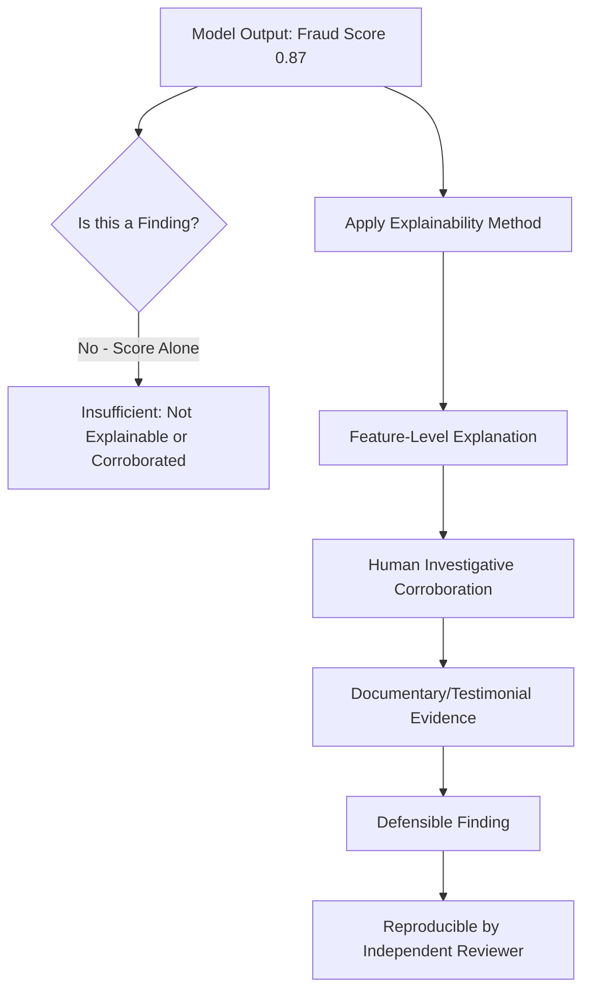
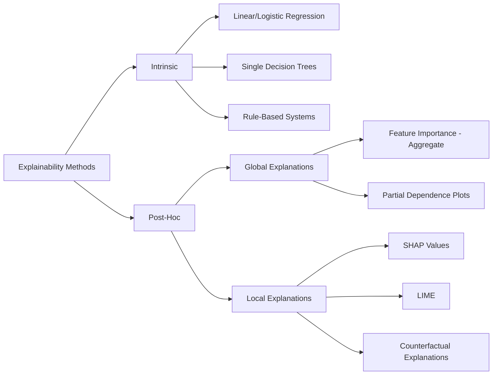
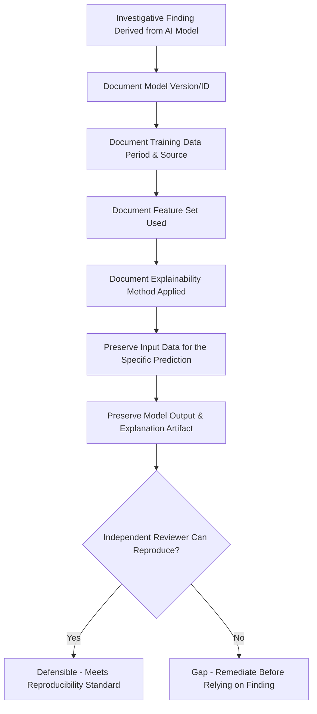

## Explainable AI and Defensibility of Findings

### Overview

Explainable AI (XAI) and defensibility of findings addresses the methods and practices used to make AI-driven fraud detection outputs interpretable, auditable, and legally sound — transforming a model's statistical output into a defensible investigative or evidentiary finding. This topic sits at the intersection of technical ML interpretability methods and forensic accounting's evidentiary standards: a finding is only as useful as its ability to withstand scrutiny from opposing experts, regulators, courts, and internal governance bodies. As AI-assisted detection becomes standard practice in fraud investigation (per the preceding topics in this chapter), the question of *why* a model flagged something has become as professionally consequential as *whether* it flagged something correctly.

### The Defensibility Problem

**Key Points**

- A statistical model output (a probability score, an anomaly flag, a cluster assignment) is not, by itself, an evidentiary finding — it is a data point requiring interpretation, corroboration, and translation into a fact-based narrative that a non-technical decision-maker (a judge, jury, audit committee, or regulator) can evaluate.
- **"Black box" models** (deep neural networks, complex ensemble methods, some gradient boosting configurations) can achieve strong predictive performance while offering no inherent insight into *why* a specific prediction was made — this opacity is professionally and legally consequential when the output supports disciplinary action, litigation, or regulatory disclosure.
- The defensibility challenge is not unique to AI — traditional forensic accounting techniques (ratio analysis, Benford's Law, sampling) have always required methodological transparency — but AI-driven findings introduce additional layers of complexity: algorithmic opacity, training data provenance questions, and the statistical (rather than deterministic) nature of many outputs.

### Explainability Technique Taxonomy

**Key Points**

- **Intrinsically interpretable models**: models whose structure is inherently understandable — linear/logistic regression (coefficients directly indicate feature contribution and direction), single decision trees (the decision path is a readable if-then sequence), and rule-based systems. These sacrifice some predictive power for full transparency.
- **Post-hoc explanation methods**: techniques applied *after* training a complex model to approximate or decompose its reasoning, without altering the underlying model itself. These are necessary when the best-performing model for a given task (often gradient boosting or deep learning) is not intrinsically interpretable.
- **Global vs. local explanations**: global explanations describe overall model behavior (which features matter most across the entire population); local explanations describe why one specific prediction was made for one specific case — forensic and litigation contexts typically require local explanations, since a specific transaction or entity's flag must be individually justified.

### SHAP (SHapley Additive exPlanations)

**Key Points**

- SHAP is grounded in **cooperative game theory** (Shapley values), treating each feature as a "player" contributing to the "payout" (the model's prediction), and fairly distributing credit for the prediction across all contributing features based on their marginal contribution across all possible feature combinations.
- For a given prediction, SHAP produces a signed contribution value for each feature, indicating both the magnitude and direction of that feature's influence on pushing the prediction away from the baseline (average) prediction.

$$f(x) = \phi_0 + \sum_{i=1}^{M} \phi_i$$

where $\phi_0$ is the baseline (expected) prediction and $\phi_i$ is the SHAP value (contribution) of feature $i$.

- **Key properties** that make SHAP particularly suited to evidentiary use: *local accuracy* (contributions sum exactly to the actual prediction, so nothing is left unexplained), *consistency* (a feature's contribution cannot decrease if its actual impact on the model increases), and *missingness* (a feature with no impact receives zero attribution) — these are mathematically guaranteed properties, not heuristic approximations.
- [Inference] SHAP's game-theoretic grounding and guaranteed consistency properties are generally why it has become the preferred explainability method in regulated and evidentiary contexts (compared to earlier heuristic methods), since a reviewing party can verify the explanation's internal mathematical consistency rather than relying solely on trust in the method's general validity.

### LIME (Local Interpretable Model-Agnostic Explanations)

**Key Points**

- LIME explains an individual prediction by generating perturbed samples around the instance being explained, obtaining the complex model's predictions for those perturbed samples, and fitting a simple, interpretable model (typically linear regression) to locally approximate the complex model's behavior in that neighborhood.
- LIME is **model-agnostic**: it can be applied to any classifier or regressor regardless of internal structure, since it only requires the ability to query the model for predictions on new inputs.
- **Limitation relative to SHAP**: LIME's local linear approximation is not guaranteed to sum to the actual prediction and can be sensitive to the specific perturbation sampling strategy used, meaning results can vary somewhat between runs — a consideration relevant when explanation stability/reproducibility matters for evidentiary purposes.
- [Unverified] The degree of run-to-run variability in LIME explanations depends heavily on implementation parameters (number of perturbed samples, kernel width) and the specific dataset; this should be empirically tested for a given deployment rather than assumed to be negligible.

### Counterfactual Explanations

**Key Points**

- A **counterfactual explanation** answers: "what is the minimal change to this transaction/entity's features that would have changed the model's prediction?" (e.g., "if the payment amount had been $8,000 lower, this transaction would not have been flagged").
- Counterfactuals are often more intuitive for non-technical audiences than SHAP or LIME output, since they frame the explanation in terms of an actionable, concrete "what-if" scenario rather than abstract feature-contribution weights.
- Particularly useful in **adverse action / disclosure contexts** (e.g., explaining to an employee or vendor why a transaction was flagged) where a feature-contribution table may be less accessible than a direct statement of what specific condition drove the flag.

### Model Cards and Documentation Standards

**Key Points**

- A **model card** is a structured documentation artifact accompanying a deployed model, recording its intended use, training data characteristics, performance metrics (including subgroup/fairness metrics), known limitations, and validation history — analogous in function to audit workpaper documentation for a traditional forensic technique.
- Comprehensive model documentation typically includes: training data provenance and time period, feature list and engineering methodology, performance metrics on held-out/out-of-time validation data, known failure modes and edge cases, and version history reflecting retraining events.
- [Inference] Model documentation of this kind serves a function directly analogous to the "methodology" section of a traditional forensic accounting report — establishing that the analytical approach was systematic, reproducible, and subject to appropriate validation, rather than an ad hoc or unexplainable process — and is increasingly expected by regulators and auditors reviewing AI-assisted compliance and investigative tools.

### Reproducibility Standards for Forensic AI Findings

**Key Points**

- A defensible AI-assisted finding should be **reproducible**: an independent reviewer with access to the same model version, training data snapshot, and input data should be able to regenerate the same output and explanation.
- **Version control** for models is essential — given that models are retrained periodically (see concept drift, discussed under predictive risk scoring), a finding must be tied to a specific, identifiable model version rather than "the model" generically, since a retrained model may score the same input differently.
- **Data snapshot preservation**: the specific input data used to generate a flagged finding should be preserved as of the time of scoring, since underlying source data (transaction records, vendor master data) may itself change over time, potentially making the original prediction non-reproducible against current data.
- [Inference] This version-control and snapshot-preservation discipline mirrors chain-of-custody principles from traditional forensic evidence handling, extended to the modeling pipeline itself — the "evidence" in an AI-assisted finding includes not just the underlying transaction data but the specific model artifact and its explanation.

### Regulatory and Professional Standards Context

**Key Points**

- Financial services regulators (in banking supervision, lending, and increasingly broader compliance contexts) have progressively articulated **model risk management** expectations requiring documented validation, ongoing monitoring, and explainability commensurate with the model's decision impact — frameworks such as the Federal Reserve/OCC's SR 11-7 guidance (US banking context) established foundational principles now commonly referenced (directly or by analogy) in AI governance discussions beyond their original scope.
- **Professional forensic accounting standards** (e.g., those issued by relevant professional bodies governing forensic and fraud examination practice) generally require that findings be based on sufficient, reliable evidence and be presented with appropriate methodological transparency — AI-assisted findings must satisfy these same underlying principles, not a lesser standard simply because the analytical method is novel.
- [Inference] As AI-assisted fraud detection becomes more prevalent in regulated industries, professional and regulatory expectations around AI explainability in forensic/compliance contexts are likely to continue formalizing, though the specific pace and shape of this formalization for forensic accounting practice specifically (as distinct from lending/credit decisioning, where explainability regulation is more mature) remains an evolving area investigators should monitor.

### Practical Framework for Building Defensible AI-Assisted Findings

**Key Points**

- **Layer 1 — Statistical output**: the raw model score or flag (e.g., "0.87 fraud probability" or "anomaly detected").
- **Layer 2 — Feature-level explanation**: SHAP/LIME/counterfactual output identifying which specific, named factors drove that output for this specific case.
- **Layer 3 — Human investigative corroboration**: traditional forensic methodology (document review, interviews, independent verification) applied to test whether the AI-flagged hypothesis is actually substantiated by underlying facts.
- **Layer 4 — Documentary evidence**: the actual source documents, testimony, or records that establish the finding independent of the model's involvement — the AI's role is properly characterized as generating the investigative lead, not as the evidentiary basis for the conclusion itself.
- A properly documented finding traces cleanly through all four layers, allowing a reviewer to understand not just *what* was found but *why the model flagged it* and *how that flag was verified* against independent facts.

### Common Pitfalls

**Key Points**

- **Presenting a model score as a conclusion**: describing a transaction as "fraudulent" based solely on a high fraud-probability score, without the corroborating investigative layers, conflates statistical pattern-matching with a factual finding.
- **Using post-hoc explanations without verifying their fidelity**: LIME and similar local-approximation methods can, in some cases, poorly represent the actual complex model's true reasoning if the local approximation is a poor fit — explanations should ideally be sanity-checked against known cases where the true driving factor is independently verifiable.
- **Failing to preserve model version and data snapshots**, making a finding non-reproducible if challenged months or years later during litigation or regulatory proceedings.
- **Treating explainability as a one-time technical exercise** rather than an ongoing documentation discipline maintained across model retraining cycles.
- **Overclaiming certainty from feature attribution**: SHAP/LIME explain what drove the *model's* prediction, which is not the same as establishing *ground truth causation* in the real world — a feature contributing heavily to a fraud score is not, by itself, proof that the feature reflects actual fraudulent conduct.

### Example

**Example**

A forensic team's ML-based vendor risk model (from the predictive risk scoring pipeline) flags a vendor at a 0.91 composite risk score, and the finding must be documented for an internal disciplinary proceeding:

1. **Layer 1 documentation**: The specific model version (v3.2, trained on data through the prior quarter-end) and the exact input feature values for this vendor at the time of scoring are logged and preserved.
2. **Layer 2 — SHAP explanation**: SHAP values show the three largest contributors to the elevated score were: a shared bank routing number with a known employee (contribution +0.31), invoice amounts clustered just below the $10,000 approval threshold (contribution +0.22), and a Benford's Law digit-distribution deviation across the vendor's invoice population (contribution +0.18) — collectively accounting for the majority of the deviation from baseline.
3. **Layer 3 — Investigative corroboration**: Investigators independently pull the vendor master file and confirm the shared bank routing number; they separately obtain and review the underlying invoices to confirm the threshold-clustering pattern is genuine (not a data artifact), and re-run the Benford's Law test manually on the raw ledger extract to confirm the model's reported deviation independent of the ML pipeline.
4. **Layer 4 — Documentary evidence**: Bank account registration records, approval workflow logs, and the underlying invoice documents are compiled as the actual evidentiary basis for the finding.
5. **Report framing**: The final report presents the AI model's output as having generated the investigative lead and prioritized it for review, explicitly distinguishes the model's statistical contribution (Layer 1-2) from the independently verified factual basis (Layer 3-4), and includes the model version identifier and SHAP explanation as supporting technical documentation rather than as the sole basis for the conclusion.
6. **Reproducibility check**: A second, independent reviewer is given the preserved model version, input data snapshot, and explanation artifact, and confirms they can regenerate an identical score and SHAP breakdown — satisfying the reproducibility standard before the finding proceeds to the disciplinary hearing.

### Related Topics

- Machine learning applications in fraud detection
- Predictive risk scoring and anomaly detection models
- Model risk management and validation frameworks for AI-based compliance tools
- Expert witness standards and admissibility of AI/algorithmic evidence (Daubert/Frye)
- Chain of custody and evidentiary documentation standards in digital forensics
- Bias, fairness, and discrimination risk in AI-driven fraud/credit models
- Internal investigations of corruption allegations (evidentiary documentation parallels)
- Data governance and model version control for compliance-critical AI systems
- Regulatory expectations for AI governance in financial services (SR 11-7 and analogues)
- Generative AI and large language model applications in fraud investigation