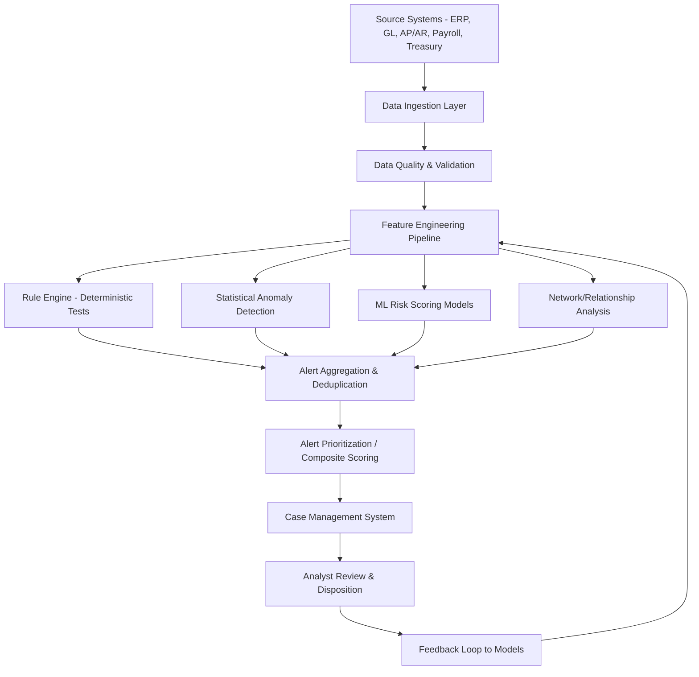
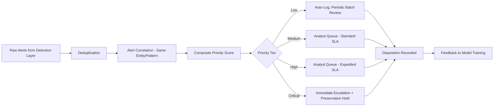

## Continuous Forensic Monitoring Systems

### Overview

Continuous forensic monitoring systems are automated, always-on analytical frameworks that apply forensic accounting tests and fraud detection logic to transactional data on an ongoing basis, rather than through periodic, retrospective sampling. Where traditional forensic accounting historically operated in discrete engagement cycles — investigate after an allegation surfaces, or audit a sample once per period — continuous monitoring shifts the paradigm toward near-real-time or high-frequency detection, closing the gap between when fraud occurs and when it is identified. This topic integrates the machine learning, risk scoring, and explainability techniques covered elsewhere in this chapter into a persistent operational system architecture.

### Continuous Monitoring vs. Traditional Periodic Review

**Key Points**

- **Traditional periodic review**: forensic or audit testing applied to a sample of transactions at fixed intervals (quarterly, annually), inherently retrospective and limited in population coverage — fraud occurring between review cycles, or outside the sampled population, may go undetected for extended periods.
- **Continuous monitoring**: automated rules and models applied to 100% of transactions (or as close to full population as computationally feasible) on a continuous or high-frequency basis, dramatically reducing the detection lag between fraudulent activity and identification.
- **Continuous auditing** (a related but distinct discipline) applies continuous techniques specifically to internal control testing and compliance verification; **continuous forensic monitoring** as addressed here is more specifically oriented toward fraud and anomaly detection, though the two disciplines share significant technical infrastructure and often operate on unified platforms.
- [Inference] The shift from periodic sampling to full-population continuous monitoring represents one of the most significant methodological changes in forensic accounting practice enabled by modern data infrastructure, since it fundamentally changes the population being tested from a statistically representative sample to the complete transaction universe.

### System Architecture

### Data Ingestion and Integration Layer

**Key Points**

- Continuous monitoring requires **near-real-time or high-frequency data pipelines** connecting to source systems: ERP/general ledger, accounts payable/receivable, payroll, treasury/banking, procurement, and travel & expense systems — typically via API integration, database replication, or scheduled batch extraction depending on source system capability and latency requirements.
- **Data quality validation** at ingestion is critical: continuous systems operating on flawed or incomplete data at scale can generate systematically incorrect alerts far faster than periodic manual review would, amplifying data quality problems rather than merely inheriting them.
- **Master data management**: vendor master, employee master, and chart of accounts data must be reliably synchronized, since many forensic tests (vendor-employee matching, duplicate vendor detection) depend on master data integrity independent of transaction-level data quality.
- [Inference] Organizations transitioning from periodic to continuous monitoring frequently discover pre-existing data quality issues that were previously masked by the limited scope of manual sample-based testing, since continuous, full-population testing surfaces data inconsistencies that a small sample would be unlikely to capture.

### Detection Layer Components

**Key Points**

- **Rule engine (deterministic tests)**: codifies well-established forensic red-flag tests as always-on rules — duplicate payment detection, Benford's Law screening, vendor-employee address matching, segregation-of-duties violations (e.g., same user creating and approving a vendor), transactions just below approval thresholds, and weekend/after-hours posting flags.
- **Statistical anomaly detection**: continuously scores incoming transactions against evolving population baselines (z-scores, Mahalanobis distance, or unsupervised ML methods), flagging deviations as they occur rather than only when a periodic batch analysis is run.
- **ML risk scoring**: composite risk models (as covered under predictive risk scoring) are applied continuously, with entity-level risk profiles updated incrementally as new transactions arrive rather than recalculated from scratch on a fixed schedule.
- **Network/relationship monitoring**: relationship graphs (vendor-employee, related-party networks) are updated as new connections form (new vendor added, new bank account linked), with alerts triggered when a new connection creates or extends a high-risk pattern (e.g., a newly added vendor bank account matches an existing employee's account).

### Alert Management and Case Workflow

**Key Points**

- **Alert deduplication and correlation** are essential at scale: a single underlying issue (e.g., one problematic vendor relationship) can trigger multiple independent rule and model alerts across different tests, and without correlation, analysts face redundant, fragmented alerts rather than a single consolidated case.
- **Case management integration**: alerts should flow into a structured case management system tracking status, assigned analyst, investigative notes, and final disposition — providing both workflow efficiency and the audit trail necessary for governance and quality assurance review.
- **Service Level Agreements (SLAs)** by priority tier ensure higher-risk alerts receive prompt attention, balancing the finite capacity of investigative staff against alert volume — a critical design consideration, since a continuous system generating more alerts than can be reviewed in a timely manner effectively degrades to the same detection lag as periodic review.
- [Inference] Alert fatigue — where investigators become desensitized to a high volume of low-value alerts and begin cursorily dismissing them — is a well-documented risk in continuous monitoring system design across security and fraud domains generally; well-calibrated composite scoring and tiered SLAs (rather than treating all alerts as equally urgent) are the primary mitigations.

### Threshold and Rule Governance

**Key Points**

- **Rule/model change management**: because continuous systems operate at scale and automatically, changes to detection rules or model versions require formal governance (testing, approval, documented rationale, rollback capability) comparable to change management for any production financial system, given that an erroneous rule change can generate a flood of false positives or, conversely, silently disable detection of a genuine risk.
- **Periodic effectiveness review**: even in a continuous system, the detection logic itself requires periodic (not continuous) human review — assessing whether rules remain relevant, whether new fraud typologies require new rules, and whether historical alert disposition data suggests certain rules have become ineffective (consistently low substantiation rate) or under-calibrated (missing known fraud patterns identified through other channels).
- **Segregation of duties in system administration**: personnel with authority to modify monitoring rules or thresholds should be segregated from personnel whose transactions/areas are subject to that monitoring, mirroring traditional internal control segregation principles applied to the monitoring system itself.

### Integration with Broader AI/ML Techniques

**Key Points**

- Continuous forensic monitoring is the **operational deployment context** for the ML techniques, risk scoring architectures, and explainability requirements covered elsewhere in this chapter — it is not a separate analytical methodology but the production system within which those methods run persistently against live data.
- **Model retraining cadence**: given concept drift (evolving fraud patterns, changing business conditions), continuous monitoring systems require a defined retraining schedule or trigger-based retraining (e.g., triggered by Population Stability Index thresholds), distinct from the continuous scoring of transactions itself — the underlying models are typically retrained periodically even though scoring occurs continuously.
- **Explainability at scale**: given the volume of alerts a continuous system generates, explanation artifacts (SHAP values, contributing rule identification) should be automatically generated and attached to each alert at the point of flagging, rather than produced on-demand only for escalated cases — ensuring every alert, including those ultimately dispositioned as false positives, has a documented basis for governance and audit trail purposes.

### Governance, Audit Trail, and Regulatory Considerations

**Key Points**

- **System audit trail**: every alert, its underlying data snapshot, model/rule version, and disposition should be immutably logged, providing both operational quality assurance and a defensible record should any specific alert (or the absence of an alert) later become relevant to litigation or regulatory inquiry.
- **False negative analysis**: continuous monitoring system governance should periodically test not only alert quality (false positive rate) but also known-fraud-case retrospective analysis — running confirmed historical fraud cases (sourced from other channels, e.g., whistleblower-initiated investigations) through the current monitoring configuration to assess whether the system would have detected them, surfacing coverage gaps.
- **Regulatory expectations**: continuous monitoring is increasingly referenced as a component of "adequate procedures" or effective compliance program expectations by regulators evaluating anti-fraud and anti-corruption program maturity (paralleling the ABAC program expectations discussed elsewhere in this material), making continuous monitoring both a detective control and, increasingly, an element of demonstrable program adequacy.
- [Inference] As continuous monitoring technology matures and becomes more accessible, regulatory and professional expectations for its adoption in larger organizations' compliance programs are likely to continue rising, analogous to the trajectory internal controls and periodic audit testing followed as they became standardized practice — though the specific pace of this expectation-setting varies by industry and jurisdiction.

### Common Pitfalls

**Key Points**

- **Alert volume outpacing investigative capacity**, effectively recreating periodic-review-level detection lag despite continuous technical detection, if triage and prioritization are inadequately designed
- **Treating initial deployment as a one-time project** rather than an ongoing program requiring sustained governance, rule maintenance, and model retraining
- **Insufficient data quality validation**, causing systematic false positives or false negatives at scale that a periodic manual process might have caught through analyst-level data familiarity
- **Underinvesting in explainability infrastructure**, leaving high alert volumes with unexplained or poorly documented bases that become a governance liability if challenged
- **Failing to segregate monitoring system administration from the population being monitored**, creating a control override risk analogous to inadequate segregation of duties in any financial process
- **Neglecting false-negative testing**, focusing exclusively on alert quality (precision) without periodically validating that the system would actually catch known fraud patterns (recall) against real historical cases

### Example

**Example**

A large organization implements continuous forensic monitoring across its accounts payable function:

1. **Data integration**: The system ingests AP transaction data, vendor master data, and employee master data from the ERP via near-real-time API feeds, with a data quality validation layer flagging and quarantining records with missing or inconsistent key fields before they enter the detection pipeline.
2. **Detection layer**: A rule engine continuously screens for duplicate payments, vendor-employee address matches, and threshold-clustering patterns; in parallel, a statistical layer runs rolling Benford's Law tests per vendor per month, and an ML composite risk score (per the predictive risk scoring architecture) updates each vendor's entity-level profile incrementally as new invoices post.
3. **Alert correlation**: A single vendor triggers three separate alerts within one week — a duplicate payment rule, an elevated Benford's Law deviation, and a composite ML score crossing the high-risk tier — and the alert correlation layer consolidates these into a single case rather than three independent analyst tasks.
4. **Prioritization and SLA**: The consolidated case is scored in the "Critical" tier given the multi-signal convergence, triggering an expedited SLA and an automatic data preservation hold on the vendor's records pending analyst review.
5. **Explainability**: The case is automatically packaged with SHAP-based feature attribution for the ML score component, the specific rule conditions triggered, and the Benford's Law statistical output — giving the assigned analyst immediate, documented context rather than requiring on-demand explanation generation.
6. **Disposition and feedback**: The analyst substantiates a duplicate-billing scheme; the outcome is logged in the case management system, and the confirmed fraud case is fed back into the ML model's training set, while the rule engine's duplicate-payment rule effectiveness statistics are updated to reflect this substantiation.
7. **Governance review**: In the quarterly governance review, the compliance team runs a retrospective false-negative test using three previously confirmed (whistleblower-sourced) fraud cases from the prior year against the current monitoring configuration, confirming the current rule/model set would have detected all three — providing evidence of continued system coverage adequacy.

### Related Topics

- Machine learning applications in fraud detection
- Predictive risk scoring and anomaly detection models
- Explainable AI and defensibility of findings
- Continuous auditing and continuous controls monitoring (CCM) design
- Data analytics techniques for fraud detection (Benford's Law, ratio analysis)
- Internal investigations of corruption allegations
- Network/graph analysis for fraud ring and collusion detection
- Model risk management and validation frameworks for AI-based compliance tools
- Whistleblower hotline design and case management integration
- Anti-Bribery and Anti-Corruption program adequacy and "adequate procedures" standards