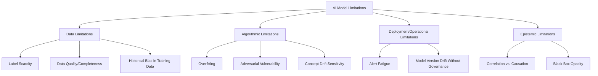
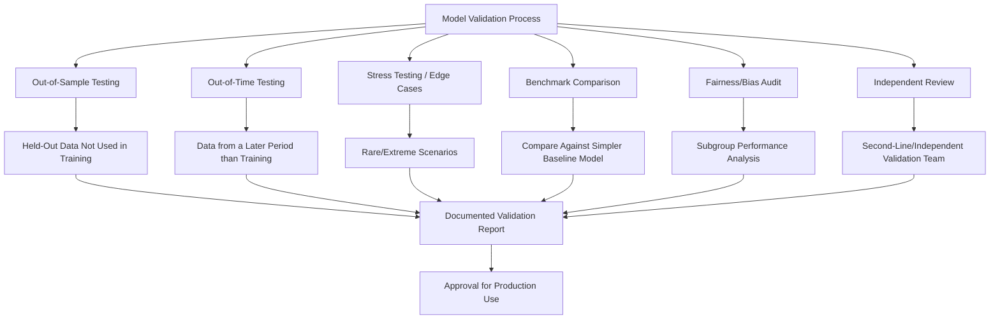

## Limitations, Bias, and Validation of AI-Based Tools

### Overview

Limitations, bias, and validation of AI-based tools addresses the critical evaluative discipline required before, during, and after deploying machine learning systems in fraud detection and forensic accounting contexts. Where prior topics in this chapter focused on building and interpreting AI-driven detection systems, this topic focuses on the professional skepticism owed to those same systems: their inherent technical limitations, the ways bias can enter and propagate through a model, and the validation methodology needed to establish that a model performs as claimed before its outputs are relied upon for investigative or disciplinary conclusions. This is the quality-control counterpart to the deployment-focused topics elsewhere in the chapter.

### Categories of AI Model Limitations

### Data-Related Limitations

**Key Points**

- **Label scarcity**: confirmed fraud cases are inherently rare relative to legitimate transactions, and labels themselves depend on prior detection processes (a case is only "labeled fraud" if someone previously found it) — meaning training data reflects what past detection methods happened to catch, not necessarily the true universe of fraud.
- **Survivorship and detection bias in training data**: because labels derive from historically detected fraud, models trained on this data may systematically underperform on fraud schemes that historical detection methods were poor at catching — a self-reinforcing blind spot where "we don't know what we don't know."
- **Data completeness and quality**: missing fields, inconsistent categorical coding, and legacy system data quality issues directly propagate into model reliability — a model is only as sound as the data pipeline feeding it, regardless of algorithmic sophistication.
- **Non-stationarity**: financial and fraud data distributions shift over time (seasonal effects, business changes, evolving fraud tactics), meaning a model's training period may not represent current conditions even if the training data was originally high quality.
- [Inference] The detection-bias problem in fraud labels is a structurally difficult issue to fully resolve, since obtaining genuinely representative "ground truth" would require exhaustively investigating a random, unbiased sample of all transactions — a standard rarely met in practice given cost constraints — meaning most fraud models are trained against an imperfect proxy for true fraud incidence rather than true fraud incidence itself.

### Algorithmic Limitations

**Key Points**

- **Overfitting**: a model that learns the training data's noise and idiosyncrasies rather than generalizable patterns, performing well on historical data but poorly on new, unseen transactions — mitigated through techniques like cross-validation, regularization, and out-of-time (rather than only out-of-sample) testing.
- **Adversarial adaptation**: unlike many ML application domains, fraud detection operates in an explicitly adversarial environment — perpetrators actively adapt their behavior in response to (or in anticipation of) detection methods, meaning a model's effectiveness can degrade specifically *because* it is being used, as sophisticated actors learn to structure transactions to evade known detection logic.
- **Correlation vs. causation**: ML models identify statistical association between features and fraud labels, not causal mechanisms — a feature strongly correlated with historical fraud may reflect a genuine causal risk factor, a confounding variable, or a spurious historical artifact, and the model itself cannot distinguish between these without external validation.
- **Threshold and boundary instability**: models can behave unpredictably near decision boundaries, where small, immaterial changes in input values shift a case from "flagged" to "not flagged" — a consideration relevant when defending why one borderline case was flagged and a similar one was not.

### Bias in AI Fraud Detection Systems

**Key Points**

- **Historical bias**: if certain groups, regions, business units, or transaction types were historically over-scrutinized (leading to more "confirmed fraud" labels in that population, potentially due to greater investigative attention rather than genuinely higher fraud rates), a model trained on that data can learn to perpetuate the same disproportionate scrutiny — a feedback loop where past bias becomes encoded as a "predictive" feature.
- **Representation bias**: if certain populations (e.g., smaller vendors, newer business units, transactions in less digitized regions) are underrepresented in training data, model performance for those populations may be less reliable, even if aggregate performance metrics appear strong.
- **Proxy discrimination**: features that are facially neutral (zip code, name characteristics, industry sector) can serve as statistical proxies for protected characteristics, creating discriminatory outcomes even without any protected attribute being directly used as a model input — a well-documented concern in credit and lending contexts that extends to fraud/risk scoring more broadly.
- **Feedback loop amplification**: if a model's flags drive increased scrutiny of certain entities, and that increased scrutiny mechanically produces more findings (simply because more looking occurs), the resulting data can create a self-reinforcing cycle that overstates the population's true risk level relative to less-scrutinized populations.
- [Inference] Bias concerns are generally more legally and reputationally consequential in contexts where model outputs directly affect individuals (e.g., employee disciplinary flagging, vendor blacklisting with human welfare implications) than in purely transaction-level anomaly detection with no direct individual impact — this distinction is relevant to how much bias-testing rigor a given deployment context warrants, though bias testing remains good practice broadly.

### Fairness Metrics and Bias Testing

**Key Points**

- **Demographic parity**: requires that the rate of positive predictions (flags) be equal across groups — a strict standard that may not be appropriate where true underlying risk genuinely differs across groups for reasons unrelated to the protected characteristic itself.
- **Equalized odds**: requires that true positive rates and false positive rates be equal across groups, a standard focused on ensuring the model is equally accurate for each group rather than requiring equal flagging rates regardless of true underlying risk.
- **Predictive parity**: requires that, among those flagged, the actual fraud rate (precision) be equal across groups — ensuring a flag means the same thing regardless of group membership.

$$\text{Equalized Odds: } P(\hat{Y}=1 \mid Y=1, A=a) = P(\hat{Y}=1 \mid Y=1, A=b) \text{ for all groups } a, b$$

- [Inference] These fairness definitions are, in general, mathematically incompatible with one another except in special cases — satisfying demographic parity, equalized odds, and predictive parity simultaneously is generally not achievable when base rates genuinely differ across groups, a well-established result in the fairness ML literature — meaning fairness testing requires an explicit, documented choice of which fairness criterion is most appropriate for the specific use case, rather than an assumption that "fair" is a single unambiguous target.
- **Disparate impact testing**: comparing outcome rates across groups (e.g., using the "four-fifths rule" commonly referenced in US employment discrimination contexts as a rough screening heuristic) can help identify whether a model's outputs disproportionately affect a particular group, warranting further investigation into whether the disparity reflects legitimate risk differences or problematic bias.

### Model Validation Methodology

**Key Points**

- **Out-of-sample testing**: evaluating model performance on data not used during training, providing a basic check against overfitting.
- **Out-of-time testing**: evaluating performance on data from a period *after* the training period, providing a more rigorous check that better simulates real-world deployment conditions (where the model will always be scored against data it has never seen, from a time it did not exist).
- **Stress testing and edge case analysis**: deliberately evaluating model behavior on rare, extreme, or unusual inputs to understand failure modes before they occur in production.
- **Benchmark/challenger comparison**: comparing a complex model's performance against a simpler baseline (e.g., a basic rule set or logistic regression) to confirm the added complexity delivers genuinely superior performance justifying its reduced interpretability.
- **Independent/second-line validation**: model validation performed by a team independent of the model's developers, mirroring the "second line of defense" concept in traditional risk management — reducing the risk that developer confirmation bias affects the validation process itself.
- [Inference] The independence principle in model validation is directly analogous to the independence principle in internal investigations discussed elsewhere in this material — just as an investigation's credibility depends on independence from implicated parties, a model validation's credibility depends on independence from the team incentivized to see the model succeed.

### Ongoing Monitoring and Revalidation

**Key Points**

- **Performance monitoring in production**: tracking precision, recall, and calibration metrics against actual investigative outcomes on an ongoing basis, not only at initial deployment — a model validated at launch can degrade due to concept drift without any change to the model itself.
- **Periodic revalidation**: formal re-testing of the model against the original validation criteria at defined intervals (or triggered by drift metrics such as Population Stability Index, covered under predictive risk scoring), ensuring continued fitness for purpose rather than relying indefinitely on initial validation results.
- **Champion-challenger frameworks**: running a new candidate model in parallel with the current production model on live data (without acting on the challenger's outputs) to compare performance before formal replacement, reducing the risk of deploying an unvalidated model change directly into production decisioning.

### Documentation and Governance Requirements

**Key Points**

- A defensible AI-based tool deployment should maintain: the original validation report, ongoing performance monitoring logs, documented model version history, fairness/bias audit results, and a clear record of who approved the model for production use and on what basis.
- **Model risk tiering**: not all models warrant the same validation rigor — a model whose output directly drives disciplinary action or regulatory disclosure warrants substantially more rigorous validation and governance than a low-stakes internal triage tool whose output is merely one input among many considered by a human analyst.
- [Inference] This risk-tiered approach to validation rigor mirrors general model risk management principles applied across financial services more broadly (proportioning governance intensity to decision impact), and is a reasonable practical framework for forensic accounting AI tools specifically, even though forensic accounting-specific regulatory guidance on this point remains less codified than, for example, credit risk model governance.

### Common Pitfalls

**Key Points**

- **Treating a single validation exercise as permanently sufficient**, without ongoing monitoring or periodic revalidation as data and fraud patterns evolve
- **Validating only on aggregate performance metrics** without subgroup/fairness analysis, potentially masking disparate performance or impact across populations
- **Confusing correlation-based feature importance with causal explanation** when communicating findings, overstating what the model's output actually establishes
- **Allowing model developers to also serve as the sole validators**, undermining independence and increasing the risk of unchecked confirmation bias
- **Ignoring the adversarial nature of the fraud domain**, applying validation standards appropriate to static, non-adversarial ML applications without accounting for the likelihood that detected patterns will themselves change perpetrator behavior over time
- **Overlooking data lineage and label quality issues**, validating a model rigorously against flawed ground-truth labels without examining whether the labels themselves are reliable

### Example

**Example**

An internal audit function validates a new ML-based expense report fraud detection model before production deployment:

1. **Data limitation review**: The validation team notes that historical confirmed fraud labels derive almost entirely from a prior period's manual spot-check program, which disproportionately reviewed expense reports from two specific business units — flagging a potential detection-bias risk that the model may have learned "business unit" as a proxy risk factor rather than a genuine one.
2. **Out-of-time testing**: The model, trained on 2023-2024 data, is tested against 2025 data withheld from training, showing acceptable but somewhat degraded precision/recall compared to out-of-sample (same-period) testing — indicating some concept drift sensitivity worth monitoring post-deployment.
3. **Fairness audit**: Subgroup analysis by business unit reveals the model flags expense reports from the two historically over-scrutinized business units at a materially higher rate than others, even after controlling for expense amount and category — triggering further investigation into whether this reflects genuine risk differences or inherited historical bias.
4. **Remediation**: The validation team recommends removing "business unit" as a direct model feature and re-training, then re-testing whether the flagging disparity persists (suggesting genuine underlying risk difference) or resolves (confirming it was a proxy-bias artifact) — the disparity substantially narrows after removal, supporting the bias-artifact interpretation.
5. **Independent review**: A second-line risk team, independent of the model development group, reviews the full validation package (out-of-time results, fairness audit, remediation steps) and formally approves the revised model for production, subject to quarterly revalidation.
6. **Governance documentation**: The approval, validation methodology, and identified limitations (residual concept-drift sensitivity, reliance on imperfect historical labels) are documented in a model risk file, explicitly noting that outputs should be treated as investigative leads requiring human corroboration, consistent with the defensibility framework for AI-assisted findings.
7. **Ongoing monitoring**: Quarterly precision/recall tracking against actual investigative dispositions is established, with a Population Stability Index trigger set to prompt earlier revalidation if the scored population drifts materially from the validation baseline.

### Related Topics

- Machine learning applications in fraud detection
- Predictive risk scoring and anomaly detection models
- Explainable AI and defensibility of findings
- Continuous forensic monitoring systems
- Model risk management frameworks (SR 11-7 and analogous governance standards)
- Bias, fairness, and discrimination risk in AI-driven credit and lending models
- Data governance and data quality management for forensic analytics
- Internal investigations of corruption allegations (independence principles)
- Professional skepticism standards in forensic accounting practice
- Generative AI and large language model applications in fraud investigation