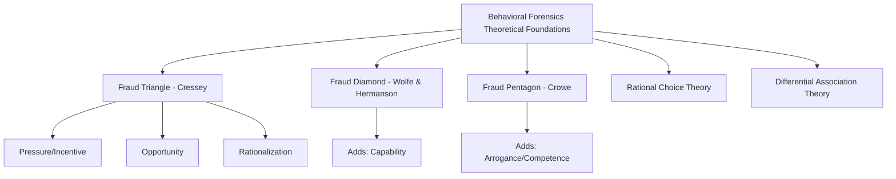
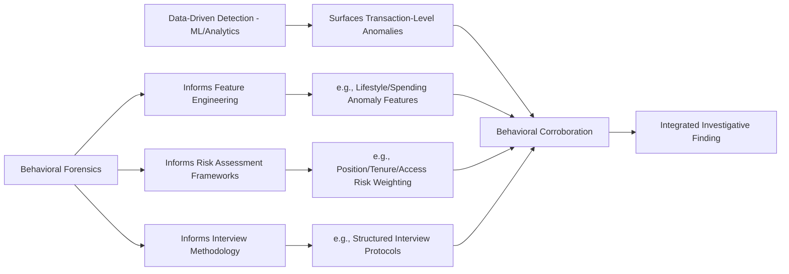

## Behavioral Forensics as a Discipline

### Overview

Behavioral forensics is the discipline that examines the human, psychological, and organizational drivers of financial fraud, complementing the transaction-level and data-driven detection methods covered elsewhere in this material with a focus on *why* fraud occurs and *who* is likely to commit it. Where forensic data analytics and AI-based detection identify anomalies in financial records, behavioral forensics addresses the antecedent conditions, incentives, rationalizations, and observable behavioral indicators associated with fraudulent conduct — grounding investigative and preventive practice in criminology, psychology, and organizational behavior research rather than purely financial-statement or transaction analysis.

### Theoretical Foundations

**Key Points**

- **The Fraud Triangle** (Donald Cressey, 1950s): the foundational behavioral model, positing that fraud occurs when three elements converge: **perceived pressure/incentive** (a financial or personal problem the perpetrator believes must be solved), **perceived opportunity** (a belief that the act can be committed without detection), and **rationalization** (the perpetrator's ability to justify the act to themselves as acceptable, temporary, or deserved, rather than as straightforward theft).
- **The Fraud Diamond** (Wolfe & Hermanson, 2004): extends the triangle by adding **capability** — the recognition that even with pressure, opportunity, and rationalization present, an individual must possess the personal traits, position, and skills (confidence, deceptive skill, ability to manage stress, technical knowledge of controls) to actually execute and conceal the fraud.
- **The Fraud Pentagon** (Crowe, 2011): further extends the model with **competence** (similar to capability) and **arrogance** — a sense of superiority or entitlement leading the perpetrator to believe internal controls do not apply to them personally, often observed in senior-level or long-tenured perpetrators.
- [Inference] The progressive elaboration from triangle to diamond to pentagon reflects an evolving academic and practitioner recognition that the original triangle, while foundational, was insufficient to explain certain fraud patterns — particularly cases involving senior executives with clear capability and low perceived detection risk, where the additional "capability" and "arrogance" elements provide better explanatory power than pressure/opportunity/rationalization alone.

### Rationalization Patterns

**Key Points**

- Rationalization is often the most behaviorally observable element of the fraud triangle, since perpetrators frequently articulate their justifications (to themselves, in communications, or under investigative interview) in recognizable patterns.
- **Common rationalization themes**: "I'm only borrowing it and will pay it back," "I deserve this given how the organization has treated me," "everyone does this," "the company/victim won't miss it or can afford the loss," and "I'm not really hurting anyone."
- **Neutralization theory** (Sykes & Matza, criminology) provides a related framework describing techniques offenders use to neutralize the moral constraints that would otherwise prevent the act: denial of responsibility, denial of injury, denial of the victim, condemnation of the condemners, and appeal to higher loyalties.
- [Inference] Documented rationalization language, where it exists in emails, chat logs, or interview transcripts, is often treated by forensic investigators as circumstantial evidence supporting intent, since rationalization is generally understood in the behavioral forensics literature as a necessary precondition for most non-pathological fraud (as distinct from cases involving diagnosed antisocial personality traits, where rationalization may be less necessary to the offender's psychological process).

### The Perpetrator Profile: Empirical Patterns

**Key Points**

- Behavioral forensics research and industry surveys (notably the Association of Certified Fraud Examiners' periodic Report to the Nations) have identified recurring, empirically observed patterns among confirmed occupational fraud perpetrators, though these represent statistical tendencies across large case populations rather than deterministic predictors for any individual.
- **Commonly observed behavioral red flags** in confirmed fraud cases include: living beyond apparent means, financial difficulties, unusually close association with vendors/customers, control issues or unwillingness to share duties, a general "wheeler-dealer" attitude, family/relationship pressures, and past employment-related problems.
- **Position and tenure patterns**: perpetrators in senior management or ownership positions, and those with longer tenure, have historically been associated with substantially larger median losses than lower-level employees, consistent with the fraud pentagon's capability/arrogance elements — greater access, authority, and control override capability tend to correlate with fraud scale.
- [Inference] These behavioral red flags are appropriately understood as risk indicators warranting closer scrutiny or corroboration through independent evidence, not as standalone proof of fraud — many individuals will exhibit one or more of these indicators without engaging in fraudulent conduct, and treating them as conclusive would risk both false accusations and discriminatory application.

### Organizational and Environmental Factors

**Key Points**

- **Tone at the top**: the ethical climate set by senior leadership's own conduct and stated priorities significantly influences the perceived opportunity and rationalization elements organization-wide — a permissive or results-at-any-cost culture measurably increases fraud risk independent of any individual's personal psychological profile.
- **Control environment weaknesses**: inadequate segregation of duties, weak oversight, excessive trust without verification, and infrequent management review create the "opportunity" element structurally, independent of any specific individual's intent.
- **Organizational pressure**: aggressive performance targets, compensation structures heavily weighted toward short-term metrics, and job insecurity can elevate the "pressure" element across an entire workforce or business unit rather than being confined to individual perpetrators.
- **Groupthink and diffusion of responsibility**: in collusive fraud schemes, individual moral resistance can be diminished when responsibility is diffused across multiple participants, and social conformity pressures within a complicit group can normalize conduct that an individual acting alone would be less likely to undertake.
- [Inference] Organizational-level behavioral factors are generally considered at least as important as individual-level factors in fraud risk assessment, since they explain variation in fraud rates across similar populations of individuals under different organizational conditions — this is a core reason behavioral forensics informs control design and culture assessment, not solely individual suspect profiling.

### Behavioral Indicators in Investigative Interviews

**Key Points**

- Behavioral forensics informs structured interview techniques (introduced under internal investigations methodology) by identifying verbal and non-verbal indicators that may warrant further probing, while cautioning against over-reliance on any single indicator as determinative of deception.
- **Verbal indicators sometimes associated with deception** (subject to significant individual and cultural variation, and never conclusive alone): inconsistent narrative details across retellings, excessive qualifying language, non-answers or evasive responses to direct questions, and unprompted, overly elaborate justifications.
- **Documented caution**: the behavioral science literature on deception detection has produced mixed and often modest results for the reliability of specific behavioral cues (including many popularized non-verbal "tells"), and professional interview methodology increasingly emphasizes **structured, evidence-based questioning** (e.g., cognitive interviewing techniques, strategic use of evidence) over reliance on behavioral cue-reading alone.
- [Unverified] The specific reliability of any given behavioral or non-verbal deception indicator is a matter of ongoing academic debate, with substantial literature questioning the validity of many commonly taught cues; forensic investigators should treat behavioral observations during interviews as one input warranting follow-up corroboration, not as a stand-alone deception-detection methodology.

### Relationship to Data-Driven Fraud Detection

**Key Points**

- Behavioral forensics and data-driven analytics are complementary, not competing, approaches: transaction-level anomaly detection (covered under machine learning applications and continuous monitoring) identifies *what* looks unusual in the financial data, while behavioral forensics helps explain *why* a flagged pattern may represent genuine fraud versus a benign explanation, and helps generate hypotheses about *who* within a flagged population warrants priority attention.
- **Lifestyle and spending anomaly analysis**: publicly observable or disclosed lifestyle changes (unexplained asset acquisitions, spending inconsistent with known compensation) represent a behavioral-forensics-informed data point that can corroborate or contextualize a financially-derived fraud flag.
- [Inference] The integration of behavioral risk factors (position, tenure, access level, known pressure indicators) as features within ML risk-scoring models represents a direct, practical convergence of the behavioral forensics discipline with the AI/analytics techniques covered elsewhere in this material — behavioral theory provides the domain rationale for why certain features are predictive, while ML provides the mechanism for operationalizing that theory at scale.

### Professional and Ethical Considerations

**Key Points**

- Behavioral forensics must be applied with care to avoid conflating **correlation with individual guilt** — behavioral red flags are population-level statistical associations, and their application to any specific individual carries meaningful risk of false accusation, unfair treatment, or discriminatory profiling if not corroborated with independent factual evidence.
- **Avoiding profiling bias**: because certain behavioral indicators (e.g., "living beyond means," "close association with vendors") can be observed and interpreted inconsistently across different demographic groups or cultural contexts, applying behavioral risk indicators without calibration and corroboration discipline risks introducing exactly the kind of bias discussed under AI model limitations, whether the indicator is applied by a human investigator or encoded into an algorithmic feature.
- Forensic accountants and fraud examiners are generally expected, under professional standards, to base conclusions on sufficient, reliable evidence — behavioral indicators inform investigative prioritization and interview strategy, but a finding of fraud requires the documentary, testimonial, and financial evidence discussed throughout this material, not behavioral inference alone.

### Common Pitfalls

**Key Points**

- Treating fraud triangle/diamond/pentagon elements as a checklist for proving fraud occurred, rather than as an explanatory framework for understanding motive and opportunity once fraud is otherwise established
- Over-relying on non-verbal or behavioral "tells" during interviews as though they were reliable deception-detection tools, given the mixed and contested state of the underlying research
- Applying behavioral red flags to individuals without independent corroboration, risking unfounded suspicion or discriminatory treatment
- Focusing exclusively on individual perpetrator psychology while neglecting organizational and control-environment factors that materially shape opportunity and pressure across an entire workforce
- Failing to integrate behavioral forensics insight into control design and culture assessment, treating it as relevant only to post-hoc investigation rather than fraud prevention

### Example

**Example**

A forensic team investigates a suspected embezzlement scheme flagged initially by a continuous monitoring system's anomaly detection:

1. **Data-driven flag**: The monitoring system flags an accounts payable clerk's activity pattern — an unusual concentration of manual journal entries processed after standard business hours, correlating with a new vendor added to the master file shortly before the entries began.
2. **Behavioral corroboration — capability/opportunity**: Investigators note the clerk holds a position with both entry and partial approval authority (a control weakness enabling opportunity) and has over a decade of tenure, giving them detailed knowledge of which control gaps existed and went unmonitored.
3. **Behavioral corroboration — pressure**: Through permissible background research and, later, interview, investigators learn the clerk had disclosed significant personal financial strain to colleagues in the period preceding the anomalous activity — consistent with the pressure element, though investigators are careful to treat this as context rather than proof.
4. **Behavioral corroboration — rationalization**: Interview notes document the clerk's spontaneous framing of the conduct as "temporary" and repeatedly emphasizing the company's profitability ("they'll never even notice"), which the team documents as rationalization language consistent with fraud triangle theory, while relying on the documentary evidence (vendor records, payment traces, authentication logs) as the actual evidentiary basis for findings.
5. **Organizational factor documentation**: The root cause analysis (per internal investigations methodology) separately notes that the segregation-of-duties gap enabling this scheme had been flagged in a prior, unremediated internal audit finding — an organizational opportunity factor independent of the individual's psychology.
6. **Integrated report**: The final report presents the financial/documentary evidence as the primary basis for the substantiated finding, with behavioral forensics analysis (fraud triangle mapping) included as a supporting explanatory section addressing motive and mechanism — explicitly distinguished from the evidentiary proof of the underlying financial facts.

### Related Topics

- Internal investigations of corruption allegations
- Machine learning applications in fraud detection
- Continuous forensic monitoring systems
- Structured investigative interview techniques and Upjohn warnings
- Root cause analysis frameworks for compliance control failures
- Tone at the top and organizational culture assessment in fraud risk programs
- ACFE Report to the Nations and occupational fraud statistics
- Segregation of duties and internal control design principles
- Whistleblower behavior and reporting decision psychology
- Limitations, bias, and validation of AI-based tools (bias parallels in behavioral profiling)