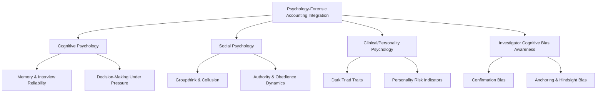
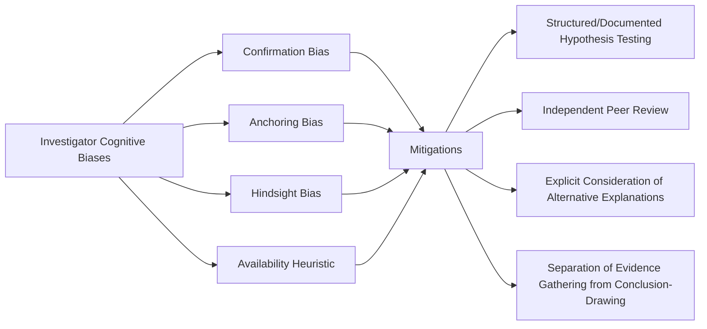

## Integrating Psychology with Forensic Accounting

### Overview

Integrating psychology with forensic accounting examines how psychological science — cognitive, social, developmental, and clinical — can be systematically incorporated into forensic accounting methodology to improve fraud risk assessment, investigative technique, and the interpretation of financial evidence. This topic extends behavioral forensics from a theoretical foundation (the fraud triangle and its extensions) into applied practice: how psychological principles concretely inform interview design, deception assessment, risk profiling, and the forensic accountant's own decision-making processes, including awareness of the investigator's own cognitive biases.

### Domains of Psychological Integration

### Cognitive Psychology: Memory, Interviewing, and Evidence Reliability

**Key Points**

- **Memory science** directly informs investigative interview methodology: human memory is reconstructive rather than a fixed recording, meaning witness accounts can be genuinely, unintentionally distorted by the passage of time, subsequent information exposure, and the specific way questions are framed — a foundational finding from cognitive psychology research on eyewitness memory.
- **Cognitive interviewing techniques**, developed from memory-retrieval research, structure interviews to maximize accurate recall — using open-ended prompts, encouraging witnesses to recall events in varied sequences (not strictly chronological), and minimizing leading or suggestive questioning that can introduce false details into a witness's subsequent recollection.
- **Suggestibility and leading questions**: psychological research consistently demonstrates that question phrasing can measurably alter recalled details, which has direct implications for how forensic accountants and counsel structure interview protocols in internal investigations to avoid inadvertently contaminating witness testimony.
- [Inference] Given that many forensic accounting investigations rely heavily on interview evidence to corroborate or contextualize documentary findings, awareness of memory reconstruction effects is directly relevant to assessing the reliability and appropriate weight of witness statements, particularly where an interview occurs long after the events in question or after the witness has been exposed to others' accounts.

### Decision-Making Under Pressure and Time Constraints

**Key Points**

- **Dual-process theory** (fast, intuitive "System 1" thinking versus slow, deliberate "System 2" thinking, per Kahneman and related research) provides a framework for understanding both perpetrator decision-making (fraud initiated impulsively under acute pressure versus planned deliberately) and investigator decision-making (rapid pattern-matching during triage versus careful analytical review during formal investigation).
- **Escalation of commitment**: once an individual has taken an initial fraudulent action, psychological research on sunk-cost reasoning and commitment escalation helps explain why many fraud schemes grow in scale and duration over time — the perpetrator becomes progressively more committed to concealment and continuation rather than disclosure, even as detection risk and potential consequences increase.
- [Inference] Escalation-of-commitment dynamics are frequently cited as an explanation for why long-running frauds (particularly asset misappropriation and financial statement fraud schemes) tend to grow substantially in size over their duration rather than remaining static, since each successive concealment action increases the psychological and practical cost of stopping or disclosing relative to continuing.

### Social Psychology: Collusion, Authority, and Organizational Dynamics

**Key Points**

- **Obedience to authority** (informed by classic social psychology research, e.g., Milgram-tradition studies on compliance with authority figures) helps explain why subordinates may participate in or fail to report fraudulent instructions from superiors, even when personally aware the conduct is wrong — relevant to understanding both perpetrator recruitment in hierarchical fraud schemes and bystander/whistleblower non-reporting.
- **Groupthink and diffusion of responsibility** in collusive schemes: when multiple individuals participate, each may experience reduced individual moral responsibility, and social conformity pressures can normalize conduct that would be resisted by an individual acting alone — directly relevant to investigating multi-participant schemes where establishing each individual's knowledge and intent is legally significant.
- **Social proof and normalization**: perception that "everyone does this" (a documented rationalization pattern) is reinforced through social psychology mechanisms of observed peer behavior, particularly potent in organizational cultures where minor policy violations are visibly tolerated, gradually normalizing larger violations.
- [Inference] Social psychology research on collusion dynamics is particularly relevant to procurement fraud, bid-rigging, and other schemes requiring active multi-party coordination, since these fraud types cannot be explained by individual-level fraud triangle analysis alone — they require understanding how the social dynamics between co-conspirators sustained the scheme over time.

### Personality and Clinical Psychology Considerations

**Key Points**

- **"Dark Triad" personality traits** (narcissism, Machiavellianism, psychopathy) have been studied in the fraud and white-collar crime literature as personality dimensions statistically associated with higher likelihood of unethical or fraudulent conduct in some populations — narcissism linked to entitlement and rule-breaking justification, Machiavellianism to strategic manipulation and deception, and psychopathy to reduced empathy and risk-aversion regarding consequences to others.
- [Unverified] The predictive strength and clinical rigor of Dark Triad research specifically within occupational fraud populations (as opposed to broader antisocial behavior research) varies across studies, and forensic accountants should treat personality trait association as a probabilistic, population-level research finding rather than a basis for individual clinical diagnosis, which forensic accountants are not qualified to perform.
- **Boundary of professional competence**: forensic accountants are not licensed psychologists or clinicians, and should not attempt to diagnose personality disorders, mental health conditions, or psychopathy in specific individuals — psychological research informs risk *frameworks* and investigative *methodology*, but individual clinical assessment (where relevant, e.g., in litigation requiring expert psychological testimony) requires a qualified mental health professional.
- **Key Points** — this boundary is professionally and ethically important: characterizing a specific subject as exhibiting "psychopathic" or similarly clinically-loaded traits without qualification risks both professional overreach and unfair prejudicial characterization unsupported by the forensic accountant's actual expertise.

### Investigator Cognitive Bias Awareness

**Key Points**

- Psychological integration into forensic accounting is not limited to understanding perpetrator psychology — it equally encompasses **awareness of the investigator's own cognitive biases**, which can distort evidence gathering, analysis, and conclusions if unaddressed.
- **Confirmation bias**: the tendency to seek, interpret, and recall information in ways that confirm a pre-existing hypothesis — a significant risk in fraud investigations, where an early working theory can unconsciously shape which evidence is pursued and how ambiguous evidence is interpreted.
- **Anchoring bias**: over-reliance on the first piece of information encountered (e.g., an initial whistleblower allegation's framing) when evaluating subsequent, potentially contradicting evidence.
- **Hindsight bias**: the tendency, once an outcome (fraud) is known, to perceive it as having been more predictable or obvious in advance than it genuinely was — relevant when evaluating whether a control failure or missed red flag reflects genuine negligence versus reasonable judgment given what was actually knowable at the time.
- **Availability heuristic**: overweighting vivid, memorable, or recently-encountered fraud patterns (e.g., a recently publicized major fraud case) when assessing the likelihood of similar patterns in a current investigation, potentially at the expense of less memorable but statistically more probable explanations.

**Key Points**

- **Mitigation practices**: structured hypothesis-testing methodology (explicitly documenting and testing alternative, non-fraud explanations before concluding fraud occurred), independent peer or second-reviewer sign-off on significant findings, and maintaining a documented investigative trail showing how conclusions were reached from evidence — directly analogous to the independence and documentation principles discussed under internal investigations methodology.
- [Inference] The professional skepticism standard embedded in forensic accounting and audit practice can be understood, in psychological terms, as a structured countermeasure against confirmation bias specifically — the discipline of actively seeking disconfirming evidence rather than merely evidence consistent with an initial hypothesis is precisely the corrective cognitive psychology research suggests is needed to counteract this well-documented bias.

### Applying Psychological Insight to Interview Strategy

**Key Points**

- **Rapport-building** grounded in psychological principles (establishing a non-confrontational opening, allowing the subject to provide an uninterrupted initial narrative) tends to elicit more complete and accurate information than immediately confrontational questioning, consistent with cognitive interviewing research.
- **Strategic use of evidence (SUE) technique**: a structured interviewing approach, informed by psychological deception research, where the interviewer withholds disclosure of evidence until late in the interview, allowing a deceptive subject's account to be compared against the undisclosed evidence for inconsistency, rather than confronting the subject with evidence upfront (which can allow a deceptive subject to simply tailor their account to fit).
- **Avoiding over-reliance on non-verbal cues**: as discussed under behavioral forensics as a discipline, psychological research offers only modest, contested support for many popularly taught non-verbal deception indicators — the stronger evidentiary practice is structured, evidence-based questioning methodology over behavioral cue interpretation.

### Integration with Organizational Risk Assessment

**Key Points**

- Psychological principles inform **fraud risk assessment frameworks** at the organizational level: understanding pressure sources (compensation structure psychology, job insecurity effects on rule-following), opportunity perception (how control visibility affects perceived detection risk), and rationalization culture (how organizational narratives and leadership messaging shape employees' moral disengagement from policy violations).
- **Moral disengagement theory** (Bandura) provides a more granular psychological mechanism underlying rationalization — describing specific cognitive mechanisms (moral justification, euphemistic labeling, advantageous comparison, displacement of responsibility) through which individuals disengage their normal ethical self-regulation to enable conduct they would otherwise consider wrong.
- [Inference] Incorporating moral disengagement and related psychological frameworks into fraud risk assessments and control design (e.g., training that specifically addresses common rationalization/disengagement patterns rather than only stating rules) represents a more psychologically grounded approach to fraud prevention than compliance training focused solely on rule communication, though the comparative effectiveness of psychologically-informed versus traditional compliance training in actually reducing fraud incidence is an area with a less extensive rigorous evidence base than the underlying psychological theory itself.

### Professional and Ethical Boundaries

**Key Points**

- Forensic accountants integrating psychological insight into their practice should clearly distinguish between **applying published psychological research and frameworks** (an appropriate and increasingly expected professional competency) and **practicing psychology or performing clinical assessment** (outside forensic accounting's professional scope and licensure).
- Findings and reports should attribute behavioral characterizations to documented, corroborated conduct and statements ("interview notes reflect the subject stating X, consistent with rationalization patterns described in the fraud triangle literature") rather than diagnostic-sounding characterizations of the individual's psychological state ("the subject is a narcissist" or "the subject exhibits psychopathic tendencies").
- This distinction has both professional ethics implications (competency boundaries) and practical litigation implications (diagnostic-sounding lay characterizations by a non-clinical expert may be challenged as exceeding the expert's qualified scope of testimony).

### Common Pitfalls

**Key Points**

- Applying personality trait research (Dark Triad, etc.) as though it constituted individual diagnostic assessment rather than population-level statistical association
- Failing to apply the same bias-awareness discipline to the investigator's own reasoning that is applied to analyzing the subject's behavior
- Using confrontational, evidence-upfront interview techniques that psychological research suggests are less effective than structured, strategic-evidence-use approaches
- Treating hindsight-biased assessments of "obvious" red flags as evidence of investigator or management negligence without accounting for what was genuinely knowable prospectively
- Overstating the reliability of non-verbal deception cues in investigative reports or testimony, given the contested state of the underlying research
- Neglecting organizational-level psychological factors (moral disengagement, authority dynamics) in favor of exclusively individual-level behavioral analysis

### Example

**Example**

A forensic accounting team investigates a multi-participant procurement kickback scheme involving a manager and two subordinate employees:

1. **Cognitive interviewing application**: Interviews with peripheral witnesses are structured using open-ended, non-leading prompts and varied recall sequencing, consistent with cognitive interview methodology, to minimize the risk of memory contamination before more central witnesses are approached.
2. **Social psychology framing**: The investigative team notes the organizational structure — a manager with significant authority over the two subordinates — and considers, per obedience-to-authority research, that the subordinates' participation may reflect compliance with perceived authority rather than independently formed criminal intent, informing (without predetermining) how each individual's culpability is assessed.
3. **Bias mitigation practice**: The lead investigator documents the initial whistleblower allegation's framing separately from subsequently gathered evidence, explicitly noting in the investigative file where the team considered and ruled out alternative, non-fraudulent explanations for flagged transactions (anchoring and confirmation bias mitigation).
4. **Strategic use of evidence**: During the manager's interview, previously obtained documentary evidence (vendor bank account records) is deliberately not disclosed until late in the interview, after the manager has given an initial uninterrupted account — allowing investigators to identify a material inconsistency between the manager's account and the undisclosed evidence.
5. **Professional boundary observed**: Despite the manager's interview demonstrating conduct consistent with rationalization and entitlement-framed justifications, the final report describes these observations factually ("the subject stated X, Y, Z" with citations to interview notes) rather than characterizing the manager using clinical personality labels, remaining within the forensic accounting team's professional competency.
6. **Root cause integration**: The final report's root cause section incorporates moral disengagement theory to explain how a previously tolerated minor policy exception (accepting vendor gifts below a nominal threshold) appears to have normalized larger rule violations over time — informing the remediation recommendation to address cultural tolerance patterns, not only formal policy language.

### Related Topics

- Behavioral forensics as a discipline
- Internal investigations of corruption allegations
- Structured investigative interview techniques and Upjohn warnings
- Limitations, bias, and validation of AI-based tools (parallel bias-awareness principles)
- Root cause analysis frameworks for compliance control failures
- Tone at the top and organizational culture assessment
- Whistleblower behavior and non-reporting psychology
- Professional skepticism standards in forensic accounting practice
- Expert witness qualification boundaries and scope of testimony
- ACFE Report to the Nations and occupational fraud perpetrator characteristics