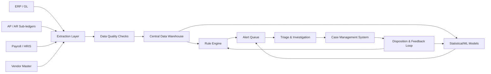
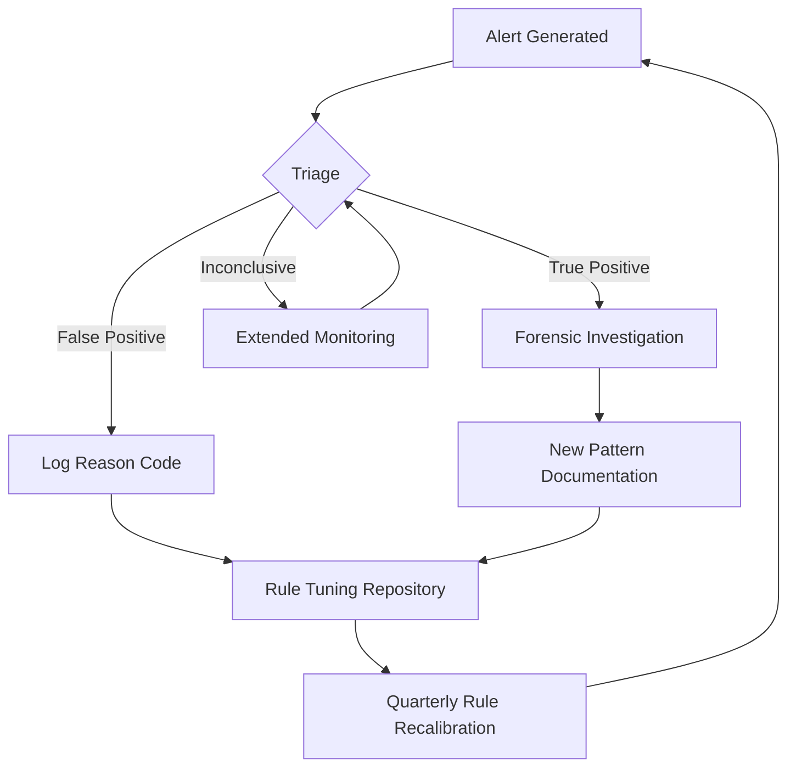

## Building Continuous Monitoring Programs

### Overview and Objectives

Continuous monitoring programs are systematic, technology-enabled processes that analyze 100% of transactions (or a representative near-total population) on an ongoing basis to detect anomalies, control breakdowns, and indicators of fraud in near-real-time or at short, fixed intervals. They differ fundamentally from periodic audit sampling because detection latency is compressed from months or years to days or hours.

**Key Points**

- Shifts fraud detection from reactive (post-incident) to proactive (pre-loss or early-loss)
- Operates on full-population data rather than statistical samples
- Combines rule-based logic, statistical baselines, and increasingly machine learning models
- Requires governance, not just technology — ownership, escalation, and response protocols are as important as the detection engine

### Core Components of a Continuous Monitoring Program

#### 1. Data Architecture

A monitoring program is only as good as the data feeding it.

- **Source systems**: ERP (SAP, Oracle), general ledger, sub-ledgers (AP, AR, payroll, procurement), treasury systems, HR/payroll master files, vendor master files
- **Extraction cadence**: Batch (nightly/weekly) vs. streaming (API/event-based). Most mature programs start batch and evolve toward near-real-time for high-risk cycles (e.g., wire transfers)
- **Data warehouse/lake**: Centralized repository normalizing disparate chart-of-accounts structures, currencies, and entity codes across business units
- **Data quality controls**: Completeness checks (record counts reconcile to source), referential integrity (vendor IDs exist in master file), timeliness SLAs

#### 2. Detection Logic Layers

**Rule-based (deterministic) tests** — the backbone of most programs, drawn from known fraud schemes:

- Duplicate payments (same invoice number/amount/vendor within a date window)
- Vendor-employee address or bank account matches (conflict of interest)
- Round-dollar or just-below-approval-threshold transactions (structuring)
- Weekend/after-hours journal entries posted by users without segregation of duties
- Ghost employees (no tax withholding changes, no benefit elections, duplicate direct-deposit accounts)
- Benford's Law digit-frequency deviations on populations of invoice or expense amounts

**Statistical/anomaly-based tests**:

- Z-score or interquartile-range outlier detection on transaction amounts by vendor/GL account
- Time-series deviation from seasonal baselines (e.g., expense account spikes)
- Peer-group benchmarking (one branch/cost center deviates materially from similar units)

**Machine learning approaches** (for mature programs):

- Supervised classification trained on historically confirmed fraud cases (logistic regression, gradient boosting) — requires labeled data, which is often scarce
- Unsupervised clustering/isolation forests to surface transactions dissimilar to the bulk population without needing labels
- Network/graph analysis to detect collusion rings (shared addresses, phone numbers, IP addresses across "unrelated" vendors or employees)

[Inference] Pure ML approaches without an interpretable rule layer tend to generate lower analyst trust and higher override rates in early deployment, because auditors and investigators need explainable alert rationale to act on results and to defend findings if litigation follows.

#### 3. Risk Scoring and Alert Prioritization

Raw rule hits are typically too numerous to investigate individually. A scoring layer aggregates signals:

$$\text{RiskScore}_i = \sum_{k=1}^{n} w_k \cdot f_k(x_i)$$

Where $f_k(x_i)$ is the binary or normalized output of rule/model $k$ for transaction $i$, and $w_k$ is a weight calibrated from historical investigation outcomes (true positive rate of that rule). Transactions crossing a threshold score route to a triage queue; those far above threshold may trigger automatic holds (e.g., blocking a payment run).

**Example**

A duplicate-payment rule (weight 0.3) plus a new-vendor-within-30-days rule (weight 0.25) plus a just-below-approval-threshold rule (weight 0.2) firing simultaneously on one invoice yields a composite score of 0.75, exceeding a 0.6 escalation threshold, routing the item to a Level 2 investigator rather than the general queue.

#### 4. Alert Triage and Case Management

- **Tiered response**: Level 1 (automated disposition of clearly benign patterns), Level 2 (analyst review), Level 3 (forensic investigation)
- **Case management system**: Tracks alert lifecycle from generation through disposition (false positive, true positive, inconclusive), preserves chain of custody for evidence, and logs investigator notes for audit trail and potential legal proceedings
- **SLA targets**: Time-to-triage (e.g., 24-48 hours for high-risk alerts), time-to-close

#### 5. Feedback Loop and Model Governance

Every disposed alert should feed back into rule/model calibration:

- False positive rates by rule tracked monthly; rules exceeding a target FP rate (commonly >90-95% false positive) are retuned or retired
- Confirmed true positives analyzed for new pattern signatures, seeding new rules
- Periodic (semi-annual/annual) revalidation of statistical thresholds and ML model performance against drift

### Governance Structure

| Role | Responsibility |
| --- | --- |
| Audit Committee | Oversight, budget approval, risk appetite sign-off |
| Chief Audit Executive / Forensic Lead | Program ownership, escalation of significant findings |
| Data/Analytics Team | Rule development, model maintenance, data pipeline integrity |
| Investigators | Triage, evidence gathering, disposition |
| IT/Security | Access controls, system integration, data security |
| Legal/Compliance | Privilege considerations, regulatory reporting (SAR filings if applicable), whistleblower coordination |

### Implementation Roadmap

**Phase 1 — Foundation (Months 1-3)**

- Data inventory and access provisioning across source systems
- Prioritize 2-3 highest-risk cycles (typically procure-to-pay and payroll)
- Deploy 10-15 well-understood deterministic rules

**Phase 2 — Expansion (Months 4-9)**

- Add statistical anomaly detection
- Build case management workflow and SLAs
- Establish feedback loop and rule-tuning cadence

**Phase 3 — Maturity (Months 10-18)**

- Introduce ML models where sufficient labeled history exists
- Extend to additional cycles (treasury, expense reimbursement, revenue recognition)
- Integrate with enterprise risk management and whistleblower hotline data

[Unverified] Exact timelines vary significantly by organization size, ERP landscape complexity, and existing data governance maturity; the phases above represent a common but not universal pattern observed across mid-to-large enterprise deployments.

### Common Pitfalls

- **Alert fatigue**: Poorly calibrated rules generating high false-positive volume erode investigator trust and cause genuine alerts to be deprioritized
- **Siloed data**: Monitoring only the GL while ignoring sub-ledger detail misses schemes that net-out at the summary level
- **Static rule sets**: Fraudsters adapt; rules not revisited become blind spots (concept drift)
- **No response protocol**: Detecting an anomaly without a defined investigation and escalation path produces documentation risk without remediation
- **Ignoring segregation-of-duties (SoD) conflicts** as a first-order signal — SoD violations are often leading indicators, not just control gaps

### Illustrative Dashboard Layout (svg_diagram)

<svg viewBox="0 0 800 420" xmlns="http://www.w3.org/2000/svg">
<rect x="0" y="0" width="800" height="420" fill="#f7f7f8"/>
<text x="20" y="30" font-family="Arial" font-size="18" font-weight="bold" fill="#222">Continuous Monitoring Dashboard (svg_diagram)</text>
<rect x="20" y="50" width="240" height="140" fill="#ffffff" stroke="#ccc"/>
<text x="35" y="75" font-family="Arial" font-size="13" font-weight="bold" fill="#333">Open Alerts by Priority</text>
<rect x="40" y="90" width="30" height="80" fill="#d9534f"/>
<rect x="90" y="120" width="30" height="50" fill="#f0ad4e"/>
<rect x="140" y="140" width="30" height="30" fill="#5bc0de"/>
<text x="40" y="185" font-family="Arial" font-size="10" fill="#555">High</text>
<text x="90" y="185" font-family="Arial" font-size="10" fill="#555">Med</text>
<text x="140" y="185" font-family="Arial" font-size="10" fill="#555">Low</text>
<rect x="280" y="50" width="240" height="140" fill="#ffffff" stroke="#ccc"/>
<text x="295" y="75" font-family="Arial" font-size="13" font-weight="bold" fill="#333">False Positive Rate Trend</text>
<polyline points="300,160 340,140 380,150 420,120 460,130 500,100" fill="none" stroke="#5cb85c" stroke-width="3"/>
<rect x="540" y="50" width="240" height="140" fill="#ffffff" stroke="#ccc"/>
<text x="555" y="75" font-family="Arial" font-size="13" font-weight="bold" fill="#333">Top Triggering Rules</text>
<text x="560" y="100" font-family="Arial" font-size="11" fill="#444">1. Duplicate Payment</text>
<text x="560" y="120" font-family="Arial" font-size="11" fill="#444">2. Vendor-Employee Match</text>
<text x="560" y="140" font-family="Arial" font-size="11" fill="#444">3. Round-Dollar Threshold</text>
<text x="560" y="160" font-family="Arial" font-size="11" fill="#444">4. After-Hours JE</text>
<rect x="20" y="210" width="760" height="190" fill="#ffffff" stroke="#ccc"/>
<text x="35" y="235" font-family="Arial" font-size="13" font-weight="bold" fill="#333">Alert Volume by Cycle (Rolling 12 Weeks)</text>
<rect x="50" y="330" width="20" height="50" fill="#337ab7"/>
<rect x="90" y="300" width="20" height="80" fill="#337ab7"/>
<rect x="130" y="350" width="20" height="30" fill="#337ab7"/>
<rect x="170" y="280" width="20" height="100" fill="#337ab7"/>
<rect x="210" y="310" width="20" height="70" fill="#337ab7"/>
<text x="45" y="395" font-family="Arial" font-size="9" fill="#555">P2P</text>
<text x="85" y="395" font-family="Arial" font-size="9" fill="#555">Payroll</text>
<text x="120" y="395" font-family="Arial" font-size="9" fill="#555">T&E</text>
<text x="160" y="395" font-family="Arial" font-size="9" fill="#555">Treasury</text>
<text x="200" y="395" font-family="Arial" font-size="9" fill="#555">Rev Rec</text>
</svg>

### Key Metrics to Track

- Alert volume (total, by rule, by cycle) over time
- False positive rate by rule (target: continuously declining)
- Mean time-to-triage and mean time-to-disposition
- Dollar value of confirmed fraud/error detected vs. program cost (ROI)
- Coverage percentage (transaction population actually scored vs. total population)
- Rule/model drift indicators (performance degradation over successive periods)

**Related Topics**

- Benford's Law and digit-analysis techniques in forensic accounting
- Segregation of duties (SoD) analytics and access-risk modeling
- Journal entry testing and CAAT (Computer-Assisted Audit Techniques)
- Machine learning model validation and explainability in fraud detection
- Whistleblower hotline data integration with monitoring programs
- Vendor master file due diligence and shell company detection
- Data loss prevention and chain-of-custody protocols for digital evidence