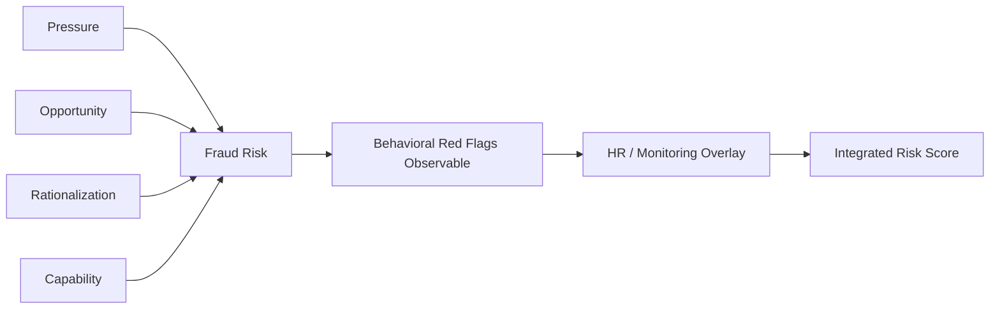

## Human Factors in Fraud Detection Systems

### Overview

Continuous monitoring and analytics catch the transactional signal, but every alert ultimately passes through a human analyst, investigator, or approver before a fraud finding is acted upon. Human factors — cognitive biases, workload design, organizational incentives, and behavioral psychology — determine whether a technically sound detection system produces reliable outcomes or is quietly undermined in practice. This subtopic addresses the psychological and organizational dimensions that sit between algorithmic alert generation and effective fraud response.

**Key Points**

- Detection systems fail as often from human misuse/underuse as from technical inadequacy
- Cognitive biases systematically distort how investigators triage and interpret alerts
- Alert fatigue is a predictable, measurable phenomenon with known mitigations
- Incentive structures and organizational culture shape whether employees report anomalies at all
- Behavioral profiling of fraud perpetrators (the "Fraud Triangle" and its extensions) informs both detection design and investigator training

### Cognitive Biases Affecting Investigators

**Confirmation bias**: Once an investigator forms an initial hypothesis about a flagged transaction, subsequent evidence is disproportionately interpreted as confirming that hypothesis, while disconfirming evidence is discounted or under-weighted.

**Anchoring**: The first alert score or the first piece of evidence reviewed exerts outsized influence on the final disposition, even when later evidence should logically dominate.

**Automation bias**: Analysts over-trust system-generated risk scores and under-scrutinize low-scored transactions, even when contextual red flags are present that the model was never trained to detect.

**Alert fatigue / vigilance decrement**: Sustained exposure to high volumes of low-value alerts causes measurable declines in detection accuracy over a shift or review period, analogous to signal-detection degradation documented in radar-monitoring and quality-control literature.

[Inference] The magnitude of vigilance decrement in fraud-alert triage specifically (as opposed to the broader signal-detection literature it is drawn from) is not something that has a single universally cited figure; program-specific false-positive-rate and time-to-fatigue data should be measured empirically rather than assumed from other domains.

**Availability heuristic**: Investigators overweight fraud schemes they have personally encountered or recently read about, under-detecting novel scheme variants that don't match a readily recalled pattern.

### The Fraud Triangle and Behavioral Red Flags

Human-factors-informed detection design draws on established fraud psychology frameworks:

$$\text{Fraud Risk} = f(\text{Pressure}, \text{Opportunity}, \text{Rationalization})$$

- **Pressure/incentive**: Financial strain, performance targets, lifestyle beyond means
- **Opportunity**: Weak controls, override authority, lack of oversight
- **Rationalization**: Belief the act is justified, temporary, or victimless

The **Fraud Diamond** extends this with a fourth element, **capability** — the perpetrator's personal traits (position, intelligence, ego, coercion skill) enabling them to recognize and exploit the opportunity, execute the scheme, and manage the deception over time.

**Behavioral red flags** commonly incorporated into HR-linked monitoring overlays:

- Unexplained lifestyle changes inconsistent with compensation
- Refusal to take vacation or accept promotions/transfers (concealment behavior)
- Excessive control over a process area, resistance to cross-training
- Irritability, defensiveness, or over-justification when questioned about routine matters
- Close, undisclosed personal relationships with vendors or counterparties

[Inference] Behavioral red flags are probabilistic risk indicators observed in populations of confirmed fraud cases, not diagnostic criteria for any individual; using them as standalone grounds for investigation (rather than as one input among several) raises both legal and ethical exposure and is generally advised against in forensic practice.

### Designing Alert Systems Around Human Limitations

#### Alert Volume Management

- Cap daily/shift alert queues per analyst based on empirically measured sustainable review capacity
- Use progressive disclosure in case UI (summary first, drill-down on demand) to reduce cognitive load per alert
- Randomize a small percentage of low-score "control" transactions into the queue to measure whether analysts are actually discriminating signal from noise, or rubber-stamping

#### Structured Decision Protocols

- Standardized triage checklists reduce reliance on ad hoc judgment and limit anchoring/confirmation bias
- Require investigators to document disconfirming evidence considered, not just confirming evidence, before closing a case
- Blind or partially blind review (withholding the automated risk score until after independent initial assessment) can be used periodically to audit whether automation bias is distorting judgment

#### Second-Reviewer and Rotation Controls

- Independent second review on high-dollar or high-score dispositions
- Periodic case-file rotation among investigators to surface inconsistent disposition patterns tied to a specific reviewer's blind spots
- Investigator performance metrics tracked at the population level (disposition consistency, override rates) rather than only individual "cases closed" throughput, which can incentivize rushed review

### Organizational and Cultural Factors

**Reporting culture and psychological safety**: Employees are measurably more likely to report suspected fraud when they trust that reports will be handled confidentially and without retaliation. Whistleblower hotline utilization rates are commonly used as an indirect proxy for organizational reporting culture health.

**Tone at the top**: Leadership's visible commitment to ethics enforcement (including against senior employees) is repeatedly identified in fraud-examiner survey literature as a factor associated with lower realized fraud losses, though the causal direction and magnitude are inferential rather than experimentally established.

**Incentive misalignment**: Compensation or performance structures that reward volume/speed over accuracy (e.g., procurement staff incentivized purely on cost savings, without a corresponding control metric) create structural pressure that can override individual ethical intent.

**Segregation-of-duties fatigue**: In practice, SoD controls are sometimes informally circumvented by well-intentioned employees under workload pressure (e.g., sharing credentials to meet a deadline). Programs should monitor for control-circumvention behavior as a distinct signal from intentional fraud, since root causes and remediation differ.

### Training Investigators for Behavioral Forensics

| Training Focus | Objective |
| --- | --- |
| Interview and interrogation technique (e.g., cognitive interview method) | Elicit accurate, complete statements while minimizing false confessions or false denials |
| Cognitive bias awareness | Enable self-monitoring for anchoring, confirmation bias, automation bias during triage |
| Documentation discipline | Ensure evidentiary chain-of-custody and defensible written rationale for every disposition |
| Statement analysis / linguistic red flags | Recognize deceptive language patterns (e.g., distancing language, non-answers) in written explanations or interview transcripts |
| Legal and privilege boundaries | Understand when findings must be escalated to legal counsel before further investigator action |

**Example**

An AP investigator triaging a duplicate-payment alert has an initial hunch it's a data-entry error (a common, low-severity outcome for this rule). A structured protocol requiring documentation of at least one disconfirming factor before closure forces the investigator to check whether the "duplicate" invoice was paid to two different bank accounts — a fact that would have been overlooked under an unstructured, hypothesis-confirming review, and that reclassifies the case from clerical error to potential vendor fraud.

### Measuring Human-Factor Effectiveness

- **Inter-rater reliability**: Percentage agreement (or Cohen's kappa) between two independent investigators disposing the same alert sample — low agreement signals inconsistent judgment standards, not just individual investigator error
- **Override rate**: Frequency with which analysts override system-recommended dispositions, tracked by direction (escalating vs. dismissing) to detect systematic under- or over-reliance on automation
- **Fatigue-adjusted accuracy curves**: Detection accuracy plotted against alert sequence number within a shift, to identify the point at which review quality degrades and queue caps should be set

$$\kappa = \frac{p_o - p_e}{1 - p_e}$$

where $p_o$ is observed agreement between reviewers and $p_e$ is agreement expected by chance.

### Common Pitfalls

- Treating alert fatigue as a training problem rather than a workload-design problem
- Rewarding investigators purely on volume closed, incentivizing superficial review
- Failing to periodically re-baseline "normal" behavioral patterns as organizational culture and workforce composition change
- Over-relying on behavioral red-flag checklists as if they were deterministic fraud indicators, creating discrimination or wrongful-accusation exposure
- No feedback mechanism telling investigators the ultimate outcome of cases they escalate, which degrades calibration and engagement over time

**Related Topics**

- Fraud Triangle, Fraud Diamond, and other behavioral fraud models
- Interview and interrogation methodologies (cognitive interview, PEACE model)
- Alert fatigue and vigilance decrement in high-volume review environments
- Whistleblower hotline design and psychological safety metrics
- Segregation of duties and access-risk analytics
- Case management system design for investigator workflow
- Statement and linguistic analysis in fraud interviews