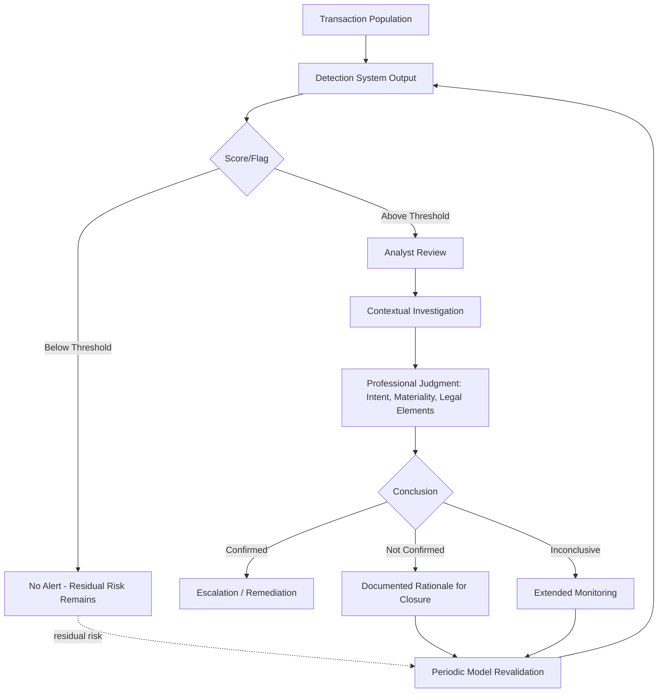

## Combining Technology with Professional Judgment

### Overview

Fraud detection systems generate statistical outputs — scores, flags, anomaly rankings — that describe likelihood, not certainty. Professional judgment is the discipline of translating that statistical output into a defensible conclusion about intent, materiality, and appropriate action. Neither element is sufficient alone: technology without judgment produces mechanical over- or under-reaction to noise; judgment without technology cannot scale to full-population testing and reintroduces the sampling risk continuous monitoring was built to eliminate. This topic addresses the interface between the two — where authority for decisions sits, how confidence should be calibrated, and how the combination is documented for audit and legal defensibility.

**Key Points**

- Technology establishes statistical likelihood; judgment establishes legal, contextual, and materiality conclusions
- Professional skepticism must be applied to the algorithm itself, not only to the underlying transaction
- Documentation must show the reasoning chain from data output to human conclusion, not just the final disposition
- Over-reliance and under-reliance are both professional-judgment failures, not just technology failures
- Standards bodies (PCAOB, IIA, ACFE) explicitly require auditor/investigator judgment even where automated tools are used

### Division of Labor: What Technology Does vs. What Judgment Does

| Function | Technology | Professional Judgment |
| --- | --- | --- |
| Population coverage | Scans 100% of transactions | N/A |
| Pattern detection | Identifies statistical outliers, rule matches | Assesses whether pattern reflects genuine risk or benign explanation |
| Consistency | Applies identical logic across all records | Adapts to context technology cannot encode (e.g., known one-off business event) |
| Speed | Processes at machine scale | Deliberates at human reasoning speed |
| Intent assessment | Cannot infer intent | Determines whether pattern indicates error, override, or deliberate concealment |
| Materiality | Flags based on preset thresholds | Weighs qualitative materiality (e.g., reputational, regulatory) beyond dollar thresholds |
| Legal conclusion | None | Determines whether findings meet elements of fraud, warrant referral, or require privilege protection |

### Professional Skepticism Applied to the Detection System Itself

Standard forensic training emphasizes skepticism toward client/subject representations. An underappreciated extension is skepticism toward the analytical tool's own output:

- **Model assumptions**: What does the anomaly-detection model treat as "normal," and was that baseline period itself free of undetected fraud? A model trained on a contaminated baseline will under-flag similar future activity.
- **Threshold arbitrariness**: A score of 0.59 versus a 0.60 escalation threshold is not a meaningful risk distinction; judgment should treat near-threshold cases as a class requiring separate calibration review, not treat the cutoff as a bright line.
- **Rule coverage gaps**: Absence of an alert is not evidence of absence of fraud — it may reflect a scheme the rule set was never designed to detect. [Inference] This is a logical/methodological point about detection systems generally rather than an empirical finding requiring citation, but it is one of the more consequential misunderstandings in practice, since "clean monitoring results" are sometimes miscommunicated to stakeholders as an assurance the system was never designed to provide.

$$P(\text{Fraud} \mid \text{No Alert}) \neq 0$$

The absence of a positive signal only reduces posterior probability relative to the prior; it does not eliminate it, and the degree of reduction depends entirely on the sensitivity of the specific rules deployed — a fact that should be explicitly stated in program reporting rather than implied.

### Calibrating Reliance: Avoiding Both Failure Modes

**Over-reliance on technology (automation bias)**

- Symptom: Analysts dispose of alerts based solely on score, without reviewing underlying transaction context
- Mitigation: Mandatory documented rationale citing at least one independently reviewed fact beyond the system score; periodic blind-review audits (see Human Factors topic) comparing analyst conclusions to score-withheld reassessment

**Under-reliance on technology (judgment override without basis)**

- Symptom: Experienced investigators dismiss high-confidence statistical flags based on unstructured "gut feel" or familiarity with the subject, without documenting a specific disconfirming fact
- Mitigation: Override requires written justification tied to a verifiable fact (e.g., "confirmed via signed contract addendum," not "vendor has been reliable for years"); override rates tracked and reviewed by supervisors as a distinct KPI

**Example**

A vendor-duplicate-payment rule flags a $340,000 invoice pair at a 0.91 risk score — near-certain by the model's historical calibration. An investigator's initial instinct, based on 15 years' familiarity with the vendor, is to dismiss it as a system false positive. Applying structured judgment protocol, the investigator is required to independently verify a specific disconfirming fact rather than rely on relationship history alone; on doing so, discovers the second "duplicate" was actually a legitimate credit memo reversal recorded with an offsetting entry the rule's logic didn't capture. The dismissal is correct, but only because it was grounded in a verified fact, not in trust — the same protocol would have caught a genuine duplicate that a purely relationship-based dismissal would have missed.

### Standards and Professional Guidance Context

- **AICPA/PCAOB auditing standards**: Use of technology tools (data analytics, ADAs) does not reduce the auditor's responsibility to exercise professional skepticism and judgment over both the tool's output and its underlying assumptions
- **IIA International Standards for the Professional Practice of Internal Auditing**: Requires internal auditors to apply due professional care, explicitly including evaluation of the sufficiency and reliability of information — extending to system-generated information
- **ACFE Fraud Examiners Manual**: Frames technology-assisted review as an investigative tool subject to the same evidentiary and documentation rigor as any other investigative technique, not a substitute for it

[Unverified] Exact current wording of specific standard paragraphs should be verified against the live authoritative text at time of use, as standards are periodically updated; the substantive principle — that automated tools do not diminish the judgment and skepticism requirement — is consistently represented across these frameworks.

### Documentation Requirements for Defensibility

A defensible case file combining technology and judgment should capture:

1. **System output**: Exact rule(s)/model(s) triggered, score, and version of the model/rule set at time of alert (models are periodically retrained; version control matters for later legal review)
2. **Independent facts gathered**: What the investigator verified beyond the system output (documents reviewed, interviews conducted, data cross-referenced)
3. **Reasoning chain**: How the independent facts and system output combine to support the conclusion — not just the conclusion itself
4. **Alternative explanations considered and ruled out**: Explicit documentation of disconfirming hypotheses evaluated
5. **Escalation/referral rationale**: If referred to legal or law enforcement, the specific basis connecting evidence to legal elements of the suspected offense

### Governance: Where Authority Sits

| Decision | Typical Authority Level |
| --- | --- |
| Alert disposition (routine, low score) | Analyst (Level 1) |
| Alert disposition (high score or high dollar) | Senior investigator (Level 2), often requiring second reviewer |
| Model/rule threshold changes | Analytics lead with audit committee or CAE visibility |
| Escalation to legal/law enforcement | Forensic lead + legal counsel jointly |
| Override of system-recommended escalation | Requires documented justification and supervisory sign-off |

### Common Pitfalls

- Treating a model's statistical output as a legal or definitive fraud conclusion in communications to the audit committee or board
- Allowing seniority or relationship familiarity to substitute for documented, fact-based override justification
- Failing to version-control detection logic, making it impossible to reconstruct why a historical alert did or didn't fire when the case resurfaces in litigation
- No formal process for periodically testing whether judgment-based overrides are, in aggregate, correcting real false positives or systematically suppressing true positives
- Presenting "no alerts generated" as equivalent to "no fraud risk," rather than as a statement bounded by the specific rules/models deployed

**Related Topics**

- Professional skepticism standards in audit and forensic practice (PCAOB, IIA, ACFE)
- Model risk management and version control for detection rule sets
- Documentation and evidentiary standards for fraud case files
- Human factors and cognitive bias in fraud detection systems
- Escalation protocols and legal privilege considerations in fraud investigations
- Benford's Law and other statistical baseline techniques requiring judgmental interpretation