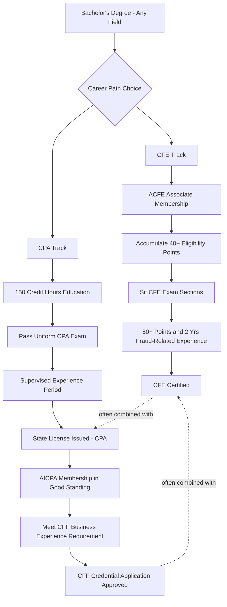

## CFE, CPA, and CFF Credential Pathways

### Overview

Three distinct but complementary credentials anchor careers in forensic accounting and fraud examination: the **Certified Fraud Examiner (CFE)**, granted by the Association of Certified Fraud Examiners (ACFE); the **Certified Public Accountant (CPA)**, a state-issued license in the U.S.; and **Certified in Financial Forensics (CFF)**, an AICPA credential layered on top of an existing CPA certificate. They are frequently pursued in combination — CPA + CFF signals accounting/audit rigor with forensic specialization, while CFE signals investigative and anti-fraud domain expertise independent of accounting licensure. Many senior forensic practitioners hold two or all three.

**Key Points**

- CFE is issued exclusively by the ACFE and does not require a CPA or accounting background
- CPA is a jurisdiction-issued license (varies by U.S. state/territory) required before CFF eligibility
- CFF requires an active AICPA membership and a valid, unrevoked CPA certificate — but not an active practicing CPA license
- All three carry ongoing continuing professional education (CPE) requirements to maintain
- The CFE exam underwent a substantive content update effective June 2, 2026, reflecting the 2024 Job Task Analysis

### CFE (Certified Fraud Examiner) — ACFE

#### Eligibility

CFE eligibility uses a **qualifying point system** rather than a fixed degree/experience formula:

- Points are awarded for degrees or coursework completed at a recognized institution of higher learning, with no specific field of study required, and credit can be claimed for each full year of study completed [Association of Certified Fraud Examiners](https://www.acfe.com/cfe-credential/eligibility/point-system-calculator)
- Candidates without an academic background can substitute fraud-related experience, with two years of experience substituting for each year of study, and certain approved certifications counting as 10 academic points, though those cannot replace the fraud-related professional experience requirement [Association of Certified Fraud Examiners](https://www.acfe.com/cfe-credential/eligibility/point-system-calculator)
- A minimum of 40 points is required to sit for the CFE Exam, and a minimum of 50 points is required to be certified [Association of Certified Fraud Examiners](https://www.acfe.com/cfe-credential/eligibility)
- At the time of certification, candidates must have at least two years of professional experience in a field directly or indirectly related to the detection or deterrence of fraud; a candidate can still take the exam without the two years of experience as long as the 40-point minimum is met [Association of Certified Fraud Examiners](https://www.acfe.com/cfe-credential/eligibility)[Association of Certified Fraud Examiners](https://www.acfe.com/cfe-credential/cfe-faq)
- Candidates must be an Associate Member of the ACFE to sit for the exam and earn the credential [Association of Certified Fraud Examiners](https://www.acfe.com/cfe-credential/eligibility)
- Qualifying professional experience categories recognized by the ACFE include accounting and auditing, criminology and sociology (sociology only where fraud-related), fraud investigation, loss prevention (security-guard-equivalent experience does not qualify), and law relating to fraud, with other experience considered case-by-case [Wikipedia](https://en.wikipedia.org/wiki/Certified_Fraud_Examiner)
- Character references are required before the certificate is granted [Wikipedia](https://en.wikipedia.org/wiki/Certified_Fraud_Examiner)

#### Exam Structure

- The exam consists of sections ranging from 70 to 120 questions, and test-takers must pass each section individually; a preliminary score report is issued within 24 hours of completing each section, including performance feedback on strongest and weakest topics [Accounting.com](https://www.accounting.com/certifications/certified-fraud-examiner/)[Accounting.com](https://www.accounting.com/certifications/certified-fraud-examiner/)
- Most working professionals with relevant experience complete all four sections in three to six months, and candidates have 18 months from their first section to complete all four, with one section per month being a common pacing strategy [Cert Mage](https://certmage.com/certified-fraud-examiner-cfe-guide/)
- The exam fee is $480 [Association of Certified Fraud Examiners](https://www.acfe.com/cfe-credential/how-to-earn-your-cfe-credential)
- Upon passing all sections, the application, exam results, and proctored exam sessions are reviewed by the ACFE's Certification Committee before certification is confirmed [Association of Certified Fraud Examiners](https://www.acfe.com/cfe-credential/how-to-earn-your-cfe-credential)

[Unverified] Source 9 references "three sections" while source 2 and 8 reference "four sections" — this discrepancy likely reflects the transition between the pre- and post-June 2026 exam versions; candidates should confirm the current section count directly against the live ACFE Candidate Handbook at the time of application.

#### 2026 Content Update

- CFE exam content changes on a roughly five-to-seven-year cycle, and a new version launched on June 2, 2026, based on the results of the 2024 Job Task Analysis [Accounting.com](https://www.accounting.com/certifications/certified-fraud-examiner/)
- Key additions in the updated exam include cryptocurrency and digital asset fraud, AI-facilitated fraud schemes such as deepfake fraud and synthetic identity fraud, and updated digital evidence legal standards, meaning study materials produced before June 2026 need to be supplemented for these areas [Cert Mage](https://certmage.com/certified-fraud-examiner-cfe-guide/)[Cert Mage](https://certmage.com/certified-fraud-examiner-cfe-guide/)

#### Maintenance

- CFEs must complete 20 hours of continuing professional education (CPE) per year and pay annual ACFE membership dues, with a minimum of 10 of those 20 hours directly related to fraud prevention, detection, deterrence, or investigation [Cert Mage](https://certmage.com/certified-fraud-examiner-cfe-guide/)

#### No Accounting Degree Required

- A bachelor's degree in any field combined with two years of relevant experience meets the eligibility threshold, and many CFEs come from law enforcement, legal, or general business backgrounds without accounting degrees [Cert Mage](https://certmage.com/certified-fraud-examiner-cfe-guide/)

### CPA (Certified Public Accountant) — U.S. State Boards

The CPA is a **license**, not a certification body credential — issued by individual U.S. state boards of accountancy (and equivalent bodies in other jurisdictions), which is why it is the prerequisite for CFF rather than a standalone entry into forensic accounting on its own.

- Standard structure (varies by state): 150 semester hours of education (typically requiring coursework beyond a standard 120-credit bachelor's degree), passage of the Uniform CPA Examination (four sections), and a specified period of supervised experience under a licensed CPA (commonly one to two years)
- The Uniform CPA Exam is administered by the AICPA/NASBA/Prometric infrastructure and has undergone its own structural evolution (the CPA Evolution initiative), shifting toward a core-plus-discipline model
- State licensure requirements (education hours, experience supervision, ethics exam) differ meaningfully by jurisdiction — candidates must confirm requirements with the specific state board where licensure is sought

[Unverified] Specific current CPA Exam section structure, fees, and state-by-state education/experience variations should be verified against the relevant state board of accountancy and the AICPA/NASBA CPA Examination Services site at time of application, as these are periodically restructured (e.g., CPA Evolution changes) and vary by jurisdiction in ways too granular to generalize reliably here.

### CFF (Certified in Financial Forensics) — AICPA

#### Eligibility

- Applicants must be an AICPA member in good standing — the CFF credential is exclusively granted to and usable only by AICPA members [aicpa-cima](https://www.aicpa-cima.com/resources/landing/certified-in-financial-forensics-cff-credential)
- An active CPA license to practice public accounting is not required; instead, the applicant must hold a valid and unrevoked CPA certificate issued by a legally constituted state authority, along with meeting other prescribed requirements [aicpa-cima](https://www.aicpa-cima.com/resources/landing/certified-in-financial-forensics-cff-credential)
- FVS (Forensic and Valuation Services) Section membership is not a prerequisite to apply, though CFF credential holders receive complimentary FVS Section membership upon certification [aicpa-cima](https://www.aicpa-cima.com/resources/landing/certified-in-financial-forensics-cff-credential)
- Qualifying forensic accounting experience is defined under the Business Experience Requirement section of the CFF Handbook, and completing the Fundamentals of Forensic Accounting Certificate Program — a comprehensive online CPE program covering the AICPA's full body of knowledge on financial forensics — is one recognized pathway toward the experience/education component [aicpa-cima](https://www.aicpa-cima.com/resources/landing/certified-in-financial-forensics-cff-credential)[aicpa-cima](https://www.aicpa-cima.com/resources/landing/certified-in-financial-forensics-cff-credential)

#### Academic Pathway Recognition

Some university forensic-accounting programs have negotiated direct recognition with the AICPA:

- Graduates of the University of Toronto's Master of Forensic Accounting degree after January 1, 2023 are considered to have fulfilled both the education and exam requirements for the CFF credential, though other requirements — business experience hours, CPA licensure or its equivalent, recertification hours, and AICPA membership in good standing — must still be satisfied before the CFF credential can be applied for. This illustrates a broader pattern: some accredited forensic-accounting graduate programs carry direct exam/education reciprocity agreements with the AICPA, which can materially shorten the pathway for graduates of those specific programs. [Inference] This is illustrative of one documented university partnership rather than a universal rule — candidates should check whether their specific institution holds such an arrangement rather than assuming it applies broadly. [utoronto](https://mfacc.utoronto.ca/node/199)[utoronto](https://mfacc.utoronto.ca/node/199)

#### Scope of Practice

- CFF holders are recognized for executing litigation and investigative support services, including examining fraudulent activity and serving as expert witnesses [aicpa-cima](https://www.aicpa-cima.com/resources/landing/certified-in-financial-forensics-cff-credential)

### Comparative Summary

| Dimension | CFE (ACFE) | CPA (State Board) | CFF (AICPA) |
| --- | --- | --- | --- |
| Issuing body | ACFE | State Boards of Accountancy | AICPA |
| Accounting degree required | No | Yes (typically 150 credit hours) | Requires CPA certificate as prerequisite |
| Prior credential required | None | None | Valid, unrevoked CPA certificate |
| Core focus | Fraud detection, deterrence, investigation | General accounting/audit competency and licensure | Forensic accounting, litigation support, expert witness work |
| Exam format | Multi-section, points-based eligibility | Four-section Uniform CPA Exam | Application + experience-based (not a traditional multi-section exam in the same sense) |
| Ongoing CPE | 20 hrs/year (10 fraud-specific) | Varies by state | Per AICPA/FVS Section requirements |
| Legal/investigative emphasis | High | Low (general practice) | High |

### Career Positioning Considerations

- **CFE alone**: Common entry point for law enforcement, compliance, and internal audit professionals without an accounting license; broadly recognized across industries and jurisdictions internationally
- **CPA alone**: Establishes general accounting/audit credibility and regulatory standing (required for signing audit opinions) but does not itself signal forensic specialization
- **CPA + CFF**: Positions the practitioner specifically for litigation support, expert witness testimony, and financial forensic engagements requiring both accounting licensure credibility and demonstrated specialized forensic competency
- **CPA + CFF + CFE**: Common combination among senior forensic accounting partners/directors at professional services firms, combining licensure, specialized forensic recognition, and investigative-specific credentialing recognized by law enforcement and audit committees alike

[Inference] The specific combination pursued is generally driven by practice area (litigation support vs. internal fraud investigation vs. law enforcement liaison work) and employer expectations rather than a single universally optimal sequence; the summary above reflects commonly observed patterns in the profession rather than a formal ranking.

### Common Pitfalls

- Assuming CFF requires an actively practicing CPA license, when only a valid, unrevoked CPA certificate is required
- Underestimating the CFE point-system calculation, particularly for candidates with non-accounting degrees relying on experience substitution
- Using pre-June 2026 CFE study materials without supplementing for the updated cryptocurrency, AI-fraud, and digital evidence content areas
- Overlooking state-specific CPA education/experience variations when planning the CPA-to-CFF pathway across jurisdictions
- Failing to track CPE hour composition requirements (e.g., CFE's 10-of-20-hour fraud-specific rule) separately from general licensure CPE

**Related Topics**

- ACFE Code of Professional Ethics and CFE disciplinary standards
- CPA Evolution and the core-plus-discipline Uniform CPA Exam model
- AICPA Forensic and Valuation Services (FVS) Section resources
- Continuing professional education (CPE) tracking and compliance for multi-credential holders
- Expert witness qualification standards (Daubert/Frye) for CFF and CFE holders
- International equivalents (e.g., ACAMS CAMS for AML specialization, CIA for internal audit)