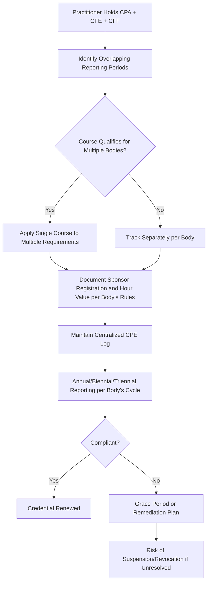

## Continuing Professional Education Requirements

### Overview

Continuing professional education (CPE) requirements are the mechanism by which credentialing bodies and licensing authorities ensure that certified/licensed practitioners maintain current competency after initial qualification. For professionals holding multiple credentials common in forensic accounting practice (CPA, CFE, CFF, and others), CPE tracking becomes a multi-jurisdictional, multi-body compliance exercise with overlapping but distinct rules on hour counts, subject-matter mix, reporting periods, and documentation standards.

**Key Points**

- CPE requirements differ by issuing body (state board vs. ACFE vs. AICPA) even when hours appear similar in magnitude
- Subject-matter composition rules (minimum hours in specific topics) are as important as total hour counts
- Reporting/renewal periods vary — annual, biennial, or triennial depending on the credential
- Multi-credential holders can often apply a single qualifying course toward more than one body's requirement, but must verify overlap rules rather than assume it
- Lapses in CPE compliance can result in credential suspension, revocation, or required reinstatement procedures distinct from initial certification

### CFE (ACFE) CPE Requirements

- CFEs must complete 20 hours of CPE per year and pay annual ACFE membership dues
- A minimum of 10 of the 20 annual hours must be in subjects directly related to fraud prevention, detection, deterrence, or investigation, meaning up to 10 hours may be in adjacent or general professional development topics
- CPE is tracked and reported through the ACFE's member/certification portal, with documentation retained by the credential holder in case of audit by the ACFE

[Unverified] Exact current reporting deadlines, portal mechanics, and acceptable CPE activity categories (e.g., self-study vs. group study hour caps) should be verified against the live ACFE CPE Policy at the time of reporting, as administrative mechanics are updated independently of the broader requirement structure described here.

### CPA (State Board) CPE Requirements

CPA CPE requirements are set at the **state/jurisdiction level** in the U.S., not by a single national body, which means practitioners licensed in multiple states must track the most stringent applicable requirement or comply separately with each.

Common structural elements across most U.S. state boards (patterns vary — always confirm with the specific state board):

- Typical total hour requirements fall in the range of 40 hours per year or 80-120 hours per two- or three-year renewal cycle
- Most states require a minimum number of ethics-specific CPE hours per renewal period (commonly 2-4 hours)
- Some states impose subject-matter minimums in areas such as accounting/auditing for CPAs performing attest work
- Acceptable CPE delivery formats typically include live seminars, webinars, self-study courses (often capped as a percentage of total hours), university coursework, and authorship of published material (subject to hour-equivalency limits)
- CPE sponsors are frequently required to be registered with NASBA's National Registry of CPE Sponsors or an equivalent state-recognized registry for the hours to qualify

[Unverified] Because CPE hour totals, ethics-hour minimums, reporting periods, and acceptable format rules are set independently by each U.S. state board of accountancy and change periodically, practitioners must confirm current requirements directly with their specific state board(s) of licensure rather than relying on a generalized figure.

### CFF (AICPA) CPE Requirements

- CFF credential holders must maintain CPE consistent with AICPA/FVS Section recertification requirements, layered on top of (and partly overlapping with) their underlying state CPA CPE obligation
- Recertification hours specifically tied to forensic accounting subject matter are typically required as a subset of total CPE, distinct from general CPA CPE, to demonstrate ongoing currency in the forensic specialization itself
- AICPA membership in good standing (a prerequisite for holding the CFF) carries its own membership renewal requirements independent of the CPE hour count

[Unverified] Specific current CFF recertification hour totals and the forensic-subject-matter minimum should be verified against the live AICPA CFF Credential Handbook, as these figures are periodically revised by the CFF Credential Committee.

### Cross-Credential CPE Coordination

**Example**

A practitioner holding CPA (state-licensed), CFE, and CFF credentials attends a 4-hour seminar on cryptocurrency fraud investigation techniques. If the seminar sponsor is registered with the relevant CPE registries recognized by all three bodies, and the subject matter qualifies as fraud-related under ACFE rules and forensic-specific under AICPA/CFF rules, the same 4 hours may be creditable toward all three CPE obligations simultaneously — but the practitioner must independently verify sponsor registration status and subject-matter classification against each body's current rules rather than assume automatic reciprocity, since a course accepted by one body is not guaranteed to meet another's format or content criteria.

### Documentation and Audit Readiness

Best-practice CPE record-keeping (applicable across all credentialing bodies):

- Retain certificates of completion showing sponsor name/registration number, course title, date, hours awarded, and subject-matter classification
- Maintain records for the retention period specified by each body (commonly 3-5 years, but varies), since bodies periodically conduct random compliance audits of credential holders
- Log hours in a centralized tracker noting which credential(s) each course applies toward, to avoid double-counting errors or under-reporting to a specific body
- Retain proof of self-study completion (exam scores, completion certificates) separately, as self-study hours are frequently subject to caps or additional verification requirements not applicable to live/group instruction

### Consequences of Non-Compliance

| Scenario | Typical Consequence |
| --- | --- |
| Missed CPE deadline, hours substantially met | Grace period with late fee (varies by body) |
| Hours not met by end of reporting period | Credential suspended pending remediation |
| Repeated non-compliance | Credential revocation, requiring reapplication/re-examination in some cases |
| Falsified CPE records | Disciplinary action independent of the CPE shortfall itself, potentially including ethics violations under the body's code of conduct |

[Inference] Consequence severity and grace-period availability vary meaningfully by credentialing body and, for CPA licensure, by state board — the general escalation pattern (grace period → suspension → revocation) reflects a common structure across professional credentialing bodies generally, not a confirmed identical policy across all three credentials discussed here.

### Common Pitfalls

- Assuming a course approved for one credential automatically satisfies another body's requirements without checking sponsor registration and subject classification separately
- Under-tracking the subject-matter minimums (e.g., CFE's 10-hour fraud-specific rule, CPA ethics-hour minimums) while satisfying only the total hour count
- Losing documentation for self-study or online courses, which are more frequently subject to audit verification than live seminar attendance
- Failing to account for differing reporting period start/end dates across credentials, leading to a false sense of compliance when one body's cycle has closed but another's is still open
- Not planning for credential-specific renewal fees and membership dues as a distinct compliance cost separate from the CPE hours themselves

**Related Topics**

- CFE, CPA, and CFF credential pathways
- NASBA National Registry of CPE Sponsors and state board recognition standards
- AICPA Code of Professional Conduct and CPE ethics-hour requirements
- ACFE Code of Professional Ethics and disciplinary procedures
- Multi-jurisdictional CPA licensure (mobility and substantial equivalency rules)
- Record retention standards for professional credential compliance audits