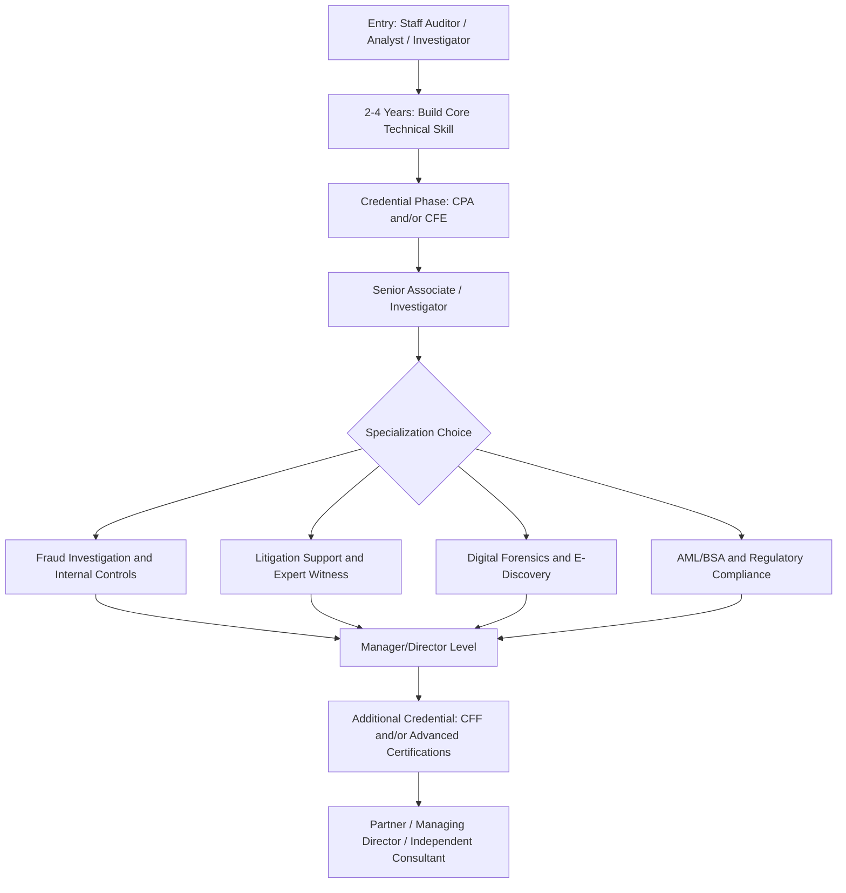

## Building a Career in Forensic Accounting

### Overview

A career in forensic accounting combines accounting/auditing technical competency with investigative methodology, legal literacy, and communication skill suited to litigation and dispute contexts. Career paths into the field are heterogeneous — practitioners arrive from public accounting audit practices, internal audit, law enforcement, IT/data analytics backgrounds, and legal support roles — and progression typically involves a combination of credentialing, specialization choice, and employer-type transitions rather than a single linear track.

**Key Points**

- Entry points vary widely; there is no single mandatory starting role
- Career progression generally moves from general accounting/audit competency toward specialized forensic and litigation-support work
- Credential sequencing (CPA, CFE, CFF, and others) is a career-management decision, not just an academic requirement
- Practice-area specialization (fraud investigation, litigation support/expert witness, valuation, digital forensics, AML/BSA) increasingly differentiates senior practitioners
- Soft skills — report writing, testimony delivery, client/counsel communication — become as career-determinative as technical skill at senior levels

### Common Entry Points

| Background | Typical Entry Route |
| --- | --- |
| Public accounting (audit) | Transfer into a firm's forensic/dispute advisory practice after 2-4 years in audit |
| Internal audit | Move into corporate fraud investigation or internal forensic units |
| Law enforcement/government | Lateral into private-sector forensic accounting, often valued for investigative and interview skill |
| Legal (paralegal/attorney) | Litigation support roles, particularly at firms combining legal and forensic accounting services |
| IT/data analytics | Digital forensics, e-discovery, and data-analytics-driven fraud detection roles |
| Academic (accounting/finance) | Direct entry via forensic accounting graduate programs (e.g., MFAcc-type degrees) into associate-level forensic roles |

### Typical Career Progression

### Building Technical Foundations

- **Accounting and audit fundamentals**: GAAP/IFRS proficiency, internal control frameworks (COSO), audit sampling and testing methodology — the base competency underlying all forensic work
- **Fraud examination methodology**: Interview technique, evidence handling and chain of custody, fraud theory approach (hypothesis-driven investigation), financial statement analysis for manipulation indicators
- **Data analytics proficiency**: SQL, Excel/data-analysis tools, and increasingly Python/R for large-dataset analysis; familiarity with continuous monitoring and anomaly-detection concepts covered elsewhere in this material
- **Legal literacy**: Rules of evidence, civil procedure basics, understanding of expert witness standards (Daubert/Frye), and privilege/work-product concepts relevant to investigation scoping

[Inference] The relative weighting of these four foundation areas shifts depending on specialization path — a litigation-support-track practitioner will lean more heavily into legal literacy and report-writing skill over time, while a continuous-monitoring/internal-fraud-detection-track practitioner will lean more heavily into data analytics — but all four remain foundational at the early-career stage regardless of eventual specialization.

### Credentialing as a Career Strategy

Credential sequencing decisions typically reflect intended specialization:

- **CPA first**: Standard for practitioners entering via public accounting; establishes general licensure credibility and is a prerequisite for CFF
- **CFE independent of CPA**: Common for practitioners from law enforcement, legal, or non-accounting backgrounds entering fraud investigation directly
- **CFF after CPA**: Signals forensic specialization for CPAs moving into litigation support, valuation-adjacent, or expert witness work
- **Combination (CPA + CFE + CFF)**: Common trajectory for senior practitioners aiming for partner/director-level roles at professional services firms with dedicated forensic practices

See the CFE/CPA/CFF credential pathways and CPE requirements material for detailed eligibility and maintenance mechanics.

### Specialization Tracks

**Fraud investigation and internal controls**

- Focus: Internal corporate fraud, employee misconduct, procurement/payroll schemes, continuous monitoring program design
- Typical employers: Corporate internal audit/investigations units, forensic practices within accounting firms

**Litigation support and expert witness**

- Focus: Damages calculation, financial statement disputes, shareholder litigation, matrimonial/divorce financial disputes
- Requires developed report-writing and testimony skill; deposition and cross-examination experience becomes a distinct career asset
- Often pairs with CFF and, at senior levels, valuation credentials (e.g., ABV)

**Digital forensics and e-discovery**

- Focus: Electronic evidence recovery, data preservation, forensic imaging, structured/unstructured data analysis for litigation or investigation
- Increasingly requires technical certifications distinct from accounting credentials (e.g., EnCE, GCFE) alongside forensic accounting fundamentals

**AML/BSA and regulatory compliance**

- Focus: Anti-money-laundering program design, suspicious activity monitoring, regulatory examination support for financial institutions
- Often paired with credentials such as CAMS (Certified Anti-Money Laundering Specialist) rather than CFF

### Employer Types and Career Implications

| Employer Type | Typical Work | Career Trajectory Notes |
| --- | --- | --- |
| Big Four / large accounting firms | Client-engagement forensic advisory, litigation support | Structured promotion track; broad client exposure; partner track available |
| Boutique forensic/litigation support firms | Deep specialization, higher testimony frequency | Faster specialization; smaller structured hierarchy |
| Corporate internal audit/investigations | In-house fraud detection and response | Deeper institutional knowledge; less client-facing variety |
| Government/law enforcement (FBI, SEC, state AG offices) | Regulatory and criminal investigation | Distinct hiring/security clearance processes; strong investigative training |
| Independent/solo consulting | Expert witness and advisory work | Requires established reputation and referral network; typically a later-career transition |

### Developing Non-Technical Career Skills

- **Report writing**: Forensic findings must be documented for audiences ranging from management to opposing counsel to a jury; clarity and defensibility of written work product is a frequently cited differentiator between mid-level and senior practitioners
- **Testimony and communication**: Expert witness work requires the ability to explain technical financial concepts to non-technical audiences (judges, juries) under adversarial cross-examination
- **Business development**: At senior/partner levels, career progression increasingly depends on client relationship development and referral network building, particularly for practitioners aiming toward independent consulting or firm leadership
- **Cross-disciplinary fluency**: Working effectively alongside attorneys, IT/security teams, and law enforcement requires communication adapted to each audience's frame of reference and objectives

**Example**

A staff auditor at a mid-size accounting firm spends three years building core audit competency, earns the CPA license, and transfers into the firm's forensic advisory group. Over the next four years, they pursue the CFE credential while working fraud investigation engagements, developing interview and evidence-handling skill. Recognizing an aptitude for and interest in litigation work, they add the CFF credential and begin taking on damages-calculation engagements under a senior expert's supervision, gradually building independent testimony experience — a trajectory illustrating credential sequencing following, rather than preceding, the discovery of specialization interest, which is a common (though not the only) pattern in practice.

### Professional Network and Continuing Development

- Active involvement in professional bodies (ACFE local chapters, AICPA FVS Section) provides both CPE opportunities and referral/networking value
- Mentorship relationships, particularly around expert witness skill development, are frequently cited by practitioners as accelerating career progression in litigation-support tracks
- Staying current on emerging fraud typologies (cryptocurrency fraud, AI-facilitated fraud, synthetic identity schemes) is both a CPE obligation and a market differentiator, given how rapidly scheme sophistication has evolved

### Common Pitfalls

- Treating credential acquisition as the career strategy itself, rather than as a tool supporting a chosen specialization direction
- Underinvesting in report-writing and communication skill relative to technical/investigative skill, which limits advancement into litigation-facing roles
- Narrow specialization too early without first building broad foundational competency across accounting, investigation, and data-analysis skill sets
- Neglecting professional network development, which materially affects independent consulting viability later in a career
- Failing to track evolving fraud typologies, resulting in credentials and expertise that lag current practice (as illustrated by the 2026 CFE exam content update)

**Related Topics**

- CFE, CPA, and CFF credential pathways
- Continuing professional education requirements
- Expert witness standards and testimony preparation (Daubert/Frye)
- Building continuous monitoring programs
- AML/BSA compliance and CAMS certification
- Digital forensics and e-discovery fundamentals