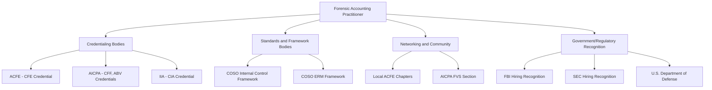

## Professional Organizations and Industry Resources

### Overview

Forensic accounting and fraud examination practitioners rely on a network of professional bodies, standard-setters, and publications that provide credentialing, technical guidance, research data, and community. Understanding which organization serves which function — accreditation, standards-setting, research publication, or networking — helps practitioners target the right resource for a given need, from initial credentialing to ongoing technical reference during an active investigation.

**Key Points**

- ACFE is the dominant accrediting and training body specifically for fraud examination
- AICPA governs CPA licensure-adjacent credentials (CFF, ABV) and general accounting standards
- COSO frameworks provide the internal-control and enterprise-risk-management backbone referenced throughout fraud risk management guidance
- Local chapters of national organizations provide networking, mentoring, and CPE delivery at the community level
- Government and law enforcement bodies (FBI, SEC) recognize and sometimes prefer specific credentials in hiring, extending organizational relevance beyond private practice

### Association of Certified Fraud Examiners (ACFE)

- Founded in 1988 and headquartered in Austin, Texas, the ACFE serves as the accrediting authority for the Certified Fraud Examiner (CFE) designation and describes itself as the world's largest anti-fraud organization and premier provider of anti-fraud training and education
- The ACFE reported more than 95,000 members as of 2026, reflecting substantial growth from a reported 50,000-75,000 member range cited in earlier years across different sources
- Local ACFE chapters function as regional networking and training hubs, supporting information dissemination, mentoring, leadership development, and community outreach, and are a common venue for CPE credit and professional connections
- The ACFE requires 20 hours of continuing professional education every 12 months to maintain the CFE credential [goingconcern](https://www.goingconcern.com/?p=18721)

**Key ACFE Publications and Resources**

- **Fraud Examiner's Manual**: Described as a primary source guide for professionals working in forensic auditing and fraud examination, covering the ACFE's body of knowledge across legal, investigative, and financial disciplines
- **Report to the Nations**: An annual publication summarizing global occupational fraud and abuse statistics compiled from CFE-conducted investigations, widely cited as a benchmark data source for fraud typology, median losses, and detection-method statistics across industries
- **Fraud Magazine** and **ACFE Insights**: Ongoing publications covering current fraud schemes, case studies, and practice guidance
- **Fraud Risk Management Guide**: A resource compiled with supporting organizations covering frameworks and tools for enterprise fraud risk management

### AICPA (American Institute of Certified Public Accountants)

- Governs CPA-adjacent specialty credentials relevant to forensic practice, including Certified in Financial Forensics (CFF) and Accredited in Business Valuation (ABV)
- Maintains the **Forensic and Valuation Services (FVS) Section**, providing specialized resources, CPE, and community specifically for forensic and valuation practitioners; CFF holders receive complimentary FVS Section membership
- Sets the AICPA Code of Professional Conduct, which governs ethics obligations for CPA and CFF holders independent of ACFE's own ethics code

### COSO (Committee of Sponsoring Organizations of the Treadway Commission)

COSO's Internal Control–Integrated Framework and Enterprise Risk Management–Integrated Framework are foundational references cited across fraud risk management guidance, alongside related materials such as a CGMA report on fraud risk management and joint COSO/Deloitte guidance on managing cyber risk. These frameworks underpin how organizations structure internal control environments that continuous monitoring and fraud detection programs are designed to test and reinforce.

### Other Supporting Organizations

The ACFE's Fraud Risk Management Guide identifies a network of supporting organizations spanning the broader accounting and audit profession, including:

- **Financial Executives International (FEI)** — professional body for senior financial executives, relevant to fraud risk oversight from a governance perspective
- **Institute of Internal Auditors (IIA)** — sets internal audit standards and governs the Certified Internal Auditor (CIA) credential, relevant to practitioners working in internal fraud detection and control-testing roles
- **American Accounting Association (AAA)** — academic and research-focused body connecting practitioner and academic forensic accounting communities
- **Institute of Management Accountants (IMA)** — governs the CMA credential and publishes management-accounting-focused guidance, including fraud risk management material referenced above

### Government and Regulatory Recognition

- The CFE credential is recognized in the hiring and promotion policies of organizations including the FBI, the U.S. Department of Defense, and the U.S. Securities and Exchange Commission, extending the credential's relevance beyond private-sector practice into government and regulatory career paths [thefinancestory](https://thefinancestory.com/how-to-become-a-certified-fraud-examiner-cfe-from-acfe)
- [Inference] This kind of institutional recognition functions as a practical signal of credential value in hiring contexts, though it should not be read as a formal endorsement or certification requirement imposed by those agencies themselves — candidates should verify specific agency hiring criteria directly rather than assume credential recognition guarantees a hiring advantage.

### Adjacent Professional Bodies by Specialization

| Specialization | Relevant Organization | Associated Credential |
| --- | --- | --- |
| General fraud examination | ACFE | CFE |
| CPA licensure and forensic accounting | AICPA | CPA, CFF |
| Business valuation | AICPA | ABV |
| Internal audit | IIA | CIA |
| Anti-money laundering/BSA | ACAMS | CAMS |
| Digital forensics | Various (e.g., ISC2, SANS/GIAC) | GCFE, EnCE, and similar |
| Management accounting | IMA | CMA |

[Unverified] Current membership figures, credential requirements, and organizational scope for bodies outside the ACFE/AICPA/COSO cluster (ACAMS, IIA, IMA, digital forensics certifiers) should be verified directly against each organization's current published standards, as this material focuses primarily on sources directly confirmed for the forensic accounting and fraud examination core bodies.

### Using These Resources in Practice

- **During program design**: COSO frameworks and the ACFE Fraud Risk Management Guide provide structural reference points for building or benchmarking a fraud risk management program
- **During active investigation**: The ACFE Fraud Examiner's Manual serves as a practical reference for investigative methodology and legal considerations
- **For benchmarking and reporting**: The annual Report to the Nations is commonly cited in fraud risk assessments, board reporting, and program justification to provide external benchmark context for detected fraud patterns and loss magnitudes
- **For ongoing technical currency**: Fraud Magazine, ACFE Insights, and AICPA FVS Section resources track emerging scheme typologies (e.g., cryptocurrency and AI-facilitated fraud) between major credential exam content updates

### Common Pitfalls

- Treating the ACFE and AICPA as interchangeable or competing bodies rather than complementary — one is fraud-examination-specific accreditation, the other is CPA-licensure-adjacent with a broader accounting scope
- Relying on outdated Report to the Nations data in current risk assessments rather than checking for the most recent annual edition
- Overlooking local chapter involvement as a career-development resource in favor of only engaging with national-level publications
- Assuming credential recognition by one government agency implies formal endorsement or guaranteed hiring preference, rather than treating it as one favorable signal among several hiring criteria
- Not distinguishing between standards-setting bodies (COSO, IIA) and accrediting bodies (ACFE, AICPA) when researching a specific practice question, which can lead to consulting the wrong type of resource for the need at hand

**Related Topics**

- CFE, CPA, and CFF credential pathways
- Continuing professional education requirements
- COSO Internal Control and Enterprise Risk Management frameworks
- Building a career in forensic accounting
- Report to the Nations and occupational fraud benchmarking data
- ACAMS and anti-money-laundering specialization