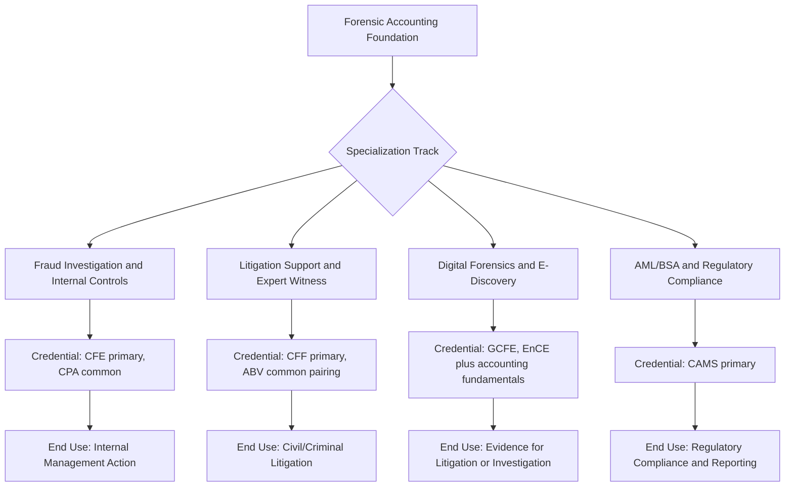

## Specialization Tracks within Forensic Accounting

### Overview

Forensic accounting has diversified into distinct specialization tracks, each requiring a different weighting of accounting, legal, investigative, and technical skill. While early-career practitioners typically build broad foundational competency, mid-to-senior career progression usually involves choosing a primary specialization that shapes credential selection, employer type, and day-to-day work. This topic surveys the major tracks, their distinguishing skill requirements, and how they relate to the credentials and career patterns discussed elsewhere in this material.

**Key Points**

- Specialization tracks differ primarily in their end-use context: internal management action, litigation, regulatory compliance, or criminal referral
- Credential pairing differs meaningfully by track (e.g., CFF pairs with litigation support; CAMS pairs with AML)
- Some tracks are accounting-led with investigative/legal support; others are investigative or technical-led with accounting support
- Track boundaries are increasingly blurred by technology — data analytics and digital forensics skills now cut across nearly every track
- Choosing a track is generally an iterative career decision informed by early exposure across several areas, not a fixed choice made at entry

### Fraud Investigation and Internal Controls

**Focus**: Detecting, investigating, and remediating fraud within an organization — employee misconduct, procurement schemes, payroll fraud, expense reimbursement abuse, and financial statement manipulation identified through internal channels.

**Core skills**: Interview and interrogation technique, evidence handling and chain of custody, internal control design and testing (COSO-based), continuous monitoring program design and calibration, root-cause analysis for control failures.

**Typical employers**: Corporate internal audit/investigations units, forensic advisory practices within accounting firms serving corporate clients, government inspector-general offices.

**Associated credentials**: CFE is central; CPA is common but not universal, particularly for practitioners entering from internal audit or corporate security backgrounds.

**Distinguishing characteristic**: Findings typically feed internal management action (termination, control remediation, restitution) rather than public litigation, though escalation to law enforcement or civil action remains possible depending on severity and organizational policy.

### Litigation Support and Expert Witness

**Focus**: Calculating economic damages, analyzing financial statement disputes, supporting shareholder litigation, matrimonial/divorce financial disputes, and providing expert testimony in civil or criminal proceedings.

**Core skills**: Damages quantification methodology, deep report-writing discipline suited to adversarial scrutiny, deposition and cross-examination preparation, familiarity with expert witness admissibility standards (Daubert/Frye), and increasingly business valuation technique where damages calculations intersect with valuation questions.

**Typical employers**: Big Four and large accounting firm dispute advisory practices, boutique litigation support firms, independent expert witness consultants (typically a later-career transition requiring established reputation).

**Associated credentials**: CFF is the primary specialized credential; CPA is a prerequisite for CFF. Accredited in Business Valuation (ABV) frequently pairs with CFF at senior levels where damages work intersects with valuation.

**Distinguishing characteristic**: Work product is built explicitly for adversarial legal scrutiny; testimony delivery and cross-examination resilience become career-differentiating skills at senior levels in a way not required in internal-facing tracks.

### Digital Forensics and E-Discovery

**Focus**: Electronic evidence recovery, forensic imaging, preservation of data integrity for litigation or investigation, and analysis of structured/unstructured data (emails, financial system logs, communications platforms) for fraud indicators.

**Core skills**: Forensic imaging and data preservation methodology, chain-of-custody documentation for digital evidence, e-discovery platform proficiency, and increasingly cloud/SaaS data recovery techniques as source systems shift away from on-premises infrastructure.

**Typical employers**: Specialized digital forensics firms, litigation support practices with in-house e-discovery capability, corporate legal/IT security teams.

**Associated credentials**: Distinct technical certifications outside the core forensic-accounting credential set — commonly cited examples include GCFE (GIAC Certified Forensic Examiner) and EnCE (EnCase Certified Examiner) — layered on top of, rather than replacing, forensic accounting fundamentals for practitioners working the accounting-adjacent end of this track.

[Unverified] Specific current certifying bodies and exam requirements for digital forensics certifications should be verified directly against the issuing organizations (e.g., GIAC, OpenText/EnCase), as this track sits partly outside traditional accounting credentialing bodies and its certification landscape evolves with underlying forensic technology.

**Distinguishing characteristic**: Heavier technical/IT skill requirement relative to other tracks; practitioners often cross over from IT security or law enforcement digital forensics backgrounds rather than a pure accounting entry point.

### AML/BSA and Regulatory Compliance

**Focus**: Anti-money-laundering program design, suspicious activity monitoring and reporting, sanctions screening, and regulatory examination support for financial institutions and other regulated entities.

**Core skills**: Regulatory framework knowledge (Bank Secrecy Act, USA PATRIOT Act, OFAC sanctions regimes), transaction monitoring system tuning, suspicious activity report (SAR) drafting, and regulatory examination liaison experience.

**Typical employers**: Banks and financial institutions, fintech companies, regulatory consulting practices, government regulatory agencies (FinCEN, state banking regulators).

**Associated credentials**: CAMS (Certified Anti-Money Laundering Specialist) is the dominant credential for this track, distinct from the CFE/CFF credential cluster, though CFE holders frequently work AML-adjacent investigations as well.

**Distinguishing characteristic**: Heavily regulatory-driven rather than litigation-driven; success metrics center on regulatory exam outcomes and program effectiveness rather than case-by-case investigation or courtroom testimony.

### Comparative Skill Emphasis

| Track | Accounting Depth | Legal/Litigation Skill | Technical/IT Skill | Regulatory Knowledge |
| --- | --- | --- | --- | --- |
| Fraud Investigation & Internal Controls | High | Moderate | Moderate (data analytics) | Moderate |
| Litigation Support & Expert Witness | High | Very High | Low-Moderate | Moderate |
| Digital Forensics & E-Discovery | Moderate | Moderate | Very High | Low-Moderate |
| AML/BSA & Regulatory Compliance | Moderate | Low-Moderate | Moderate | Very High |

[Inference] This comparative weighting reflects generally observed skill emphasis differences across these tracks rather than a rigid or universally quantified allocation — individual roles within each track vary, and cross-track skill transfer (particularly data analytics) is increasingly common as noted above.

### Cross-Track Convergence: Data Analytics

Data analytics and continuous monitoring competency — covered in detail elsewhere in this material — increasingly cuts across all four tracks rather than remaining specific to fraud investigation:

- Litigation support practitioners use data analytics for damages modeling and large-dataset discovery review
- Digital forensics practitioners rely on analytics to process recovered data at scale
- AML/BSA practitioners depend on transaction monitoring analytics as their core detection mechanism

This convergence means foundational data analytics skill (SQL, statistical concepts, familiarity with anomaly detection logic) has become a track-agnostic requirement rather than a specialization itself.

### Choosing a Track: Practical Considerations

**Example**

A practitioner with three years in public accounting audit, now considering specialization, might use short-term rotational exposure — a secondment to the firm's litigation support group for one engagement, and a fraud investigation engagement for another — to compare fit before committing to a credential path (CFF vs. deeper CFE-focused investigative training), since credential acquisition represents a multi-year time investment that is more efficient to align with confirmed interest than pursued speculatively across multiple tracks simultaneously.

- **Interest in courtroom/testimony work** points toward litigation support; discomfort with adversarial cross-examination is a meaningful signal against this track regardless of technical skill level
- **Interest in technology/data infrastructure** points toward digital forensics, provided the practitioner is willing to develop IT-specific technical certification alongside accounting fundamentals
- **Interest in internal organizational impact and remediation** points toward fraud investigation and internal controls
- **Interest in regulated-industry, compliance-driven work** points toward AML/BSA, often better suited to practitioners preferring process and regulatory framework work over ad hoc investigation

### Common Pitfalls

- Choosing a specialization track based solely on credential prestige rather than genuine fit with the track's dominant skill and work-style demands (e.g., pursuing CFF without confirming comfort with adversarial testimony)
- Underestimating the technical/IT skill investment required for a credible digital forensics specialization, treating it as a natural extension of general forensic accounting rather than requiring distinct certification
- Assuming AML/BSA experience directly transfers to fraud investigation or litigation support without accounting for the differing regulatory-vs-investigative skill emphasis
- Committing to a single track too early in career without rotational exposure, foreclosing better-fitting alternatives before sufficient comparison
- Neglecting data analytics skill development on the assumption it is only relevant to one track, when it has become a cross-track baseline competency

**Related Topics**

- Building a career in forensic accounting
- CFE, CPA, and CFF credential pathways
- Professional organizations and industry resources
- Building continuous monitoring programs
- Combining technology with professional judgment
- Expert witness standards and testimony preparation (Daubert/Frye)