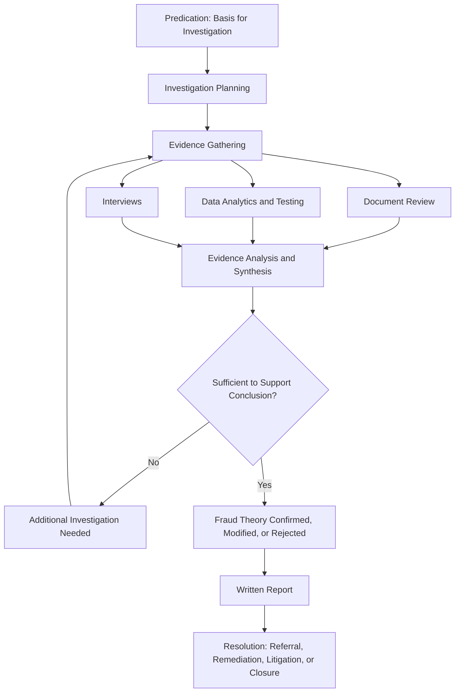

## Comprehensive Fraud Examination Simulation

### Overview

A comprehensive fraud examination simulation is a capstone exercise integrating the full investigative lifecycle — predication, planning, evidence gathering, analysis, interviewing, reporting, and resolution — into a single structured case. Unlike topic-specific exercises that isolate one technique (e.g., a Benford's Law analysis drill or a single mock interview), the capstone simulation requires sequencing multiple techniques correctly, managing incomplete and sometimes contradictory information, and producing a defensible final work product under realistic constraints of time, scope, and legal exposure.

**Key Points**

- Simulations test sequencing and judgment, not just technique execution in isolation
- A well-designed simulation includes red herrings and incomplete information, mirroring real investigative ambiguity
- The examination follows a structured methodology (commonly the ACFE's fraud examination process) rather than an ad hoc investigative approach
- Documentation and reasoning chain matter as much as the final conclusion
- Legal and ethical boundaries (predication, scope, privilege) must be respected even within a simulated exercise, since these habits are the point of the exercise

### The Fraud Examination Process Framework

Most comprehensive simulations are structured around the standard fraud examination lifecycle:

**Predication** — the specific set of circumstances sufficient to cause a reasonable, professionally trained person to believe a fraud has occurred, is occurring, or will occur — must be established and documented before investigation begins. A simulation without a clearly defined predication trigger teaches poor investigative discipline, since real investigations launched without adequate predication carry legal and reputational risk.

### Structuring the Case Scenario

A comprehensive simulation typically layers several elements to force integration of multiple skills:

- **A triggering event**: An anonymous tip, an unusual audit finding, a whistleblower report, or a continuous-monitoring alert (connecting back to the detection mechanisms covered elsewhere in this material)
- **A primary scheme**: Commonly drawn from established occupational fraud categories — asset misappropriation (e.g., billing schemes, payroll fraud, expense reimbursement fraud), corruption (e.g., kickbacks, conflicts of interest), or financial statement fraud
- **Supporting documentary evidence**: Fabricated invoices, bank statements, emails, org charts, and financial statements consistent with the scheme, deliberately including some documents that are irrelevant or misleading to test discrimination skill
- **Interview subjects with varying credibility**: At least one subject providing accurate but incomplete information, one providing deceptive statements, and one providing accurate corroborating information — requiring the examinee to triangulate rather than accept any single account at face value
- **A resolution decision point**: The simulation should require a documented recommendation (referral to law enforcement, internal disciplinary action, civil recovery action, or closure as unsubstantiated) rather than ending at "fraud confirmed"

**Example**

A capstone scenario might present a mid-size manufacturing company where a continuous monitoring alert flags a vendor whose registered address matches an employee's home address (a classic conflict-of-interest indicator covered under behavioral forensics topics). The examinee must plan an investigation, request and analyze vendor master file and payment history data, identify a pattern of inflated invoices approved just below a supervisor's authorization threshold (structuring), conduct simulated interviews with the accounts payable clerk and the implicated employee, evaluate credibility inconsistencies between their accounts, and produce a written report supporting a specific dollar loss quantification and a recommended resolution path — integrating data analytics, behavioral assessment, documentary evidence review, and interviewing technique into a single coherent case narrative.

### Applying the Fraud Triangle/Diamond to Case Analysis

A comprehensive simulation should require the examinee to explicitly map the scenario's facts to a behavioral framework rather than jumping directly to financial conclusions:

$$\text{Case Narrative} = \text{Pressure (evidenced facts)} + \text{Opportunity (control gaps)} + \text{Rationalization (statements/behavior)} + \text{Capability (position/access)}$$

This mapping exercise reinforces the connection between the behavioral forensics material covered earlier in this course and the mechanical loss-quantification work, ensuring examinees do not treat the two as unrelated disciplines.

### Evidence Analysis Techniques to Integrate

A well-rounded simulation should require application of multiple techniques from across the curriculum rather than relying on one:

- **Digit and statistical analysis**: Benford's Law testing on the flagged vendor's invoice population to corroborate (or fail to corroborate) manual suspicion
- **Timeline reconstruction**: Sequencing transaction dates, approval dates, and organizational events (e.g., the employee's hire date, the vendor's registration date) to establish opportunity window
- **Net worth or lifestyle analysis** (where financial statement or asset-based schemes are involved): Comparing known income to observed spending/asset accumulation to support or refute a pressure/motive inference
- **Document examination**: Identifying alterations, inconsistencies in formatting or metadata, and cross-referencing supporting documentation against independent third-party records

[Inference] Which specific techniques are relevant depends entirely on the scheme type built into a given scenario; a corruption-scheme simulation will emphasize conflict-of-interest and vendor-relationship analysis, while a financial-statement-fraud simulation will emphasize ratio analysis and revenue recognition testing — the list above illustrates commonly used techniques rather than a fixed checklist applicable to every case.

### Report Writing as Capstone Output

The written report is typically the primary graded/evaluated deliverable in a comprehensive simulation, and should include:

1. **Background and predication**: What triggered the investigation and the scope authorized
2. **Methodology**: What evidence was gathered and how (without revealing investigative techniques that could compromise future engagements, in real practice)
3. **Findings**: Chronological or thematic presentation of evidence, clearly distinguishing established fact from inference
4. **Loss quantification**: Dollar-value calculation with documented methodology and assumptions
5. **Conclusion**: Whether the fraud theory is supported, and to what degree of confidence
6. **Recommendations**: Specific next steps (referral, remediation, control improvement)

**Key Points on Report Standards**

- Facts and inferences must be clearly distinguished throughout — a report that blends the two undermines its defensibility if challenged in litigation or by opposing counsel
- Alternative explanations considered and ruled out should be explicitly documented, mirroring the professional-judgment documentation standard covered earlier
- The report should be written for the audience that will act on it (management, legal counsel, or a court), affecting tone, technical depth, and structure

### Evaluation Criteria for Simulation Performance

| Dimension | What Is Assessed |
| --- | --- |
| Investigative sequencing | Was evidence gathered in a logical order supporting an evolving fraud theory, rather than jumping to conclusions? |
| Technique selection | Were the right analytical techniques applied to the specific scheme type presented? |
| Evidence discrimination | Did the examinee correctly disregard irrelevant/misleading documents and interview statements? |
| Credibility assessment | Was interview evidence appropriately weighted against corroborating or contradicting documentary evidence? |
| Documentation and reasoning | Is the reasoning chain from evidence to conclusion explicit and defensible? |
| Loss quantification accuracy | Is the financial loss calculation methodologically sound and appropriately caveated? |
| Professional judgment | Were legal/ethical boundaries (predication, scope, privilege) respected throughout? |

### Common Pitfalls in Simulation Performance

- Jumping to a fraud conclusion based on the initial triggering alert without following through on corroborating or disconfirming evidence gathering (the automation-bias and confirmation-bias failure modes covered under human factors)
- Failing to establish or document predication before beginning investigative steps, reflecting poor real-world investigative discipline
- Treating all interview statements as equally credible rather than triangulating against documentary evidence
- Producing a report that blends fact and inference without clear distinction, weakening defensibility
- Neglecting to reach an explicit resolution recommendation, leaving the case narratively "solved" but practically unresolved
- Applying a single analytical technique (e.g., only Benford's Law) as if it were sufficient corroboration on its own, without triangulating against other evidence types

**Related Topics**

- Fraud examination methodology and the predication standard
- Fraud Triangle and Fraud Diamond behavioral frameworks
- Building continuous monitoring programs
- Human factors in fraud detection systems
- Combining technology with professional judgment
- Report writing and documentation standards for forensic case files
- Interview and interrogation methodology (cognitive interview technique)