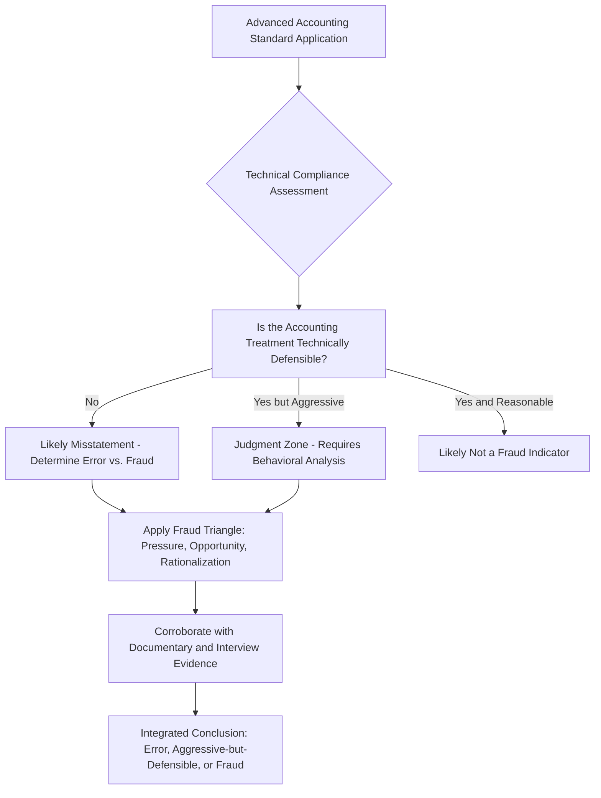

## Integrating Advanced Accounting and Forensic Techniques

### Overview

Advanced financial accounting topics — consolidations, derivatives, revenue recognition, lease accounting, business combinations — and forensic accounting techniques are often taught as separate disciplines, but real engagements require fluency at their intersection. Financial statement fraud in particular is frequently executed by exploiting the judgment and estimation inherent in advanced accounting standards, meaning a forensic examiner without deep technical accounting competency will miss manipulation that a purely investigative skill set cannot detect. This topic addresses how to integrate the two bodies of knowledge into a single analytical approach.

**Key Points**

- Advanced accounting areas with high estimation judgment are disproportionately represented in financial statement fraud schemes
- Forensic technique (fraud theory, red-flag analysis, interview) must be paired with technical accounting fluency to interpret findings correctly
- Misapplication of a standard can be either an honest error or fraud — distinguishing the two requires both technical and behavioral analysis
- Integration is most tested in areas involving management estimates, related-party transactions, and complex structuring (consolidations, SPEs/VIEs)
- A purely technical accounting review misses intent; a purely investigative review misses whether the technical treatment was even defensible

### Why Advanced Accounting Areas Are High-Risk for Fraud

Complex accounting standards create latitude for judgment, and judgment latitude creates opportunity — the second leg of the Fraud Triangle covered under behavioral forensics.

| Advanced Accounting Area | Judgment/Estimation Element | Common Fraud Exploitation |
| --- | --- | --- |
| Revenue recognition (ASC 606/IFRS 15) | Performance obligation identification, variable consideration estimates, timing of control transfer | Premature revenue recognition (bill-and-hold, channel stuffing), fictitious contracts |
| Business combinations (ASC 805) | Purchase price allocation, fair value estimates, goodwill vs. identifiable intangibles | Manipulating allocation to minimize amortization or manage post-acquisition earnings |
| Consolidations and VIEs (ASC 810) | Control assessment, primary beneficiary determination | Off-balance-sheet structuring to conceal debt or liabilities |
| Leases (ASC 842/IFRS 16) | Lease classification, discount rate selection, variable payment estimates | Misclassification to manage balance sheet leverage ratios |
| Derivatives and hedge accounting (ASC 815) | Hedge effectiveness testing, fair value estimation for Level 3 instruments | Mismarking positions, improper hedge designation to smooth earnings |
| Impairment testing (goodwill, long-lived assets) | Cash flow projections, discount rate assumptions | Delaying or avoiding impairment recognition to protect reported earnings |
| Allowance for credit losses (CECL/ASC 326) | Forward-looking loss estimation models | Understating reserves to inflate earnings |

[Inference] This table illustrates commonly cited categories of estimation-driven risk across advanced accounting standards rather than an exhaustive or empirically ranked list of highest-frequency schemes; actual scheme frequency varies by industry, and practitioners should consult current occupational fraud research (e.g., the ACFE's Report to the Nations) for empirical prevalence data specific to a given period and sector.

### Integration Framework

### Step 1: Technical Accounting Assessment

Before applying forensic technique, the examiner must determine whether the accounting treatment itself is defensible under the applicable standard:

- Identify the specific standard and its key judgment inputs (e.g., for revenue recognition, the five-step ASC 606 model and where variable consideration or contract modification judgment entered)
- Compare the entity's stated assumptions against industry norms and the entity's own historical pattern — a sudden, unexplained shift in an estimation assumption (discount rate, useful life, loss rate) is a technical red flag independent of any behavioral indicator
- Assess whether required disclosures adequately support the judgment applied, since inadequate disclosure of a significant estimate is itself a technical deficiency that can indicate either poor controls or deliberate obscuring

### Step 2: Behavioral and Contextual Overlay

Once the technical assessment identifies aggressive, unusual, or non-compliant treatment, forensic technique determines whether it reflects error or fraud:

- **Pressure indicators**: Compensation tied to metrics affected by the accounting treatment (e.g., executive bonuses tied to revenue targets affected by recognition timing), analyst guidance pressure, debt covenant proximity
- **Opportunity indicators**: Concentration of estimation authority in a single individual without independent review, weak or overridden internal controls around the judgment area, related-party relationships obscuring arm's-length assessment
- **Rationalization indicators**: Documented communications suggesting awareness the treatment was aggressive but justified as temporary or immaterial, resistance to auditor challenge on the specific estimate

**Example**

A technology company recognizes revenue on a bundled hardware-and-service contract entirely at delivery of the hardware component, rather than allocating consideration across performance obligations per ASC 606. A purely technical review would flag this as a standard misapplication. Integrating forensic technique, the examiner further finds that revenue recognized this way pushed the company narrowly over a debt covenant threshold in the same quarter (pressure), that the allocation judgment was made solely by the CFO without documented input from the accounting policy team despite the contract's unusual structure (opportunity), and that an internal email described the treatment as "a reasonable read for now, we'll true it up next quarter" (rationalization) — the combination transforms a technical accounting question into a fraud indicator supporting further investigation, whereas the technical finding alone would only have supported a restatement recommendation without addressing intent.

### Step 3: Corroboration Through Data Analytics

Advanced accounting fraud often requires transaction-level testing beyond financial statement analytical review:

- **Journal entry testing**: Identifying manual entries posted to revenue, reserve, or valuation accounts outside standard close processes, particularly near period-end
- **Related-party transaction mapping**: Cross-referencing counterparty data against employee, board, and known related-party registries to detect undisclosed relationships affecting consolidation or fair value judgments
- **Trend and ratio analysis**: Comparing estimation-driven metrics (days sales outstanding, reserve coverage ratios, impairment timing) against industry peers and the entity's own multi-year history to isolate anomalous shifts

This connects directly to the continuous monitoring and data analytics techniques covered earlier — the same rule-based and statistical anomaly detection infrastructure used for transactional fraud monitoring can be adapted to flag unusual patterns in estimation-driven account balances, though the analytical logic must be tailored to the specific standard's risk points rather than applying generic transaction-monitoring rules.

### Distinguishing Error from Fraud: The Critical Judgment Call

$$\text{Fraud Determination} \neq \text{Technical Non-Compliance Alone}$$

A material misstatement under an advanced accounting standard is a necessary but not sufficient condition for a fraud conclusion. The examiner must additionally establish:

1. **Materiality**: Was the misstatement quantitatively or qualitatively significant enough to matter to a reasonable user of the financial statements?
2. **Intent**: Does the totality of evidence (technical unreasonableness combined with pressure/opportunity/rationalization indicators) support knowing or reckless misapplication, versus a good-faith but incorrect judgment?
3. **Pattern**: Is this an isolated estimation error, or part of a pattern of similarly-directional adjustments across multiple periods or account areas suggesting systematic manipulation rather than a one-off mistake?

[Inference] The error-versus-fraud determination is inherently a professional judgment call requiring the integration described throughout this topic; no single technical or behavioral indicator is independently dispositive, and this is precisely why the combining-technology-with-judgment discipline covered earlier in this course applies with particular force in advanced accounting fraud contexts.

### Common Integration Failures

- **Technical accountants without forensic training** correctly identify a misapplication of a standard but stop at "restatement needed" without assessing whether the totality of evidence supports a fraud referral
- **Forensic investigators without deep technical accounting fluency** correctly identify behavioral red flags (pressure, suspicious communications) but cannot independently assess whether the underlying accounting treatment was actually indefensible, relying entirely on external technical specialists and potentially missing the connection between behavior and specific accounting mechanics
- **Treating every aggressive judgment as fraud**: Not all aggressive-but-disclosed accounting judgment constitutes fraud; overzealous forensic conclusions without technical grounding risk mischaracterizing legitimate (if aggressive) professional judgment
- **Treating every technical error as immaterial or innocent**: Conversely, dismissing a technically indefensible treatment as "just an estimate" without behavioral overlay risks missing genuine fraud

### Common Pitfalls

- Applying forensic red-flag checklists to accounting estimates without first establishing whether the underlying technical treatment was actually indefensible
- Concluding fraud based on aggressive accounting judgment alone, without corroborating pressure, opportunity, or rationalization evidence
- Failing to benchmark an entity's estimation assumptions against its own historical pattern, missing the most detectable red flag: an unexplained directional shift
- Treating related-party transaction disclosure adequacy as a checkbox exercise rather than a substantive test of whether consolidation or fair value judgments were made at arm's length
- Under-resourcing technical accounting expertise on forensic engagements involving complex standards (derivatives, consolidations), resulting in investigations that miss the mechanism of the fraud even when behavioral indicators are correctly identified

**Related Topics**

- Comprehensive fraud examination simulation
- Combining technology with professional judgment
- Building continuous monitoring programs
- Fraud Triangle and Fraud Diamond behavioral frameworks
- Revenue recognition (ASC 606) and financial statement fraud schemes
- Related-party transaction analysis and disclosure adequacy testing
- Expert witness standards for technical accounting testimony