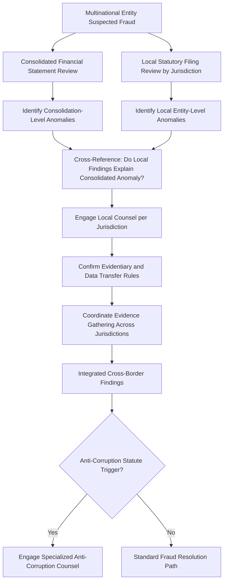

## Cross-Border and Multi-Scheme Case Analysis

### Overview

Cross-border fraud investigations and cases involving multiple concurrent schemes represent the highest-complexity category of forensic engagement, combining jurisdictional legal complexity, currency and accounting standard differences, evidentiary access limitations, and the analytical challenge of disentangling interacting fraud schemes that may share perpetrators, mask one another, or compound in effect. This capstone topic integrates the technical, behavioral, and legal material covered throughout the course into the most demanding case structure a practitioner is likely to encounter.

**Key Points**

- Cross-border cases introduce jurisdictional legal, evidentiary, and regulatory complexity beyond the underlying accounting analysis
- Multiple concurrent schemes may be independent, linked by a common perpetrator, or structured so one scheme conceals another
- Currency translation, differing accounting standards (US GAAP vs. IFRS vs. local statutory), and cross-border data transfer restrictions all complicate evidence gathering and analysis
- Coordination with local counsel, regulators, and sometimes law enforcement across jurisdictions becomes a project-management dimension layered on top of the technical investigation
- Case sequencing (which scheme to investigate first, how findings from one inform the other) requires deliberate analytical strategy rather than treating each scheme in isolation

### Jurisdictional Complexity in Cross-Border Investigations

#### Legal and Regulatory Considerations

- **Evidentiary standards and admissibility** vary by jurisdiction — evidence gathered in a manner compliant with one country's rules may be inadmissible or improperly obtained under another's, particularly for employee data and communications subject to differing privacy regimes (e.g., GDPR-derived frameworks common across EU jurisdictions versus more permissive U.S. employer-monitoring norms)
- **Data transfer restrictions**: Cross-border data transfer rules can restrict moving financial records, emails, or personal data out of a jurisdiction for analysis, sometimes requiring local data processing or specific transfer mechanisms
- **Local counsel coordination**: Retaining local counsel in each relevant jurisdiction is typically necessary not only for legal compliance but to correctly interpret local regulatory reporting obligations (e.g., mandatory fraud or corruption reporting triggers that differ from U.S. or home-jurisdiction requirements)
- **Anti-corruption law overlap**: Cross-border schemes involving payments to foreign officials or intermediaries may trigger extraterritorial anti-corruption statutes (e.g., the U.S. Foreign Corrupt Practices Act, UK Bribery Act) independent of the underlying fraud scheme's classification in the local jurisdiction

[Unverified] Specific current data-transfer, evidentiary, and reporting-obligation rules vary substantially by jurisdiction pair and change with local regulatory developments; practitioners must confirm current requirements with qualified local counsel for each specific jurisdiction involved in a given engagement rather than relying on generalized cross-border principles.

#### Accounting Standard and Currency Complications

- **GAAP vs. IFRS vs. local statutory accounting**: A multinational entity's consolidated financials under one standard may obscure scheme mechanics visible only in local statutory filings prepared under a different standard, requiring the examiner to work at both the consolidated and local-entity level
- **Currency translation effects**: Distinguishing a genuine financial anomaly from an artifact of currency translation (especially in hyperinflationary or highly volatile currency environments) requires careful methodology, since translation effects can mask or mimic manipulation
- **Transfer pricing intersection**: Cross-border fraud schemes sometimes overlap with transfer pricing structures, requiring the examiner to distinguish between aggressive-but-legitimate tax planning and fraudulent misrepresentation of intercompany transaction terms

### Multi-Scheme Case Analysis

#### Categories of Scheme Interaction

**Independent concurrent schemes**: Multiple unrelated fraud schemes occurring within the same entity or period, discovered incidentally during investigation of one (e.g., a payroll fraud investigation uncovers an unrelated procurement kickback scheme in a different department). These require separate fraud theories and evidence chains, though shared organizational context (control environment weaknesses, tone-at-the-top issues) may be relevant to both.

**Perpetrator-linked schemes**: A single individual or colluding group running multiple distinct schemes simultaneously (e.g., an executive both manipulating revenue recognition for bonus purposes and separately engaging in undisclosed related-party transactions). Here, behavioral evidence (motive, opportunity, rationalization patterns) may be shared across schemes even though the mechanical execution differs.

**Concealment-layered schemes**: One scheme specifically structured to mask another — a common and analytically demanding pattern where, for example, a financial statement manipulation scheme (aggressive revenue recognition) is used to obscure the earnings impact of an underlying asset misappropriation scheme, such that correcting for one without recognizing the other produces an incomplete or misleading conclusion.

[Inference] Concealment-layered schemes are generally considered the most analytically demanding category because resolving the "outer" scheme (e.g., the accounting manipulation) can appear to fully explain the observed anomaly, creating a risk that the examiner stops investigating before uncovering the "inner" scheme it was designed to hide — this is a structural risk inherent to the pattern rather than a claim about its relative frequency compared to the other two categories.

#### Analytical Strategy for Multi-Scheme Cases

1. **Map all identified anomalies before assigning them to a scheme theory** — premature scheme categorization risks forcing evidence into an incomplete framework
2. **Test whether a single fraud theory fully explains all observed anomalies** — if quantifiable anomalies remain unexplained after confirming one scheme, this is a signal of a second, potentially concealed scheme rather than investigative completion
3. **Assess perpetrator overlap and behavioral consistency** across suspected schemes to determine whether pressure/opportunity/rationalization evidence should be analyzed jointly or separately
4. **Sequence investigation to minimize evidence spoliation risk** — in multi-scheme cases, disclosing or acting on one scheme's findings prematurely can alert perpetrators and compromise evidence relevant to an undiscovered related scheme

**Example**

An investigation into a multinational manufacturing subsidiary begins with a whistleblower report alleging inflated regional sales figures. Consolidated financial review confirms unusual revenue growth in one region inconsistent with market conditions. Local statutory filing review in that jurisdiction reveals the revenue was recognized on contracts with a distributor that, on further mapping, shares a beneficial owner with a senior regional sales executive — an undisclosed related party. Rather than concluding the case as a straightforward revenue recognition fraud, the examiner tests whether the related-party distributor arrangement fully explains the anomaly and finds that a portion of payments routed through the distributor do not correspond to any legitimate product flow, indicating the revenue scheme is layered on top of a separate misappropriation scheme diverting funds through the related-party structure — a concealment-layered pattern that would have gone undetected had the investigation stopped at the initially confirmed revenue recognition finding, and which independently triggers anti-corruption statute considerations given the cross-border related-party payment structure.

### Coordinating a Cross-Border, Multi-Scheme Investigation Team

| Function | Typical Role |
| --- | --- |
| Lead forensic accountant | Overall investigation strategy, scheme theory integration, final report authorship |
| Local counsel (per jurisdiction) | Evidentiary compliance, data transfer authorization, local regulatory reporting obligations |
| Anti-corruption specialist counsel | Assessment of extraterritorial statute exposure where cross-border payments are implicated |
| Local forensic/accounting support | On-the-ground document access, local statutory filing interpretation, language/cultural liaison |
| Data analytics team | Cross-jurisdictional data integration, currency-normalized trend analysis |
| Translation/interpretation support | Document translation and interview interpretation where language differences exist |

### Reporting Considerations for Complex Cases

A cross-border, multi-scheme final report requires additional structural discipline beyond the standard fraud examination report format covered in the capstone simulation material:

- **Scheme segmentation**: Clearly delineate findings by scheme, while explicitly addressing scheme interaction and concealment relationships where identified
- **Jurisdictional attribution**: Specify which findings derive from which jurisdiction's records and under which local counsel's evidentiary guidance
- **Currency and standard normalization disclosure**: Document the methodology used to normalize findings across currencies and accounting standards, since this methodology itself may be challenged
- **Regulatory exposure summary**: Where anti-corruption or multi-jurisdictional regulatory triggers are identified, summarize exposure separately from the core fraud findings, given the distinct legal pathway such findings may follow

### Common Pitfalls

- Treating a cross-border case as a single-jurisdiction investigation with translation as the only added complexity, missing substantive differences in evidentiary and regulatory requirements
- Stopping scheme investigation once one fraud theory appears to explain the initial anomaly, missing a concealment-layered second scheme
- Failing to engage local counsel early enough, resulting in evidence gathered in a manner that later proves inadmissible or non-compliant with local data protection law
- Normalizing currency or accounting-standard differences inconsistently across the investigation, undermining the defensibility of loss quantification
- Overlooking anti-corruption statute exposure that arises independently of the core fraud scheme being investigated, particularly where cross-border payments to intermediaries are present
- Assuming behavioral evidence (pressure, rationalization) applies uniformly across schemes without testing whether multiple schemes actually share a common perpetrator or motive structure

**Related Topics**

- Comprehensive fraud examination simulation
- Integrating advanced accounting and forensic techniques
- Foreign Corrupt Practices Act and international anti-corruption compliance
- Related-party transaction analysis and disclosure adequacy testing
- Combining technology with professional judgment
- Data privacy and cross-border data transfer considerations in forensic investigations