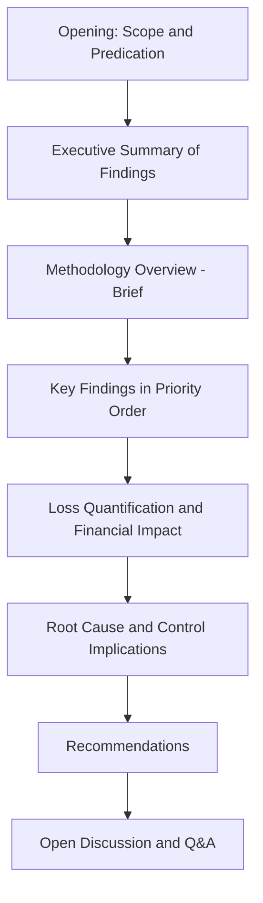

## Presenting Findings to a Mock Board or Tribunal

### Overview

The final translation of a fraud investigation's technical findings into a spoken or presented format for a board of directors, audit committee, or adjudicative tribunal is a distinct skill from written report production. Where a written report can be read, re-read, and annotated at the reader's pace, a live presentation must convey complex financial and behavioral findings clearly, defensibly, and persuasively within a fixed time window, often under direct questioning from an audience with varying technical sophistication and, in a tribunal setting, an adversarial motivation to expose weaknesses in the analysis.

**Key Points**

- Board presentations and tribunal/testimony presentations serve different purposes and require different structural approaches
- Audience calibration — technical sophistication and decision-making authority — should drive structure, vocabulary, and level of detail
- Defensibility under questioning is as important as clarity of initial delivery, particularly in tribunal contexts
- Visual aids and exhibits must be prepared to withstand scrutiny, not just support a narrative
- Distinguishing fact from inference must be maintained live, under pressure, exactly as it must be in the written report

### Board and Audit Committee Presentations vs. Tribunal Testimony

| Dimension | Board/Audit Committee Presentation | Tribunal/Deposition Testimony |
| --- | --- | --- |
| Purpose | Inform a governance decision (remediation, disclosure, referral) | Establish facts for adjudication; support or challenge a legal position |
| Audience posture | Generally receptive, seeking clarity and actionable recommendations | Often adversarial; opposing counsel actively seeks weaknesses |
| Format | Structured presentation, Q&A following | Direct examination, cross-examination, redirect |
| Control of pacing | Presenter substantially controls flow | Examining/cross-examining counsel controls pacing via questions |
| Primary risk | Failing to convey materiality or urgency clearly enough for board action | Statements being used to impeach credibility or undermine findings |
| Preparation focus | Clear narrative, prioritized findings, actionable recommendations | Anticipating cross-examination lines, consistency with written report |

### Structuring a Board Presentation

**Opening and framing**: State the scope and predication clearly and briefly — the board needs to understand what was investigated and why, but does not need the full investigative methodology narrative from the written report.

**Executive summary first**: Boards and audit committees are decision-making bodies operating under time constraints; leading with the bottom-line finding and its significance, before methodology detail, respects this constraint and is consistent with how executive audiences generally prefer to receive complex information — [Inference] this ordering preference reflects widely observed practice in board communication generally rather than a claim specific to forensic reporting, but it applies with particular force here given the stakes and time pressure typical of fraud-finding presentations.

**Prioritized findings, not exhaustive findings**: A board presentation should surface the findings that matter most to the governance decision at hand, with supporting detail available in the written report or as backup material — attempting to present the full evidentiary record live typically obscures rather than clarifies the decision points that matter.

**Visual clarity over volume**: Charts and timelines should simplify complex financial patterns (e.g., a timeline of the scheme's operation, a chart of loss accumulation over time) rather than reproducing dense data tables that are better suited to an appendix.

**Recommendations tied explicitly to findings**: Each recommendation (control remediation, referral, disclosure) should be traceable to a specific finding, so the board can evaluate the recommendation's basis rather than accepting it on authority alone.

### Preparing for Board Q&A

- Anticipate governance-relevant questions distinct from purely investigative questions: board members are likely to ask about disclosure obligations, management's role or awareness, control remediation cost and timeline, and reputational/regulatory exposure — areas the investigator should be prepared to address even if they extend beyond the strict factual findings
- Distinguish clearly, in real time, between findings supported by evidence and the investigator's professional recommendation or opinion — a board member's question phrased as "so you're saying management knew?" requires precise, evidence-bounded response rather than an overstated affirmative answer
- Have supporting exhibits and the full written report available for reference during Q&A, since board members may ask for detail beyond what the summary presentation covered

### Structuring Tribunal or Deposition Testimony

Tribunal-context presentation follows a fundamentally different structure, governed by examination format rather than presenter-controlled narrative:

**Direct examination** (questioning by the party who retained the expert):

- Establish qualifications and methodology credibility early, since this underpins the weight given to subsequent substantive testimony
- Answer questions within the scope asked, resisting the tendency to over-explain or volunteer information beyond the question — over-answering creates additional material for cross-examination to exploit
- Use the same fact/inference distinction discipline as in the written report; testimony that blurs this distinction under direct examination is significantly more vulnerable under cross-examination

**Cross-examination** (questioning by opposing counsel):

- Expect challenges to methodology, data sources, assumptions, and alternative explanations not fully addressed in the original analysis
- Maintain consistency with the written report — any testimony that appears to depart from or add to the written findings without clear basis undermines credibility
- Avoid defensiveness; acknowledging a genuine limitation in the analysis (where one exists) is generally more credible than resisting a well-founded challenge, provided the limitation does not undermine the core conclusion
- Answer only the question asked; resist the urge to explain, justify, or elaborate beyond what is required, since elaboration under cross-examination frequently opens further lines of challenging inquiry

**Example**

An expert witness testifying on a damages calculation is asked on cross-examination whether the model's growth-rate assumption might have been different under an alternative but plausible set of market conditions. Rather than defensively insisting the assumption is the only reasonable one, an experienced witness acknowledges that reasonable alternative assumptions exist within a defined range, explains why the specific assumption used was selected and is well-supported by the available evidence, and notes the sensitivity of the overall conclusion to that assumption if relevant — preserving both the credibility of testifying candidly and the substantive defensibility of the specific figure presented, rather than presenting false certainty that a probing follow-up question could then expose as overstated.

### Visual Aids and Exhibits: Preparation Standards

- **Board presentation aids**: Should prioritize clarity and narrative support (timelines, simplified flow diagrams, summary loss charts); overly technical exhibits reduce board comprehension without adding decision-relevant value
- **Tribunal exhibits**: Must be prepared to withstand detailed scrutiny — every number, label, and methodology reference on a tribunal exhibit should be independently verifiable and traceable to underlying evidence, since opposing counsel may probe any element of a demonstrative exhibit during cross-examination
- Both contexts require exhibits to accurately represent underlying data without selective framing that could be characterized as misleading if challenged — this standard applies even more rigorously in tribunal settings given the adversarial and evidentiary stakes involved

### Maintaining Fact/Inference Discipline Under Pressure

Both presentation contexts test whether the practitioner can maintain, live and under time or adversarial pressure, the same discipline required in written reporting:

$$\text{Testimony Credibility} \propto \text{Consistency}(\text{Live Statement}, \text{Written Report}) \times \text{Precision}(\text{Fact vs. Inference})$$

[Inference] This relationship is presented as a conceptual illustration of the factors that determine perceived credibility in testimony contexts, not as an empirically validated formula; the underlying principle — that consistency with prior written work product and precision in distinguishing fact from opinion are widely regarded as central to testimonial credibility — is well established in forensic and legal practice literature, even though it is not a literally quantifiable relationship.

### Common Pitfalls

- Presenting the full investigative methodology to a board when an executive summary and prioritized findings would better serve the governance decision at hand
- Volunteering information beyond the scope of a question during direct or cross-examination, creating unnecessary material for opposing counsel to challenge
- Becoming defensive or overstating certainty when a genuine methodological limitation is raised under cross-examination, rather than acknowledging it candidly within the bounds of the overall conclusion's defensibility
- Preparing visual aids for a tribunal setting with the same simplification standard used for a board presentation, leaving exhibits vulnerable to detailed scrutiny they were not built to withstand
- Allowing live testimony to depart, even slightly, from the written report's findings without a clearly articulated and defensible basis for the difference
- Failing to anticipate governance-relevant questions (disclosure obligations, reputational exposure) in board settings that extend beyond the strict factual findings of the investigation

**Related Topics**

- Comprehensive fraud examination simulation
- Expert witness standards and testimony preparation (Daubert/Frye)
- Combining technology with professional judgment
- Building a career in forensic accounting (litigation support and expert witness track)
- Report writing and documentation standards for forensic case files
- Cross-border and multi-scheme case analysis