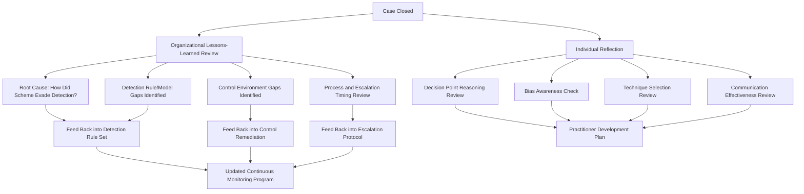

## Reflective Practice and Lessons-Learned Review

### Overview

Reflective practice and structured lessons-learned review close the fraud examination lifecycle by converting individual case experience into durable practitioner and organizational knowledge. Without deliberate reflection, even well-executed investigations fail to improve future performance — biases go unrecognized, near-misses go undocumented, and detection gaps that allowed a scheme to persist go unaddressed until a similar scheme recurs. This capstone topic provides a structured approach to post-engagement review at both the individual practitioner level and the organizational program level.

**Key Points**

- Reflective practice operates at two levels: individual practitioner development and organizational program improvement
- A structured lessons-learned process is distinct from informal debriefing — it requires defined prompts, documentation, and follow-through
- Root-cause analysis of how a scheme evaded detection is as valuable as the fraud finding itself
- Reflection should examine process and judgment quality, not only outcomes, since a correct outcome can result from flawed process
- Lessons-learned findings should feed back into the technology and human-factors elements of continuous monitoring programs covered earlier in this course

### Individual Practitioner Reflection

#### Structured Self-Review Framework

A disciplined post-case reflection process examines several dimensions beyond simply "was the conclusion correct":

1. **Decision points and reasoning quality**: At each major juncture in the investigation, was the reasoning sound given the information available at that time — independent of whether the ultimate outcome validated it? A correct conclusion reached through weak reasoning (e.g., confirmation bias that happened to align with the truth) represents a process failure worth identifying, since the same flawed reasoning could produce an incorrect conclusion in a different case.
2. **Bias awareness**: Did anchoring, confirmation bias, automation bias, or availability heuristic (covered under human factors in fraud detection) influence any judgment during the case? Practitioners are generally poorly positioned to identify their own biases in real time, making structured post-case review one of the more effective mechanisms for building this awareness over a career.
3. **Technique selection appropriateness**: Were the analytical techniques applied well-suited to the scheme type, or was a familiar technique applied out of habit rather than fit?
4. **Communication effectiveness**: Did written and verbal communication (reports, board presentations, testimony) achieve their intended effect with the intended audience?

**Example**

A practitioner reflects on a closed investigation where the initial suspicion, based on a continuous monitoring alert, turned out to be correct — the flagged vendor relationship was indeed fraudulent. On structured review, the practitioner recognizes that the investigation moved quickly to confirm the initial hypothesis without adequately pursuing an alternative explanation that was available in the data (a legitimate but unusual business justification for the vendor relationship that happened not to apply in this case). The correct outcome masked a confirmation-bias pattern in the investigative process — one that, in a different case with a similar alert profile but an actually legitimate explanation, could have led to a wrongful accusation. Documenting this pattern in the practitioner's own reflective log, rather than dismissing it because the outcome was correct, builds awareness that improves judgment in future ambiguous cases.

### Organizational Lessons-Learned Review

#### Root-Cause Analysis of Detection Gaps

The central organizational question in a lessons-learned review is not only "what happened" but "how did this evade detection for as long as it did, and what does that reveal about the control and monitoring environment":

- **Detection timing analysis**: How long did the scheme operate before detection, and through what mechanism was it ultimately identified (continuous monitoring alert, whistleblower tip, audit finding, accident)? A scheme detected only by chance or whistleblower, despite operating within a monitored process, indicates a detection rule or model gap distinct from a scheme detected promptly by the monitoring system functioning as designed.
- **Control environment gap identification**: Which specific control (segregation of duties, approval authority, independent review) was absent, circumvented, or overridden to allow the scheme to occur? This maps directly back to the opportunity leg of the Fraud Triangle and should inform specific, not generic, remediation.
- **Rule/model coverage gap identification**: If the scheme type was not covered by existing continuous monitoring rules, this is a direct input into the rule-tuning and feedback-loop process described in the continuous monitoring program material — a confirmed fraud case is one of the highest-value sources of new rule logic available to a program.

#### Structured Lessons-Learned Session Format

| Phase | Activity |
| --- | --- |
| Case summary | Brief factual recap of the scheme, detection mechanism, and resolution, without editorializing |
| Detection timeline analysis | Map when the scheme began, when it was detectable in principle, and when it was actually detected |
| Control and rule gap identification | Identify specific control failures and monitoring coverage gaps that allowed the timing gap above |
| Process review | Examine investigation process quality independent of outcome, per the individual reflection framework |
| Actionable recommendations | Specific, owned, and timelined recommendations — vague recommendations ("improve oversight") are lower value than specific ones ("require dual approval for vendor master file changes above $X") |
| Follow-through tracking | Documented tracking of whether recommendations were actually implemented, since a lessons-learned review that generates recommendations without follow-through tracking has limited organizational value |

[Inference] The follow-through tracking phase is frequently the weakest link in lessons-learned processes in practice — recommendations are commonly generated but not systematically tracked to implementation — though this reflects a general pattern observed in organizational process-improvement literature broadly rather than a claim specific to fraud examination lessons-learned reviews in particular.

### Integrating Lessons-Learned into Continuous Monitoring

This topic connects directly back to the feedback-loop mechanism described in the continuous monitoring program material earlier in this course:

$$\text{Program Maturity}_{t+1} = \text{Program Maturity}_t + \sum(\text{Lessons-Learned Findings Actually Implemented})$$

A continuous monitoring program's improvement over time is a direct function of how systematically confirmed fraud cases are converted into rule refinements, control changes, and escalation protocol adjustments — meaning the lessons-learned process is not a separate administrative exercise but an operational input to program effectiveness.

### Distinguishing Outcome-Focused from Process-Focused Review

A common failure mode in both individual and organizational reflection is evaluating only whether the case reached a correct conclusion, rather than whether the process used to reach it was sound:

| Outcome | Process Quality | Appropriate Lesson |
| --- | --- | --- |
| Correct conclusion | Sound process | Reinforce the approach; no correction needed |
| Correct conclusion | Flawed process (e.g., confirmation bias) | Correct the process despite the correct outcome — the flaw could produce an incorrect conclusion next time |
| Incorrect conclusion | Sound process given information available | Distinguish this from a process failure; sometimes available evidence genuinely supported the conclusion reached, and the error reflects information limitations rather than judgment failure |
| Incorrect conclusion | Flawed process | Highest-priority correction; both the outcome and the process require remediation |

### Documentation Standards for Lessons-Learned Findings

- Findings should be documented with the same fact/inference discipline applied throughout the investigation itself, distinguishing confirmed root causes from inferred contributing factors
- Sensitive findings (e.g., a specific individual's judgment error during the investigation) should be handled with appropriate discretion, focusing on process and system improvement rather than individual blame, to preserve the psychological safety needed for honest reflective practice to continue functioning over time
- Aggregated, anonymized lessons-learned themes across multiple cases (rather than case-by-case findings alone) often reveal systemic patterns — such as a recurring bias type among investigators, or a recurring control gap across business units — that are not visible from any single case review

### Common Pitfalls

- Conducting lessons-learned review only for cases with negative outcomes, missing valuable process lessons from cases that happened to reach correct conclusions despite flawed reasoning
- Generating recommendations without a follow-through tracking mechanism, resulting in repeated identification of the same gaps across successive cases
- Framing lessons-learned findings around individual blame rather than process and system improvement, which discourages honest participation in future reviews
- Treating the lessons-learned review as a one-time administrative closeout task rather than a structured input into continuous monitoring program rule refinement
- Failing to distinguish outcome quality from process quality, reinforcing flawed reasoning patterns that happened to produce a correct result in one case

**Related Topics**

- Building continuous monitoring programs
- Human factors in fraud detection systems
- Comprehensive fraud examination simulation
- Combining technology with professional judgment
- Building a career in forensic accounting
- Root-cause analysis methodology for control failures